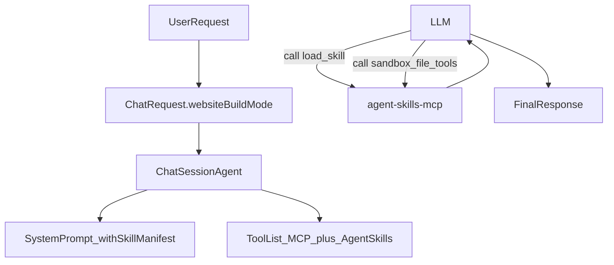

# Agent Skills 首期落地方案

## 目标与范围
- 对齐你确认的方向：采用 `s05` 模式（先注入 skills 目录，再按需 `load_skill`）；新增前端“网站构建”开关。
- 首期仅覆盖“前后端代码生成”场景，不扩展到通用任务编排。
- 文件工具限定为沙箱目录（不直接操作业务仓库）。

## 最终实施版 v2 清单（已确认）
- `websiteBuildMode` 默认值：`false`（默认关闭，仅在显式开启时生效）。
- 沙箱隔离粒度：`per_user + per_conversation`（同一用户不同会话使用独立工作区）。
- 沙箱目录路径：`backend/data/user_data/<user_id>/workspaces/<workspace_id>/`（`workspace_id=conversation_id`）。
- 并发写冲突策略：`last_write_wins`（同一会话内不加锁，后写覆盖先写）。
- 沙箱生命周期：`manual_only`（不做自动 TTL 清理）。
- 资源配额：限制“用户沙箱总大小 + 文件数”，超限拒绝写入。
- 文件类型：`allow_any`（允许任意扩展名）。
- Skill 白名单：仅允许 `frontend-codegen`、`backend-codegen` 被 `load_skill` 加载。
- 工具选择协同：`websiteBuildMode=true` 时强制追加 `agent-skills-mcp`，不受 `mcpAutoMode/sourceConfig` 影响。

## 后端改造
- 在请求模型中增加网站构建开关字段，贯通到会话执行链路：
  - [backend/app/schemas/chat.py](backend/app/schemas/chat.py)
  - [backend/app/agents/chat_session_agent.py](backend/app/agents/chat_session_agent.py)
- 新增 skills 注册与加载模块（轻量目录 + 按需正文）：
  - [backend/app/services/chat/agent_skills/registry.py](backend/app/services/chat/agent_skills/registry.py)
  - [backend/app/services/chat/agent_skills/models.py](backend/app/services/chat/agent_skills/models.py)
  - 首期 skills 文档：`frontend-codegen`、`backend-codegen`（放在 `backend/app/services/chat/agent_skills/skills/*/SKILL.md`）
- 新增本地 MCP server（建议命名 `agent-skills-mcp`），提供：
  - `load_skill(name)`：返回 skill 正文
  - `list_workspace_files(path?)` / `read_workspace_file(path)` / `write_workspace_file(path, content)` / `delete_workspace_file(path)`：仅允许访问会话沙箱根目录 `backend/data/user_data/<user_id>/workspaces/<workspace_id>/`
  - 相关文件：
    - [backend/app/mcp/mcp_registry.py](backend/app/mcp/mcp_registry.py)
    - [backend/app/mcp/mcp_servers/agent_skills_mcp/server.py](backend/app/mcp/mcp_servers/agent_skills_mcp/server.py)
    - [backend/app/mcp/mcp_servers/agent_skills_mcp/config.py](backend/app/mcp/mcp_servers/agent_skills_mcp/config.py)
- 在会话 prompt 里注入 skills 目录（仅网站构建模式生效），并约束调用顺序：先 `load_skill` 再执行代码/文件工具。
  - [backend/app/prompts/system_prompt.py](backend/app/prompts/system_prompt.py)
  - [backend/app/prompts/prompt_utils.py](backend/app/prompts/prompt_utils.py)

## 前端改造
- 在输入配置中新增 `websiteBuildMode`（布尔），本地缓存与请求透传都纳入：
  - [frontend/src/interfaces/chat.ts](frontend/src/interfaces/chat.ts)
  - [frontend/src/pages/ChatPage/components/ChatInput/constant.ts](frontend/src/pages/ChatPage/components/ChatInput/constant.ts)
  - [frontend/src/pages/ChatPage/components/ChatInput/hooks.ts](frontend/src/pages/ChatPage/components/ChatInput/hooks.ts)
- 在输入区底部将“网站构建”开关放在 `ChatInputFooter`，与“深度思考”并列展示。
  - [frontend/src/pages/ChatPage/components/ChatInput/components/ChatInputFooter.tsx](frontend/src/pages/ChatPage/components/ChatInput/components/ChatInputFooter.tsx)

## 执行链路（首期）

## 验证与验收
- 后端：新增单测覆盖 skill 注册/加载、沙箱路径越权拦截、文件工具 CRUD。
- 前端：开关状态持久化、请求体包含 `website_build_mode`、关闭时不注入 skills。
- 联调：网站构建开关开启后，观察工具流中先出现 `load_skill`，再出现代码/文件工具调用。

## 风险与兜底
- 路径安全：所有文件工具必须做 `resolve()` + 沙箱根路径前缀校验，拒绝 `..` 越权。
- 上下文膨胀：`load_skill` 返回正文长度设置上限，必要时截断并附提示。
- 工具误用：网站构建开关关闭时，不向模型暴露 skills/file 工具。
- 必做硬约束（v2）：
  - 文件路径与命名白名单：拦截系统敏感路径、隐私目录和危险文件名模式。
  - 写操作审计日志：记录 user_id、conversation_id、路径、操作类型、时间、结果。
  - 配额拦截与错误码规范：超限时返回稳定错误码与可读错误信息。
  - 手动清理入口：提供可执行的清理命令/接口与最小运维说明。
