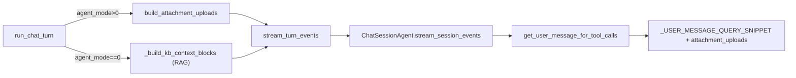

# agent_mode 附件改用文件工具按需读取（替代 RAG）

## 目标

`agent_mode > 0` 时：

1. **跳过** [`_build_kb_context_blocks`](backend/app/services/chat/chat_orchestrator.py) 的 RAG 流程
2. 在 `_USER_MESSAGE_QUERY_SNIPPET` 注入新的 `<attachment_uploads>` 块，描述每个上传文件
3. 模型自行决定是否用 `read_file` 等文件工具读取内容

`agent_mode == 0` 时：保持现有 RAG 行为不变。

## 关键事实（已确认）

- 聊天附件落盘目录 = VFS `uploads` 目录：`conversations/{cid}/uploads/`，虚拟前缀 `vfs_config.uploads_prefix`（`/mnt/user-data/uploads/`）。`storage_key` 形如 `{cid}/{name}` 或 `{cid}/derived/{stem}.md`，去掉 `{cid}/` 即虚拟相对路径。
- PDF 原始二进制不可直接 `read_file`（UTF-8 乱码）；可读文本是 derived `.md`。故 PDF 同时给 `path`(.pdf) 与 `readable_path`(derived .md)。

## 数据流



## 改动清单

### 1. 新增数据模型 — [`backend/app/schemas/chat.py`](backend/app/schemas/chat.py)

在 `KbContextBlock` 附近新增：

```python
class AttachmentUploadInfo(BaseModel):
    name: str
    path: str                      # /mnt/user-data/uploads/{name}
    readable_path: str | None = None  # PDF: derived .md；md 自身可为同路径；图片 None
    size: int
    is_current_turn: bool = False
    kind: str                      # "pdf" | "markdown" | "image"
```

### 2. 构建函数 — [`backend/app/utils/multimodal.py`](backend/app/utils/multimodal.py)

新增 `build_attachment_uploads(content_blocks, history_messages, user_id)`：

- 遍历当前轮 `content_blocks`（`is_current_turn=True`）与历史 user 消息 blocks（`is_current_turn=False`），按 `storage_key` 去重（当前轮优先）。
- 各类型映射：
  - `PdfBlock`：`path = uploads_prefix + name`；`readable_path` 由 `block.markdown.storage_key` 去 `{cid}/` 前缀拼成；`kind="pdf"`
  - `MarkdownBlock`：`path`/`readable_path` 同为自身虚拟路径；`kind="markdown"`
  - `ImageBlock`：`path` 为自身虚拟路径，`readable_path=None`，`kind="image"`
- 虚拟路径辅助：`vfs_config.uploads_prefix + storage_key.split("/", 1)[1]`
- `size` 取 `block.size`
- 复用 `normalize_content_blocks` 处理 dict/模型混入

### 3. 模板 — [`backend/app/prompts/user_prompt.py`](backend/app/prompts/user_prompt.py)

在 `_USER_MESSAGE_QUERY_SNIPPET` 内（`attachment_context` 之后）新增：

```xml

  <attachment_uploads note="以下为本会话已上传文件，可按需用文件工具(read_file)读取；PDF 请读取 readable_path 指向的 Markdown">
  
    <file index="{{ loop.index }}">
      <name>{{ f.name|e }}</name>
      <path>{{ f.path|e }}</path>
      
      <readable_path>{{ f.readable_path|e }}</readable_path>
      
      <size_bytes>{{ f.size }}</size_bytes>
      <uploaded_this_turn>{{ 'true' if f.is_current_turn else 'false' }}</uploaded_this_turn>
    </file>
  
  </attachment_uploads>

```

模板用默认 `Undefined`，未传变量时该块自然为空，不影响 title / 其他模板。

### 4. 提示词入口 — [`backend/app/prompts/prompt_utils.py`](backend/app/prompts/prompt_utils.py)

`get_user_message_for_tool_calls` 增加形参 `attachment_uploads: list[AttachmentUploadInfo] | None = None`，并 `render(..., attachment_uploads=attachment_uploads or [])`。

### 5. 会话 Agent — [`backend/app/agents/chat_session_agent.py`](backend/app/agents/chat_session_agent.py)

- `stream_session_events` 增加参数 `attachment_uploads: list[AttachmentUploadInfo] | None = None`
- 调用 `get_user_message_for_tool_calls(...)` 处透传该参数（约 L126）

### 6. 编排层 — [`backend/app/services/chat/chat_orchestrator.py`](backend/app/services/chat/chat_orchestrator.py)

- `run_chat_turn` 中（约 L397–423）按 `agent_mode` 分流：
  - `agent_mode > 0`：`kb_context_blocks = None`；`attachment_uploads = build_attachment_uploads(content_blocks, prepared_history_messages, user_id)`；跳过 `kb-rag-build` span
  - `agent_mode == 0`：维持现有 RAG，`attachment_uploads = None`
- `stream_turn_events` 与 `stream_session_events` 增加并透传 `attachment_uploads`
- 标题生成（L424–430）保持传 `kb_context_blocks or []`，agent_mode 下即空，行为不变

### 7. 校验前置条件（只读确认）

确认 `settings.mcp.agent_mode_servers` 含 file 工具服务（`read_file`/`list_files`），否则模型无法读取。查 [`backend/app/agents/chat_session_agent.py`](backend/app/agents/chat_session_agent.py) `_resolve_request_mcp_servers` 与配置。

## 验证

- `cd backend && make lint && make check`
- 单测：构建 `build_attachment_uploads` 的单元测试（当前轮 PDF + 历史 markdown + 图片），断言 path/readable_path/is_current_turn/kind 正确
- 手动：agent_mode=1 上传 PDF 提问，确认 prompt 内出现 `<attachment_uploads>` 且无 RAG `<attachment_context>`；模型能用 read_file 读取 derived md
