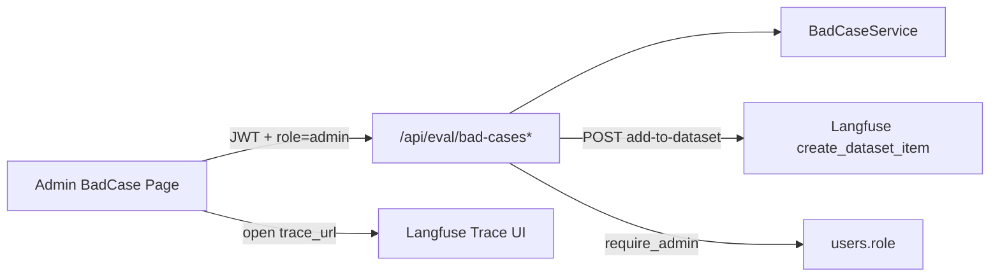

# Bad Case 管理页实现计划

## 现状

- 后端已有完整队列：[bad_case_item_db.py](backend/app/models/bad_case_item_db.py)、[bad_case_service.py](backend/app/services/eval/bad_case_service.py)、[eval.py](backend/app/api/eval.py)（列表/详情/更新/统计）。
- `resolution=added_to_dataset` 仅为枚举，**尚未真正写入 Langfuse dataset**。
- `/api/eval/*` 仅 `require_auth`；`UserDb.role` 存在但未做门禁。
- 前端无 admin 路由 / RBAC / bad-case UI；`UserInfo` 未声明 `role`（但 `/user/detail` 已返回完整 `UserDb`，含 `role`）。

## 决策（已确认）

- 仅 `users.role == "admin"` 可访问页面与 eval bad-case 接口。
- 推送到固定 dataset，默认名 `chat-agent-bad-cases`，可通过配置修改。

## 架构



---

## 1. 后端：admin 鉴权

在 [auth_deps.py](backend/app/utils/auth_deps.py) 新增 `require_admin`：

1. 调用现有 `get_auth_token_info` 校验 JWT。
2. 用 `UserDbService` / DB 查 `users.role`。
3. `role != "admin"` → `HTTP 403`。

将 [eval.py](backend/app/api/eval.py) 全部 bad-case 路由的 `Depends(require_auth)` 替换为 `Depends(require_admin)`。

---

## 2. 后端：配置与 Trace URL

扩展 [LangfuseConfig](backend/app/schemas/config.py)：

- `bad_case_dataset_name: str = "chat-agent-bad-cases"`（环境变量 `LANGFUSE__BAD_CASE_DATASET_NAME`）
- `project_id: str = ""`（可选，用于拼 UI 链接；`LANGFUSE__PROJECT_ID`）

在 [observability.py](backend/app/core/observability.py) 增加：

- `build_trace_url(trace_id) -> str | None`：有 `project_id` 时用 `{host}/project/{project_id}/traces/{trace_id}`，否则回退 `{host}/trace/{trace_id}`。
- 保证 dataset 存在：`create_dataset(name=...)`（upsert 语义，失败则日志 + 抛业务错）。

`BadCaseItemResponse` 增加可选字段 `langfuse_trace_url: str | None`，在 `_to_response` 中由 `trace_id` 生成，供前端直接跳转。

---

## 3. 后端：推送 Dataset API

新增：

`POST /api/eval/bad-cases/{item_id}/add-to-dataset`

逻辑（落在 `BadCaseService`）：

1. 取条目；不存在 → 404。
2. `get_langfuse()` 不可用 → 503 / 明确错误。
3. 确保 dataset 存在后调用：

```python
langfuse.create_dataset_item(
    dataset_name=settings.langfuse.bad_case_dataset_name,
    id=item.id,  # upsert，避免重复推送
    input={"query": item.query, "messages": [...]},  # 与现有 judge 脚本可读字段对齐：至少含 query
    expected_output=item.answer or None,
    metadata={
        "bad_case_id": item.id,
        "source": item.source,
        "message_id": item.message_id,
        "conversation_id": item.conversation_id,
        "attribution": item.attribution,
        "rule_scores": item.rule_scores,
        "judge_scores": item.judge_scores,
    },
    source_trace_id=item.trace_id,
)
```

4. 更新本地：`resolution=added_to_dataset`，`status=resolved`，写 `resolved_at`（若尚未有）。
5. 返回更新后的 `BadCaseItemResponse`。

不新增 DB 列 / 迁移（用 `id=bad_case.id` upsert + `resolution` 即可标识已推送）。

---

## 4. 前端：角色与路由守卫

- [interfaces/user.ts](frontend/src/interfaces/user.ts)：`UserInfo` 增加 `role?: string`。
- 新增 `RequireAdmin`（或路由 loader）：未登录 → `/login`；非 admin → `/chat`。
- 路由：`/admin/bad-cases` → 新页面。
- [MainLayout](frontend/src/components/Layout/MainLayout.tsx)：对 `/admin/*` 隐藏聊天侧栏，仅保留轻量顶栏（返回对话 + 标题）。
- 入口：仅当 `userDetail.role === "admin"` 时在侧栏/设置区显示「Bad Case 复核」链接（不暴露给普通用户）。

---

## 5. 前端：管理页 UI

新建 `frontend/src/pages/AdminBadCasesPage/`（antd Table + 筛选，风格贴近现有 `DataManage`）：

| 能力 | 交互 |
|------|------|
| 列表 | `GET /eval/bad-cases`，分页；筛选 `status` / `source` |
| 统计 | 顶部展示 `GET /eval/bad-cases/stats`（按 status/source） |
| 状态管理 | 行内 Select / 抽屉：改 `status`、`attribution`、`reviewer_notes`、`resolution` → `PUT` |
| 加 Dataset | 确认后 `POST .../add-to-dataset`；成功提示并刷新行 |
| Trace 跳转 | `langfuse_trace_url` 有值时「查看 Trace」外链（`target=_blank`）；无则禁用/隐藏 |

新增 [services/eval.ts](frontend/src/services/eval.ts) + 对应 interfaces（枚举与后端 `BadCase*` 对齐）。

---

## 6. 文档与验证

- 更新 [EVAL_OPS.md](backend/docs/EVAL_OPS.md)：admin 要求、dataset 配置项、`add-to-dataset` 端点。
- 验证：`cd backend && make lint`；`cd frontend && vp lint .`（及必要的类型检查）。
- 手动：admin 可进页调接口；非 admin 页面跳转 + API 403；推送后 Langfuse dataset 可见且 resolution 变为 `added_to_dataset`；有 `trace_id` 可打开 Trace。

## 关键文件

| 层 | 文件 |
|----|------|
| 鉴权 | `backend/app/utils/auth_deps.py` |
| API | `backend/app/api/eval.py`、`backend/app/schemas/eval.py`、`backend/app/schemas/config.py` |
| 服务 | `backend/app/services/eval/bad_case_service.py`、`backend/app/core/observability.py` |
| 前端 | `routes`、`UserInfo`、`services/eval.ts`、新 Admin 页、`MainLayout` 微调 |
| 文档 | `backend/docs/EVAL_OPS.md` |
