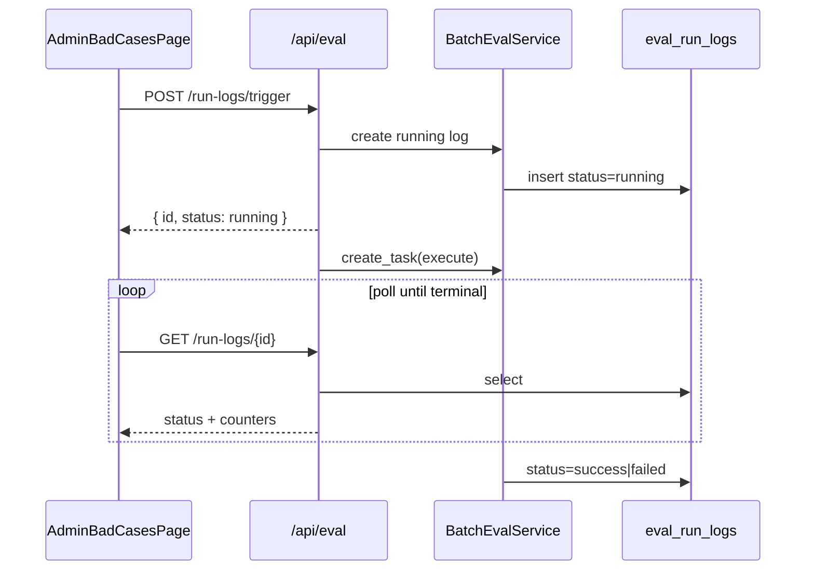

# Admin Bad Cases Tabs + 手动批量评估

## 现状

- Bad Case 管理页与 API 已就绪：[frontend/src/pages/AdminBadCasesPage/index.tsx](frontend/src/pages/AdminBadCasesPage/index.tsx)、[backend/app/api/eval.py](backend/app/api/eval.py)
- `EvalRunLog` 模型与 `EvalRunLogResponse` schema 已存在，但 **无 HTTP 查询/触发**；手动跑仅靠 [backend/scripts/run_batch_eval.py](backend/scripts/run_batch_eval.py)
- `BatchEvalService.run()` 会先 commit 一条 `status=running` 的日志，再同步执行；适合拆成「创建 → 后台执行」以支持立即返回 id

## 默认决策

- 触发参数：仅支持可选 `hours`（默认 `None` → 用 `settings.eval_worker.lookback_hours`）；**不暴露 dry_run**（管理页只跑真实评估）
- 并发：若已有 `status=running` 的记录，返回 **409**，避免与定时 worker / 另一次手动触发重叠
- 后台执行：API 进程内 `asyncio.create_task`（与现有 chat/message 模式一致）；长任务跑在 API 进程，不依赖 eval_worker 在线

## 后端

### 1. 抽出共用 judge caller

将 [backend/eval_worker/main.py](backend/eval_worker/main.py) 中的 `judge_llm_caller` 抽到例如 `app/services/eval/judge_llm.py`，worker 与 API 共用（基于 `settings.eval_worker.judge_model_scenario`）。脚本 `run_batch_eval.py` 改为从该模块导入。

### 2. 微调 `BatchEvalService`

在 [backend/app/services/eval/batch_eval_service.py](backend/app/services/eval/batch_eval_service.py) 拆分：

- `create_run_log(run_type) -> EvalRunLog`：写库 `running` 并返回
- `execute_run(run_id, hours=..., dry_run=...) -> EvalRunLog`：现有 `_do_run` + 终态写回
- 保留 `run(...)`：供脚本/worker 同步调用（create + await execute）

另加薄 service（可放在同文件或 `eval_run_log_service.py`）：

- `list_run_logs(status?, run_type?, page, page_size)`
- `get_run_log(id)`
- `has_running() -> bool`

### 3. Schema

在 [backend/app/schemas/eval.py](backend/app/schemas/eval.py) 补充：

- `EvalRunLogListResponse`（items/total/page/page_size）
- `EvalRunTriggerRequest`（`hours: int | None = None`）
- 可选：`EvalRunStatus` / `EvalRunType` 枚举（与模型字符串一致）

`EvalRunLogResponse` 已存在，直接复用。

### 4. API（admin only）

在 [backend/app/api/eval.py](backend/app/api/eval.py) 增加：

| Method | Path | 行为 |
|--------|------|------|
| GET | `/run-logs` | 分页列表，可选 `status` / `run_type` |
| GET | `/run-logs/{run_id}` | 详情（轮询用） |
| POST | `/run-logs/trigger` | 有 running → 409；否则 create log → `asyncio.create_task(execute)` → 立即返回该条 `EvalRunLogResponse` |

顺带更新 [backend/docs/EVAL_OPS.md](backend/docs/EVAL_OPS.md) 中「无 HTTP」表述。

## 前端

### 1. 类型与 API client

- [frontend/src/interfaces/eval.ts](frontend/src/interfaces/eval.ts)：`EvalRunLog`、`EvalRunLogListResponse`、`EvalRunTriggerRequest`、status/runType 联合类型
- [frontend/src/services/eval.ts](frontend/src/services/eval.ts)：`listRunLogs` / `getRunLog` / `triggerBatchEval`

### 2. 页面 Tabs

改造 [frontend/src/pages/AdminBadCasesPage/index.tsx](frontend/src/pages/AdminBadCasesPage/index.tsx)：

- Ant Design `Tabs`：`bad-cases`（现有内容原样迁入）| `run-logs`（新）
- **评估历史 Tab**：
  - 顶部「手动触发评估」按钮（可带可选 hours `InputNumber`，默认空=配置 lookback）
  - `Table` 展示：runType、status、startedAt、finishedAt、采样/裁判统计、errorMessage
  - 触发成功后记录 `pollingRunId`，用 ahooks `useRequest(getRunLog, { pollingInterval: 2000, ready: !!id })`，当 status 为 `success`/`failed` 时停轮询、toast、刷新列表
  - 若 409，提示「已有评估在运行」

页面可拆小子组件（同目录 `BadCasesTab.tsx` / `EvalRunLogsTab.tsx`）以保持可读，非必须。

## 验证

- 后端：`cd backend && make lint`；必要时补一个轻量 service/API 单测（mock `BatchEvalService.execute_run`）
- 前端：类型对齐 + 手动点一次触发，确认列表出现 `running` → 终态更新
