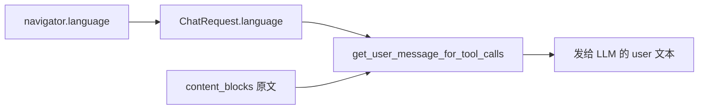

# Chat Stream 携带浏览器语言并注入用户提示词

## 行为约定

- 前端发送 `POST /api/chat/stream` 时，在 payload 增加 `language`（BCP 47，如 `zh-CN` / `en-US`），取 `navigator.language`。
- 后端**不改写**用户原文（`content_blocks` / `<query>` 保持原样，避免污染记忆检索与 KB RAG）。
- 在用户提示词 XML 中、`<query>` 之后追加一条指示，让模型自己按优先级选语言：

```
请优先使用用户 query 所使用的语言作答；若无法从 query 推断语言，则使用 {{ language }} 作答。
```

- `language` 为空（eval replay、旧客户端）时不注入该段，行为与现在一致。
- 不写入 `ChatInputConfig` / 消息 metadata（它不是会话开关，只是当轮请求提示）。语言会随已有的 `llm_rendered_text` 快照固化，后续历史回放自动带上。



## 前端

- [`frontend/src/interfaces/chat.ts`](frontend/src/interfaces/chat.ts)：`ChatRequest` 增加 `language: string`。
- [`frontend/src/hooks/chat.ts`](frontend/src/hooks/chat.ts)：`sendMessage` 调用 `chatAPI.streamMessage` 时带上 `language: navigator.language || "en"`。
- [`frontend/src/services/chat.ts`](frontend/src/services/chat.ts) 已用 `snakecaseKeys`，字段名 `language` 无需改序列化。

## 后端

- [`backend/app/schemas/chat.py`](backend/app/schemas/chat.py)：`ChatRequest` 增加可选字段

```python
language: str | None = Field(
    default=None,
    description="浏览器首选语言（BCP 47）；无法从 query 推断时作为回复语言",
)
```

- [`backend/app/prompts/user_prompt.py`](backend/app/prompts/user_prompt.py)：在 `_USER_MESSAGE_QUERY_SNIPPET` 的 `</query>` 后增加可选块（tool-call / default / no-tool 共用该 snippet）：

```xml
<query>{{ user_message_text|e }}</query>

<response_language>
请优先使用用户 query 所使用的语言作答；若无法从 query 推断语言，则使用 {{ language|e }} 作答。
</response_language>

```

- [`backend/app/prompts/prompt_utils.py`](backend/app/prompts/prompt_utils.py)：`get_user_message_for_tool_calls`（以及 `get_user_message_for_no_tool_call`）增加 `language: str | None = None` 并传入模板。标题生成不传 `language`。
- [`backend/app/services/chat/chat_orchestrator.py`](backend/app/services/chat/chat_orchestrator.py)：固化 `llm_rendered_text` 时传入 `chat_request.language`。
- [`backend/app/agents/chat_session_agent.py`](backend/app/agents/chat_session_agent.py)：编排层未提供快照时的 fallback 同样传入 `chat_request.language`。

## 测试

在 [`backend/tests/prompts/test_user_message_datetime.py`](backend/tests/prompts/test_user_message_datetime.py)（或同目录新文件）补充：

- 传入 `language="en-US"` 时，渲染结果含 `<response_language>` 且含 `en-US`，`<query>` 仍为原文。
- 不传 `language` 时不含 `<response_language>`。

现有 `test_stream_persists_llm_rendered_text_even_without_memories` 不断言无该标签，无需改。

## 不改动

- 系统提示词、标题生成、eval replay payload、消息展示用的 `content_blocks`。
- 不做服务端语言检测库（优先级规则交给模型执行）。
