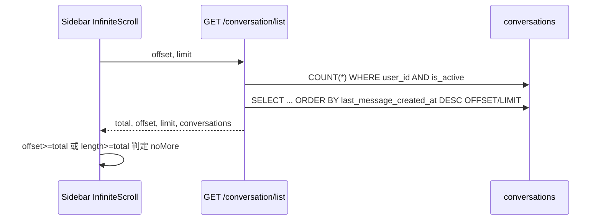

# 对话列表游标分页改造方案

## 决策（已确认）

- **直接替换**：去掉 `offset` / `total`，仅保留 `cursor` + `limit`
- **无 COUNT**：用 `has_more` + `next_cursor` 判断是否还有下一页
- 排序仍保持现有语义：`last_message_created_at DESC`，并加 `id DESC` 作为并列打破键

## 现状



关键文件：
- 后端：[backend/app/api/conversation.py](backend/app/api/conversation.py)、[backend/app/schemas/conversation.py](backend/app/schemas/conversation.py)、[backend/app/services/conversation/conversation_db.py](backend/app/services/conversation/conversation_db.py)
- 前端：[frontend/src/services/conversation.ts](frontend/src/services/conversation.ts)、[frontend/src/interfaces/conversation.ts](frontend/src/interfaces/conversation.ts)、[frontend/src/store/slices/conversationSlice.ts](frontend/src/store/slices/conversationSlice.ts)、[frontend/src/components/Layout/hooks.tsx](frontend/src/components/Layout/hooks.tsx)

## 目标 API 契约

**Request（query）**

| 参数 | 类型 | 默认 | 说明 |
|------|------|------|------|
| `cursor` | `string \| null` | 无 | 首屏不传；后续传上一页返回的 `next_cursor` |
| `limit` | `int` | `20` | `1..100`，与现网一致 |

**Response `data`**

```json
{
  "conversations": [ /* ConversationInfo[] */ ],
  "next_cursor": "eyJ0Ijoi...LCJpIjoi...\"},
  "has_more": true,
  "limit": 20
}
```

- 首页：不传 `cursor`
- 加载更多：传上一页的 `next_cursor`
- 末页：`has_more=false`，`next_cursor=null`

## 游标设计（keyset）

**排序键**：`(last_message_created_at DESC, id DESC)`

仅按时间分页在时间戳碰撞时会丢行/重行，必须带 `id`。

**Cursor 格式**：URL-safe Base64(JSON)

```json
{ "t": "<ISO8601 last_message_created_at>", "i": "<conversation_id>" }
```

- 编码/解码放在 service 或小型 util（如 `app/utils/cursor.py`），非法 cursor → `400`
- 不加密：内容非敏感，opaque 便于以后换实现

**SQL（示意）**

首页：

```sql
SELECT * FROM conversations
WHERE user_id = :uid AND is_active
ORDER BY last_message_created_at DESC, id DESC
LIMIT :limit + 1;
```

续页（cursor 解码为 `t`, `i`）：

```sql
SELECT * FROM conversations
WHERE user_id = :uid AND is_active
  AND (
    last_message_created_at < :t
    OR (last_message_created_at = :t AND id < :i)
  )
ORDER BY last_message_created_at DESC, id DESC
LIMIT :limit + 1;
```

`limit+1`：多取 1 条判断 `has_more`，返回时截断为 `limit`；若有下一页，用本页最后一条生成 `next_cursor`。

## 索引

现网只有 `user_id` 索引，大 offset 慢，大表首屏 keyset 也吃亏。

新增复合索引（Alembic migration）：

```sql
CREATE INDEX CONCURRENTLY IF NOT EXISTS
  ix_conversations_user_active_last_msg
ON conversations (user_id, is_active, last_message_created_at DESC, id DESC);
```

说明：
- Alembic 常规 `upgrade` 在事务内时，`CONCURRENTLY` 不可用；本仓库迁移走 `start.sh` 启动时同步执行，用普通 `op.create_index(...)` 即可（与现有迁移风格一致）
- 在 [backend/app/models/conversation_db.py](backend/app/models/conversation_db.py) 的 `__table_args__` 声明同一索引，避免下次 autogenerate 漂移

## 后端改动清单

1. **Schema** — [backend/app/schemas/conversation.py](backend/app/schemas/conversation.py)
   - `ConversationListRequest`：`cursor: str | None = None`，保留 `limit`
   - `ConversationListResponse`：`conversations`、`next_cursor`、`has_more`、`limit`；删除 `total`/`offset`

2. **Service** — [backend/app/services/conversation/conversation_db.py](backend/app/services/conversation/conversation_db.py)
   - 将 `get_conversations_paginated` 改为 keyset：签名大致为 `(user_id, *, cursor=None, limit=20) -> ConversationListResponse`（或 tuple）
   - 去掉 `COUNT(*)`
   - `order_by(last_message_created_at.desc(), id.desc())` + keyset `WHERE`
   - `limit+1` → 截断 + 编码 `next_cursor`

3. **API** — [backend/app/api/conversation.py](backend/app/api/conversation.py)
   - `get_conversations` 传 `cursor`/`limit`，返回新结构；返回类型尽量落到 `ApiResponse[ConversationListResponse]`

4. **Cursor util**（新建小模块）
   - `encode_conversation_cursor(t, i)` / `decode_conversation_cursor(cursor)`
   - 校验字段齐全、时间可解析、id 非空

5. **Migration** — 新建 Alembic revision，创建上述复合索引

6. **测试**（若有现成 conversation 测试则扩展；否则在 `tests/` 补 service 级用例）
   - 首页返回 ≤limit，`has_more` 正确
   - 用 `next_cursor` 续页无重叠、无空洞（同时间戳多条场景）
   - 非法 cursor → 400
   - 末页 `next_cursor is None`、`has_more=False`

## 前端改动清单

1. **类型** — [frontend/src/interfaces/conversation.ts](frontend/src/interfaces/conversation.ts)

```ts
export interface ConversationListResponse {
  conversations: ConversationInfo[];
  nextCursor: string | null;
  hasMore: boolean;
  limit: number;
}
```

（axios 响应会 camelCase；请求参数侧传 `cursor`/`limit`）

2. **API** — [frontend/src/services/conversation.ts](frontend/src/services/conversation.ts)

```ts
getConversations: (params?: { limit?: number; cursor?: string | null }) => ...
```

3. **Redux** — [frontend/src/store/slices/conversationSlice.ts](frontend/src/store/slices/conversationSlice.ts)
   - state 去掉 `total`/`offset`；改为 `nextCursor: string | null`、`hasMore: boolean`
   - `loadConversations` 参数改为 `{ limit?, cursor? }`
   - `fulfilled`：无 cursor（首页）→ 替换列表；有 cursor → `uniqBy` 追加；写入 `nextCursor`/`hasMore`/`limit`

4. **无限滚动** — [frontend/src/components/Layout/hooks.tsx](frontend/src/components/Layout/hooks.tsx)

```ts
async (lastData?) => {
  const cursor = lastData?.nextCursor ?? undefined;
  if (lastData && !lastData.hasMore) return lastData;
  const res = await dispatch(
    loadConversations({ cursor, limit: CONVERSATION_PAGE_LIMIT })
  ).unwrap();
  return {
    list: res.conversations,
    nextCursor: res.nextCursor,
    hasMore: res.hasMore,
    limit: res.limit,
  };
};
// isNoMore: !data?.hasMore
```

5. 清理其它对 `state.total` / `state.offset` 的引用（目前主要在 slice + hooks）。

## 边缘行为（实现时注意）

- **列表中途有新对话置顶**：keyset 续页本身可能与「滚动途中插入」并存重复；前端已有 `uniqBy(..., "id")`，继续保留即可
- **删除/软删导致 cursor 指向已消失行**：keyset 用「严格小于」继续向前，不会卡死
- **同一毫秒多条**：靠 `id DESC` 打破并列

## 验收

- 首屏与滚到底加载更多行为与现网一致，文案「暂无更多数据」仍正确
- 大翻页不再走 `OFFSET N`；`EXPLAIN` 可见用到 `(user_id, is_active, last_message_created_at, id)` 索引
- 接口不再返回 `total`/`offset`；OpenAPI（`/docs`）契约更新
- 前后端类型/lint 通过：`backend make lint`、`frontend vp lint .`（或既有 check 命令）
