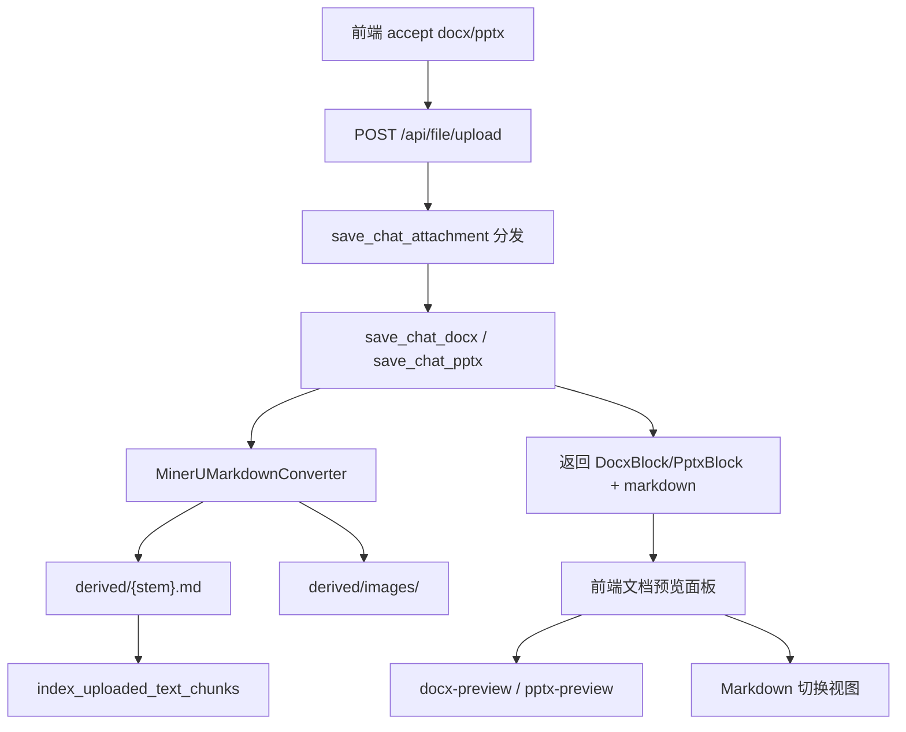

# 前后端增加 docx / pptx 上传与 MinerU 解析

## 决策

- 新增独立 `DocxBlock` / `PptxBlock`（与 `PdfBlock` / `ExcelBlock` 同构），不合并为通用 Office 类型。
- 仅支持 OOXML：`.docx` / `.pptx`（不含 legacy `.doc` / `.ppt`）。
- 后端直接复用现有 [`MinerUMarkdownConverter`](backend/app/services/chat_upload/mineru_markdown_converter.py)（API 已支持 Docx/Pptx，转换器不校验扩展名）。
- 前端预览（对齐 PDF/Excel 双模式）：
  - **默认「文档」视图**：客户端渲染原文件
    - docx：`docx-preview`（`renderAsync` 渲染到容器）
    - pptx：`pptx-preview`（`init` + `preview(ArrayBuffer)`）
  - **「Markdown」视图**：复用 `useMarkdownPreviewContent` + `MarkdownContainer`
  - Header 提供 Segmented 切换 + 下载原文件 / Markdown
- 大小限制与现有一致：10MB；魔数校验：`PK\x03\x04`（与 xlsx 相同）。
- 依赖通过 `vp add docx-preview pptx-preview` 安装（勿直接 npm）。

## 数据流

## 后端改动

### 1. Schema

[`backend/app/schemas/chat.py`](backend/app/schemas/chat.py)：

- 新增 `DocxBlock`、`PptxBlock`（字段对齐 Excel：`mime` 固定、`markdown` 可选）
  - docx MIME：`application/vnd.openxmlformats-officedocument.wordprocessingml.document`
  - pptx MIME：`application/vnd.openxmlformats-officedocument.presentationml.presentation`
- 扩展 `AttachmentBlock`、`ContentBlock`
- 更新 `AttachmentFileInfo.type` / `AttachmentUploadInfo.markdown` 描述，纳入 docx/pptx

### 2. 上传 handler（复制 excel.py 模式）

新建：

- [`backend/app/services/chat_upload/docx.py`](backend/app/services/chat_upload/docx.py) → `save_chat_docx`
- [`backend/app/services/chat_upload/pptx.py`](backend/app/services/chat_upload/pptx.py) → `save_chat_pptx`

共同流程：

1. MIME 或扩展名校验
2. 读入 ≤10MB，魔数 `PK\x03\x04`
3. SHA-256 作为 `id`，落盘到会话 `uploads/`
4. `await MinerUMarkdownConverter().convert_to_markdown(dest, md_path=..., images_dir=derived/images)`
5. `index_uploaded_text_chunks(..., source_kind="docx"|"pptx", text_format="markdown")`
6. 返回带 `markdown` 子块的 Block（`derived_kind`: `docx_to_markdown` / `pptx_to_markdown`）

### 3. 分发与预览路径

[`backend/app/services/chat_upload/attachment.py`](backend/app/services/chat_upload/attachment.py)：

- 增加 `DOCX_CONTENT_TYPE`、`PPTX_CONTENT_TYPE`
- `_NON_TEXT_PREVIEW_EXTS` 加入 `docx`、`pptx`
- `_EXT_TO_MEDIA_TYPE` 映射上述 MIME
- `save_chat_attachment` 在 Excel 分支后增加 docx/pptx 分发（扩展名兜底）

更新 [`backend/app/services/chat_upload/__init__.py`](backend/app/services/chat_upload/__init__.py) 导出。

### 4. Agent 附件注入

[`backend/app/utils/multimodal.py`](backend/app/utils/multimodal.py)：

- `has_docx_block` / `has_pptx_block` + 仅附件时的 placeholder
- `collect_attachment_content_ids`、`build_attachment_uploads`、`resolve_storage_key_for_content_id` 将 `(PdfBlock, ExcelBlock)` 扩展为包含 `DocxBlock`、`PptxBlock`
- 派生 Markdown 虚拟路径逻辑与 PDF/Excel 相同

### 5. Prompt / README

- [`backend/app/prompts/system_prompt.py`](backend/app/prompts/system_prompt.py)：上传说明改为 PDF / Excel / Word / PowerPoint，均指向 `derived/{stem}.md` 与 `derived/images/`
- [`backend/README.md`](backend/README.md)：补充支持类型与转换说明
- 转换器模块 docstring 改为「PDF/Excel/Word/PowerPoint」

## 前端改动

### 1. 类型

[`frontend/src/interfaces/contentBlock.ts`](frontend/src/interfaces/contentBlock.ts)：

- 新增 `DocxBlock`、`PptxBlock`
- 更新 `ContentBlock`、`PreviewableBlock`、`UserAttachmentBlock`、`isUserAttachmentBlock` exhaustive switch

[`frontend/src/services/file.ts`](frontend/src/services/file.ts)：上传返回联合类型加入新 Block。

### 2. 上传白名单

[`frontend/src/pages/ChatPage/components/ChatInput/util.ts`](frontend/src/pages/ChatPage/components/ChatInput/util.ts)：

- MIME 常量 + `.docx`/`.pptx` 扩展名
- 扩展 `CHAT_ATTACHMENT_ACCEPT` 与 `CHAT_ATTACHMENT_ACCEPT_PDF_ONLY`
- `isSupportedChatAttachment` / 错误文案

同步更新 tooltip：[`ChatInput/components/utils.ts`](frontend/src/pages/ChatPage/components/ChatInput/components/utils.ts)。

### 3. 消息卡片与预览

- [`UserMessageDisplayContent.tsx`](frontend/src/pages/ChatPage/components/ChatMessage/UserMessage/components/UserMessageDisplayContent.tsx)：`case "docx" | "pptx"` → FileCard，点击打开预览
- [`BlockPreviewPanel/index.tsx`](frontend/src/pages/ChatPage/components/BlockPreviewPanel/index.tsx)：路由到新面板
- 新建预览面板（结构对齐 Pdf/Excel）：
  - [`BlockPreviewPanel/DocxPreview/`](frontend/src/pages/ChatPage/components/BlockPreviewPanel/DocxPreview/)
  - [`BlockPreviewPanel/PptxPreview/`](frontend/src/pages/ChatPage/components/BlockPreviewPanel/PptxPreview/)

每个面板包含：

| 部分 | 行为 |
|------|------|
| Header | Segmented：`文档` / `Markdown`（有 markdown 时显示）；下载；关闭 |
| 文档视图 | fetch `block.url` → ArrayBuffer/Blob → 对应库渲染到 `ref` 容器；loading / error / 重试 |
| Markdown 视图 | 复用 `useMarkdownPreviewContent` + `MarkdownContainer` |
| 默认模式 | `文档`（与 PDF 默认 `pdf`、Excel 默认 `table` 一致） |

实现要点：

- docx：`import { renderAsync } from "docx-preview"`，渲染前清空容器；组件卸载时清理 DOM
- pptx：`import { init } from "pptx-preview"`，按侧栏宽度设置 viewer width；切换 mode / unmount 时销毁实例
- 库按需动态 `import()`，避免拖慢主包首屏
- 复杂版式/字体可能与 Word/PPT 不完全一致，属客户端 HTML 渲染限制；失败时展示错误态并保留下载与 Markdown 回退

## 测试

- 后端：为 `save_chat_docx` / `save_chat_pptx` 增加 mock MinerU 的单元测试（或共享 fixture），覆盖 MIME 拒绝、魔数失败、成功返回 block
- 前端：保证 `isUserAttachmentBlock` / TypeScript exhaustive switch 编译通过；`vp check` 通过

## 不在范围

- legacy `.doc` / `.ppt`
- 像素级还原 Office 桌面版排版
- 提高 10MB 上限
- Microsoft Office Online / Google Docs Viewer 等外链 iframe 方案（隐私与可用性差）
