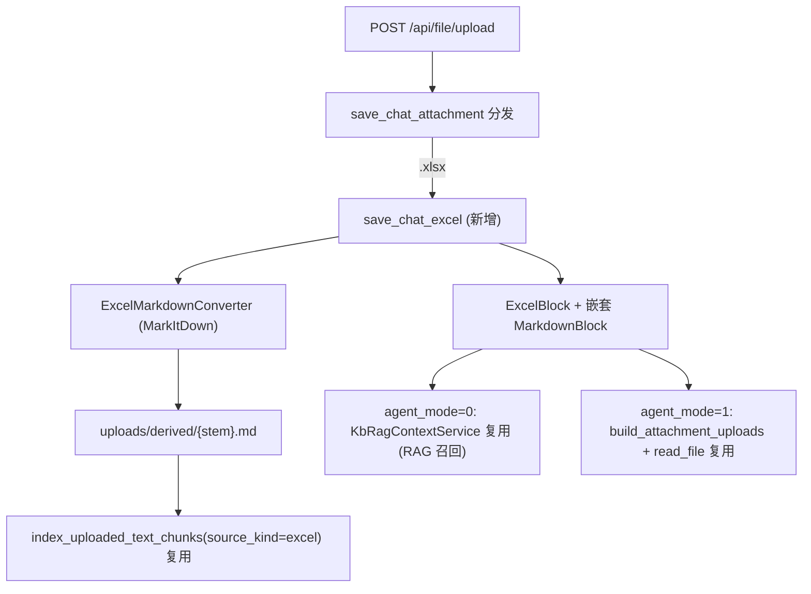

# 为聊天附件增加 Excel (.xlsx) 支持

完全镜像现有 PDF 流程。仅支持 `.xlsx`。`agent_mode=0` 走 RAG 召回，`agent_mode=1` 走文件清单 + `read_file`（均复用 PDF 既有实现）。前端预览用 SheetJS 渲染真实表格，并支持切换到后端转写的 Markdown（与 PDF 预览的 Markdown 切换一致）。

## 架构（复用 PDF 链路）

## 后端改动

- 依赖 [backend/pyproject.toml](backend/pyproject.toml)：第 50 行 `markitdown[pdf]` 改为 `markitdown[pdf,xlsx]`（引入 openpyxl）。
- 新增 [backend/app/services/chat_upload/excel_markdown_converter.py](backend/app/services/chat_upload/excel_markdown_converter.py)：`ExcelMarkdownConverter`，`convert_excel_to_markdown` + `save_markdown`，参考原型 [backend/tests/test/test_excel_markitdown.py](backend/tests/test/test_excel_markitdown.py)（无扫描分支），失败抛 `ExcelMarkdownConversionError`。
- 新增 [backend/app/services/chat_upload/excel.py](backend/app/services/chat_upload/excel.py)：`save_chat_excel`，镜像 [backend/app/services/chat_upload/pdf.py](backend/app/services/chat_upload/pdf.py)。
  - 校验：扩展名 `.xlsx` + 大小 ≤10MB + zip(PK) 魔数。
  - `content_id = sha256(bytes)`；落盘 `uploads/{name}.xlsx`；转写写入 `uploads/derived/{stem}.md`。
  - 调 `index_uploaded_text_chunks(..., source_kind="excel", text_format="markdown")`（复用，无需改 kb_chunk_embedding.py）。
  - 返回 `ExcelBlock`（含嵌套 `MarkdownBlock`，`derived_kind="excel_to_markdown"`）。
- Schema [backend/app/schemas/chat.py](backend/app/schemas/chat.py)：新增 `ExcelBlock`（镜像 `PdfBlock` 第 289 行附近，含 `markdown` 子块）；加入 `AttachmentBlock`（第 334 行）与 `ContentBlock` 联合；更新 `AttachmentFileInfo.type` 注释（第 312 行）。
- 分发 [backend/app/services/chat_upload/attachment.py](backend/app/services/chat_upload/attachment.py)：
  - `save_chat_attachment`（第 206 行）增加 xlsx 分支（MIME `application/vnd.openxmlformats-officedocument.spreadsheetml.sheet` 或文件名以 `.xlsx` 结尾）。
  - `_STORAGE_KEY_CONV_TOP_RE`（第 25 行）扩展名加入 `xlsx`。
  - `_EXT_TO_MEDIA_TYPE`（第 34 行）加入 `.xlsx`，使 preview 端点返回正确 content-type 供前端 SheetJS 读取。
- 多模态 [backend/app/utils/multimodal.py](backend/app/utils/multimodal.py)：`collect_attachment_content_ids`、`resolve_storage_key_for_content_id`、`build_attachment_uploads` 按 `PdfBlock` 同样处理 `ExcelBlock`（含其 `markdown` 子块）；新增 `has_excel_block` 与 Excel 占位符。
- 提示词 [backend/app/prompts/system_prompt.py](backend/app/prompts/system_prompt.py)：第 65-66 行 working_directory 说明补充「Excel 也会自动生成只读 Markdown，分析时优先读 derived/{stem}.md」。
- VFS 列举 [backend/app/vfs/uploads_provider.py](backend/app/vfs/uploads_provider.py)：顶层 uploads 列表纳入 `.xlsx`。

RAG（agent_mode=0）与 Agent（agent_mode=1）查询路径无需新增逻辑——识别到 `ExcelBlock` 后，向量召回与 `read_file` 均复用现有实现。

## 前端改动

- 依赖：`vp add xlsx`（SheetJS，用于解析 .xlsx 渲染表格）。
- 类型 [frontend/src/interfaces/contentBlock.ts](frontend/src/interfaces/contentBlock.ts)：新增 `ExcelBlock`（镜像 `PdfBlock` 含 `markdown`）；加入 `ContentBlock`、`PreviewableBlock`、`UserContentBlock` 联合；`isUserAttachmentBlock`（第 205 行）纳入 `"excel"`。
- 上传 API [frontend/src/services/file.ts](frontend/src/services/file.ts)：返回类型加入 `ExcelBlock`。
- 允许类型 [frontend/src/pages/ChatPage/components/ChatInput/util.ts](frontend/src/pages/ChatPage/components/ChatInput/util.ts)：`CHAT_ATTACHMENT_ACCEPT` 加 `.xlsx` 及对应 MIME；新增 `EXCEL_EXT_RE`；`isSupportedChatAttachment`、错误文案纳入 Excel。
- Tooltip [frontend/src/pages/ChatPage/components/ChatInput/components/utils.ts](frontend/src/pages/ChatPage/components/ChatInput/components/utils.ts)：文案补充 Excel。
- 消息卡片 [frontend/src/pages/ChatPage/components/ChatMessage/UserMessage/components/UserMessageDisplayContent.tsx](frontend/src/pages/ChatPage/components/ChatMessage/UserMessage/components/UserMessageDisplayContent.tsx)：`attachmentToFileCardItem` 增加 `case "excel"`（点击 → `onPreviewBlock`）。
- 预览路由 [frontend/src/pages/ChatPage/components/BlockPreviewPanel/index.tsx](frontend/src/pages/ChatPage/components/BlockPreviewPanel/index.tsx)：`switch` 增加 `case "excel"` → `ExcelBlockPreviewPanel`。
- 新增 `frontend/src/pages/ChatPage/components/BlockPreviewPanel/ExcelPreview/`：
  - `index.tsx`：用 SheetJS（`read` + `utils.sheet_to_html`/`sheet_to_json`）解析 `block.url`（fetch arraybuffer）渲染多 sheet 表格（sheet 切换 tab）；header 的 Segmented 切换到 Markdown 视图，复用 PDF 的 `useMarkdownPreviewContent`、`MarkdownContainer`、`PreviewScrollBody`。结构参考 [PdfPreview/index.tsx](frontend/src/pages/ChatPage/components/BlockPreviewPanel/PdfPreview/index.tsx)。
  - `ExcelPreviewHeader.tsx`：参考 PdfPreviewHeader.tsx，提供 表格/Markdown 切换、下载、关闭。

## 验证

- 后端：`cd backend && make lint`；在 `/docs` 上传 .xlsx 验证返回 `ExcelBlock` 且 `derived/*.md` 生成、向量入库。
- 前端：`vp install && vp lint . && vp build`；上传 .xlsx，确认消息卡片、侧栏表格渲染与 Markdown 切换、两种 agent_mode 问答均能引用 Excel 内容。
