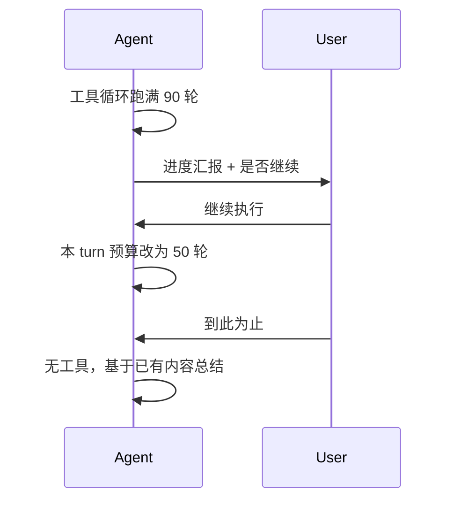

# 触达上限后暂停并询问是否继续

不新增 MCP 工具、不在 SSE 里挂起等点击。当前请求走完检查点后正常 `done`；续跑是下一轮对话。

**按 `agent_mode` 分流**（`chat_request.agent_mode` 已在 `stream_session_events` 里）：

- **Agent 模式**（`agent_mode > 0`）：90 轮触顶 → 检查点问用户；点继续则本 turn 预算 **50**。
- **普通模式**（`agent_mode == 0`）：10 轮触顶 → **仍强制终答**，不出按钮、不追加预算。



## 现状

[`chat_session_agent.py`](backend/app/agents/chat_session_agent.py) 循环耗尽后直接 `_stream_final_round_events(..., tools=[])`，没有专门提示，模型会假装收束。已有但未接线的模板 [`user_message_for_reach_tool_call_limit_template`](backend/app/prompts/user_prompt.py) 文案也是「直接作答」，且会改写原始 user（破坏前缀缓存），不能照搬。

下一 turn 的 history 已能把上一轮 `tool_use` / `tool_result` 还原进 prompt（[`BaseAgent._format_history_message_for_llm`](backend/app/agents/base.py)），续跑不需要把同一条 SSE 挂住。

## 1. 检查点轮（仅 Agent 模式）

277–292 行按模式分支：`agent_mode == 0` 保持现有强制终答；`agent_mode > 0` 改为检查点：

- `unified_context_guard(..., allow_stop_tools=False)` 照旧。
- 尾部追加一条 ephemeral trailing user（走现有 [`build_trailing_hint_user_message`](backend/app/utils/message.py)，**不改写**原始 user），大意：
  - 已执行 N 轮工具调用，到达上限
  - 向用户汇报已完成 / 未完成
  - 询问是否继续；不要再调工具，不要假装任务已完成
- 再调 `_stream_final_round_events`（空 tools），让模型生成那段进度文字。
- 在 [`SessionOutput`](backend/app/agents/chat_session_state.py) 记下 `iteration_checkpoint = {iterations_used, continue_budget}`。

常量放在 [`MCPToolSession`](backend/app/agents/mcp_tool_execution.py) 旁：`CONTINUE_BUDGET_ITERATIONS = 50`（只给 Agent 续跑用）。`continue_budget` 写入 checkpoint，前端按钮文案用这个数字。

改 [`user_message_for_reach_tool_call_limit_template`](backend/app/prompts/user_prompt.py) 为检查点文案，新增只渲染 notice 的 helper；废弃「包一层原 query」的用法。

## 2. 下一 turn 的两种选择

[`ChatRequest`](backend/app/schemas/chat.py) 增加可选字段：

```python
task_action: Literal["continue", "summarize"] | None = None
```

预算解析（`task_action` 只在 Agent 模式有意义；普通模式忽略，仍用 10）：

| 条件 | max_total_iterations | 行为 |
|---|---|---|
| `agent_mode > 0` 且 `task_action == "continue"` | **50** | 工具照常；trailing hint：用户确认续跑 |
| `agent_mode > 0` 且 `task_action == "summarize"` | — | 跳过工具循环，空 tools 总结 |
| `agent_mode > 0` 且 `task_action is None` | 90 | 现有 Agent 首轮预算 |
| `agent_mode == 0` | 10 | 现有普通模式；触顶强制终答 |

用户点按钮会发出一条可见的 user 消息（如「请继续执行剩余工作。」），history 可读；`task_action` 只作结构化信号，不解析自然语言。

Agent 模式若 50 轮再耗尽，再次进入检查点，可多次续跑。不加会话总上限。

## 3. 把检查点传到前端

[`persist_final_assistant_message`](backend/app/services/chat/post_process_service.py) / orchestrator 落库时把 checkpoint 写入 assistant `message_metadata`（JSON，无需迁移）。`done` SSE 带上同一字段，当前流不必等刷新也能出按钮。

## 4. 前端两个按钮

- [`ChatRequest`](frontend/src/interfaces/chat.ts) / [`SendMessageOptions`](frontend/src/interfaces/chat.ts) 增加 `taskAction`
- `done` 时写入最后一条 assistant 的 `messageMetadata.iterationCheckpoint`
- 仅当 `isLastMessage && !isStreaming && iterationCheckpoint` 时，在 [`AssistantMessage`](frontend/src/pages/ChatPage/components/ChatMessage/AssistantMessage/index.tsx) 展示：
  - 继续执行（追加 50 轮）
  - 到此为止，生成总结
- 点击走现有 `sendMessage`，带上对应文案和 `taskAction`。用户发了任意下一条后按钮自然消失。

## 5. 测试

- Agent 模式循环耗尽：检查点 trailing hint、空 tools、`iteration_checkpoint.continue_budget == 50`
- 普通模式循环耗尽：仍强制终答，无 checkpoint
- Agent + `task_action=continue`：预算为 50；普通模式即使带 continue 仍为 10
- Agent + `task_action=summarize`：不进工具循环
- 检查点文案 helper 渲染

不改文档站、不加 `increase_iteration` 工具。
