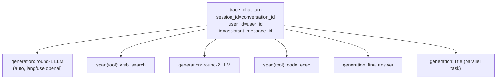

## Langfuse 自托管可观测性接入

### 背景与目标
- 你已自备 Langfuse 自托管实例，本计划只做**后端 SDK 接入 + 配置 + 埋点**，不部署 Langfuse 服务栈。
- 对齐 [roadmap.md](roadmap.md) 4.3 节：端到端 trace（请求→编排→模型→工具→响应），采集 token/延迟/错误/重试/工具耗时，统一 `trace_id`/`conversation_id`/`user_id`，并做错误分类。
- 关键优势：所有 LLM 调用收敛于单一入口 `LLMService.call_llm_api`（[backend/app/services/base_service/llm_service.py](backend/app/services/base_service/llm_service.py)），用 Langfuse 的 OpenAI drop-in 即可零散点自动采集；编排层 `run_chat_turn` 天然是 trace 根。

### 目标 Trace 结构

工具在 `asyncio.gather` 子任务中执行，OTel 上下文在任务创建时复制，span 会自动挂到当前 trace；标题任务在 trace 上下文内 `create_task`，其 LLM 调用也归并同一 trace。

### 实施步骤

**1. 依赖**
- `cd backend && uv add langfuse`（v3，OTel 内核）。

**2. 配置模型** — [backend/app/schemas/config.py](backend/app/schemas/config.py)
- 新增 `LangfuseConfig`：`enabled: bool=False`、`host: str`、`public_key: str`、`secret_key: str`、`sample_rate: float=1.0`、`debug: bool=False`、`environment: str="dev"`。
- 在 [backend/app/core/config.py](backend/app/core/config.py) `Settings` 加字段 `langfuse: LangfuseConfig = Field(default_factory=LangfuseConfig)`（默认关闭，避免未配置时报错）。
- Nacos 快照 [backend/nacos-data/config/ai-chat-dev@@DEFAULT_GROUP@@](backend/nacos-data/config/ai-chat-dev@@DEFAULT_GROUP@@) 增加 `langfuse:` 段，统一通过 Nacos 下发 `enabled/host/public_key/secret_key/sample_rate/environment`，不使用 `.env`。

**3. 可观测模块（新建）** — `backend/app/core/observability.py`
- `init_langfuse()`：当 `settings.langfuse.enabled` 时，用 `Langfuse(public_key=, secret_key=, host=, sample_rate=, environment=, tracing_enabled=True, debug=)` 初始化全局单例；否则 `tracing_enabled=False`（drop-in 变为透传 no-op）。
- `get_langfuse()` / `shutdown_langfuse()`（`flush()` + `shutdown()`）。
- 提供 `is_enabled()` 供埋点处快速短路。

**4. 启动接线** — [backend/app/main.py](backend/app/main.py)
- `lifespan` 启动段（建表/MCP 之前或之后均可）调用 `init_langfuse()`；`yield` 之后 `shutdown_langfuse()`，保证多 worker 退出前 flush。

**5. LLM 统一埋点（核心，最小改动）** — [backend/app/services/base_service/llm_service.py](backend/app/services/base_service/llm_service.py)
- 将 `from openai import (... AsyncOpenAI ...)` 改为从 `langfuse.openai` 导入 `AsyncOpenAI`（其余 error 类型仍从 `openai` 导入）。这样所有 `chat.completions.create`（流式/非流式）自动产生 generation，含 model、input/output、token、延迟、API 错误。
- 启用流式 token：在 [backend/app/agents/chat_session_agent.py](backend/app/agents/chat_session_agent.py) `call_llm_api(..., stream=True)` 传 `extra_body`/参数 `stream_options={"include_usage": True}`（DeepSeek/OpenAI 兼容支持）。消费循环已在 `chat_session_agent.py:308` 用 `if not chunk.choices: continue` 跳过末尾 usage 块，安全。

**6. Trace 根与关联维度** — [backend/app/services/chat/chat_orchestrator.py](backend/app/services/chat/chat_orchestrator.py) `run_chat_turn`
- 用 `with get_langfuse().start_as_current_observation(as_type="span", name="chat-turn") as root:` 包裹方法主体（在产出 ack 之后、流式生成处）。该方法整体运行在后台 producer 任务里，contextvars 跨 `yield` 保持，子 LLM/工具 span 自动挂载。
- `get_langfuse().update_current_trace(session_id=conversation_id, user_id=user_id, name="chat-turn", input=user_message_text, metadata={user_message_id, assistant_message_id, model_id=chat_request.model_id, agent_mode, client_turn_id}, tags=[...])`。
- 结束时把最终回答写入 `root.update(output=assistant_response.content)`（在 `collect_assistant_response()` 之后）。
- enabled=False 时用一个 no-op 上下文管理器分支，保持零侵入。

**7. 工具 span** — [backend/app/agents/tool_executor.py](backend/app/agents/tool_executor.py) `execute_single_tool`
- 包裹主体：`with get_langfuse().start_as_current_observation(as_type="tool", name=tool_name, input=arguments) as span:`。
- 成功：`span.update(output=content, metadata={server_name, iteration, tool_call_id, conversation_id, user_id})`。
- 失败（except 分支）：`span.update(output=str(exc), level="ERROR", status_message=type(exc).__name__)` 实现**错误分类**（工具异常）。

**8. 错误分类（LLM/网络/超时）** — 复用 `langfuse.openai` 自动捕获的 API 错误 level；可在 `call_llm_api` 各 `except`（`APIConnectionError`/`RateLimitError`/`APIStatusError`）补充 `update_current_observation(level="ERROR", status_message=error_type)` 以统一分类标签。

**9. 文档**
- 在 [docs/agent_observability/](docs/agent_observability) 新增 `langfuse_integration.md`：Nacos 配置项说明、Trace/Session/User 维度约定、如何在 Langfuse UI 按 conversation/user 查询 token 与耗时、故障定位手册雏形（对齐 roadmap 验收：10 分钟定位根因）。

### 不在本次范围
- 不部署 Langfuse 自托管服务栈（你已自备实例）。
- 评估（LLM-as-Judge）、Prometheus/Grafana、DashScope embedding 埋点留待后续阶段（roadmap Phase 1 后续 / Phase 2）。

### 验证
- 本地 `make dev`，发起一次含工具调用的对话，确认 Langfuse UI 出现一条 trace：含多个 generation（带 token/耗时）+ 工具 span，且 session=conversation_id、user=user_id。
- 通过 Nacos 将 `langfuse.enabled=false` 回归一次，确认对话正常、无埋点开销。
- `make lint` 通过。
