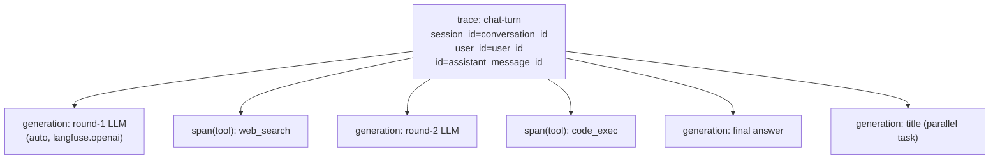

## Langfuse 自托管可观测性接入

### 背景与目标
- 你已自备 Langfuse 自托管实例，本计划只做**后端 SDK 接入 + 配置 + 埋点**，不部署 Langfuse 服务栈。
- 对齐 [roadmap.md](roadmap.md) 4.3 节：端到端 trace（请求→编排→模型→工具→响应），采集 token/延迟/错误/重试/工具耗时，统一 `trace_id`/`conversation_id`/`user_id`，并做错误分类。
- 关键优势：所有 LLM 调用收敛于单一入口 `LLMService.call_llm_api`（[backend/app/services/base_service/llm_service.py](backend/app/services/base_service/llm_service.py)），用 Langfuse 的 OpenAI drop-in 即可零散点自动采集；编排层 `run_chat_turn` 天然是 trace 根。

### 目标 Trace 结构

工具在 `asyncio.gather` 子任务中执行，OTel 上下文在任务创建时复制，span 会自动挂到当前 trace；标题任务在 trace 上下文内 `create_task`，其 LLM 调用也归并同一 trace。

### 实施步骤

**1. 依赖**
- `cd backend && uv add langfuse`（v3，OTel 内核）。

**2. 配置模型** — [backend/app/schemas/config.py](backend/app/schemas/config.py)
- 新增 `LangfuseConfig`：`enabled: bool=False`、`host: str`、`public_key: str`、`secret_key: str`、`sample_rate: float=1.0`、`debug: bool=False`、`environment: str="dev"`。
- 在 [backend/app/core/config.py](backend/app/core/config.py) `Settings` 加字段 `langfuse: LangfuseConfig = Field(default_factory=LangfuseConfig)`（默认关闭，避免未配置时报错）。
- Nacos 快照 [backend/nacos-data/config/ai-chat-dev@@DEFAULT_GROUP@@](backend/nacos-data/config/ai-chat-dev@@DEFAULT_GROUP@@) 增加 `langfuse:` 段，统一通过 Nacos 下发 `enabled/host/public_key/secret_key/sample_rate/environment`，不使用 `.env`。

**3. 可观测模块（新建）** — `backend/app/core/observability.py`
- `init_langfuse()`：用 try/except 包裹（失败仅 warning，绝不崩应用，Q9）。`Langfuse(public_key=, secret_key=, host=, sample_rate=, environment=, tracing_enabled=settings.langfuse.enabled, debug=, mask=_mask)` 初始化全局单例。**不调用 `auth_check()`**（不阻塞启动）。`enabled=false` 时仍初始化但 `tracing_enabled=False`，使 `langfuse.openai` drop-in 透传 no-op（Q9）。
- `_mask(data)`：mask 函数，递归把 messages 中 `data:image/...;base64,...` 的图片 URL 替换为 `"[image omitted]"`，避免 base64 撑爆 trace（Q5）。
- `get_langfuse()` / `shutdown_langfuse()`（`flush()` + `shutdown()`，多 worker 各自 flush）。
- `is_enabled()` 供埋点处快速短路。
- `new_trace_id(seed)`：封装 `Langfuse.create_trace_id(seed=seed)`，由 `assistant_message_id` 派生确定性 trace_id（Q3）。

**4. 启动接线** — [backend/app/main.py](backend/app/main.py)
- `lifespan` 启动段（建表/MCP 之前或之后均可）调用 `init_langfuse()`；`yield` 之后 `shutdown_langfuse()`，保证多 worker 退出前 flush。

**5. LLM 统一埋点（核心，最小改动）** — [backend/app/services/base_service/llm_service.py](backend/app/services/base_service/llm_service.py)
- 将 `from openai import (... AsyncOpenAI ...)` 改为从 `langfuse.openai` 导入 `AsyncOpenAI`（其余 error 类型仍从 `openai` 导入）。这样所有 `chat.completions.create`（流式/非流式）自动产生 generation，含 model、input/output、token、延迟、API 错误。
- 启用流式 token（Q8）：给 `call_llm_api` **新增显式可选参数 `stream_options`**（不复用已被 think_mode 占用的 `extra_body`），仅在主 Agent 两处流式调用（[backend/app/agents/chat_session_agent.py](backend/app/agents/chat_session_agent.py) `_stream_tool_round_events` 的 `call_llm_api(..., stream=True)` 与 final round）传 `{"include_usage": True}`。已确认 DashScope 兼容模式与 DeepSeek 均支持，usage 在末尾空 `choices` 块返回；消费循环已在 `chat_session_agent.py:308` 用 `if not chunk.choices: continue` 跳过该块，`langfuse.openai` 从中读取 token，安全。标题/摘要为 `stream=False`、usage 本就返回，无需改动。
- 成本：本期**仅采集 token 用量**，不在 Langfuse 配模型金额价（国产模型不在内置价目表，Q4）。

**6. Trace 根与关联维度** — [backend/app/services/chat/chat_orchestrator.py](backend/app/services/chat/chat_orchestrator.py) `run_chat_turn`
- **覆盖整个 turn（Q2）**：`with get_langfuse().start_as_current_observation(as_type="span", name="chat-turn", trace_context={"trace_id": new_trace_id(assistant_message_id)}) as root:` 包裹从 history 准备（含窗口外摘要 LLM）→ 记忆检索 → KB RAG → 主 Agent 流式 → 落库/done 的主体。**必须把标题任务 `asyncio.create_task` 的创建点也包进 `with` 内**（Q7：create_task 快照当前 context，标题 LLM 才会挂同一 trace）。
- 上下文传递（Q7）：方法整体在后台 producer 任务里执行，依赖 OTel contextvar 自动传递；`asyncio.gather` 并行工具子任务复制创建时 context，工具 span 自动挂 root。**验收必须含嵌套冒烟**；若 UI 未嵌套，退而显式传 parent（`trace_context`/`parent_observation_id`）。
- `get_langfuse().update_current_trace(session_id=conversation_id, user_id=user_id, name="chat-turn", input=user_message_text, metadata={user_message_id, assistant_message_id, model_id=chat_request.model_id, agent_mode, client_turn_id}, tags=[...])`。
- 正常结束：`root.update(output=assistant_response.content)`（在 `collect_assistant_response()` 之后）。
- **stopped/error 分支**：现有 `except asyncio.CancelledError`（用户停止）与外层 `except Exception` 分支中，分别 `update_current_trace(output=..., metadata={status: STOPPED})` 与 `level="ERROR"/status_message`，保证中断/失败的 trace 也闭合且可分类。
- enabled=False 用 no-op 上下文管理器分支（Q9），保持零侵入。

**7. 工具 span** — [backend/app/agents/tool_executor.py](backend/app/agents/tool_executor.py) `execute_single_tool`
- 包裹主体：`with get_langfuse().start_as_current_observation(as_type="tool", name=tool_name, input=arguments) as span:`。
- 成功：`span.update(output=content, metadata={server_name, iteration, tool_call_id, conversation_id, user_id})`。
- 失败（except 分支）：`span.update(output=str(exc), level="ERROR", status_message=type(exc).__name__)` 实现**错误分类**（工具异常）。

**8. 错误分类（LLM/网络/超时）** — 复用 `langfuse.openai` 自动捕获的 API 错误 level；可在 `call_llm_api` 各 `except`（`APIConnectionError`/`RateLimitError`/`APIStatusError`）补充 `update_current_observation(level="ERROR", status_message=error_type)` 以统一分类标签。

**9. 失败隔离（贯穿，Q9）**
- 所有埋点处先 `is_enabled()` 短路，再用 try/except 包裹；观测层任何异常只 warning，**绝不冒泡到对话主链路**。
- 上报走 SDK 后台批量队列（非阻塞）；Langfuse 不可达不影响对话与延迟。
- `init_langfuse` 不做 `auth_check`，不阻塞启动。

**10. 文档**
- 在 [docs/agent_observability/](docs/agent_observability) 新增 `langfuse_integration.md`：Nacos 配置项说明、Trace/Session/User 维度约定、如何在 Langfuse UI 按 conversation/user 查询 token 与耗时、故障定位手册雏形（对齐 roadmap 验收：10 分钟定位根因）。

### 关键决策记录（grill-me 结论）
- Q1 trace 粒度：每轮一条 trace + `session_id=conversation_id` 聚合。
- Q2 trace 范围：覆盖整个 turn（含 history 摘要/记忆/RAG/流式/落库）；记忆、RAG 暂不单独埋 span。
- Q3 trace_id：由 `assistant_message_id` 派生确定性 trace_id，为 Eval 反馈打分铺路。
- Q4 成本：仅 token，不配金额价。
- Q5 I/O：完整文本 + mask 剔除 base64 图片；不做 PII 脱敏。
- Q6 采样/环境：`sample_rate=1.0`，environment 跟随部署环境，先 dev 后 prod。
- Q7 上下文：contextvar 自动传递 + 嵌套冒烟验证，必要时退而显式传 parent。
- Q8 流式 token：`call_llm_api` 新增显式 `stream_options` 参数，主 Agent 流式传 `include_usage=True`。
- Q9 隔离：不 auth_check、try/except、禁用 no-op、埋点异常不冒泡。

### 不在本次范围
- 不部署 Langfuse 自托管服务栈（你已自备实例）。
- 评估（LLM-as-Judge）、Prometheus/Grafana、DashScope embedding 埋点留待后续阶段（roadmap Phase 1 后续 / Phase 2）。

### 验证
- 嵌套冒烟（Q7 关键）：发起一次「含工具调用 + 触发标题生成 + 多轮工具」的对话，确认 Langfuse UI 出现**一条** trace，且多个 generation（含标题、含 token/耗时）与工具 span 都**嵌套**在该 trace 下；`session=conversation_id`、`user=user_id`、`trace_id` 由 assistant_message_id 派生。
- 流式 token（Q8）：确认主 Agent 流式 generation 上 input/output/total token 非空。
- 多模态（Q5）：发一张图片，确认 trace 输入中图片被替换为 `[image omitted]`，无 base64。
- 中断/失败（Q6 边界）：点击停止与制造一次工具异常，确认对应 trace 仍闭合，且 level/status 正确分类。
- 禁用回归（Q9）：通过 Nacos 将 `langfuse.enabled=false`，确认对话正常、无埋点开销、启动不受 Langfuse 可达性影响。
- `make lint` 通过。
