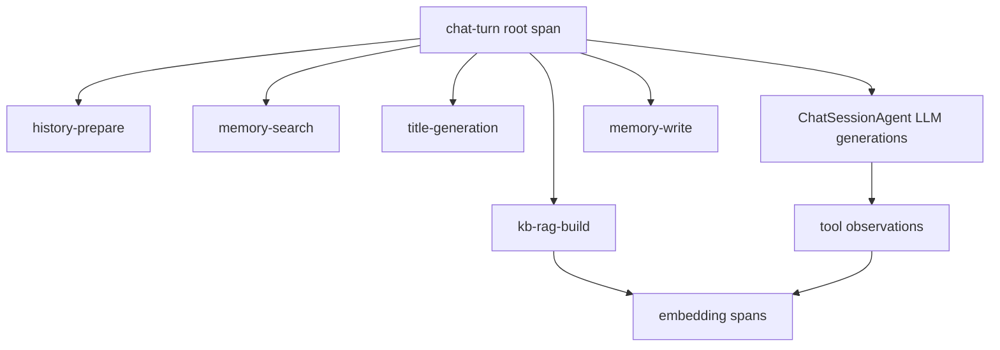

# Langfuse 观测缺口补全实施计划

## 目标架构



子 span 命名与文档 [`docs/agent_observability/langfuse_integration.md`](docs/agent_observability/langfuse_integration.md) 第 3 节对齐。

---

## 1. 抽取可复用观测 helper（前置）

**文件**: [`backend/app/core/observability.py`](backend/app/core/observability.py)

新增轻量 API，避免在 orchestrator / service 层重复 `try/except + get_langfuse()` 样板：

- `observation_span(name, *, as_type="span", input=..., trace_context=...)` — `@contextmanager`，`is_enabled()` 为 false 时 yield `None`
- `mark_observation_error(span, exc)` — 设置 `level="ERROR"` + `status_message`
- `flush_langfuse()` — 封装 `get_langfuse()?.flush()`，供 producer 结束可选调用（本计划不强制改 `chat.py`，可作为后续增强）

所有 helper 内部异常只 `logger.warning`，不冒泡。

---

## 2. 高优先级：stream 错误与 trace / 落库一致

**问题**: [`stream_turn_events`](backend/app/services/chat/chat_orchestrator.py) 捕获异常后只 `yield build_error_event`，`run_chat_turn` 仍走 done 落库路径，根 span 显示成功。

**改动**:

1. 新增领域异常 `ChatStreamError`（可放在 `backend/app/services/chat/errors.py` 或 `chat_orchestrator.py` 顶部）
2. `stream_turn_events` 在 `yield build_error_event(...)` 后 `raise ChatStreamError(...) from exc`
3. `run_chat_turn` 内层 `try` 增加 `except ChatStreamError as exc` 分支（置于 `CancelledError` 之后）：
   - `self.chat_session_agent._sync_session_output()`（与 stopped 路径一致）
   - `collect_assistant_response()` 收集部分内容
   - `message_service.update_assistant_message(..., status=MessageStatus.FAILED)`（复用现有 update 方法，不新增 DB 字段）
   - `root_span.update(level="ERROR", status_message=..., output=partial_content, metadata={"status": "failed"})`
   - **不** `yield build_done_event`
   - **不** 调用 `schedule_memory_write`
   - 不再向外抛异常（error SSE 已下发）

4. 正常 `except Exception` 外层分支逻辑保持不变（DB 查询失败等场景）

**前端兼容**: [`frontend/src/hooks/chat.ts`](frontend/src/hooks/chat.ts) 收到 `type === "error"` 后直接 return，不依赖 done；跳过 done 符合现有行为。

---

## 3. 中优先级：历史准备 / 记忆检索 / KB RAG 子 span

**文件**: [`backend/app/services/chat/chat_orchestrator.py`](backend/app/services/chat/chat_orchestrator.py)

在 `run_chat_turn` 根 span 内，用 `observation_span` 包裹三处调用：

| Span 名 | 包裹点 | input（精简） | output（精简） |
|---------|--------|---------------|----------------|
| `history-prepare` | `prepare_history_messages(...)` | `history_ids_count` | `prepared_count`, `has_window_summary: bool` |
| `memory-search` | `memory_search(...)` | `query`（文本，已由 mask 保护） | `count`, `memory_ids`, `relevance` 列表 |
| `kb-rag-build` | `_build_kb_context_blocks(...)` | `query`, `candidate_content_ids_count` | `block_count`, `content_ids` |

失败时 `mark_observation_error` 后 **re-raise**，由外层统一处理（与业务行为一致）。

窗口外摘要 LLM 仍在 `history-prepare` 子树下，由现有 `langfuse.openai.AsyncOpenAI` 自动产生 generation，无需额外改动 [`ContextSummaryService`](backend/app/services/conversation/context_summary_service.py)。

---

## 4. 中优先级：标题生成失败可观测

**文件**: [`backend/app/services/chat/chat_orchestrator.py`](backend/app/services/chat/chat_orchestrator.py)

在 `generate_title_event` 外包 `observation_span("title-generation", input={conversation_id})`：

- 成功：`span.update(output={"title": title, "title_length": len(title)})`
- 失败：`mark_observation_error` 后 `raise`（保持现有 `_merge_stream_with_title_task` 吞掉异常、不影响主流程的行为，但 Langfuse 中该子 span 标 ERROR）

并行 task 通过 `asyncio.create_task` 继承 contextvars，generation 与 span 均挂在同一 `chat-turn` trace 下。

---

## 5. 中优先级：Mem0 读写追踪

**文件**: [`backend/app/services/user/memory_service.py`](backend/app/services/user/memory_service.py)

- `search`: 包 `observation_span("memory-search", ...)` — **注意** orchestrator 层已有同名 span 时二选一，避免重复嵌套同名 span。
  - **推荐**: span 只放在 **MemoryService**（单一职责），orchestrator 层删除 `memory-search` 包裹，改为在 orchestrator 的 `kb-rag-build` / `history-prepare` 保留；记忆检索由 service 自追踪。
- `add_memories`: 包 `observation_span("memory-write", trace_context={"trace_id": new_trace_id(run_id)})`
  - `run_id` 使用 `assistant_message_id`，保证异步 task 在根 span 关闭后仍能关联到同一 trace

**文件**: [`backend/app/services/chat/post_process_service.py`](backend/app/services/chat/post_process_service.py)

- `schedule_memory_write` 增加参数 `assistant_message_id: str`，传入 `add_memories(..., run_id=assistant_message_id)`
- `run_chat_turn` 调用处传入 `assistant_message_id`；**FAILED 分支不调用** `schedule_memory_write`

output 元数据：`messages_count=2`，不写完整对话正文（控制体积）。

---

## 6. 中优先级：Embedding 调用追踪（双路径）

### 6.1 KB RAG — EmbeddingService

**文件**: [`backend/app/services/base_service/embedding_service.py`](backend/app/services/base_service/embedding_service.py)

在 `aembed_query` / `aembed_documents` 内：

```python
with observation_span("embedding", input={"model": ..., "text_length": ...}) as span:
    vectors = await ...
    span.update(output={"dimension": len(vectors[0]) if vectors else 0, "count": len(vectors)})
```

失败：`mark_observation_error` 后按现有逻辑返回 `[]`（不阻断 RAG）。

### 6.2 工具结果压缩 — ContextCompactor

**文件**: [`backend/app/utils/context_compactor.py`](backend/app/utils/context_compactor.py)

在 `extract_relevant_markdown`（实际触发 `FAISS.from_documents` + embedding）外包：

`observation_span("tool-result-embedding", input={"chunk_count", "query_length", "model"})`

output: `selected_chunks`, `relevance_applied` 等摘要字段。

不重构为共用 `EmbeddingService`（用户已确认双路径各自加 span）。

---

## 7. 文档与验收

**文件**: [`docs/agent_observability/langfuse_integration.md`](docs/agent_observability/langfuse_integration.md)

更新：

- §3 列出子 span 名称表（`history-prepare`, `memory-search`, `kb-rag-build`, `title-generation`, `memory-write`, `embedding`, `tool-result-embedding`）
- §7 增加：`metadata.status=failed` 与 `level=ERROR` 的定位步骤
- §8 验收项补充：
  - Agent 流中途中断/异常时 trace 为 ERROR，且无 done
  - 记忆检索 / KB RAG 子 span 可展开
  - 标题失败时 `title-generation` span 为 ERROR
  - `memory-write` 可通过 `assistant_message_id` 关联到同 trace

---

## 8. 测试

新增 [`backend/tests/core/test_observability.py`](backend/tests/core/test_observability.py)：

- `is_enabled=False` 时 `observation_span` 为 no-op
- `mark_observation_error` 不抛异常

新增 [`backend/tests/services/chat/test_chat_orchestrator_tracing.py`](backend/tests/services/chat/test_chat_orchestrator_tracing.py)（mock `get_langfuse` / `is_enabled`）：

- `stream_turn_events` 抛 `ChatStreamError` 后，`run_chat_turn` 不 yield done、调用 `update_assistant_message` 且 `status=FAILED`
- 正常完成路径仍 yield done

运行：`cd backend && make test -- tests/core/test_observability.py tests/services/chat/test_chat_orchestrator_tracing.py`

---

## 改动文件汇总

| 文件 | 变更类型 |
|------|----------|
| `backend/app/core/observability.py` | 新增 helper |
| `backend/app/services/chat/errors.py` | 新增 `ChatStreamError` |
| `backend/app/services/chat/chat_orchestrator.py` | 错误路径 + 子 span + title span |
| `backend/app/services/user/memory_service.py` | Mem0 search/write span |
| `backend/app/services/chat/post_process_service.py` | 传 `assistant_message_id` |
| `backend/app/services/base_service/embedding_service.py` | embedding span |
| `backend/app/utils/context_compactor.py` | tool-result-embedding span |
| `docs/agent_observability/langfuse_integration.md` | 文档同步 |
| `backend/tests/...` | 单元测试 |

**不改动**: `chat_service.py`（纯透传）、`chat.py` API 层、`tool_executor.py`（已有 tool observation，可选后续 refactor 用 helper）。

---

## 实施顺序建议

1. observability helper + 单测
2. `ChatStreamError` + FAILED 落库路径（最高价值）
3. orchestrator 子 span（history / kb-rag）+ MemoryService search span
4. title-generation span
5. memory-write + Embedding 双路径
6. 文档 + 集成验收（Langfuse UI 手动走一轮含工具/标题/附件的请求）
