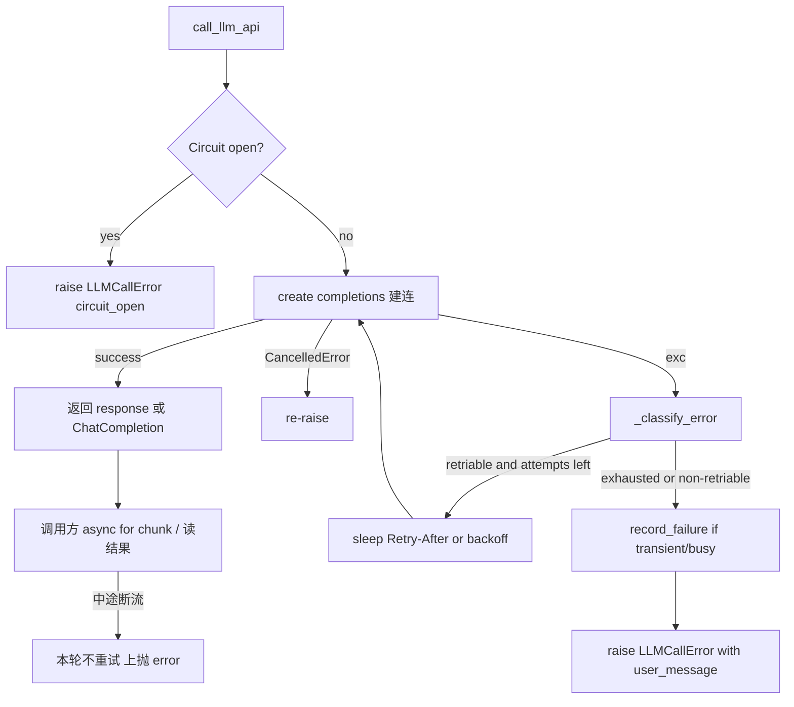

# LLM 层错误处理（重试 / 熔断 / 友好降级）

## 范围

- **做**：错误分类、最多 3 次重试、指数退避 + Retry-After、进程级 LLM Circuit Breaker、中文友好错误上抛到现有 SSE `error`。
- **不做**：AgentMiddleware 洋葱链、工具层改造、SSE `llm_retry` 事件与前端展示（后续可选）。
## 重试时机（明确边界）

重试发生在 **`call_llm_api` 内部、拿到返回值之前**，与是否 `stream=True` 无关：

| 阶段 | 代码位置 | 会不会重试 |
|------|----------|------------|
| A. 建连 / 创建 completion | `await client.chat.completions.create(...)` 抛错（429、503、连接失败等） | **会**（可重试类错误，最多 3 次） |
| B. 已拿到 stream，正在读 chunk | [`streaming_llm.py`](backend/app/agents/utils/streaming_llm.py) 的 `async for chunk in response` | **不会**（本轮方案不做） |
| C. 非流式整包返回 | `stream=False` 时 `create` 本身失败 | **会**（与 A 同一路径） |

因此：**流式任务「进行中」（前端已开始收到 reasoning/content）时不会自动重试**。若中途断流，异常从消费层上抛，走现有 SSE `error` + 友好文案（若被包装为 `LLMCallError` 则仅限于仍在 `call_llm_api` 内抛出的错误；chunk 循环内的异常保持现状上抛）。

原因：中途重试会导致已推给前端的半包与新请求内容重复/错乱，且长输出场景会叠加重试等待。中途断流恢复留给后续（P2：特殊预算或会话级续写）。

用户体感：

- 建连阶段 429/503：后端静默 sleep 再试，成功则用户无感知（本轮不做 `llm_retry` SSE，前端不会显示「正在重试」）。
- 建连耗尽或中途断流：直接 SSE `error`，对话该轮失败。

## 现状与目标行为

当前 [`llm_service.py`](backend/app/services/base_service/llm_service.py) 只 log + `raise`；[`chat_orchestrator`](backend/app/services/chat/chat_orchestrator.py) / [`api/chat.py`](backend/app/api/chat.py) 用 `str(exc)` 填 `build_error_event`。前端已用 `message.error(content)` 展示（[`hooks/chat.ts`](frontend/src/hooks/chat.ts)），因此只需让异常的用户可见文案变友好，**不必改前端**。

## 实现方案

### 1. 新增可靠性配置

在 [`backend/app/schemas/config.py`](backend/app/schemas/config.py) 增加 `LLMReliabilityConfig`（带默认值），并挂到 [`Settings`](backend/app/core/config.py)：

| 字段 | 默认 |
|------|------|
| `retry_max_attempts` | `3` |
| `retry_base_delay_ms` | `1000` |
| `retry_cap_delay_ms` | `8000` |
| `circuit_failure_threshold` | `5` |
| `circuit_recovery_timeout_sec` | `30` |

Nacos / env 可用 `LLM_RELIABILITY__RETRY_MAX_ATTEMPTS` 等覆盖；不强制改现有 nacos YAML。

### 2. 抽出错误处理模块

新建 [`backend/app/services/base_service/llm_error_handling.py`](backend/app/services/base_service/llm_error_handling.py)（逻辑参考 deer-flow，但不依赖 LangChain）：

- **`LLMCallError(Exception)`**：字段 `reason`（`quota` / `auth` / `busy` / `transient` / `generic` / `circuit_open`）、`user_message`（中文）、`detail`（原始摘要，截断）、`status_code`（可选）。`__str__` 返回 `user_message`，保证现有 `str(exc)` 路径自然变友好。
- **`classify_error(exc) -> (retriable: bool, reason: str)`**：顺序与 deer-flow 一致——quota/auth 消息模式（中英）→ 异常类名（`APITimeoutError`、`APIConnectionError`、`InternalServerError`、`ReadError`、`RemoteProtocolError`）→ HTTP `{408,409,425,429,500,502,503,504}` → busy 模式 → 否则 `generic` 不可重试。
- **`build_retry_delay_ms` / `extract_retry_after_ms`**：优先 `Retry-After-Ms` / `Retry-After`（秒或 HTTP-date），否则 `base * 2^(attempt-1)` 封顶。
- **`user_message_for(reason, exc)`**：中文文案（配额不足 / 认证失败 / 暂时不可用 / 通用失败）。
- **`CircuitBreaker`**：closed → open → half-open（单探针）；仅 `transient`/`busy` 计入失败；`quota`/`auth`/`generic` 不触发熔断。
- **进程级共享**：模块级 `dict[str, CircuitBreaker]`，key 用 `api_base`（同一 provider 共享），避免每个 Agent/`LLMService` 实例各算一套导致熔断失效。

### 3. 改造 `LLMService.call_llm_api`

改 [`llm_service.py`](backend/app/services/base_service/llm_service.py)：

1. 创建客户端时显式 `max_retries=0`，关闭 OpenAI SDK 默认重试，避免与自研重试叠加。
2. 调用前 `_check_circuit(api_base)`；打开则直接 `LLMCallError(reason="circuit_open", ...)`。
3. 循环最多 `retry_max_attempts`：
   - 成功 → `record_success`，返回 response（含 stream 句柄）。
   - `asyncio.CancelledError` → 重置 half-open 探针状态后原样抛出。
   - 可重试且未耗尽 → sleep → continue（保留现有 Langfuse `mark_observation_error` 日志习惯，重试用 `warning`）。
   - 不可重试或耗尽 → 若 reason 为 transient/busy 则 `record_failure`，再 `raise LLMCallError`（不再裸抛 SDK 异常给上层用户路径）。
4. 内部仍可对 SDK 异常打结构化日志；对外统一 `LLMCallError`。

调用方（`chat_session_agent`、`title_generation_agent`、`context_summary_service`、`streaming_llm`）**无需改签名**；编排层继续 `str(exc)` 即可。可选小改：orchestrator 若捕获到 `LLMCallError`，日志里额外打 `reason`/`detail`（用户文案与运维详情分离）。

### 4. 测试

新增 [`backend/tests/services/test_llm_error_handling.py`](backend/tests/services/test_llm_error_handling.py)：

- 分类：429/503/连接错误 → retriable；quota/auth 文案 → 不可重试。
- Retry-After 解析与退避封顶。
- CircuitBreaker 状态：连续失败开闸、冷却后 half-open、探针成功关闭、探针失败再开；auth 失败不计入。
- `call_llm_api`（mock client）：前两次 `RateLimitError`、第三次成功；不可重试错误只调 1 次；熔断打开时不发起请求。

## 关键文件

| 文件 | 变更 |
|------|------|
| `backend/app/schemas/config.py` | 新增 `LLMReliabilityConfig` |
| `backend/app/core/config.py` | Settings 挂载字段 |
| `backend/app/services/base_service/llm_error_handling.py` | **新建**：分类/重试/熔断/友好文案 |
| `backend/app/services/base_service/llm_service.py` | 接入重试循环 + `max_retries=0` |
| `backend/tests/services/test_llm_error_handling.py` | **新建** |
| `backend/app/services/chat/chat_orchestrator.py` | 可选：错误日志带 `reason` |

## 验收标准

- 模拟 429/503：自动退避重试，成功则用户无感知。
- 模拟余额不足/鉴权失败：不重试，SSE `error.content` 为中文友好句。
- 连续 transient 失败达阈值：后续请求快速失败（circuit_open 文案），冷却后恢复探测。
- `make test` 覆盖上述单测；不改前端、不改工具执行路径。
