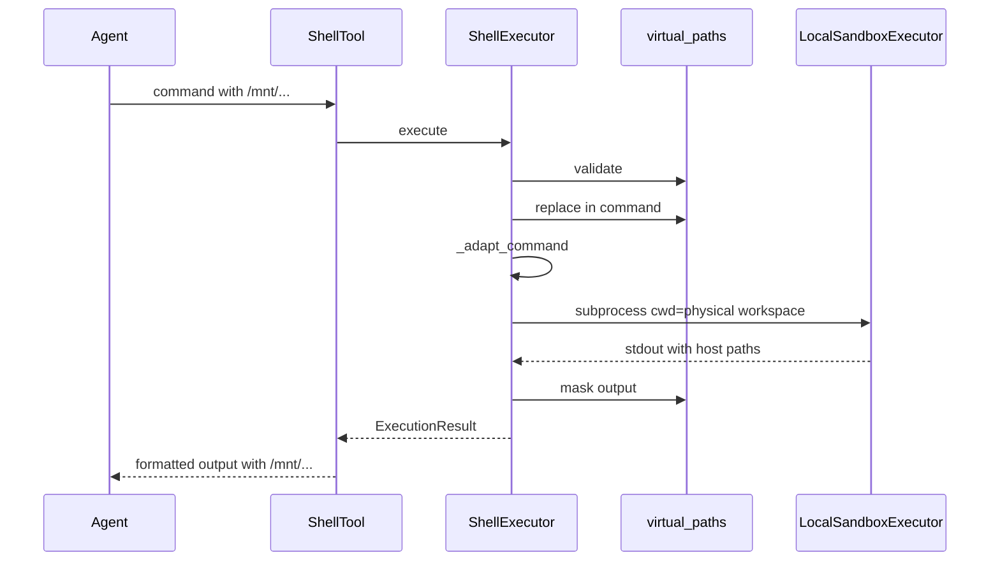

# Local Sandbox Shell 虚拟路径处理

## 现状与问题

| 模式 | cwd | 命令中的路径 | 输出 |
|------|-----|-------------|------|
| **docker** | 虚拟 `/mnt/user-data/workspace` | 容器内虚拟路径，bind mount 生效 | 已是虚拟路径 |
| **local**（当前） | 宿主机物理 workspace（[`ShellExecutor._resolve_cwd`](backend/app/mcp/mcp_servers/shell_mcp/executor.py)） | **未转换**：`cat /mnt/user-data/uploads/x.pdf` 在宿主机不存在 | stdout/stderr 可能泄露 `.../data/user_data/...` |

已有能力（**未接入 shell**）：

- [`PathResolver`](backend/app/vfs/resolver.py)：单路径 virtual → physical + 穿越校验
- [`VirtualPathMapper`](backend/app/vfs/mapper.py)：`to_physical` / `_replace_physical_paths`（输出侧字符串替换）
- [`policy._validate_cd_segment`](backend/app/mcp/mcp_servers/shell_mcp/policy.py)：仅校验 `cd` 目标，且只覆盖 user-data 三前缀，**不**扫描命令中其它绝对路径 token

[`ShellExecutor.initialize`](backend/app/mcp/mcp_servers/shell_mcp/executor.py) 已接收 `conversation_id`，但**未保存**，local 模式无法构建 per-conversation 映射。

**范围说明**（相对 deer-flow 精简，符合 chat-agent 能力）：

- 包含：`/mnt/user-data/{workspace,uploads,outputs}`、`/mnt/skills/`（含 `public`）、`/mnt/skills/custom/`
- 不包含：ACP workspace、config 自定义 mount（项目内无对应配置）

---

## 实现方案

### 1. 新增 `virtual_paths.py`（shell 专用）

路径：[`backend/app/mcp/mcp_servers/shell_mcp/virtual_paths.py`](backend/app/mcp/mcp_servers/shell_mcp/virtual_paths.py)

参考 deer-flow [`replace_virtual_path`](file:///Users/honglei.wu/Desktop/code/deer-flow/backend/packages/harness/deerflow/sandbox/tools.py) / [`replace_virtual_paths_in_command`](file:///Users/honglei.wu/Desktop/code/deer-flow/backend/packages/harness/deerflow/sandbox/tools.py) / [`mask_local_paths_in_output`](file:///Users/honglei.wu/Desktop/code/deer-flow/backend/packages/harness/deerflow/sandbox/tools.py)，实现：

| 函数 | 职责 |
|------|------|
| `build_path_mappings(user_id, conversation_id)` | 从 [`get_paths()`](backend/app/vfs/paths.py) + [`vfs_config`](backend/app/vfs/config.py) 构建 **最长前缀优先** 的 `virtual → physical` 表（含 user-data 根、三子目录、skills、skills/custom；user-data 根映射到 `conversation_dir` 父级，与 deer-flow 一致） |
| `replace_virtual_path(token, mappings)` | 单 token 替换，保留尾部 `/` |
| `replace_virtual_paths_in_command(command, mappings)` | 正则 `VIRTUAL_PREFIX(/[^\s\"';&|<>()]*)?`，按 skills → skills/custom → user-data 子路径 → user-data 根 顺序替换（对齐 deer-flow 边界字符） |
| `validate_local_command_paths(command, mappings)` | **在替换前**扫描命令：拒绝 `/Users/...` 等宿主机绝对路径、`~`、`file://`（非 file URL 白名单）、`..` 穿越、不在白名单的 `/` 绝对路径；允许 `/mnt/user-data/*`、`/mnt/skills/*`、`/bin`/`/usr/bin` 等系统路径前缀；对 `cd` 目标做与 policy 一致的加强校验 |
| `mask_paths_in_output(text, ctx)` | 复用 [`VirtualPathMapper._replace_physical_paths`](backend/app/vfs/mapper.py)（或抽成 mapper 的公开方法 `mask_paths_in_text`），将 stdout/stderr 中物理路径映回虚拟路径 |

单路径解析可内部调用现有 `PathResolver.resolve_virtual_to_physical`，避免与 file MCP 行为分叉。

### 2. 接入 `ShellExecutor.execute`（仅 local）

修改 [`backend/app/mcp/mcp_servers/shell_mcp/executor.py`](backend/app/mcp/mcp_servers/shell_mcp/executor.py)：

1. **`initialize`**：保存 `_conversation_id`（与 `_user_id` 并列）
2. **`execute`**：当 `_effective_backend == "local"` 且 `user_id` + `conversation_id` 均有值时：
   - `validate_local_command_paths` → 失败则返回 `ExecutionResult(blocked=True, block_reason=...)`
   - `replace_virtual_paths_in_command`
   - 现有 `_adapt_command_for_backend`（**在替换之后**调用，以便剥掉已变成物理路径的 `cd`/`mkdir`）
   - `LocalSandboxExecutor.execute`（cwd 仍为物理 workspace，**无需** deer-flow 的 `cd host &&` 前缀，与现有 [`test_shell_executor_local_cwd_uses_workspace_path`](backend/app/mcp/mcp_servers/shell_mcp/test_shell_tool.py) 一致）
   - 对 `result.stdout` / `result.stderr` 调用 `mask_paths_in_output`
3. **docker 分支**：保持现状，不做替换（容器内已是虚拟挂载）

审计日志仍使用 Agent 原始 `command`（[`shell.py`](backend/app/mcp/mcp_servers/shell_mcp/shell.py) 在调用 executor 前已记录），不记录解析后的宿主机路径。

### 3. 与 policy 的分工

- **保留**现有 [`CommandPolicyEngine`](backend/app/mcp/mcp_servers/shell_mcp/policy.py)（命令白名单、危险模式、bashlex）
- **新增** `validate_local_command_paths` 专管「绝对路径白名单」，仅在 local 模式、替换前执行
- 可选小改：policy 的 `_validate_cd_segment` 增加 `/mnt/skills` 前缀（与 file MCP 一致），避免 `cd /mnt/skills/public` 被误拦——若 validate 已覆盖可不动

### 4. 测试

新增 [`backend/app/mcp/mcp_servers/shell_mcp/test_virtual_paths.py`](backend/app/mcp/mcp_servers/shell_mcp/test_virtual_paths.py)（参考 deer-flow [`test_sandbox_tools_security.py`](file:///Users/honglei.wu/Desktop/code/deer-flow/backend/tests/test_sandbox_tools_security.py)）：

- `replace_virtual_paths_in_command`：`workspace` / `uploads` / `outputs` / `skills/public`、尾部 `/` 保留
- `validate_local_command_paths`：拒绝 `/Users/...`、`..`；允许 `/mnt/user-data/workspace/x`
- `mask_paths_in_output`：物理路径 → `/mnt/user-data/...`

扩展 [`test_shell_tool.py`](backend/app/mcp/mcp_servers/shell_mcp/test_shell_tool.py)：

- local + mock backend：`cat /mnt/user-data/uploads/a.txt` 传入 executor 的 command 应为物理路径
- 输出经 mask 后含虚拟路径、不含 `data/user_data` 片段

---

## 数据流（local）

---

## 非目标 / 后续

- 不实现 deer-flow `LocalSandbox._resolve_paths_in_command` 第二层（无自定义 mount）
- Windows MSYS `MSYS_NO_PATHCONV`：当前 [`LocalSandboxExecutor`](backend/app/sandbox/local_executor.py) 未区分平台；若需 Windows 本地开发可单独跟进
- 不修改 docker 路径逻辑
