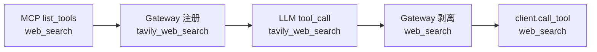

# MCP 工具名 `{server_name}_` 前缀改造方案

## 与 DeerFlow 的对照与借鉴

DeerFlow 通过 `MultiServerMCPClient(tool_name_prefix=True)` 在 **LangChain/Agent 层** 使用 `{serverName}_{原始名}`，在 **`session.call_tool` 前** 剥回原始名。本项目的 `MCPToolGateway` 职责等价，可直接对齐其分阶段模型：

| 阶段 | DeerFlow | Chat Agent（本方案） |
|------|----------|----------------------|
| MCP `list_tools` | `search` | `web_search`（不变） |
| 暴露给 LLM | `github_search` | `tavily_web_search` |
| LLM tool call | `github_search` | `tavily_web_search` |
| 调用 MCP 前 | `startswith(f"{server_name}_")` 剥离 | 同上，经 `to_mcp_tool_name()` |
| `call_tool` 参数 | `search` | `web_search` |

**采纳的设计点：**

1. **前缀仅用于 Agent/LLM 层**，MCP 协议与各 Server 实现不改。
2. **`server_name` 必须等于 `mcp_servers` 配置键**（如 `tavily`、`code-exec`；已去掉 `-mcp` 后缀），拼接与剥离都基于该 key，不用模块名或别名。
3. **调用前剥离而非长期维护 `original_tool_names` 映射表**：先由 `tools_map[llm_name]` 得到 `server_name`，再 `to_mcp_tool_name(llm_name, server_name)` → 原始名（与 DeerFlow `_make_session_pool_tool` 一致）。
4. **Best-effort 剥离**：仅当 `llm_name.startswith(f"{server_name}_")` 时剥离；否则将全名传给 MCP（用于极少数边界或调试）。

**本项目差异（保留原方案）：**

- 配置键使用 `mcp_servers` 的字面量 key（如 `tavily`、`my_custom_mcp`），前缀形如 `{key}_{tool.name}`。
- **`server_name` 可含 `-` 与 `_`**；解析归属时不依赖「第一个 `_` 切开」，而对已知 server 列表做**最长前缀匹配**（见下）。
- 前端需剥离前缀做图标/结果渲染；与后端共用同一套最长前缀逻辑（传入 server 列表时）。
- **不做裸名 fallback**：`call_tool` 仅接受 `tools_map` 中的带前缀 LLM 名；LLM 传裸名将直接报错（与 DeerFlow 一致）。

---

## 目标命名

- **LLM 可见名**：`{server_name}_{tool.name}`，例如 `tavily_web_search`、`my_custom_mcp_web_search`
- **MCP 协议调用名**：原始 `tool.name`
- **分隔符**：单下划线 `_` 连接 `{server_name}` 与 `{tool.name}`；`server_name` 为 `mcp_servers` 配置键（允许 `-`、`_` 等，与 key 字面量一致）
- **归属解析**：在已知 server 列表上，取满足 `llm_name.startswith(f"{name}_")` 的 **最长** `name`（避免 `mcp` 误匹配 `mcp_extra_tool`）



---

## 核心改动（后端）

### 1. 命名模块 [`backend/app/mcp/tool_naming.py`](backend/app/mcp/tool_naming.py)

| 函数 | 职责 | 对应 DeerFlow |
|------|------|----------------|
| `llm_tool_name(server_name, bare_name)` | `f"{server_name}_{bare_name}"` | adapter `lc_tool_name` |
| `to_mcp_tool_name(llm_name, server_name)` | 已知 server 时剥前缀（内聚 strip 逻辑）；gateway / schema 查找唯一使用 | `_make_session_pool_tool` |
| `is_llm_tool(llm_name, server_name, bare_name)` | 策略层比较 | — |
| `resolve_server_by_prefix(llm_name, server_names)` | 已知 key 列表上**最长前缀**匹配 `f"{name}_"` | DeerFlow 归属识别（增强） |
| `bare_tool_name(llm_name, server_names)` | `resolve_server_by_prefix` → `to_mcp_tool_name`；无匹配则原样返回 | — |

**`resolve_server_by_prefix` 算法（后端/前端一致）：**

```python
def resolve_server_by_prefix(llm_name: str, server_names: Iterable[str]) -> str | None:
    candidates = [n for n in server_names if llm_name.startswith(f"{n}_")]
    if not candidates:
        return None
    return max(candidates, key=len)  # 最长 key 优先
```

单元测试覆盖：正常剥离、`server_name` 不匹配时不误剥、裸名、`tavily` / `code-exec`、**重叠前缀**（`code` vs `code-exec` 取更长者）。

### 2. 改造 [`backend/app/mcp/gateway.py`](backend/app/mcp/gateway.py)

**索引 `rebuild_tool_index`**

```python
llm_name = llm_tool_name(server_name, tool.name)
self.tools_map[llm_name] = server_name
```

- 跨 Server 裸工具名冲突：前缀后天然消除；**删除** `tool_conflicts`、`_handle_conflict` 与 `keep_first_server`（`tools_map` 仅索引带前缀 `llm_name`）。
- **不再维护** `original_tool_names` 字典（改由 strip 推导，与 DeerFlow 一致）。

**`get_tools_for_llm`**

```python
"name": llm_tool_name(server_name, tool.name),
```

**`call_tool`（DeerFlow 调用前还原）**

```python
server_name = self.tools_map[llm_name]  # llm_name 为 LLM 传入
mcp_name = to_mcp_tool_name(llm_name, server_name)
await client.call_tool(mcp_name, args, ...)
```

- `llm_name not in tools_map` 时直接 `ValueError`（列出现有带前缀工具名），**不**尝试裸名解析或调用。

**`get_tool_info` / `_get_tool_input_schema`**

- 入参为 LLM 名；schema 查找时对 `tools_by_server[server_name]` 用 `to_mcp_tool_name(...)` 与 `tool.name` 比较。

### 3. ToolUseBlock 显式字段（推荐，已确认全量补全）

在 [`ToolUseBlock`](backend/app/schemas/chat.py) 增加可选字段（存于 `messages.content_blocks` JSON，**无需**改表结构）：

| 字段 | 含义 | 写入时机 |
|------|------|----------|
| `name` | LLM 可见名（带前缀），与流式 delta / `tool_messages_from_content_blocks` 回放一致 | 现有 `process_tool_call_deltas` |
| `server_name` | `mcp_servers` 配置键 | `finalize_round` 或 name 确定后，经 `gateway.get_server_for_tool(name)` |
| `mcp_tool_name` | MCP 裸工具名 | `to_mcp_tool_name(name, server_name)` |

**为何建议加字段（而不只靠 `name` 解析）：**

- 前端图标、结果组件、策略统计可直接用 `mcp_tool_name`，不必依赖 server 列表做最长前缀匹配。
- 读历史消息时避免「裸名 `web_search` 无法反推 server」的歧义（前缀改造前大量裸名落库）。
- `tool_messages_from_content_blocks` / [`base.py`](backend/app/agents/base.py) 重建 LLM 上下文时仍只读 `name`，行为不变。

**写入路径：** [`ContentBlocksAggregator.finalize_round`](backend/app/agents/utils/content_blocks.py) 对本轮 `ToolUseBlock` 注入 `server_name`、`mcp_tool_name`（需注入 `MCPClientManager` 或 gateway 查询能力）。

**不变量（新数据）：** `name == llm_tool_name(server_name, mcp_tool_name)`（在两者均非空时断言或单测保证）。

### 4. 历史数据全量补全迁移（用户选择：full_backfill）

实现 `backend/scripts/backfill_tool_use_block_names.py`（或 Alembic `data` revision，推荐独立脚本便于 dry-run）：

1. 扫描 `messages` 表中 `content_blocks` 含 `type=tool_use` 的行（可仅 `role=assistant`）。
2. 对每条 `ToolUseBlock`：
   - **已带前缀**（`resolve_server_by_prefix(name, known_servers)` 命中）：写入 `server_name`、`mcp_tool_name`，**不修改** `name`。
   - **裸名**：按「工具名 → 默认 server」静态表 + **会话上下文** 消歧：
     - 查同条 message / 同 conversation 的 `message_metadata` 或关联 user message 的 `agent_mode`（0 → `normal_mode_servers`，>0 → `agent_mode_servers`）。
     - 若裸名在多个 server 均存在，优先选当前模式已启用 server 列表中的唯一匹配；仍歧义则 `server_name=null` 并打日志计数。
   - **旧 server key**（如 `tavily-mcp_web_search`）：先映射 key `tavily-mcp` → `tavily`，再剥离。
3. 批处理 `UPDATE` JSON（SQLAlchemy 或 raw SQL `jsonb`）；支持 `--dry-run`、`--limit`、`--conversation-id`。
4. 产出报告：总数 / 已补全 / 歧义跳过 / 无法识别。

**注意：** 补全只写 `server_name`、`mcp_tool_name`；**不把历史 `name` 改成带前缀名**，避免改变已持久化的 LLM 调用记录语义。新会话在 gateway 改造后自然写入带前缀 `name`。

**回滚：** 脚本保留补全前 JSON 快照或仅删除新增两字段（可选 `downgrade` 步骤）。

### 5. Agent / Prompt / 前端

- [`tool_call_policy.py`](backend/app/agents/tool_call_policy.py)、[`tavily_result_processor.py`](backend/app/agents/utils/tavily_result_processor.py)：优先 `block.mcp_tool_name` 或 `is_llm_tool(name, "tavily", "web_search")`。
- Prompt 与 LLM schema 一致（`tavily_web_search`）。
- 前端 [`ToolUseBlock`](frontend/src/interfaces/contentBlock.ts) 增加 `serverName?`、`mcpToolName?`；展示/图标**优先** `mcpToolName`，其次 `bareToolName(name)`，最后裸名 `matchesTool` 启发式（兼容未补全记录）。
- 可选保留 [`mcpToolName.ts`](frontend/src/utils/mcpToolName.ts) 作为无字段时的回退。

### 6. 文档与测试

- 更新 [`backend/docs/MCP_CONFIG_ANALYSIS.md`](backend/docs/MCP_CONFIG_ANALYSIS.md)：增加「命名双轨」一节，对照 DeerFlow 时序图。
- `tests/mcp/test_tool_naming.py`：剥离逻辑与 DeerFlow 示例表对齐（`github` + `search` → `github_search` → `search`）。
- `tests/mcp/test_gateway_tool_names.py`：mock 双 server 同名工具，验证暴露名不同、调用均落到正确裸名。

---

## 完整时序（单次 tool call）

```
1. [注册]   MCP: web_search
2. [暴露]   LLM schema: tavily_web_search
3. [调用]   LLM 传入 tavily_web_search
4. [路由]   tools_map → server_name = tavily
5. [剥离]   to_mcp_tool_name → web_search
6. [MCP]    client.call_tool("web_search", args)
7. [持久化] name=tavily_web_search, server_name=tavily, mcp_tool_name=web_search
```

---

## 实施顺序

1. `tool_naming.py` + 单元测试（含 DeerFlow 对照用例）
2. `gateway.py` 改造
3. `ToolUseBlock` 字段 + `finalize_round` 写入
4. Agent / Prompt（可读 `mcp_tool_name`）
5. 前端 schema + ToolBlock 优先读新字段
6. 全量 backfill 脚本（dry-run → 生产执行）+ 报告
7. 文档 + gateway 集成测试

---

## 风险与边界

| 要点 | 说明 |
|------|------|
| 前缀与配置强绑定 | `server_name` 必须等于 `mcp_servers` 的 key |
| 重叠 server key | 如同时存在 `mcp` 与 `mcp_extra`，依赖**最长前缀**避免误归属 |
| 工具名本身含 `_` | 已知 `server_name` 下用完整前缀 `f"{server_name}_"` 剥离，裸名可保留尾部 `_` |
| 进行中/历史会话 | 全量 backfill 补 `server_name`/`mcp_tool_name`；未补全记录前端仍可用启发式 |
| 裸名歧义 | backfill 结合 `agent_mode` 与启用 server 列表；无法判定则字段留空并记日志 |
| 补全不改写 name | 历史 LLM 裸名保留；新消息 name 为带前缀 LLM 名 |

---

## 示例对照表（与 DeerFlow §8 同构）

| mcp_servers key | MCP 原始名 | LLM 可见名 | call_tool 参数 |
|-----------------|------------|------------|----------------|
| `tavily` | `web_search` | `tavily_web_search` | `web_search` |
| `my_custom_mcp` | `web_search` | `my_custom_mcp_web_search` | `web_search` |
| `file` | `read_file` | `file_read_file` | `read_file` |
| `time` | `get_current_time` | `time_get_current_time` | `get_current_time` |
