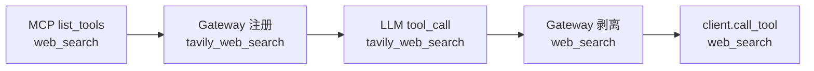

# MCP 工具名 `{server_name}_` 前缀改造方案

## 前置：Server 配置键已短名化

`mcp_servers` 默认键为 `tavily`、`file`、`shell`、`code-exec`、`time`、`weather`、`context7`（已无 `-mcp` 后缀）。Nacos / `MCP__MCP_SERVERS` 须同步。前缀改造尚未落地（[`gateway.py`](backend/app/mcp/gateway.py) 仍用裸 `tool.name`）。

---

## 与 DeerFlow 的对照与借鉴

DeerFlow 通过 `MultiServerMCPClient(tool_name_prefix=True)` 在 **LangChain/Agent 层** 使用 `{serverName}_{原始名}`，在 **`session.call_tool` 前** 剥回原始名。本项目的 `MCPToolGateway` 职责等价，可直接对齐其分阶段模型：

| 阶段 | DeerFlow | Chat Agent（本方案） |
|------|----------|----------------------|
| MCP `list_tools` | `search` | `web_search`（不变） |
| 暴露给 LLM | `github_search` | `tavily_web_search` |
| LLM tool call | `github_search` | `tavily_web_search` |
| 调用 MCP 前 | `startswith(f"{server_name}_")` 剥离 | 同上，经 `to_mcp_tool_name()` |
| `call_tool` 参数 | `search` | `web_search` |

**采纳的设计点：**

1. **前缀仅用于 Agent/LLM 层**，MCP 协议与各 Server 实现不改。
2. **`server_name` 必须等于 `mcp_servers` 配置键**（如 `tavily`、`code-exec`；已去掉 `-mcp` 后缀），拼接与剥离都基于该 key，不用模块名或别名。
3. **调用前剥离而非长期维护 `original_tool_names` 映射表**：先由 `tools_map[llm_name]` 得到 `server_name`，再 `to_mcp_tool_name(llm_name, server_name)` → 原始名（与 DeerFlow `_make_session_pool_tool` 一致）。
4. **Best-effort 剥离**：仅当 `llm_name.startswith(f"{server_name}_")` 时剥离；否则将全名传给 MCP（用于极少数边界或调试）。

**本项目差异（保留原方案）：**

- 配置键使用 `mcp_servers` 的字面量 key（如 `tavily`、`my_custom_mcp`），前缀形如 `{key}_{tool.name}`。
- **`server_name` 可含 `-` 与 `_`**；解析归属时不依赖「第一个 `_` 切开」，而对已知 server 列表做**最长前缀匹配**（见下）。
- 前端需剥离前缀做图标/结果渲染；与后端共用同一套最长前缀逻辑（传入 server 列表时）。
- **不做裸名 fallback**：`call_tool` 仅接受 `tools_map` 中的带前缀 LLM 名；LLM 传裸名将直接报错（与 DeerFlow 一致）。

---

## 目标命名

- **LLM 可见名**：`{server_name}_{tool.name}`，例如 `tavily_web_search`、`my_custom_mcp_web_search`
- **MCP 协议调用名**：原始 `tool.name`
- **分隔符**：单下划线 `_` 连接 `{server_name}` 与 `{tool.name}`；`server_name` 为 `mcp_servers` 配置键（允许 `-`、`_` 等，与 key 字面量一致）
- **归属解析**：在已知 server 列表上，取满足 `llm_name.startswith(f"{name}_")` 的 **最长** `name`（避免 `mcp` 误匹配 `mcp_extra_tool`）



---

## 核心改动（后端）

### 1. 命名模块 [`backend/app/mcp/tool_naming.py`](backend/app/mcp/tool_naming.py)

| 函数 | 职责 | 对应 DeerFlow |
|------|------|----------------|
| `llm_tool_name(server_name, bare_name)` | `f"{server_name}_{bare_name}"` | adapter `lc_tool_name` |
| `to_mcp_tool_name(llm_name, server_name)` | 已知 server 时剥前缀（内聚 strip 逻辑）；gateway / schema 查找唯一使用 | `_make_session_pool_tool` |
| `is_llm_tool(llm_name, server_name, bare_name)` | 策略层比较 | — |
| `resolve_server_by_prefix(llm_name, server_names)` | 已知 key 列表上**最长前缀**匹配 `f"{name}_"` | DeerFlow 归属识别（增强） |
| `bare_tool_name(llm_name, server_names)` | `resolve_server_by_prefix` → `to_mcp_tool_name`；无匹配则原样返回 | — |

**`resolve_server_by_prefix` 算法（后端/前端一致）：**

```python
def resolve_server_by_prefix(llm_name: str, server_names: Iterable[str]) -> str | None:
    candidates = [n for n in server_names if llm_name.startswith(f"{n}_")]
    if not candidates:
        return None
    return max(candidates, key=len)  # 最长 key 优先
```

单元测试覆盖：正常剥离、`server_name` 不匹配时不误剥、裸名、`tavily` / `code-exec`、**重叠前缀**（`code` vs `code-exec` 取更长者）。

### 2. 改造 [`backend/app/mcp/gateway.py`](backend/app/mcp/gateway.py)

**索引 `rebuild_tool_index`**

```python
llm_name = llm_tool_name(server_name, tool.name)
self.tools_map[llm_name] = server_name
```

- 跨 Server 裸工具名冲突：前缀后天然消除；**删除** `tool_conflicts`、`_handle_conflict` 与 `keep_first_server`（`tools_map` 仅索引带前缀 `llm_name`）。
- **不再维护** `original_tool_names` 字典（改由 strip 推导，与 DeerFlow 一致）。

**`get_tools_for_llm`**

```python
"name": llm_tool_name(server_name, tool.name),
```

**`call_tool`（DeerFlow 调用前还原）**

```python
server_name = self.tools_map[llm_name]  # llm_name 为 LLM 传入
mcp_name = to_mcp_tool_name(llm_name, server_name)
await client.call_tool(mcp_name, args, ...)
```

- `llm_name not in tools_map` 时直接 `ValueError`（列出现有带前缀工具名），**不**尝试裸名解析或调用。

**`get_tool_info` / `_get_tool_input_schema`**

- 入参为 LLM 名；schema 查找时对 `tools_by_server[server_name]` 用 `to_mcp_tool_name(...)` 与 `tool.name` 比较。

### 3. ToolUseBlock 显式字段（全量 backfill + 流式同步写入）

在 [`ToolUseBlock`](backend/app/schemas/chat.py) 增加字段（存于 `messages.content_blocks` JSON，**无需**改表结构）：

| 字段 | Schema 类型 | 写入时机 |
|------|-------------|----------|
| `name` | 可选（与现有一致） | 见流式策略 |
| `server_name` | **必填** `str` | 与 `name` 同一次写入 |
| `mcp_tool_name` | **必填** `str` | 与 `name` 同一次写入 |

**Pydantic / TypeScript 均为必填**（`Field(...)` / 非 optional 属性）。**须先完成 §4 迁移并通过 `--verify-only`**，再部署含必填模型的代码，否则 `normalize_content_blocks` 加载旧消息会失败。

**流式写入（满足前端实时渲染 + 必填模型）：**

当前实现会在首个 tool delta **无 `name`** 时 `append` 空 `ToolUseBlock`，与必填字段冲突。改为：

1. **延迟创建 block**：`tool_call index` 在见到非空 `fn.name` 之前只缓存 `tool_call_id` / `arguments` 片段，不 `append`。
2. **首次具备可解析 LLM 名时** 一次 `append` 完整块（含 `name`、`server_name`、`mcp_tool_name`），并继续对后续 delta 发 `tool_delta`。

```python
def resolve_tool_use_fields(llm_name: str) -> tuple[str, str, str]:
    server = gateway.get_server_for_tool(llm_name)
    if not server:
        raise ValueError(f"未知工具名: {llm_name}")  # 与 gateway 无裸名 fallback 一致
    return llm_name, server, to_mcp_tool_name(llm_name, server)
```

- 首次 `append` 的 `block` payload 已含三字段；后续 `tool_delta` 可只带 `arguments_delta` / `tool_call_id`。
- 若 provider 分片下发 `function.name`，在**每次** `fn.name` 更新时重新 enrich（幂等）；最终以完整 LLM 名为准。
- 前端 [`chat.ts`](frontend/src/services/chat.ts) 对 SSE 做 `camelcaseKeys` → `serverName` / `mcpToolName`；[`chatSlice`](frontend/src/store/slices/chatSlice.ts) 在 `tool_delta` 分支合并到 `ToolUseBlock`，ToolBlock 可在参数流式阶段即用 `mcpToolName` 选图标/标题。
- 扩展 [`ContentBlockEvent`](frontend/src/interfaces/contentBlock.ts)：`append` 的 `ToolUseBlock` 与 `tool_delta` 均携带必填的 `serverName`、`mcpToolName`（首次 append 即齐全）。

**`finalize_round` 职责不变（仅参数 JSON）：** 继续只解析 `arguments_json`；**不再**作为 `server_name` / `mcp_tool_name` 的主写入路径。可选防御：若 `name` 已有而两字段缺失（异常流），再补一次 enrich 并打 debug 日志。

**Aggregator 依赖：** `ContentBlocksAggregator` 构造或 `set_tool_name_resolver(...)` 注入 `get_server_for_tool`（来自 `MCPClientManager.gateway`），由 [`chat_session_agent`](backend/app/agents/chat_session_agent.py) 在会话开始时绑定。

**为何仍持久化两字段：** 历史消息/backfill、落库后非流式加载、策略统计不依赖前端解析；`tool_messages_from_content_blocks` / [`base.py`](backend/app/agents/base.py) 重建 LLM 上下文仍**只读 `name`**。

**不变量：** 有 `name` 时 `name == llm_tool_name(server_name, mcp_tool_name)`（带前缀名）或 `name == mcp_tool_name`（历史裸名保留场景）。

### 4. 历史数据迁移脚本（强制补全，禁止留空）

实现 [`backend/scripts/backfill_tool_use_block_names.py`](backend/scripts/backfill_tool_use_block_names.py)（**独立脚本**，不用 Alembic schema revision；便于 dry-run、分批与回滚）。

**范围：** 扫描 `messages.content_blocks` 中所有 `type=tool_use` 且 `name` 非空的块（建议仅 `role=assistant`）。

**解析顺序（每条 ToolUseBlock）：**

1. **旧前缀 key**：`tavily-mcp_web_search` 等 → 先 `LEGACY_SERVER_KEY_MAP`（`tavily-mcp`→`tavily`）再 `resolve_server_by_prefix` / 剥离。
2. **已带新短名前缀**：`resolve_server_by_prefix(name, known_servers)` → `server_name` + `to_mcp_tool_name`。
3. **裸名**：`STATIC_BARE_TOOL_TO_SERVER`（如 `web_search`→`tavily`、`read_file`→`file`）+ 同会话 `agent_mode` 与 `normal_mode_servers` / `agent_mode_servers` 过滤；若在启用列表中仅一个 server 提供该裸名 → 采用。
4. **仍歧义**：**确定性 fallback**（禁止 `null`），例如：在候选 server 中取字典序最小者，并写入 `migration_warnings` 报告；`mcp_tool_name` = 裸 `name`（历史裸名）或 `to_mcp_tool_name`（已带前缀）。

**写入规则：**

- 只增/改 `server_name`、`mcp_tool_name`；**不改**历史 `name`（裸名保持裸名，前缀名保持前缀名）。
- 无 `name` 的 orphan `tool_use` 块：跳过（不计入「必须补全」集合），或单独计数。

**CLI：**

```bash
uv run python backend/scripts/backfill_tool_use_block_names.py --dry-run
uv run python backend/scripts/backfill_tool_use_block_names.py
uv run python backend/scripts/backfill_tool_use_block_names.py --verify-only
```

**`--verify-only`（验收门禁）：** 全表扫描，若存在「`name` 非空但缺少 `server_name` 或 `mcp_tool_name`」的块 → **exit 1** 并列出 `message_id` / `block.id`。部署/发版前必须通过。

**产出：** `dry-run` 报告（将改动的条数、歧义 fallback 次数）；正式跑批日志；`--verify-only` 作为 CI 或发布检查项。

**回滚：** 脚本支持 `--rollback-from <snapshot.json>`（正式跑前可选导出受影响行的 `content_blocks` 快照）。

**与发版顺序：** ① 在**旧代码仍可读**的环境跑 backfill → `--verify-only` 通过；② 部署含**必填模型 + 延迟 append enrich** 的后端与前端；③ 禁止回滚到未迁移库 + 新 schema 的组合。

**附录：`STATIC_BARE_TOOL_TO_SERVER`（实现时在脚本内维护，单测锁定）**

| 裸工具名 | 默认 server | 备注 |
|----------|-------------|------|
| `web_search` | `tavily` | |
| `web_pages_extract` | `tavily` | |
| `web_site_crawl` / `web_site_map` / `research` | `tavily` | 按实际注册名补全 |
| `read_file` / `write_file` / `edit_file` / `search_files` / `load_skill` | `file` | Agent 模式 |
| `shell` | `shell` | |
| `execute_code` / `list_runtimes` | `code-exec` | |
| `resolve-library-id` / `query-docs` | `context7` | |
| `get_current_time` 等 | `time` | 天气类 → `weather` |

未收录的裸名：走 agent_mode 过滤 + 字典序 fallback，并记入迁移报告。

### 5. Agent / Prompt / 前端

| 模块 | 改造要点 |
|------|----------|
| [`tool_call_policy.py`](backend/app/agents/tool_call_policy.py) | 历史 key / `has_tool_been_called` / `tool_arguments_history_by_name` 用 `is_llm_tool(name, server, bare)` 或展开为 `tavily_web_search` 等 LLM 名（勿只比裸名 `web_search`） |
| [`tool_executor.py`](backend/app/agents/tool_executor.py) | `get_server_for_tool` 仍返回短 key，常量不变；**但** `tool_name == WEB_PAGES_EXTRACT` 等裸名比较须改为 `is_llm_tool(...)`（前缀后为 `tavily_web_pages_extract`） |
| [`tavily_result_processor.py`](backend/app/agents/utils/tavily_result_processor.py) | 各分支用 `is_llm_tool(tool_name, "tavily", bare)` |
| Prompts | 文案与 schema 一致（`tavily_web_search` 等） |
- 流式：`tool_delta` 携带 `serverName`/`mcpToolName`（与 `name` 同包）；`chatSlice` 写入 block。
- [`ToolUseBlock`](frontend/src/interfaces/contentBlock.ts)：`serverName`、`mcpToolName` 为**必填**；渲染直接使用（迁移验收后历史数据亦满足）。

### 6. 文档与测试

- 更新 [`backend/docs/MCP_CONFIG_ANALYSIS.md`](backend/docs/MCP_CONFIG_ANALYSIS.md)、[`backend/docs/RETRIEVAL_SYSTEM.md`](backend/docs/RETRIEVAL_SYSTEM.md)：Server 短名 +「命名双轨」一节。
- `tests/mcp/test_tool_naming.py`：剥离逻辑与 DeerFlow 示例表对齐（`github` + `search` → `github_search` → `search`）。
- `tests/mcp/test_gateway_tool_names.py`：mock 双 server 同名工具，验证暴露名不同、调用均落到正确裸名。

---

## 完整时序（单次 tool call）

```
1. [注册]   MCP: web_search
2. [暴露]   LLM schema: tavily_web_search
3. [流式]   tool_delta: name + server_name + mcp_tool_name → 前端即时渲染
4. [调用]   LLM 传入 tavily_web_search
5. [路由]   tools_map → server_name = tavily
6. [剥离]   to_mcp_tool_name → web_search
7. [MCP]    client.call_tool("web_search", args)
8. [落库]   content_blocks 含三字段；finalize_round 仅解析 arguments_json
```

---

## 实施顺序

1. `tool_naming.py` + 单元测试（含 DeerFlow 对照用例）
2. `gateway.py` 改造
3. `ToolUseBlock` 字段 + `process_tool_call_deltas` 同步 enrich + SSE/chatSlice
4. Agent / Prompt（可读 `mcp_tool_name`）
5. 前端 schema + ToolBlock 优先读新字段
6. 迁移脚本：dry-run → 正式 backfill → `--verify-only` 门禁（历史有 name 的块两字段 100% 存在）
7. 文档 + gateway 集成测试 + backfill 单测（解析表与 fallback）

---

## 风险与边界

| 要点 | 说明 |
|------|------|
| 前缀与配置强绑定 | `server_name` 必须等于 `mcp_servers` 的 key |
| 重叠 server key | 如 `code` 与 `code-exec`，依赖**最长前缀**避免误归属 |
| 工具名本身含 `_` | 已知 `server_name` 下用完整前缀 `f"{server_name}_"` 剥离，裸名可保留尾部 `_` |
| 历史迁移 | 脚本强制补全；`--verify-only` 不通过则不可视为迁移完成 |
| 裸名歧义 | 静态表 + agent_mode + **确定性 fallback**，禁止留空；歧义写入报告 |
| 补全不改写 name | 历史 LLM 裸名保留；新消息 name 为带前缀 LLM 名 |

---

## 示例对照表（与 DeerFlow §8 同构）

| mcp_servers key | MCP 原始名 | LLM 可见名 | call_tool 参数 |
|-----------------|------------|------------|----------------|
| `tavily` | `web_search` | `tavily_web_search` | `web_search` |
| `my_custom_mcp` | `web_search` | `my_custom_mcp_web_search` | `web_search` |
| `file` | `read_file` | `file_read_file` | `read_file` |
| `time` | `get_current_time` | `time_get_current_time` | `get_current_time` |

---

## 逻辑审阅结论（通顺性）

**主链路一致：** MCP 裸名 → Gateway 注册/暴露带前缀 LLM 名 → LLM 回传带前缀名 → `tools_map` 路由 → `to_mcp_tool_name` 调 MCP → ToolUseBlock 三字段落库/流式下发。与 DeerFlow 双轨模型对齐。

**已对齐的迭代决策：** 仅 `to_mcp_tool_name` 对外剥离；删除 `tool_conflicts`；ToolUseBlock 三字段与 `name` 同刻 `tool_delta` 下发；历史全量 backfill 不改写 `name`。

**实施依赖顺序合理：** `tool_naming` → `gateway`（tools_map 带前缀）→ ToolUseBlock enrich（依赖 `get_server_for_tool`）→ Agent/Prompt/前端 → backfill → 文档测试。

**需在实现中留意的缺口（已写入上文）：**

1. `tool_executor` / `tool_call_policy` 中除 server 判断外，凡比较**工具裸名**处都要走 `is_llm_tool`，否则会漏掉 `tavily_web_search` 等前缀名。
2. 流式 `function.name` 若分片到达，enrich 需随 `name` 更新而幂等重算。
3. 历史数据：先 migrate + verify，再上线必填 schema；流式采用延迟 append，避免空块无法通过校验。
4. backfill 与线上一致：旧 `tavily-mcp_*` 先 key 映射再 `resolve_server_by_prefix`；歧义必须 fallback，不得 `null`。
