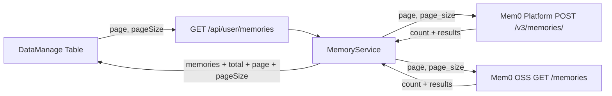

# 记忆列表改为服务端分页

## 现状

`GET /api/user/memories` **不是分页接口**，始终返回全量列表。

```58:65:backend/app/api/user.py
@router.get("/memories")
async def get_memories(...):
    raw_list = await memory_service.get_memories(token_info.user_id)
    return ApiResponse.success(data=MemoryListResponse(memories=raw_list))
```

底层 [`memory_service.py`](backend/app/services/user/memory_service.py) 行为：

- **Platform**：循环 `POST /v3/memories/?page=&page_size=100`，最多 20 页，拼成最多约 2000 条后再按 `created_at` 倒序返回。
- **OSS**：`GET /memories?user_id=&top_k=1000`。mem0 已有 `offset`，但响应只有 `results`、没有 `count`；`top_k` 上限 1000。chat-agent 目前忽略 offset，一次拉满再在前端分页。

前端 [`DataManage.tsx`](frontend/src/components/Layout/components/DataManage.tsx) 调用 `profileAPI.getMemories()` 不带分页参数。`GET /user/memories/search` 是语义检索，本次不改。

调用面很窄：`get_memories` 只被该 API 和测试使用，改签名安全。



## mem0 影响面（GET /memories / get_all）

**不会改** `POST /memories`、`POST /search`、按 id 读写删除、Platform Client（`POST /v3/memories/`）。影响只在列表读取。

兼容策略：默认不传 `page` 时行为与现在一致（仍 `top_k`/`offset`）；`get_all` **只追加** `count`，`results` 语义不变。

| 模块 | 怎么用列表 | 影响 |
|------|------------|------|
| Dream 治理 [`engine.py`](/Users/apple/Desktop/code/mem0/server/governance/engine.py) | 直接 `memory.get_all(...)`，读 `result["results"]`；全量走 `before_created_at` keyset，**刻意不用 OFFSET**（注释写明 OFFSET 会按未过滤行跳过） | 加 `count` 会被忽略。必须保留 `before_created_at`。SQL 下推可见性过滤后，keyset 每页条数更准，是正向。不要改默认 `latest_only`/`include_merged` 可见集 |
| Dashboard 记忆页 [`memories/page.tsx`](/Users/apple/Desktop/code/mem0/server/dashboard/src/app/(root)/dashboard/memories/page.tsx) | `GET /memories?top_k=1000`，`res.data?.results ?? res.data`，前端再 slice | 已兼容 `{results}` envelope。本次可不改 Dashboard（仍一次 1000 + 客户端分页） |
| Playground | `POST /search` | 无关 |
| Setup 页 | `POST /memories` 测连通 | 无关 |
| `delete_all` / entities 路由 | 调 `vector_store.list(top_k=...)`，不用 HTTP | `list()` 新参数必须有默认值，不能改变现有 LIMIT 语义 |
| `tests/test_server_params.py` | mock `get_all` 返回 list，断言 HTTP 也是 list | 与真实 `{"results": ...}` 不一致；若 HTTP 统一 envelope，改测试即可 |
| Platform SDK / CLI | `/v3/memories/` | 另一套 API，不受 OSS GET 影响 |

约束：不要「只要传了 `offset` 就关闭 over-fetch」——Dream 每次都传 `offset=0`。应在 **过滤已下推到 SQL** 后整体取消 over-fetch，或仅在 `offset > 0` / 显式 `page` 时取消。

## mem0 OSS（`/Users/apple/Desktop/code/mem0`）

自建服务已有半套能力，缺的是对外契约和正确的 COUNT：

- [`server/main.py`](/Users/apple/Desktop/code/mem0/server/main.py) `GET /memories` 已有 `top_k`（`le=1000`）和 `offset`
- [`Memory.get_all`](/Users/apple/Desktop/code/mem0/mem0/memory/main.py) 已把 `offset` 传给 vector store，但返回只有 `{"results": [...]}`
- [`pgvector.list`](/Users/apple/Desktop/code/mem0/mem0/vector_stores/pgvector.py) 已 `ORDER BY created_at DESC LIMIT/OFFSET`
- 过期 / 治理状态在 Python 里过滤，且 `fetch_limit_for_filters` 会 over-fetch（`max(limit*4, 60)`）。直接拿 `offset` 分页会跳过「未过滤行」而不是「可见行」，页码会错

改动范围（保持 `top_k`/`offset` 兼容）：

1. **HTTP** `GET /memories`
   - 新增 `page`（ge=1）、`page_size`（ge=1, le=1000）
   - `page_size` → `top_k`，`offset = (page - 1) * page_size`；未传 `page` 时仍用现有 `top_k`/`offset`
   - 响应改为 Platform 同款 envelope：`{count, results}`（无 `next`/`previous` 也可）
   - 带 `user_id` 的路径与 admin 全量 `_list_all_memories` 都返回 `count`

2. **`Memory.get_all`（sync + async）**
   - 返回 `{"results": ..., "count": N}`
   - 走分页时不要 over-fetch：`top_k`/`offset` 作用在**可见集**上
   - async 版补传 `offset`（目前漏了）

3. **pgvector：过滤下推 + COUNT**
   - 把 `_payload_is_expired` / `should_include_memory` 写进 WHERE，使 `LIMIT/OFFSET/COUNT` 同一套条件
   - 默认（`show_expired=False`, `include_merged=False`）：排除过期、merged、archived（缺省 `governance_status` 视为 active）
   - 新增 `count(filters, ...)`：`SELECT COUNT(*)` + 同一 WHERE
   - Python 侧保留一层兜底过滤，其它 vector store 若无 `count` 则 `count` 可省略，chat-agent 用 `len(results)` 兜底

4. **测试**
   - [`tests/test_server_params.py`](/Users/apple/Desktop/code/mem0/tests/test_server_params.py)：`page`/`page_size` 转成 `top_k`/`offset` 并转发
   - [`tests/vector_stores/test_pgvector.py`](/Users/apple/Desktop/code/mem0/tests/vector_stores/test_pgvector.py)：list 带 offset；count 用同一 filter
   - `get_all` 返回含 `count`；分页时不走 over-fetch

## chat-agent 后端

对齐 eval 列表（`page` / `page_size` / `total`），列表字段仍用 `memories`。

1. **Schema** [`backend/app/schemas/user.py`](backend/app/schemas/user.py)

```python
class MemoryListResponse(BaseModel):
    memories: list[MemoryListItem] = Field(default_factory=list)
    total: int = 0
    page: int = 1
    page_size: int = 20
```

2. **API** [`backend/app/api/user.py`](backend/app/api/user.py)

```python
page: int = Query(1, ge=1)
page_size: int = Query(20, ge=1, le=100)
```

3. **Service** [`backend/app/services/user/memory_service.py`](backend/app/services/user/memory_service.py)

- `get_memories(user_id, page=1, page_size=20) -> MemoryListResponse`
- **Platform**：只请求当前页，`total` 用 envelope 的 `count`
- **OSS**：`GET /memories?user_id=&page=&page_size=`，`total` 用 `count`；不再 `top_k=1000` 本地切片
- 当前页按 `created_at` 倒序排一下，避免页内乱序
- Mem0 未启用：空列表，`total=0`

去掉 `_PLATFORM_LIST_MAX_PAGES` 全量拉取；`_OSS_LIST_TOP_K` 不再用于对外列表。

4. **测试** [`backend/tests/services/user/test_memory_service.py`](backend/tests/services/user/test_memory_service.py)

- Platform：只打第 N 页，断言 `page`/`page_size` 与 `total=count`
- OSS：断言 query 带 `page`/`page_size`（不是 `top_k=1000`），`total` 来自 `count`

## 前端

对齐 [`BadCasesTab.tsx`](frontend/src/pages/AdminBadCasesPage/BadCasesTab.tsx)。

1. [`frontend/src/interfaces/user.ts`](frontend/src/interfaces/user.ts)：`MemoryListResponse` 增加 `total` / `page` / `pageSize`
2. [`frontend/src/services/user.ts`](frontend/src/services/user.ts)：`getMemories({ page, pageSize })`（拦截器会转成 `page_size`）
3. [`frontend/src/components/Layout/components/DataManage.tsx`](frontend/src/components/Layout/components/DataManage.tsx)
   - 无搜索：`page`/`pageSize` 作为 `useRequest` 依赖，服务端分页
   - 有搜索：继续 `searchMemories`（结果集小），可客户端分页或关分页
   - 切换/清空搜索时 `page` 重置为 1
   - 删除当前页最后一条且 `page > 1` 时回退一页再刷新

关联记忆弹窗已有 `getMemory(id)` 补拉，分页后无需改协议。

## 不改动

- `GET /user/memories/search`、对话上下文记忆检索、按 id 查询/删除
- mem0 其它 vector store 的完整 SQL 下推（本环境用 pgvector）
