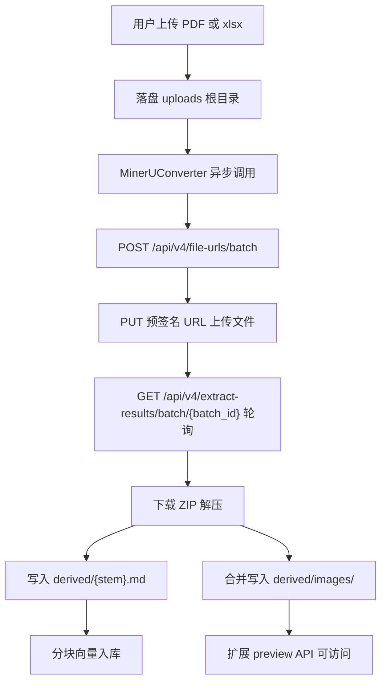

# MinerU SaaS 替换 PDF/Excel 转 Markdown 方案

## 目标架构



参考实现：[`/Users/apple/Desktop/pdf_parser/src/tool_mineru.py`](/Users/apple/Desktop/pdf_parser/src/tool_mineru.py)（批量上传 + 轮询 + ZIP 解压 + `_enrich_image_alt_text`）。

## 磁盘布局（与需求对齐）

```
uploads/{conversation_id}/
  report.pdf              # 原始文件
  derived/
    report.md             # MinerU 生成的 Markdown
    images/               # 与 .md 同级目录下的 images 文件夹
      figure_001.jpg
      ...
```

Markdown 内保留 MinerU 原始相对路径 `images/xxx.jpg`（与参考脚本一致）；Agent 通过 VFS 读取时使用 `/mnt/user-data/uploads/derived/images/xxx.jpg`。

**多文件冲突处理**：同一 `derived/images/` 目录会被多个附件共享。解压时**不** `rmtree` 整个 images 目录（参考脚本会清空，需修正）；逐文件合并，若文件名冲突则加 `{stem}_` 前缀并同步改写 MD 内引用。

## 核心代码变更

### 1. 新建 MinerU 转换器

新建 [`backend/app/services/chat_upload/mineru_markdown_converter.py`](backend/app/services/chat_upload/mineru_markdown_converter.py)：

- `MinerUMarkdownConversionError` 异常类
- `MinerUMarkdownConverter` 类，核心方法：
  - `async convert_to_markdown(file_path: Path, *, md_path: Path, images_dir: Path) -> str`
  - 移植参考脚本的 4 步流程（`httpx.AsyncClient`）
  - 移植 `_enrich_image_alt_text`（从 `content_list_v2.json` 补充图片 alt）
  - 解压后将 `.md` 写入 `md_path`，图片合并到 `images_dir`（`derived/images/`）
- 使用 `asyncio.sleep(poll_interval)` 轮询，超时 `poll_timeout_seconds`

### 2. 替换 PDF / Excel 上传流程

修改 [`backend/app/services/chat_upload/pdf.py`](backend/app/services/chat_upload/pdf.py) 与 [`backend/app/services/chat_upload/excel.py`](backend/app/services/chat_upload/excel.py)：

- 移除对 `PdfMarkdownConverter` / `ExcelMarkdownConverter` 的依赖
- 转换前创建 `images_dir = upload_dir / "derived" / "images"`
- 直接 `await MinerUMarkdownConverter().convert_to_markdown(dest, md_path=md_path, images_dir=images_dir)`（不再 `asyncio.to_thread` 包同步调用）
- 错误类型统一为 `MinerUMarkdownConversionError`，HTTP 502 文案改为「MinerU 转换失败」

### 3. 删除旧转换器

- 删除 [`backend/app/services/chat_upload/pdf_markdown_converter.py`](backend/app/services/chat_upload/pdf_markdown_converter.py)
- 删除 [`backend/app/services/chat_upload/excel_markdown_converter.py`](backend/app/services/chat_upload/excel_markdown_converter.py)
- 更新 [`backend/app/services/chat_upload/__init__.py`](backend/app/services/chat_upload/__init__.py) 导出

### 4. 配置模型重构

在 [`backend/app/schemas/config.py`](backend/app/schemas/config.py)：

- 将 `PdfMarkdownConfig` 重命名为 `MinerUConfig`（或新增 `MinerUConfig` 并移除旧类）
- 字段设计：

| 字段 | 说明 |
|------|------|
| `enabled` | 是否启用（false 时 PDF/Excel 上传返回明确错误） |
| `api_url` | 默认 `https://mineru.net` |
| `api_key` | Bearer Token（敏感，默认空） |
| `model_version` | 默认 `vlm` |
| `poll_interval_seconds` | 轮询间隔，默认 `3.0` |
| `poll_timeout_seconds` | 轮询总超时，默认 `300.0` |

移除：`scan_text_threshold`、`detect_pages`、`pp_structure_api_url`、`pp_structure_token`。

在 [`backend/app/core/config.py`](backend/app/core/config.py)：

- `pdf_markdown` 字段改为 `mineru: MinerUConfig`
- 转换器通过 `settings.mineru` 读取配置（`NacosConfigSettingsSource` 自动加载）

**Nacos 配置（已完成，无需本次改动）**：

用户已在 Nacos 配置中心配置完整的 `mineru` 对象（含 `api_key` 等字段）。实现侧只需保证 `MinerUConfig` 字段名与 Nacos YAML 键一致，后端启动后即可通过 `settings.mineru` 使用。

预期结构（与 Nacos 对齐）：

```yaml
mineru:
  enabled: true
  api_url: "https://mineru.net"
  api_key: "..."          # 已在 Nacos 配置，勿提交到 Git
  model_version: "vlm"
  poll_interval_seconds: 3.0
  poll_timeout_seconds: 300.0
```

同时删除旧的 `pdf_markdown` 配置块（`scan_text_threshold`、`pp_structure_*` 等字段不再使用）。

> **安全**：`api_key` 仅存在于 Nacos，不写入代码仓库或本地 `nacos-data` 缓存文件。`.env` 覆盖（`MINERU__API_KEY`）可作为可选兜底，非主路径。

### 5. 扩展附件预览路径校验

[`backend/app/services/chat_upload/attachment.py`](backend/app/services/chat_upload/attachment.py) 当前仅允许：

- `{uuid}/{filename}.{ext}`
- `{uuid}/derived/{name}.md`

需新增正则，允许 `{uuid}/derived/images/{filename}.{jpg|jpeg|png|gif|webp}`，使 [`backend/app/api/file.py`](backend/app/api/file.py) 的 `/api/file/preview/{user_id}/{storage_key}` 能返回解析图片。

`_EXT_TO_MEDIA_TYPE` 已含图片 MIME，无需额外改动。

### 6. VFS 与 Prompt 微调（可选但建议）

- [`backend/app/vfs/uploads_provider.py`](backend/app/vfs/uploads_provider.py)：`derived/images/` 下的图片可不列入虚拟文件列表（避免噪音），Agent 通过 MD 内链接或 prompt 指引访问即可。
- [`backend/app/prompts/system_prompt.py`](backend/app/prompts/system_prompt.py)：补充说明 PDF/Excel 解析后图片位于 `uploads/derived/images/`。
- [`backend/README.md`](backend/README.md)：更新「PDF -> Markdown 转换策略」章节。

### 7. 依赖清理

[`backend/pyproject.toml`](backend/pyproject.toml) 中若 `markitdown` / `pymupdf` 仅被旧转换器使用，移除这两项依赖以减小镜像体积。

## 测试计划

新建 [`backend/tests/test_mineru_markdown_converter.py`](backend/tests/test_mineru_markdown_converter.py)：

- 使用 `httpx` mock 或 `respx`/`pytest-httpx` 模拟 batch 申请、上传、轮询、ZIP 下载
- 验证：MD 写入正确路径、`images/` 合并逻辑、alt text  enrichment、超时/失败错误

手动验证：

1. 确认 Nacos `mineru` 配置已加载（启动日志或 `/health`），上传文本型 PDF、扫描型 PDF、xlsx 各一份
2. 确认 `derived/{stem}.md` 与 `derived/images/` 生成
3. 确认 `/api/file/preview/.../derived/images/xxx.jpg` 可访问
4. 确认 RAG 分块入库成功

## 不在本次范围

- MinerU 单文件 `/api/v4/extract/task` 接口（批量接口已满足需求）
- 前端 Markdown 预览内嵌图片渲染（若当前仅展示文本，可后续迭代）
- `.xls` 老格式（当前仅支持 `.xlsx`）

## 风险与注意

- MinerU 为**异步远程调用**，上传耗时会显著高于本地 MarkItDown；`poll_timeout_seconds` 建议 300s，与参考脚本一致。
- 10MB 上传限制与 MinerU 200MB 限制兼容，无需调整。
- 完全替换后，MinerU 服务不可用将导致所有 PDF/Excel 上传失败（502），无离线回退。
