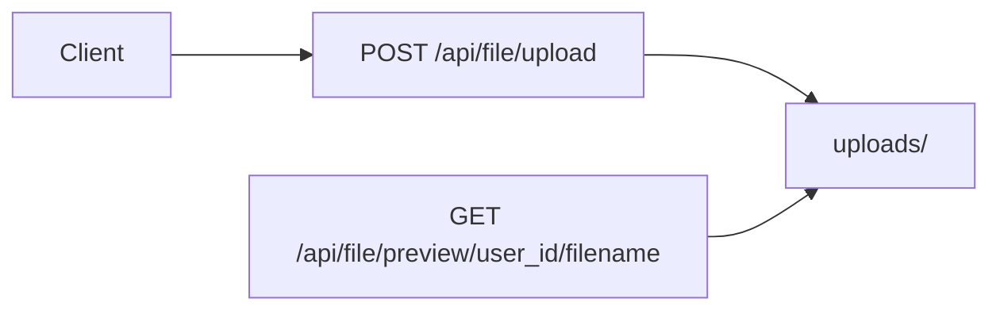

# PDF 聊天附件上传方案

## 现状要点

- 附件 UI 在 [`ChatInputSenderHeader.tsx`](frontend/src/pages/ChatPage/components/ChatInput/components/ChatInputSenderHeader.tsx)：`accept="image/*"`，`customRequest` 调用 [`fileAPI.uploadChatImage`](frontend/src/services/file.ts) → `POST /api/file/image/upload`。
- 选择器在 [`ChatInput/index.tsx`](frontend/src/pages/ChatPage/components/ChatInput/index.tsx) 的 `openAttachmentPicker`：`accept: "image/*"`。
- 附件收集 [`getAttachmentBlocks`](frontend/src/pages/ChatPage/components/ChatInput/util.ts) 仅识别 `type === "image"`。
- 后端 [`chat_image_service.py`](backend/app/services/base_service/chat_image_service.py)：图片落盘 `data/user_data/{user_id}/uploads/`，单文件上限已为 **10MB**；[`user_upload_file_path`](backend/app/services/base_service/chat_image_service.py) 与 [`_FILENAME_RE`](backend/app/services/base_service/chat_image_service.py) **仅允许** `uuid.(jpg|jpeg|png|gif|webp)`；[`save_chat_image`](backend/app/services/base_service/chat_image_service.py) 写入的 `ImageBlock.url` 为 `/api/file/image/preview/...`。
- 预览 [`GET /image/preview/{user_id}/{filename}`](backend/app/api/file.py) 使用 `media_type_for_preview`，扩展后需支持 `.pdf`。
- [`multimodal.py`](backend/app/utils/multimodal.py) 用正则 `_IMAGE_PREVIEW_PATH_RE` 匹配 `/api/file/image/preview/...`；`extract_user_text_with_image_placeholder` 在「无文字仅有图」时返回占位；**仅有 PDF 时目前会得到空字符串**，需一并处理。

## 统一接口设计（扩展性）

- **上传**：单一入口（建议 `POST /file/upload`，相对路由前缀后为 `/api/file/upload`），`multipart` 字段 `file`；服务端根据 MIME/扩展名/魔数在允许列表内分流：图片走现有 PIL 缩放管线，PDF 原样落盘（上限同为 10MB）；成功响应体为 **`ImageBlock | PdfBlock`**（`type` 区分），可用 `ApiResponse` 的 `data` 联合类型或文档说明。
- **预览**：单一语义路径（建议 `GET /file/preview/{user_id}/{filename}`），行为与当前 `preview_chat_image` 相同：校验 [`user_upload_file_path`](backend/app/services/base_service/chat_image_service.py)，[`FileResponse`](backend/app/api/file.py) + `media_type_for_preview`。
- **兼容（路由层，零数据迁移）**：已持久化或前端缓存的旧 URL `/api/file/image/preview/...` 建议保留 **同名处理函数**，通过 **额外注册一路由**（旧 path）指向同一 handler，或 FastAPI 双装饰器，避免历史消息、测试与外链失效；新写入的 `ImageBlock.url` / `PdfBlock.url` 一律使用 **新路径** `/api/file/preview/...`。
- **历史 URL 数据迁移（可选）**：**可以**对数据库里已存的 `content_blocks` 做批量更新，把旧预览前缀换成新前缀，从而在长期只保留 **一套** 预览路由与一套正则匹配逻辑。
  - **依据**：`messages` 表（见 [`message_db.py`](backend/app/models/message_db.py)）中 `content_blocks` 为 `JSON`/`JSONB` 列表；其中 `type === "image"` 的块含 `url` 字段，历史值为 `/api/file/image/preview/{user_id}/{filename}`。
  - **做法示例**（择一）：PostgreSQL 下用 `jsonb_set` + 子查询逐条更新；或一次性脚本（SQLAlchemy）读取 `content_blocks`、在内存中递归替换块内 `url` 字符串后写回；替换规则为字面量前缀：`/api/file/image/preview/` → `/api/file/preview/`（**仅替换此前缀**，避免误伤其他字段）。
  - **注意**：迁移前备份或先在副本验证；确认无自定义域名/代理前缀与存储值不一致；迁移后旧路由可视为技术债删除，但**仍建议保留旧 GET 一段时间**（防漏网、防回滚前旧数据）。
- **迁移完成后，兼容接口能否移除**：**可以**，前提是**仅依赖**「库内已统一为新 URL」还不够，需同时满足下面条件；否则应保留兼容路由或双正则一段时间。
  - **预览 `GET /image/preview/...`**：在 **DB 全量迁移**、且确认无其它来源仍请求旧路径（旧前端缓存、未升级客户端、书签、运维脚本、CDN 日志）后，可删除该路由；[`multimodal.py`](backend/app/utils/multimodal.py) 中仅保留 **新路径** 的解析正则即可。
  - **上传 `POST /image/upload`**：与 DB 无关；需 **所有调用方**（含移动端、脚本、旧版前端）已改为 `POST /file/upload` 后再删，否则旧客户端会直接 404。
  - **建议节奏**：先发版保留「新接口 + 旧别名 + 双路径解析」，迁移并验证数据与监控无旧 URL 命中后，再发版删除别名与 `multimodal` 旧路径分支。
- **实现落点**：[`file.py`](backend/app/api/file.py) 新增统一路由；原 [`/image/upload`](backend/app/api/file.py) 可标记 deprecated 并内部转调统一逻辑，或仅保留兼容别名；[`chat_image_service.py`](backend/app/services/base_service/chat_image_service.py) 中生成 `url` 改为新前缀；[`multimodal.py`](backend/app/utils/multimodal.py) 的 `_IMAGE_PREVIEW_PATH_RE` 改为匹配 **新路径**，并在 **未做数据迁移前** 仍 **兼容旧路径**（两个正则或一个正则含可选段）；**在** 全量迁移且旧路由/旧客户端已清退后，可移除兼容接口并只保留新路径匹配。

## 后端

1. **Schema**（[`backend/app/schemas/chat.py`](backend/app/schemas/chat.py)）
   - 新增 `PdfBlock`：`type: Literal["pdf"]`，字段与 `ImageBlock` 对齐（`id`, `url`, `name`, `size`, `mime` 为 `application/pdf`）。
   - `url` 字段描述改为中性示例：`/api/file/preview/...`。
   - 将 `PdfBlock` 并入 `ContentBlock` 联合类型。

2. **保存与校验**（[`chat_image_service.py`](backend/app/services/base_service/chat_image_service.py)）
   - PDF：`MAX_CHAT_ATTACHMENT_BYTES` 可与图片共用 10MB 或分常量同值；仅允许 `application/pdf`；可选文件头 `%PDF-`；文件名 `{uuid}.pdf`；**扩展 `_FILENAME_RE`** 含 `pdf`；**扩展 `media_type_for_preview`**：`application/pdf`。
   - 展示名：与现有 sanitize 逻辑同类（stem + 扩展名）。
   - **统一 `url` 生成**：`/api/file/preview/{user_id}/{filename}`（无前缀 `image`）。

3. **API**（[`backend/app/api/file.py`](backend/app/api/file.py)）
   - `POST /upload`：需登录，调用统一处理函数，返回 `ApiResponse[ImageBlock | PdfBlock]`（实现上用 Union 或分别序列化）。
   - `GET /preview/{user_id}/{filename}`：实现当前预览逻辑。
   - **兼容**：保留 `POST /image/upload` → 调用统一逻辑（仅图片）；`GET /image/preview/...` → 与 `GET /preview/...` 同一依赖，避免破坏旧数据。

4. **多模态**（[`multimodal.py`](backend/app/utils/multimodal.py)）
   - `_resolve_image_path` / 正则：同时识别 `/api/file/preview/...` 与 **旧** `/api/file/image/preview/...`。
   - `extract_user_text_with_image_placeholder`：无文本且存在 PDF（可含图）时返回占位（如 `[用户发送了 PDF 文件]`）。
   - `build_user_content_for_llm`：仍仅把 `ImageBlock` 转为 vision 输入；忽略 `PdfBlock`。

## 前端

1. **类型**（[`frontend/src/interfaces/contentBlock.ts`](frontend/src/interfaces/contentBlock.ts)）
   - `PdfBlock`、`isUserAttachmentBlock` 含 `image | pdf`。

2. **API**（[`frontend/src/services/file.ts`](frontend/src/services/file.ts)）
   - **单一** `uploadChatAttachment(file: File)` → `POST /file/upload`，返回 `ImageBlock | PdfBlock`（TypeScript 联合 + 运行时按 `type` 收窄）。

3. **输入区**
   - [`ChatInputSenderHeader.tsx`](frontend/src/pages/ChatPage/components/ChatInput/components/ChatInputSenderHeader.tsx)：`accept` 含图片与 PDF；`customRequest` 仅调用 `uploadChatAttachment`。
   - [`ChatInput/index.tsx`](frontend/src/pages/ChatPage/components/ChatInput/index.tsx)：`openAttachmentPicker` 与 paste 过滤与上一致。

4. **附件校验（前端）**
   - **数量**：最多 **5** 个附件（`fileList` 已达 5 时拒绝新增：选择器、粘贴、拖拽若适用）。
   - **体积**：每个附件 **10MB**（`10 * 1024 * 1024`），与后端单文件上限一致。
   - **实现建议**：在 `@ant-design/x` `Attachments` 上使用 **`beforeUpload`**（返回 `false` 并 `message.warning` / `notification` 提示原因）；必要时在 `onChange` 里对超限条目做截断或回滚；粘贴 [`onPasteFile`](frontend/src/pages/ChatPage/components/ChatInput/index.tsx) 在调用 `upload` 前校验数量与 `File.size`。
   - **常量**：抽成单一常量（如 `MAX_CHAT_ATTACHMENTS = 5`、`MAX_ATTACHMENT_BYTES = 10 * 1024 * 1024`（或与 Tooltip 共用）），避免魔法数分散。

5. **工具函数**（[`util.ts`](frontend/src/pages/ChatPage/components/ChatInput/util.ts)）
   - `getAttachmentBlocks` → `UserAttachmentBlock[]`，`type === "image" | "pdf"`。

6. **Tooltip**（[`ChatInputFooter.tsx`](frontend/src/pages/ChatPage/components/ChatInput/components/ChatInputFooter.tsx)）
   - 说明图片类型与 PDF、**单文件不超过 10MB**、**最多 5 个附件**，与校验行为一致。

7. **消息展示与重发**
   - [`UserMessageDisplayContent.tsx`](frontend/src/pages/ChatPage/components/ChatMessage/UserMessage/components/UserMessageDisplayContent.tsx)：`pdf` 分支。
   - [`chat.ts` / `hooks/chat.ts`](frontend/src/interfaces/chat.ts)：附件类型与 `reSendMessage` 过滤同前序计划。

## 验证建议

- 后端：`make lint`；必要时对 `/file/upload`、双预览路径解析加单测。
- 前端：`vp lint .`、`vp build`。
- 手工：新上传消息的预览 URL 为新路径；若 DB 中仍有旧 `image/preview` URL，确认仍可预览与多模态读盘。
- 手工：第 6 个附件被拒绝、单文件略大于 10MB 被拒绝、提示与 Tooltip 一致。

## 依赖与风险

- **联合响应**：OpenAPI/客户端需约定 `data.type` 区分块类型。
- **兼容窗口**：旧路由保留时间由团队决定，文档中注明 deprecated。
- **Ant Design X Attachments**：`beforeUpload` 实现数量与大小兜底；**后端**仍建议在消息体或上传层校验单条附件数量/大小，防止绕过前端。
