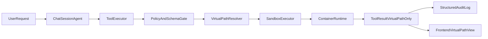

# 执行沙箱与虚拟路径基线方案（容器沙箱 + 全链路虚拟路径）

## 现状描述
- 当前主链路已具备会话级工具编排能力：`ChatSessionAgent` + `ToolExecutor` + `MCPToolGateway` 可完成多轮工具调用、参数校验与 `workspace_id` 绑定。
- 文件工具已有基础安全控制：`agent_skills_mcp/utils.py` 提供工作区根目录约束、路径规范化与写入配额检查。
- 代码执行能力已接入 Piston（`code_exec_mcp`、`/api/code`），具备与宿主进程隔离的基础形态，但尚未形成统一执行策略与审计口径。
- 关键风险仍存在于命令执行：`run_bash` 仍有宿主直接执行路径（含 `shell=True` 风险面），与“命令执行沙箱隔离”的 Phase 0 目标不一致。
- 路径层面仍存在耦合：提示词与部分工具返回仍可能暴露物理路径（如 `data/user_data/...`），与“全链路虚拟路径”目标不一致。
- 结论：当前系统“可用但不够安全且耦合偏高”，需要通过 Phase 0 完成安全底座与路径协议统一，避免后续能力扩展放大风险。

## 目标与验收
- 完成命令执行从宿主机迁移到统一 `SandboxExecutor`（容器后端），禁止直接宿主 `shell=True` 执行。
- 全链路仅暴露虚拟路径（如 `/workspace/current/...`），前后端与工具响应不再返回物理路径。
- 建立结构化审计日志（允许/拒绝均记录），支持按 `user_id`、`workspace_id`、`conversation_id` 追溯。
- 通过安全回归：路径遍历、越权访问、危险命令、资源超限、超时与网络策略。

## 代码切入点（按改造优先级）
- 命令执行与路径解析核心：[/Users/apple/Desktop/code/chat-agent/backend/app/mcp/mcp_servers/agent_skills_mcp/server.py](/Users/apple/Desktop/code/chat-agent/backend/app/mcp/mcp_servers/agent_skills_mcp/server.py)、[/Users/apple/Desktop/code/chat-agent/backend/app/mcp/mcp_servers/agent_skills_mcp/utils.py](/Users/apple/Desktop/code/chat-agent/backend/app/mcp/mcp_servers/agent_skills_mcp/utils.py)、[/Users/apple/Desktop/code/chat-agent/backend/app/mcp/mcp_servers/agent_skills_mcp/config.py](/Users/apple/Desktop/code/chat-agent/backend/app/mcp/mcp_servers/agent_skills_mcp/config.py)
- 工具调用入口与参数注入：[/Users/apple/Desktop/code/chat-agent/backend/app/agents/tool_executor.py](/Users/apple/Desktop/code/chat-agent/backend/app/agents/tool_executor.py)、[/Users/apple/Desktop/code/chat-agent/backend/app/mcp/mcp_tool_gateway.py](/Users/apple/Desktop/code/chat-agent/backend/app/mcp/mcp_tool_gateway.py)
- 提示词与路径暴露：[/Users/apple/Desktop/code/chat-agent/backend/app/prompts/prompt_utils.py](/Users/apple/Desktop/code/chat-agent/backend/app/prompts/prompt_utils.py)、[/Users/apple/Desktop/code/chat-agent/backend/app/prompts/system_prompt.py](/Users/apple/Desktop/code/chat-agent/backend/app/prompts/system_prompt.py)
- 代码执行链路（统一纳入策略与审计）：[/Users/apple/Desktop/code/chat-agent/backend/app/mcp/mcp_servers/code_exec_mcp/server.py](/Users/apple/Desktop/code/chat-agent/backend/app/mcp/mcp_servers/code_exec_mcp/server.py)、[/Users/apple/Desktop/code/chat-agent/backend/app/api/code.py](/Users/apple/Desktop/code/chat-agent/backend/app/api/code.py)
- 前端工作区接口与展示（全链路虚拟化）：`frontend` 下所有 `/api/workspaces` 相关调用与路径展示组件（实施时逐文件盘点）

## 实施步骤
1. 定义 `SandboxExecutor` 抽象与容器后端配置项（超时、CPU/内存、网络开关、工作目录挂载、命令白名单）。
2. 将 `run_bash` 全量改为调用 `SandboxExecutor`，移除宿主直接 `shell=True` 路径；失败返回结构化拒绝原因。
3. 将 `execute_code`（Piston）纳入统一策略与审计口径（即便保留 Piston 后端，也统一入口与日志字段）。
4. 引入虚拟路径协议（建议固定 `/workspace/current/...`），新增统一解析器：`virtual_path -> physical_path`，所有文件工具改为仅接收/返回虚拟路径。
5. 改造提示词与工具返回，彻底移除 `data/user_data/...` 物理路径暴露；前端接口与显示层同步替换为虚拟路径。
6. 补充安全与回归测试：命令拦截、路径遍历、符号链接逃逸、资源配额、超时、网络策略、前后端路径一致性。
7. 增加灰度与回滚开关：按会话/用户切换新执行链路，确保主流程可用性。

## 数据流（Phase 0 目标态）

## 风险与缓解
- 容器沙箱接入成本高：先实现最小可用命令集与统一接口，避免一次性覆盖全部工具。
- 性能回退风险：引入基线压测与灰度开关，对比旧链路 P95/P99。
- 前端改造面可能扩散：先做路径使用点清单，再分接口批次切换，保留短期兼容层。

## 周内里程碑建议
- D1-D2：`SandboxExecutor` 抽象 + `run_bash` 容器化 PoC。
- D3：虚拟路径解析器落地，后端工具返回去物理路径。
- D4：前端路径链路切换与联调。
- D5：安全回归、灰度验证、文档与验收清单冻结。
