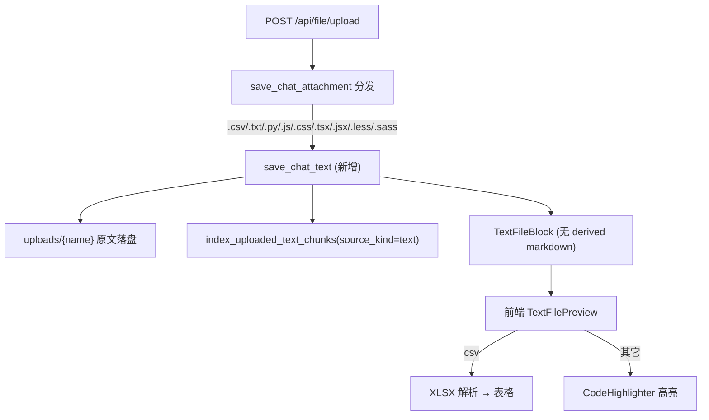

## 设计要点

- 后端新增**单一** `TextFileBlock`（`type="text_file"`），保存原始字节、保留原扩展名，**不生成 derived Markdown**；文本仍复用 `index_uploaded_text_chunks` 入向量库（与 `markdown.py` 一致，保证 agent_mode=0 的 RAG 召回可用）。
- 前端用同一个 `text_file` 块，预览面板按文件扩展名分流：`.csv` → 表格；其余 → `CodeHighlighter`。
- 不需要新依赖：`xlsx`（解析 CSV）与 `CodeHighlighter` 均已存在。

## 后端改动

- 新增 [backend/app/services/chat_upload/text.py](backend/app/services/chat_upload/text.py)：`save_chat_text`，镜像 [backend/app/services/chat_upload/markdown.py](backend/app/services/chat_upload/markdown.py)。
  - 从 `file.filename` 取原始扩展名（小写）并校验在允许集合内；大小 ≤10MB；`chunk.decode("utf-8")` 校验编码。
  - `sanitize_upload_display_name(file.filename, ext=<原扩展名>, default_stem="file")` 保留原扩展名落盘 `uploads/{name}`。
  - `index_uploaded_text_chunks(..., source_kind="text", text_format="text")`（CSV 也走同一分块器，无需改 [kb_chunk_embedding.py](backend/app/services/chat_upload/kb_chunk_embedding.py)）。
  - 返回 `TextFileBlock`（`mime` 用 `media_type_for_preview`，无 markdown 子块）。
- 分发 [backend/app/services/chat_upload/attachment.py](backend/app/services/chat_upload/attachment.py)：
  - 新增 `_TEXT_FILE_EXTENSIONS = {".csv",".txt",".py",".js",".css",".tsx",".jsx",".less",".sass"}`。
  - `save_chat_attachment`（约 218 行后、image 兜底前）增加分支：`raw_filename` 命中扩展名 → `save_chat_text`。
  - `_STORAGE_KEY_CONV_TOP_RE`（28 行）扩展名加入 `csv|txt|py|js|css|tsx|jsx|less|sass`。
  - `_EXT_TO_MEDIA_TYPE`（37 行）补充：`.csv`→`text/csv`，其余文本/代码扩展统一 `text/plain`（FileResponse 默认 attachment，前端用 `res.text()` 读取，安全且足够）。
- Schema [backend/app/schemas/chat.py](backend/app/schemas/chat.py)：
  - 新增 `TextFileBlock(AttachmentBaseBlock)`，`type: Literal["text_file"]`，`mime: str`。
  - 加入 `AttachmentBlock`（349 行）与 `ContentBlock`（351 行）联合。
  - 更新 `AttachmentFileInfo.type` 注释（326 行）补充 `"text_file"`。
- 多模态 [backend/app/utils/multimodal.py](backend/app/utils/multimodal.py)：导入 `TextFileBlock`；
  - `collect_attachment_content_ids`：像 `MarkdownBlock` 一样 `content_ids.add(block.id)`。
  - `resolve_storage_key_for_content_id`：`TextFileBlock` 按 id → `storage_key`。
  - `build_attachment_uploads`：isinstance 元组（177 行）加入 `TextFileBlock`（无 markdown 子块）。
  - 新增 `has_text_file_block` 与占位符 `[用户发送了文本文件]`，并入 `extract_user_text_with_attachment_placeholder`。
- 提示词 [backend/app/prompts/system_prompt.py](backend/app/prompts/system_prompt.py)：working_directory 说明（66 行附近）补充「纯文本/代码文件（csv/txt/py/js 等）直接读取原文，无 derived Markdown」。

> RAG（agent_mode=0）与 Agent（agent_mode=1）查询路径无需新增逻辑：识别 `TextFileBlock` 后，向量召回与 `read_file` 均复用现有实现。

## 前端改动

- 类型 [frontend/src/interfaces/contentBlock.ts](frontend/src/interfaces/contentBlock.ts)：新增 `TextFileBlock`（`type:"text_file"`, `mime:string`, 无 markdown）；加入 `ContentBlock`、`PreviewableBlock`、`UserContentBlock`；`isUserAttachmentBlock`（222 行）纳入 `"text_file"`。
- 上传 API [frontend/src/services/file.ts](frontend/src/services/file.ts)：返回类型联合加入 `TextFileBlock`。
- 允许类型 [frontend/src/pages/ChatPage/components/ChatInput/util.ts](frontend/src/pages/ChatPage/components/ChatInput/util.ts)：`CHAT_ATTACHMENT_ACCEPT` 追加 `.csv,.txt,.py,.js,.css,.tsx,.jsx,.less,.sass`；新增 `TEXT_FILE_EXT_RE`；`isSupportedChatAttachment`、错误文案纳入纯文本/代码。
- Tooltip [frontend/src/pages/ChatPage/components/ChatInput/components/utils.ts](frontend/src/pages/ChatPage/components/ChatInput/components/utils.ts)：文案补充「文本/代码文件」。
- 消息卡片 [frontend/src/pages/ChatPage/components/ChatMessage/UserMessage/components/UserMessageDisplayContent.tsx](frontend/src/pages/ChatPage/components/ChatMessage/UserMessage/components/UserMessageDisplayContent.tsx)：`attachmentToFileCardItem` 增加 `case "text_file"`（点击 → `onPreviewBlock`）。
- 预览路由 [frontend/src/pages/ChatPage/components/BlockPreviewPanel/index.tsx](frontend/src/pages/ChatPage/components/BlockPreviewPanel/index.tsx)：`switch` 增加 `case "text_file"` → `TextFilePreviewPanel`。
- 新增 `frontend/src/pages/ChatPage/components/BlockPreviewPanel/TextFilePreview/`：
  - `hooks.ts`：`useTextFileContent(url, enabled)`，`fetch` + `res.text()`（参考 [PdfPreview/hooks.ts](frontend/src/pages/ChatPage/components/BlockPreviewPanel/PdfPreview/hooks.ts) 的 `useMarkdownPreviewContent`）。
  - `index.tsx`：header（下载/关闭，参考 [MarkdownPreview/index.tsx](frontend/src/pages/ChatPage/components/BlockPreviewPanel/MarkdownPreview/index.tsx)）；按 `block.name` 扩展名分流：
    - `.csv`：`XLSX.read(text,{type:"string"})` → `sheet_to_json(header:1)` 渲染表格（复用 [ExcelPreview/index.tsx](frontend/src/pages/ChatPage/components/BlockPreviewPanel/ExcelPreview/index.tsx) 的 `SheetTable` 样式）。
    - 其它：`<CodeHighlighter lang={getLanguageFromFilePath(name) || "text"}>{text}</CodeHighlighter>`，复用 [CodeHighlighter](frontend/src/pages/ChatPage/components/MarkdownContainer/components/CodeHighlighter/index.tsx) 与 [getLanguageFromFilePath](frontend/src/pages/ChatPage/components/ChatMessage/AssistantMessage/ContentBlocksRender/ToolBlockRender/registry/utils/filePathLanguage.ts)（`FILE_EXTENSION_LANGUAGE_MAP` 已覆盖 tsx/jsx/py/css/less/sass 等）。

## 验证

- 后端：`cd backend && make lint`；`/docs` 上传各类型，确认返回 `TextFileBlock` 且向量入库。
- 前端：`vp install && vp lint . && vp build`；上传 `.csv` 看表格、`.py/.tsx/...` 看高亮、两种 agent_mode 问答均能引用文件内容。
