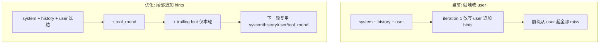

# 前缀缓存优化（iteration hints + 观测）

对照 [backend/chat-agent-cache-optimization.html](backend/chat-agent-cache-optimization.html) 与线上报告：[docs/token_cache/2026-08-21_cache_hit_report.md](docs/token_cache/2026-08-21_cache_hit_report.md)、[docs/cache_analysis/multi_turn_cache_analysis_after_change.md](docs/cache_analysis/multi_turn_cache_analysis_after_change.md)。

核心原则：**已发出过的 message 不再改写，只在尾部追加。** 前缀缓存是字节级匹配，中间任何一处变化都会让其后全部失效。



## 已核实的破坏点

| 点 | 现状 | 结论 |
|---|---|---|
| P0 hints 改写 user | [tool_call_policy.py](backend/app/agents/tool_call_policy.py) `apply_iteration_hints` 用 `update_last_user_message` 改最后一条 user；且仅 `agent_mode == 0` 时生效 | 必须改；这是同一 turn 多步调用的最大破坏源 |
| P1 usage 被丢掉 | `_stream_tool_round_events` 已设 `stream_options={"include_usage": True}`，但 `if not chunk.choices: continue` 会跳过 **usage-only 空 choices chunk** | Langfuse 包装器已能记 `input_cached_tokens`（报告里有数据）；应用层日志仍缺失 |
| 时间戳 | [prompt_utils.py](backend/app/prompts/prompt_utils.py) 每次 `get_user_message_for_tool_calls()` 都调 `get_current_datetime_str()`；守卫 Step 3 会再调一次 | **冻结在 turn 内**。禁止移到 system prompt（2026-06-24 实验缓存率从 52% 掉到 0%） |
| 守卫重建 | [chat_session_agent.py](backend/app/agents/chat_session_agent.py) 超阈值时压缩 history 并 `_compose_messages` 重建 | 超限压缩是正确性需要，不能取消；hints 改为尾部追加后，重建不会再抹掉 hints |
| 消息投影缓存 | `_compose_messages` 每次全量格式化 | Agent 按请求创建，CPU 收益小，**本轮不做** |
| 历史 user 不还原包装 | 见下文「历史 user 组装」 | 跨 turn 时上一轮发给 LLM 的 user 包装不会出现在 history 里；本轮不做还原 |

## 历史 user 组装（已核实，本轮不改）

**不会还原。** memory / RAG / `current_datetime` / `window_out_summary` 只注入**当前 turn** 的 user prompt，不会在组装 history 时重新包一层。

落库（[chat.py](backend/app/api/chat.py) → `create_chat_messages`）：user 的 `content_blocks` 是客户端原文（query + 附件），不是 `get_user_message_for_tool_calls()` 的渲染结果。`user_memories` 只写进 `message_metadata` 供 eval replay，不进 `content_blocks`。RAG `kb_context_blocks` 与 datetime 都不落库。

组装 history（[base.py](backend/app/agents/base.py) `_compose_history_messages` → [format_chat_message_for_llm](backend/app/protocols/chat_messages.py)）：从落库 `content_blocks` 抽文本 / 多模态，**不**再调 `get_user_message_for_tool_calls`，也**不**读 metadata 里的 memories。

因此下一 turn 的 LLM 看到的历史 user 是「裸 query」，而上一 turn 实际发送的是带 `<tool_call_context>` 的包装版。跨 turn 前缀从「上一轮 user」起本来就不一致；本次优化只稳住 **同一 turn 内** 的前缀。若以后要做跨 turn 字节级复用，需要持久化当时发给 LLM 的完整 user prompt（append-only），而不是事后用新 memory / 新时间重包历史。

## 关键设计：hints 放在 tool_round 之后

HTML 方案把 extra system 追加到 `base_prompt_messages`（user 之后、tool_round 之前）是错的：hints 每步不同，会让**本 turn 已产生的 tool 结果**也无法命中缓存。

正确组装（每轮用浅拷贝，不改 `base_prompt_messages`）：

```
round = base(system + history + user) + formatted_tool_round + optional_hint
```

- iteration 0（通常无 hint）：`[sys, hist, user]`
- iteration 1：`[sys, hist, user, asst, tool, hint1]`
- iteration 2：`[sys, hist, user, asst, tool, asst2, tool2, hint2]`

iteration 1→2 的稳定前缀包含 tool 结果。hint 用 **trailing `user` 消息**（`注意:\n...`），避免部分网关（DashScope）对对话中途第二条 `system` 不兼容。

循环顺序：

1. `unified_context_guard`（可能重建 base；user 内容除 window-out summary 外保持冻结）
2. `round = base + tool_round + collect_iteration_hints()`（仅 agent_mode==0）
3. `call_llm_api(round)`

## 实施项

### 1. hints 改为 collect + 尾部追加（P0）

- [tool_call_policy.py](backend/app/agents/tool_call_policy.py)：`apply_iteration_hints` 改为 `collect_iteration_hints(iteration) -> str | None`，不再 import / 调用 `update_last_user_message`。
- [mcp_tool_execution.py](backend/app/agents/mcp_tool_execution.py)：同步包装方法。
- [chat_session_agent.py](backend/app/agents/chat_session_agent.py)：
  - 从 iteration 循环里删掉对 `base_prompt_messages` 的 hints 就地修改。
  - `_build_round_prompt_messages` 增加可选 `hint_text`，追加 `{"role": "user", "content": f"注意:\n{hint_text}"}`。
- `_stream_final_round_events` 的 `final_user_message` 目前无调用方；保持不动，避免范围扩散。

### 2. 冻结 turn 级 datetime（P1，低风险）

- `get_user_message_for_tool_calls(..., current_datetime: str | None = None)`，缺省才 `get_current_datetime_str()`。
- `stream_session_events` 开头固定 `self._turn_datetime`，初始组装与守卫 Step 3 重建都传入同一值。
- **不要**把 `<current_datetime>` 挪到 system prompt。

### 3. 提取并记录 cache 命中（P1）

- 新增小函数（建议 `app/utils/llm_usage.py`）：从 chunk/completion `usage` 读取
  - DeepSeek：`prompt_cache_hit_tokens` / `prompt_cache_miss_tokens`
  - OpenAI：`prompt_tokens_details.cached_tokens`
  - 兼容 `input_cached_tokens`
- 修正流式循环：空 `choices` 的 chunk **仍读取 `usage`**（usage 通常在最后一块）。[streaming_llm.py](backend/app/agents/utils/streaming_llm.py) 若后续也要观测，同样处理。
- `logger.info("llm_cache_usage", ...)`：`cache_hit_tokens`、`prompt_tokens`、`hit_ratio`、`model`、`conversation_id`、`iteration`。
- Langfuse 已有 `input_cached_tokens`，不必再改 dashboard；应用日志用于对照本次改动效果。

### 4. 测试

- `tests/agents/test_tool_call_policy.py`：hint 收集条件（iteration、搜索次数、URL 数、should_continue）。
- 组装测试：有 hints 时最后一条 user 原文不变；hint 出现在 tool_round 之后。
- `tests/utils/test_llm_usage.py`：DeepSeek / OpenAI / 空 usage 三种解析。
- 守卫测试：重建后 datetime 与 turn 初值一致（可在现有 [test_unified_context_guard.py](backend/tests/agents/test_unified_context_guard.py) 上补一条）。

### 5. 明确不做

- 会话级 `_compose_history_messages` 增量投影缓存（CPU 优化，不提升 LLM 前缀命中）。
- 取消或“提前禁用”上下文守卫压缩（超限时改历史是必要的；hints 尾部追加后，守卫不再误伤 user 前缀）。
- 把时间戳移入 system prompt。

## 预期收益

同一 turn 内 2–5 次工具调用：`system + history + user + 已完成 tool_round` 可复用。线上 qwen3.8-max 调用级命中已约 72%；此项主要提升 **turn 内后续 iteration** 的命中长度（尤其是大段 tool result），而不是跨会话的首次调用。
