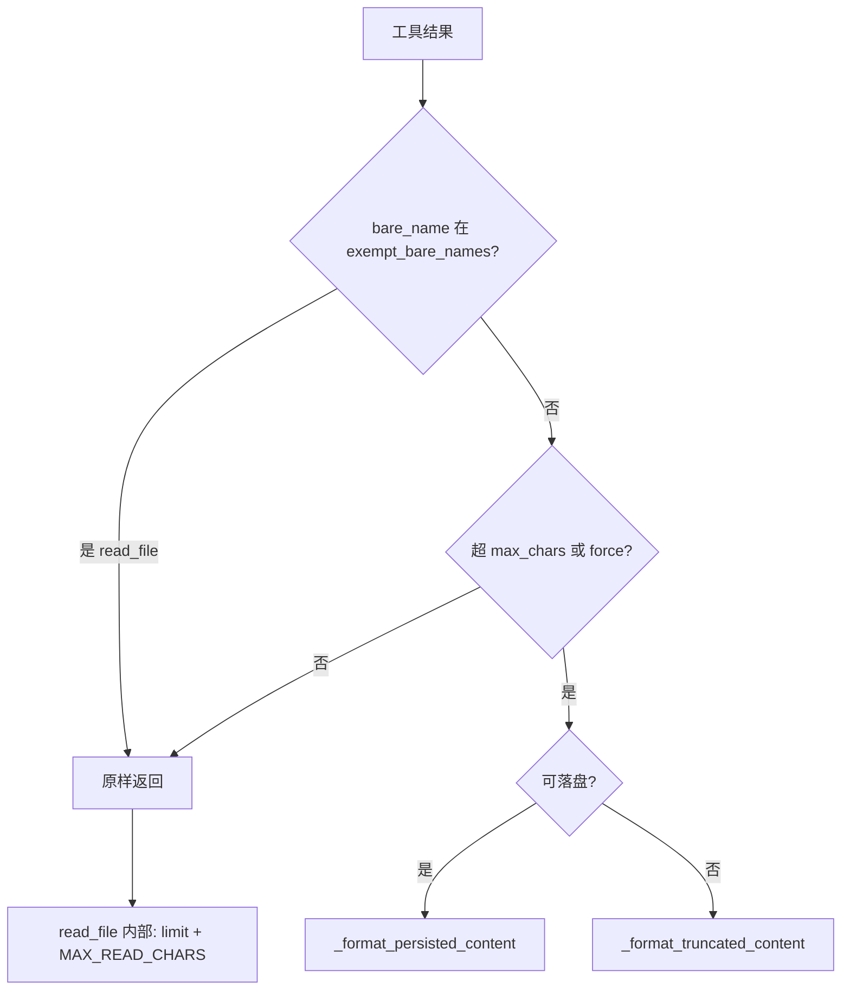

# read_file 外层硬上限改为完全豁免

## 推荐结论

对齐 **deer-flow `exempt_tools`** / **claude-code `maxResultSizeChars: Infinity`**：

- `exempt_bare_names`（默认含 `read_file`）= **外层预算整段跳过**（单条硬上限 + `force`/同轮预算都不碰）
- **不要**再给 `read_file` 加 `tool_overrides: 0`（语义弱于豁免，且挡不住 `force=True`）
- 体积控制留在工具内：已有 `limit` 默认 2000、[`truncate_content`](backend/app/utils/workspace.py) 的 `MAX_READ_CHARS=200_000`

`tool_overrides: 0` 继续只服务于像 `load_skill` 这类「单条不裁、同轮仍可强制」的工具，与豁免名单职责分开。



## 代码改动

### 1. [`backend/app/utils/tool_result_hard_limit.py`](backend/app/utils/tool_result_hard_limit.py)

在 `apply_hard_limit` 中，于 `force` / `max_chars` 判断**之前**增加豁免早退：

```python
if _is_persist_exempt(tool_name, config):  # 语义升级为 budget exempt
    return message
```

这样 `enforce_turn_budget(..., force=True)` 也不会再裁切 / 落盘 `read_file`。

可选清理（同文件内）：

- 将 `_is_persist_exempt` 重命名为 `_is_budget_exempt`（或保留函数名、改 docstring）
- `_format_truncated_content` 的 `can_reread` 分支此前主要为「豁免落盘但仍截断」服务；豁免早退后 `read_file` 不再走到该路径。可简化为普通截断 footer（`can_reread=False`），去掉「豁免持久化 / 再次调用 read_file」专用文案，避免死代码语义残留

### 2. [`backend/app/schemas/config.py`](backend/app/schemas/config.py)

更新 `exempt_bare_names` 的 `description`，写明：

- 完全跳过硬上限（含同轮 `force`）
- 用途：防 persist↔read 循环
- 体积由工具自身限制

**不**改字段名，避免 Nacos / 已有配置迁移。

`tool_overrides` 文档保持：`0` = 关闭该工具单条硬上限，**同轮预算仍可强制**——与 exempt 形成清晰对比。

### 3. 测试 [`backend/tests/utils/test_tool_result_hard_limit.py`](backend/tests/utils/test_tool_result_hard_limit.py)

- 改写 `test_read_file_exempt_no_persist`：超大 content 应 **原样返回**，不出现截断/落盘标记
- 新增：`force=True` 时 `read_file` 仍不裁
- 新增：`enforce_turn_budget` 在合计超预算时，优先压缩其他工具，**不改动** `read_file` 内容

## 不做什么

- 不把 `read_file: 0` 写进默认 `tool_overrides`
- 不改 `read_file` 的 MCP schema（limit 已是 2000）
- 不调整全局 `max_chars=1000`（只影响非豁免工具）
