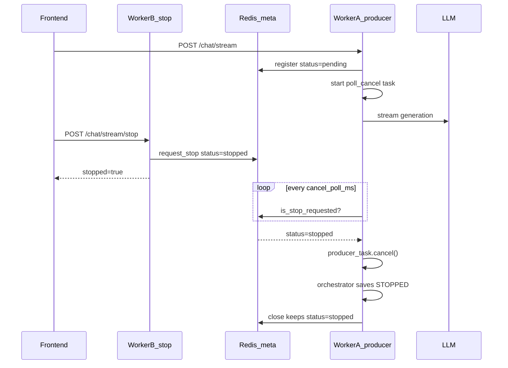
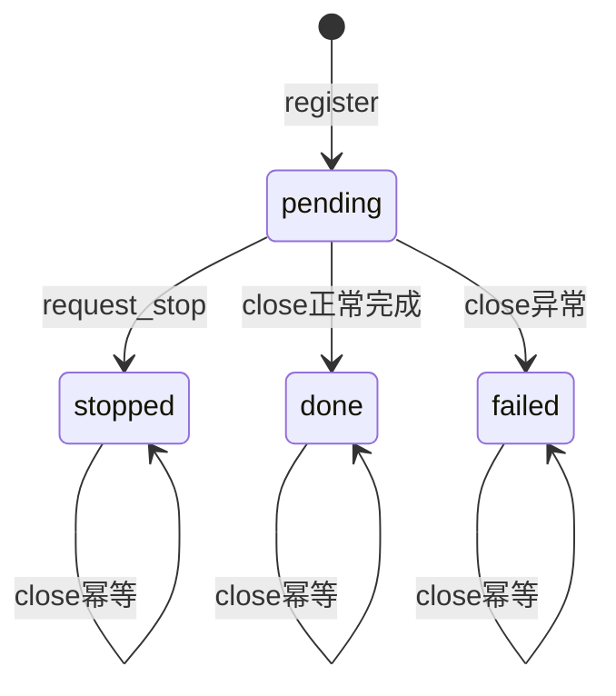

# Redis 跨 Worker SSE Cancel 实现计划

## 背景与问题

当前 stop 依赖进程内字典 [`_STREAM_PRODUCER_TASKS`](backend/app/api/chat.py)（约 L42-L43、L349-L353）。`WORKERS > 1` 时，stop 请求若打到非 producer 所在 worker，会：

- 跳过 `producer_task.cancel()`，LLM 继续生成
- 仅 DB 写 `stopped`（无部分内容），且可能被 producer 完成时覆盖为 `done`

Redis Stream relay 已支持跨 worker resume（[`stream_relay.py`](backend/app/services/chat/stream_relay.py)），但 cancel 仍是进程内能力。[`docs/会话管理.md`](docs/会话管理.md) L192 已注明「跨 worker stop 本期未实现」。

## 目标

- `POST /api/chat/stream/stop` 打到任意 worker 均能停止实际 producer
- 复用 [`chat_orchestrator.py`](backend/app/services/chat/chat_orchestrator.py) L463-L491 的 `CancelledError` 收尾：保存已聚合 `content_blocks`，`status=STOPPED`
- 对外 API、前端协议、`event_id` 语义不变
- **Redis meta 与 DB 共用同一套 [`MessageStatus`](backend/app/schemas/chat.py) 枚举语义**（`pending | stopped | done | failed`）

## 架构



**双层取消**：

| 路径 | 机制 | 场景 |
|------|------|------|
| Fast-path | `_STREAM_PRODUCER_TASKS` + `task.cancel()` | stop 与 producer 同 worker |
| Cross-worker | Redis `status=stopped` + poll | stop 打到其他 worker |

## 1. Redis 数据模型：合并为单一 `status` 字段

### 1.1 设计决策

将现有 meta Hash 的 `closed`（`"0"`/`"1"`）与计划中的 `cancelled` **合并为一个 `status` 字段**，取值对齐 [`MessageStatus`](backend/app/schemas/chat.py)：

```python
class MessageStatus(str, Enum):
    PENDING = "pending"   # 流活跃，可 append
    STOPPED = "stopped"   # 用户请求停止（跨 worker 信号 + 终态）
    DONE = "done"         # 正常完成（终态）
    FAILED = "failed"     # 生成失败（终态）
```

| meta `status` | 等价旧模型 | 含义 |
|---------------|-----------|------|
| `pending` | closed=0, cancelled=0 | 流活跃，producer 可写入 |
| `stopped` | closed=0→1, cancelled=1 | 用户 stop；producer 应 cancel；relay 可继续 resume 已缓冲事件 |
| `done` | closed=1, cancelled=0 | 正常结束，不再 append |
| `failed` | closed=1（异常路径） | 失败结束，不再 append |

**终态判定**：`status != pending` 即不再接受 append（替代原 `closed=1`）。

### 1.2 状态机



转换规则（Lua 或 Python 内 CAS）：

- `register`：`hsetnx(status, pending)`（仅首次创建时写入）
- `request_stop`：仅当 `status==pending` 时 `HSET status stopped`；已终态则幂等 no-op
- `close(stream_id, final_status=done|failed)`：
  - 若当前 `pending` → 设为 `final_status`
  - 若当前 `stopped` → **保持 stopped**（不覆盖为用户 stop 语义）
  - 若已 `done`/`failed` → 幂等，仅缩短 TTL
- 所有终态 `close` 后缩短 stream/meta/seq TTL（沿用 `sse_stream_closed_ttl_seconds`）

### 1.3 meta Hash 字段（迁移后）

| 字段 | 说明 |
|------|------|
| `status` | `pending` / `stopped` / `done` / `failed`（**替代 `closed`**） |
| `created_at` | 不变 |
| `last_event_id` | 不变 |

**向后兼容**（读时 fallback，写时不再写 `closed`）：

```python
async def _read_status(meta_key: str) -> MessageStatus:
    raw = await redis.hget(meta_key, "status")
    if raw:
        return MessageStatus(raw)
    # 遗留 key：仅有 closed 字段
    closed = await redis.hget(meta_key, "closed")
    return MessageStatus.DONE if closed == "1" else MessageStatus.PENDING
```

存量流在 TTL（默认 2h）内自然过期，无需主动迁移。

## 2. 扩展 StreamRelay

文件：[`backend/app/services/chat/stream_relay.py`](backend/app/services/chat/stream_relay.py)

### 2.1 重构现有方法

| 方法 | 改动 |
|------|------|
| `register()` | `hsetnx(status, pending)` 替代 `hsetnx(closed, 0)` |
| `close(stream_id, *, final_status=MessageStatus.DONE)` | 按状态机设终态；缩短 TTL |
| `has_stream()` | `status==pending` → True；终态但 stream key 仍有数据 → True（resume） |
| `iter_resume()` | 退出条件由 `closed==1` 改为 `status != pending` |

### 2.2 新增 public 方法

```python
async def get_status(self, stream_id: str) -> MessageStatus | None:
    # meta 不存在 → None

async def request_stop(self, stream_id: str) -> bool:
    # CAS: pending → stopped；meta 不存在 → False

async def is_stop_requested(self, stream_id: str) -> bool:
    return await self.get_status(stream_id) == MessageStatus.STOPPED
```

命名与 DB `MessageStatus.STOPPED` 对齐，`request_cancel` / `is_cancelled` 不再使用。

### 2.3 Lua append 双保险

将 `_APPEND_SCRIPT` 中 `closed` 检查替换为：

```lua
local status = redis.call('HGET', KEYS[2], 'status')
if status and status ~= 'pending' then
  return tonumber(redis.call('GET', KEYS[3]) or '0')
end
-- 遗留 fallback：无 status 时检查 closed
if not status and redis.call('HGET', KEYS[2], 'closed') == '1' then
  return tonumber(redis.call('GET', KEYS[3]) or '0')
end
```

`status != pending` 时拒绝写入（涵盖 stopped / done / failed）。

## 3. 配置项

文件：[`backend/app/schemas/config.py`](backend/app/schemas/config.py) 的 `ChatStreamConfig`

新增：

```python
sse_stream_cancel_poll_ms: int = Field(
    default=300,
    gt=0,
    description="Producer 轮询 Redis status=stopped 间隔（毫秒）",
)
```

跨 worker stop 延迟上界 ≈ `poll_ms` + 当前 LLM chunk 等待时间。

## 4. Producer 侧轮询

文件：[`backend/app/api/chat.py`](backend/app/api/chat.py)

### 4.1 新增 `_poll_cancel`

```python
async def _poll_cancel(stream_id: str, poll_ms: int) -> None:
    while True:
        await asyncio.sleep(poll_ms / 1000)
        if await _STREAM_RELAY.is_stop_requested(stream_id):
            producer = _STREAM_PRODUCER_TASKS.get(stream_id)
            if producer and not producer.done():
                producer.cancel()
            return
```

### 4.2 改造 `_run_producer`

- `register` 后启动 `poll_task`
- `async for event` 循环内，每次 append 前检查 `is_stop_requested()`，为真则 `raise asyncio.CancelledError()`
- 正常结束 `finally` → `close(stream_id, final_status=MessageStatus.DONE)`
- 异常路径（已有 `build_error_event`）→ `close(stream_id, final_status=MessageStatus.FAILED)`
- 用户 stop 路径：orchestrator 已设 DB stopped；`close` 保持 meta `status=stopped`

取消传播链（无需改 orchestrator）：

```
producer_task.cancel()
  → _run_producer CancelledError
  → event_stream.aclose() 注入 generator
  → chat_orchestrator CancelledError → 保存 STOPPED + 部分内容
  → close() 保持 meta status=stopped
```

## 5. Stop 端点改造

文件：[`backend/app/api/chat.py`](backend/app/api/chat.py) L339-L374

改造顺序：

1. **始终**调用 `await _STREAM_RELAY.request_stop(assistant_message_id)`（跨 worker 信号，meta `pending→stopped`）
2. **保留**本地 fast-path：`_STREAM_PRODUCER_TASKS.get()` + `cancel()` + `await`
3. **DB 兜底**：仅当 status 仍为 `PENDING` 时写 `STOPPED`；写入前 **re-read** message，避免与 orchestrator 竞态覆盖

```python
await _STREAM_RELAY.request_stop(request.assistant_message_id)
# ... local cancel ...
# DB: if refreshed.status == MessageStatus.PENDING: update_assistant_message_status(STOPPED)
```

## 6. Redis status 与 DB MessageStatus 的关系

两者语义对齐但**存储独立**、**短暂可能不一致**：

| 阶段 | Redis meta `status` | DB `message.status` |
|------|---------------------|---------------------|
| 生成中 | `pending` | `pending` |
| 用户点 stop | `stopped`（立即） | `pending` → `stopped`（orchestrator 收尾后） |
| 正常完成 | `done` | `done` |
| 失败 | `failed` | `failed` |

跨 worker stop 依赖 **Redis `stopped` 作为信号**，DB 落库仍由 orchestrator 的 `CancelledError` 负责（保证有部分内容）。

## 7. 不变更范围

- 前端 [`frontend/src/services/chat.ts`](frontend/src/services/chat.ts)
- [`chat_orchestrator.py`](backend/app/services/chat/chat_orchestrator.py)（已有 CancelledError 收尾）
- [`turn_idempotency_store.py`](backend/app/services/chat/turn_idempotency_store.py)
- `has_stream` / `iter_resume` 对外行为：`status=stopped` 且 stream 仍有数据时，resume 可继续拉取已缓冲事件

## 8. 测试

### 8.1 扩展 [`backend/tests/services/chat/test_stream_relay.py`](backend/tests/services/chat/test_stream_relay.py)

- `register` 初始化 `status=pending`
- `request_stop`：pending→stopped；重复调用幂等；meta 不存在返回 False
- `close`：pending→done；stopped 时保持 stopped；failed 路径
- `has_stream` / `iter_resume` 在 stopped/done 下的行为
- `append` 在 `status!=pending` 后不新增事件
- 遗留 `closed` 字段读 fallback（可选）

### 8.2 新增 `backend/tests/services/chat/test_stream_cancel.py`

- poll 检测到 `status=stopped` 后触发 `producer.cancel()`
- 模拟跨 worker：仅 `request_stop`、不操作 `_STREAM_PRODUCER_TASKS`

### 8.3 手工验证

`start.sh` 临时设 `WORKERS=2`，发长文本生成后 stop，确认：

- token 不再增长
- Redis meta `status=stopped`
- DB `status=stopped` 且 `content_blocks` 有部分内容
- 不会最终被覆盖为 `done`

## 9. 文档

更新 [`docs/会话管理.md`](docs/会话管理.md)：

- 删除/修订 L192「跨 worker stop 本期未实现」
- Redis meta 由 `closed` 改为 `status`（MessageStatus 四态）
- `stop` 通过 Redis `status=stopped` 跨 worker；同 worker 仍有本地 fast-path

## 10. 部署后续（验证通过后）

[`backend/start.sh`](backend/start.sh) L53-L54 可将 `WORKERS=1` 恢复为多 worker。

## 风险与对策

| 风险 | 对策 |
|------|------|
| stop 与 orchestrator 双重写 DB | stop 端点 re-read status，仅 `PENDING` 兜底 |
| poll 间隔内多生成少量 token | 可接受；默认 300ms；Lua 拒绝非 pending append |
| producer 崩溃未 close | TTL 清理；`status` 随 meta 过期 |
| 遗留 `closed` key | 读 fallback；TTL 内自然淘汰 |

## 二期可选（本期不做）

- Pub/Sub 即时通知 + poll 兜底（降低延迟至 ~10ms）
- stop 日志字段 `cancel_path=local|redis|db_fallback` 便于观测
