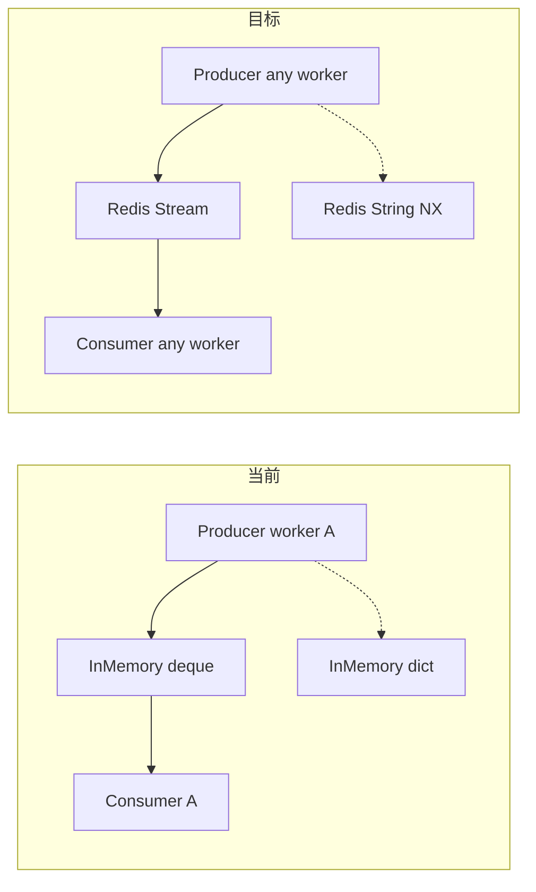
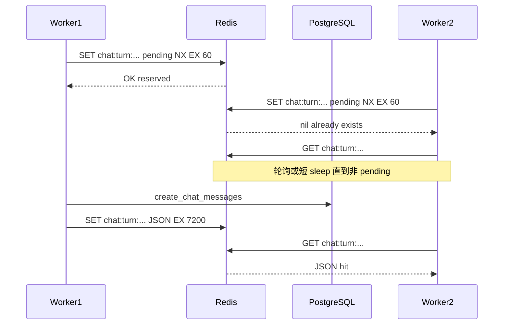

# Redis Stream Relay + Turn 幂等 Redis 化方案

## 目标与边界

**目标**：

1. 多 worker / 进程重启后，可通过 Redis Stream 缓冲做 SSE 断点续传
2. 相同 `client_turn_id` 的重试请求打到任意 worker 时，复用同一对用户/助手消息 ID，避免重复建消息

**不变**：

- [`backend/app/api/chat.py`](backend/app/api/chat.py) 对外接口、`Last-Event-ID` 语义、`event_id` 从 **1** 递增
- 前端 [`frontend/src/services/chat.ts`](frontend/src/services/chat.ts) 无需改动
- Producer/Consumer 分离模型（客户端断开 producer 继续写缓冲）

**本次不做**：

- 跨 worker `stop`（[`_STREAM_PRODUCER_TASKS`](backend/app/api/chat.py) 仍进程内）

---

## 现状 vs 目标



| 能力 | 内存方案 | Redis 方案 |
|------|---------|-----------|
| 跨 worker resume | 否 | 是 |
| 进程重启后 resume | 否 | 是（TTL 内） |
| 跨 worker turn 幂等 | 否 | 是 |
| event_id 语义 | 1-based int | 保持 1-based int |
| 缓冲上限 | 2000 deque（内存裁剪） | **无条数上限**，整 key 靠 TTL 过期删除 |
| stop 跨 worker | 否 | 否（本期不变） |

---

## Redis 数据模型

### SSE Stream（relay）

| Key | 类型 | 用途 |
|-----|------|------|
| `chat:sse:stream:{assistant_message_id}` | Stream | 事件 payload |
| `chat:sse:meta:{assistant_message_id}` | Hash | `closed`, `created_at`, `last_event_id` |
| `chat:sse:seq:{assistant_message_id}` | String | event_id 单调递增计数器（INCR） |

- `stream_id` 继续使用 **`assistant_message_id`**
- Stream entry ID 使用显式 **`{event_id}-0`**（如 `1-0`, `2-0`），与 SSE `id: N` 一一对应
- 每条 XADD 只存 field `payload`（原始 `data:` 行）；写入时由 relay 包装为 `id: {event_id}\n{payload}`

**TTL（不设 MAXLEN）**：

- `XADD` **不使用 `MAXLEN`**，单轮流式事件全量保留至 key 过期
- 活跃流 TTL **2h**（可配置）；`close` 后缩短为 **30min**
- 相对现网内存 deque（2000 条裁剪），Redis 版在 TTL 窗口内可完整续传，不因条数上限丢事件

### Turn 幂等（idempotency）

| Key | 类型 | 用途 |
|-----|------|------|
| `chat:turn:{user_id}:{conversation_id}:{client_turn_id}` | String | 幂等记录 JSON |

Value 示例：

```json
{"user_message_id":"...","assistant_message_id":"..."}
```

- TTL 与 SSE 活跃流对齐（默认 **7200s**），覆盖自动重试窗口
- 无 `client_turn_id` 的请求不走幂等（与现网一致）

---

## 核心实现一：替换 [`stream_relay.py`](backend/app/services/chat/stream_relay.py)

保持 `StreamRelay` 类名与 5 个 public 方法签名不变，内部改为 Redis；通过 [`get_redis()`](backend/app/core/redis.py) 访问。

### `append`（Lua 原子写入）

```lua
-- KEYS[1]=stream, KEYS[2]=meta, KEYS[3]=seq
-- ARGV[1]=payload, ARGV[2]=ttl
if redis.call('HGET', KEYS[2], 'closed') == '1' then
  return tonumber(redis.call('GET', KEYS[3]) or '0')
end
local event_id = redis.call('INCR', KEYS[3])
local entry_id = event_id .. '-0'
redis.call('XADD', KEYS[1], entry_id, 'payload', ARGV[1])
redis.call('HSET', KEYS[2], 'last_event_id', event_id)
redis.call('EXPIRE', KEYS[1], ARGV[2])
redis.call('EXPIRE', KEYS[2], ARGV[2])
redis.call('EXPIRE', KEYS[3], ARGV[2])
return event_id
```

### `iter_resume`

1. **重放**：`XRANGE stream (last_event_id)-0 +`
2. **尾随**：`XREAD BLOCK` 读新条目；`meta.closed=1` 且无新条目时退出
3. 过滤条件保持 **`event_id > last_event_id`**

Redis 异常向上抛出，不静默降级到内存。

---

## 核心实现二：新增 [`turn_idempotency_store.py`](backend/app/services/chat/turn_idempotency_store.py)

参考 [`SmsVerificationStore`](backend/app/services/auth/sms_verification_store.py) 模式，新建 `TurnIdempotencyStore`：

```python
@dataclass(frozen=True)
class IdempotentTurn:
    user_message_id: str
    assistant_message_id: str

class TurnIdempotencyStore:
    KEY_PREFIX = "chat:turn:"

    async def get(self, key: tuple[str, str, str]) -> IdempotentTurn | None: ...
    async def save(self, key: tuple[str, str, str], turn: IdempotentTurn) -> None: ...
    async def reserve_or_get(self, key: tuple[str, str, str]) -> IdempotentTurn | Literal["reserved"] | None: ...
```

### 并发安全（跨 worker 竞态）

`POST /chat/stream` 两条并发相同 `client_turn_id` 时，只允许一个 worker 建消息：



流程：

1. `reserve_or_get`：`SET key "pending" NX EX 60`
   - 成功 → 返回 `"reserved"`，当前 worker 负责建消息
   - 失败 → `GET key`：若已是 JSON 则直接返回；若为 `pending` 则短轮询（最多 ~5s）等待另一方写完
2. 拿到 `"reserved"` 的 worker 调用 `create_chat_messages`，再 `SET` 最终 JSON（覆盖 `pending`，设长 TTL）
3. 轮询超时的 loser：视为未命中，**不再**二次建消息，返回 409 或走空流（推荐：**继续轮询至 TTL 边界后返回 503**，实现时选短轮询 + 日志告警即可）

> 简化实现：losers 在 `pending` 时 `asyncio.sleep(0.1)` 循环 `GET`，最多 50 次（5s），与 winner 的 DB 事务时间对齐。

### [`chat.py`](backend/app/api/chat.py) 改动

**删除**：

```python
_TURN_IDEMPOTENCY_LOCK = asyncio.Lock()
_TURN_IDEMPOTENCY_CACHE: dict[tuple[str, str, str], "_IdempotentTurn"] = {}
```

**替换** `stream_chat` 内幂等块为：

```python
turn_store = TurnIdempotencyStore()
if idempotency_key is not None:
    turn = await turn_store.resolve_turn(idempotency_key, create_fn=...)
else:
    turn = await create_messages(...)
```

`resolve_turn` 封装 reserve → create → save 全流程；`_IdempotentTurn` dataclass 迁入 store 模块并改名为 `IdempotentTurn`。

幂等命中后的 SSE 行为不变：

```python
if is_idempotent_hit:
    if await _STREAM_RELAY.has_stream(turn.assistant_message_id):
        return StreamingResponse(_drain_stream(..., last_event_id=last_event_id), ...)
    return StreamingResponse(_empty_stream(), ...)
```

---

## 配置项

在 [`backend/app/schemas/config.py`](backend/app/schemas/config.py) 新建 `ChatStreamConfig`（挂到 `Settings.chat_stream`）：

| 字段 | 默认 | 说明 |
|------|------|------|
| `sse_stream_ttl_seconds` | `7200` | 活跃流 TTL（stream/meta/seq 同步过期） |
| `sse_stream_closed_ttl_seconds` | `1800` | close 后 TTL |
| `sse_stream_xread_block_ms` | `5000` | XREAD BLOCK 超时 |
| `turn_idempotency_ttl_seconds` | `7200` | 幂等记录 TTL |
| `turn_idempotency_pending_ttl_seconds` | `60` | reserve 占位 TTL |
| `turn_idempotency_wait_timeout_seconds` | `5` | loser 等待 winner 写回超时 |

---

## 测试计划

### [`test_stream_relay.py`](backend/tests/services/chat/test_stream_relay.py)

fakeredis + lua，覆盖 event_id 递增、resume 过滤、close、大量 append 不裁剪、SSE 包装格式。

### [`test_turn_idempotency_store.py`](backend/tests/services/chat/test_turn_idempotency_store.py)

1. `save` → `get` 命中
2. 双 `reserve_or_get`：一个 `reserved`，另一个最终 `get` 到同一 turn
3. key 不存在时 `get` 返回 None
4. TTL 过期后 `get` 返回 None（fakeredis `expire`）

### chat 集成（可选 mock DB）

验证 `stream_chat` 幂等命中时不调用 `create_chat_messages`（mock `MessageDbService`）。

---

## 文档更新

- [`docs/会话管理.md`](docs/会话管理.md)：Redis Stream relay + `client_turn_id` 跨 worker 幂等说明
- [`backend/README.md`](backend/README.md)：多 worker 部署需 Redis 可达

---

## 风险与已知限制

1. **Producer 仍绑死启动它的 worker**：worker 挂掉后 resume 只能拿到已缓冲事件；需结合 DB `message.status` 判断结束
2. **stop 仍限单 worker**：本期不改动
3. **Redis 强依赖**：Redis 不可用则 stream / 幂等均失败；health 已有 `ping_redis`
4. **单流内存占用**：无 MAXLEN 时，极长回复（大量 `content_block`）在 TTL 内占用更多 Redis 内存；靠 TTL + close 后缩短 TTL 控制；若后续需上限可再加可选 `maxlen`
5. **TTL 过期后不可续传**：与无 MAXLEN 并列的边界，过期后 key 消失则 resume 失败（前端应结合 DB `message.status`）
6. **极端竞态**：winner 在写 JSON 前崩溃且 `pending` 已过期，losers 超时后可能仍建重复消息（概率极低；可通过 pending TTL 与 wait 超时调参缓解）

---

## 实施顺序

1. 加 `ChatStreamConfig` 配置项
2. 实现 `TurnIdempotencyStore` + 单测
3. 重写 `StreamRelay`（Redis）+ 单测
4. 改造 `chat.py`：接入 store，删除内存 dict/lock
5. 本地验证：重复 `client_turn_id` 请求不重复建消息；跨 worker resume
6. 多 worker 验证：`uvicorn --workers 2`
7. 更新文档
