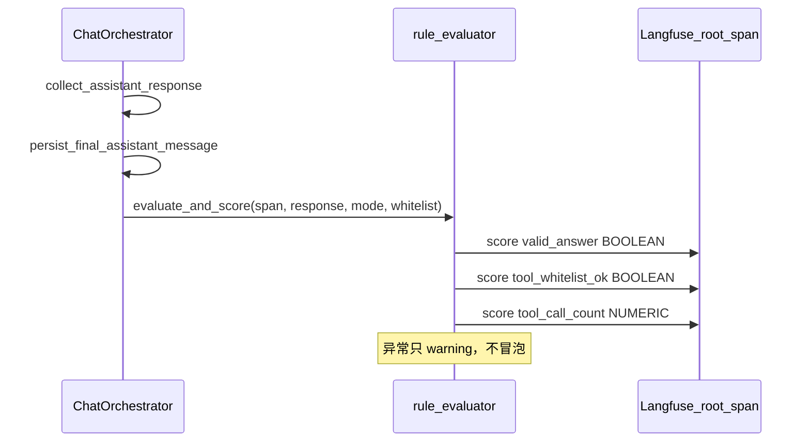

# Rule Evaluator 实现计划

## 已确认决策

- **白名单**：`agent_mode=0` 与 `agent_mode>0` 统一判定 `called_tools ⊆ whitelist`（不再对普通模式特殊判「零工具」）
- **范围**：代码接入 + 单测；不含 Langfuse v4 升级与 Monitors UI 配置
- **白名单来源**：运行时从 `mcp_manager.tools_map` + `settings.mcp.*_mode_servers` 派生（方案 A，修正文档中不存在的 `get_tools_by_server`）
- **指标命名**：原设计 `empty_answer` 改为 `valid_answer`（true=回答非空/合格，false=空答）

## 数据流



## 实现步骤

### 1. 新增 [`backend/app/evaluators/`](backend/app/evaluators/)

- `__init__.py`
- `rule_evaluator.py`，核心 API：
  - `build_tool_whitelist(agent_mode: int, tools_map: dict[str, ToolRoute]) -> set[str]`：按 mode 取 `settings.mcp.normal_mode_servers` / `agent_mode_servers`，从 `tools_map` 筛出 `route.server_name in servers` 的 LLM 组合名
  - `evaluate_and_score(*, span, assistant_response, agent_mode, tool_whitelist) -> None`：外层 try/except，失败只 `logger.warning`
  - 内部指标：
    - `valid_answer`：`len(content.strip()) > 0` → BOOLEAN（true=非空合格，false=空答）
    - `tool_whitelist_ok`：收集 `ToolUseBlock.name`；任一 `name` 为空则 false；否则 `called.issubset(whitelist)` → BOOLEAN，失败时 `comment` 带 `called=...`
    - `tool_call_count`：复用 [`count_tool_use_blocks`](backend/app/schemas/chat.py) → NUMERIC
  - 复用已有 [`score_observation`](backend/app/core/observability.py)

每轮直接从 `tools_map` 构建白名单（O(工具数)，远低于 10ms），不在 Orchestrator 上做缓存，MCP reload 后自然生效，避免设计第十节「后续扩展」里的热更新空洞。

### 2. 接入 [`chat_orchestrator.py`](backend/app/services/chat/chat_orchestrator.py)

在成功路径、`persist_final_assistant_message` + `invalidate_conversation_state` 之后、`root_span.update(output=...)` 之前插入：

```python
from app.evaluators.rule_evaluator import build_tool_whitelist, evaluate_and_score

mcp_manager = getattr(self.chat_session_agent, "mcp_manager", None)
tools_map = mcp_manager.tools_map if mcp_manager is not None else {}
evaluate_and_score(
    span=root_span,
    assistant_response=assistant_response,
    agent_mode=chat_request.agent_mode,
    tool_whitelist=build_tool_whitelist(chat_request.agent_mode, tools_map),
)
```

`getattr` 兼容现有 tracing 单测里的 `_FakeAgent`（无 `mcp_manager`）。仅成功完成路径调用；失败/取消路径不评估。

### 3. 单测 [`backend/tests/evaluators/test_rule_evaluator.py`](backend/tests/evaluators/test_rule_evaluator.py)

用 Fake span 收集 `score(**kwargs)` 调用，覆盖：

| 用例 | 期望 |
|------|------|
| 非空回复 | `valid_answer=True` |
| 空白回复 | `valid_answer=False` |
| mode=0 调用白名单内工具（如 `tavily_web_search`） | `tool_whitelist_ok=True` |
| mode=0 调用 agent 专属工具（如 `shell_exec`） | `tool_whitelist_ok=False` |
| mode>0 调用白名单外工具 | `tool_whitelist_ok=False` |
| `ToolUseBlock.name` 为空 | `tool_whitelist_ok=False` |
| 多个 ToolUseBlock | `tool_call_count` 正确 |
| `evaluate_and_score` 内部抛错 | 不冒泡 |
| `build_tool_whitelist` | 只含对应 server 的组合名 |

不强制改 orchestrator 集成测；现有 tracing 测靠 `getattr` 自然 no-op 白名单即可。

### 4. 同步修正设计文档

更新 [`docs/agent_evaluator/rule_evaluator_design.md`](docs/agent_evaluator/rule_evaluator_design.md)（以及 [`agent_evaluation_plan.md`](docs/agent_evaluator/agent_evaluation_plan.md) 中对应 Score Config 行）：

- `empty_answer` 全面更名为 `valid_answer`（Monitor 名如 `valid_answer_rate`）
- 删除「agent_mode=0 不应出现任何工具调用」特殊分支，改为统一 ⊆ 白名单
- 将伪代码中的 `get_tools_by_server` 改为 `tools_map` 派生
- 标明热更新缓存为后续扩展；本次采用每轮从 `tools_map` 构建

## 不在本次范围

- Langfuse v4 升级、Monitors / Slack 告警配置
- 离线评估、P1 LLM-Judge、bad case 回流
- Orchestrator 白名单缓存 + reload 回调
