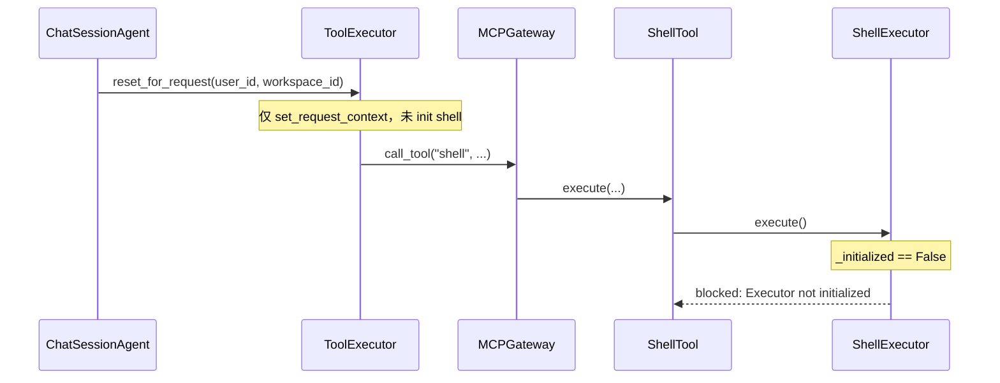
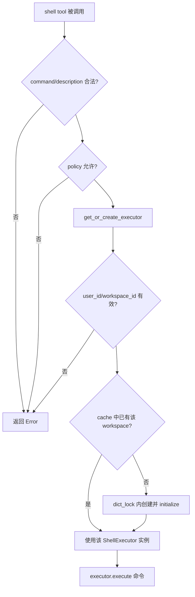
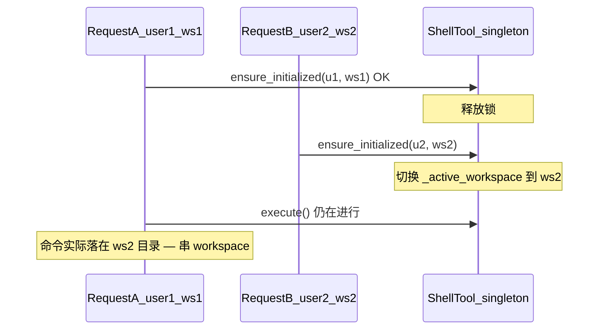
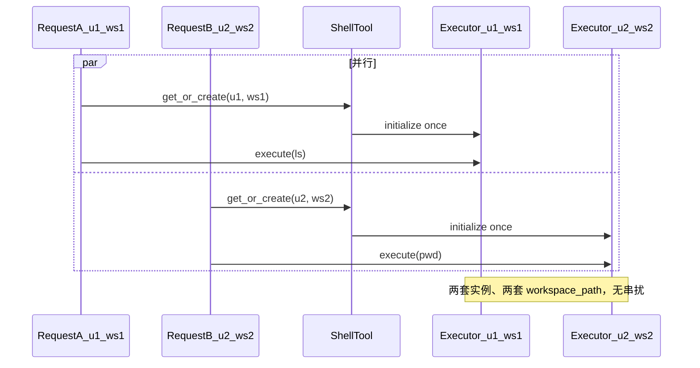

# Shell Executor 懒初始化方案

## 问题根因



[`initialize_shell_executor()`](backend/app/mcp/mcp_servers/shell_mcp/server.py) 已定义但**全仓库无调用**；[`ShellTool.__init__`](backend/app/mcp/mcp_servers/shell_mcp/shell.py) 只创建未初始化的 `ShellExecutor`。

## 目标

- 首次（或 workspace 变更后）执行 `shell` 工具前完成沙箱 `setup`
- 与 file MCP 一致：在 MCP 工具层自管 workspace，不侵入 `ToolExecutor` / `ChatSessionAgent`
- 进程内单例 `_shell_tool` 在并发请求下 workspace 不串扰（见下文「多用户并发机制」）
- 修复 `local` 后端 `cwd="/workspace"` 在宿主机不存在的问题

## 推荐初始化时机

**在 [`ShellTool.execute()`](backend/app/mcp/mcp_servers/shell_mcp/shell.py) 内、policy 校验通过后、调用 `ShellExecutor.execute()` 之前**，调用 `ensure_initialized(user_id, workspace_id)`。

不采用以下时机：

| 时机 | 排除原因 |
|------|----------|
| 应用启动 / MCP 池 init | 无 user/workspace |
| `ToolExecutor.reset_for_request` | 可能从不调用 shell；跨层耦合 |
| 每请求 cleanup | 单例会影响其它并发请求 |



## 多用户并发机制

### 部署模型

- Uvicorn 多 worker 时：**每个 worker 进程**各有一份模块级 `_shell_tool` 单例；worker 之间互不共享内存。
- 单 worker 内：多个 HTTP 请求以 **asyncio 协程** 并发；`shell` 工具调用可能在同一时刻交错执行。

### 原草案风险（仅 `_active_workspace` + init 时加锁）

若只在 `ensure_initialized()` 内加锁，而 `executor.execute()` 在锁外执行，会出现 **TOCTOU**：



因此**不能**用「全局唯一 `ShellExecutor` + 可变 `_active_workspace`」表达多租户隔离。

### 修订方案：按 workspace 缓存独立 `ShellExecutor`

`ShellTool` 维护：

```text
_executors: dict[tuple[user_id, workspace_id], ShellExecutor]
_dict_lock: asyncio.Lock   # 仅保护 dict 的创建/读取，不包裹整条命令执行
```

`get_or_create_executor(user_id, workspace_id)` 流程：

1. 校验 `user_id` / `workspace_id` 非空。
2. `key = (user_id, workspace_id)`；若 `_executors` 中已有且已初始化 → **直接返回该实例**（不同 key 并行执行，互不切换 workspace）。
3. 若不存在：`async with _dict_lock` 内 double-check，创建 `ShellExecutor()`，`initialize(get_workspace_root(...))`，写入 dict。
4. `execute()` 取到实例后调用 `executor.execute(...)`；**不再修改**其它 key 对应的实例。



| 场景 | 行为 |
|------|------|
| 同用户、同 conversation 多次 `shell` | 复用同一 `ShellExecutor`，不重复 init |
| 不同用户 / 不同 conversation 并发 | 各用 dict 中不同 entry，**可并行**执行命令 |
| 同一 worker 上 100 个历史 conversation 都调过 shell | dict 持续增长；首版可接受，后续可加 LRU/TTL 淘汰 |

**不做**：请求结束 `cleanup()` 单个 entry（其它请求可能仍持有同一 key 的 executor）；进程退出时无需特殊处理（进程结束即释放）。

## 实现步骤

### 1. 扩展 [`ShellTool`](backend/app/mcp/mcp_servers/shell_mcp/shell.py)

新增状态与 `get_or_create_executor`（替代原 `ensure_initialized` + 单一 `_active_workspace`）：

- `self._executors: dict[tuple[str, str], ShellExecutor]`
- `self._dict_lock: asyncio.Lock`

`get_or_create_executor(user_id, workspace_id) -> tuple[ShellExecutor | None, str | None]`：

- `user_id` / `workspace_id` 为空 → 返回 `(None, "错误信息")`
- 使用 [`app.utils.workspace.get_workspace_root`](backend/app/utils/workspace.py) 解析物理路径
- cache hit → 返回已有 executor
- cache miss → 在 `_dict_lock` 内创建并 `initialize(workspace_path)` 后返回

在 `execute()` 中，policy 通过后：

```python
executor, init_error = await self.get_or_create_executor(user_id, workspace_id)
if init_error:
    return f"Error: {init_error}"
result = await executor.execute(...)
```

### 2. 调整 [`ShellExecutor`](backend/app/mcp/mcp_servers/shell_mcp/executor.py)

- `initialize()` 成功后保存 `self._workspace_path: Path`
- `execute()` 根据 `sandbox_config.backend` 选择 cwd：
  - `docker` → `"/workspace"`（容器内 mount）
  - `local` → `str(self._workspace_path)`（宿主机真实目录）
- workspace 切换时：`initialize()` 若 backend 实例已存在且仅 path 变化，可复用实例并重新 `setup(path)`，避免重复构造（小优化，非必须）

**可选（本方案可一并做）**：docker 模式下在 `initialize` 后调用 `DockerSandboxExecutor.set_uploads_path`，路径来自 `file_mcp.utils.get_uploads_root(user_id)`，与容器 `/uploads` mount 对齐。

### 3. 更新 [`server.py`](backend/app/mcp/mcp_servers/shell_mcp/server.py)

- `initialize_shell_executor(workspace_path)` 改为委托 `_shell_tool.initialize(workspace_path)`（保留给测试/脚本）
- 或标注为 deprecated，推荐测试直接 mock `ensure_initialized`
- **不在** HTTP/MCP 池启动链路中调用

### 4. 测试

在 [`test_server.py`](backend/app/mcp/mcp_servers/shell_mcp/test_server.py) 或新建 `test_shell_tool.py` 增加：

- `get_or_create_executor` 在有效 `user_id/workspace_id` 后返回已初始化 executor
- 不同 `(user_id, workspace_id)` 对应 dict 中不同实例；相同 key 第二次不重复 initialize
- 缺少 `user_id` 返回错误、不执行命令
- local 模式下 `execute` 使用物理 workspace 作 cwd（mock `sandbox_config.backend = "local"`）

现有 policy 测试保持不变。

## 不改动的部分

- [`ChatSessionAgent`](backend/app/agents/chat_session_agent.py) / [`ToolExecutor.reset_for_request`](backend/app/agents/tool_executor.py)：继续只负责 `set_request_context`，不引入 shell 依赖
- 不在请求结束调用 `cleanup_shell_executor()`（避免并发请求互相影响）

## 风险与缓解

| 风险 | 缓解 |
|------|------|
| 单例并发 workspace 竞态 | 按 `(user_id, workspace_id)` 缓存独立 `ShellExecutor`，避免全局切换 workspace；dict 写入用 `_dict_lock` |
| executor 缓存无限增长 | 首版不淘汰；后续可加 LRU/TTL（非本方案范围） |
| 首次 shell 调用略慢 | 仅在实际调用 shell 时 init；`setup` 本身轻量 |
| local/docker cwd 语义不同 | 在 `ShellExecutor.execute` 统一分支 |

## 验收标准

1. Agent 模式调用 `shell`（如 `ls`）不再出现 `Executor not initialized`
2. 同一 conversation 多次 shell 调用不重复完整 init（日志仅首次或 workspace 切换时打印 `Shell executor initialized`）
3. `SANDBOX__BACKEND=local` 下简单命令（如 `pwd`）可在 workspace 目录内成功执行
4. 新增单元测试通过：`cd backend && uv run pytest app/mcp/mcp_servers/shell_mcp/ -v`
