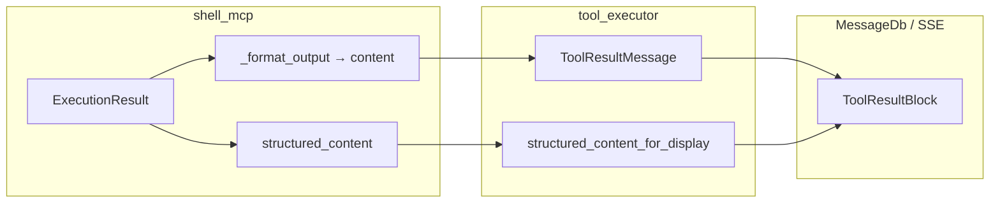

# Shell 执行结果结构化 Display Schema 改造

## 背景与目标

**现状**（[`shell.py`](backend/app/mcp/mcp_servers/shell_mcp/shell.py)）：

- `ExecutionResult` 已有 `stdout` / `stderr` / `return_code` / `timed_out` 等字段
- `_format_output` 将其拼成纯文本（`$ command`、`--- stdout ---` 等）
- MCP 仅 `ToolResult(content=result)`，无 `structured_content`
- 前端无特化 renderer，走默认 `CodeHighlighter`
- Shell 已在 `SKIP_TOOL_RESULT_COMPACTION_SERVERS`，不会走 markdown compaction

**目标**：



- **LLM**：继续读 `content` 文本（格式可保持现状，便于审计与多轮对话）
- **前端**：读 `structured_content_for_display` 做终端分区展示（stdout / stderr / exit code）
- **command**：不重复写入 display（已在 `ToolUseBlock.argumentsJson.command`）

与 [tool_renderer_registry 计划](./tool_renderer_registry_913dcfb5.plan.md) **解耦**：本计划负责后端 schema 与数据流；registry 落地后只需在 `servers/shell.ts` 注册 `ShellToolResult` renderer。

---

## 1. Schema 定义

新增 [`backend/app/schemas/shell_display.py`](backend/app/schemas/shell_display.py)（或放在 `app/mcp/mcp_servers/shell_mcp/models.py`）：

### 1.1 MCP 层 `structured_content`（FastMCP ToolResult）

供 agent 读取，字段与 `ExecutionResult` 对齐，snake_case：

```python
class ShellExecStructuredContent(BaseModel):
    exit_code: int
    stdout: str = ""
    stderr: str = ""
    timed_out: bool = False
    output_truncated: bool = False
    blocked: bool = False
    block_reason: str | None = None
    duration_ms: int = 0
```

错误/阻断路径（audit block、init 失败）仍走 `content` 字符串；可选 `blocked=True` + `block_reason` 写入 structured，便于 UI 展示红色提示。

### 1.2 前端 display 项 `ShellExecDisplayItem`

写入 `structured_content_for_display` 的单条记录（camelCase 与现有 SSE JSON 一致）：

```python
class ShellExecDisplayItem(BaseModel):
    type: Literal["shell_exec"] = "shell_exec"
    exit_code: int
    stdout: str = ""
    stderr: str = ""
    timed_out: bool = False
    output_truncated: bool = False
    blocked: bool = False
    block_reason: str | None = None
    duration_ms: int = 0
```

**为何用 `list[dict]` + `type` 判别**：

- 现有 [`ToolResultMessage.structured_content_for_display`](backend/app/schemas/llm.py) 与 [`ToolResultBlock`](backend/app/schemas/chat.py) 均为 `list[dict[str, Any]] | None`
- `web_search` 已占用「无 type 字段」的 query/results 形状；shell 用 `type: "shell_exec"` 避免与 tavily 混淆
- 前端后续扩展为 `WebSearchDisplayItem | ShellExecDisplayItem` 联合类型（本计划 backend 先行，前端可 follow-up PR）

### 1.3 截断策略

| 字段 | LLM `content` | Display |
|------|---------------|---------|
| stdout/stderr | 受 `max_output_chars` 截断后的文本 | 同 content 截断结果，或单独 `display_max_chars`（建议先与 content 一致） |
| 元数据 | 文本内 `[exit_code=]` 等 | 结构化字段 |

Display 必须自洽：**当 SSE 省略 `content` 时**（见 §4），display 列表须含完整展示所需 stdout/stderr。

---

## 2. MCP 改造

### 2.1 [`shell.py`](backend/app/mcp/mcp_servers/shell_mcp/shell.py)

`execute` 返回值改为 dataclass 或 tuple，或新增方法返回 `(content: str, structured: ShellExecStructuredContent | None)`：

- 成功 / 正常执行：填充 `ShellExecStructuredContent`
- 纯字符串错误（`Error: command is required`）：仅 `content`，`structured_content=None`

`_format_output` **保留**，作为 LLM `content` 唯一来源，避免双份逻辑漂移。

### 2.2 [`server.py`](backend/app/mcp/mcp_servers/shell_mcp/server.py)

```python
return ToolResult(
    content=content,
    structured_content=structured.model_dump(mode="json") if structured else None,
)
```

与 [`file_mcp/server.py`](backend/app/mcp/mcp_servers/file_mcp/server.py)、[`time_mcp`](backend/app/mcp/mcp_servers/time_mcp/server.py) 模式一致。

---

## 3. Agent 层挂载 display

### 3.1 扩展 [`tool_executor.py`](backend/app/agents/tool_executor.py)

在 `call_tool` 成功分支，`server_name == SHELL_SERVER` 且 `result.structured_content` 存在时：

```python
display = ShellExecDisplayItem.model_validate(
    {**result.structured_content, "type": "shell_exec"}
)
tool_call_result_message = tool_call_result_message.model_copy(
    update={"structured_content_for_display": [display.model_dump(mode="json")]}
)
```

**不**走 tavily 的 `_apply_tavily_compaction`；shell 已 skip compaction，`content` 保持 `_format_output` 全文。

### 3.2 可选：独立 `ShellResultProcessor`

若希望与 tavily 对称，可新增 [`shell_result_processor.py`](backend/app/agents/utils/shell_result_processor.py)（仅 `build_display_item(structured_content) -> list[dict]`），逻辑极简，第一版也可 inline 在 tool_executor。

### 3.3 `format_mcp_result`

确认 [`mcp_manager.format_mcp_result`](backend/app/mcp/mcp_client.py) 在 shell 场景仍只把 **文本** 写入 `ToolResultMessage.content`（structured 不 stringify 进 content）。

---

## 4. SSE 与持久化

### 4.1 流式 [`content_blocks.py`](backend/app/agents/utils/content_blocks.py)

现有逻辑：当 `structured_content_for_display is not None` 时，`append_tool_result` 的 block payload **pop `content`**。

对 shell 意味着：

- Display 必须包含 stdout/stderr（已截断后的副本）
- 历史消息从 DB 加载时：若仅存 display、无 content，LLM 重建上下文需依赖 DB 中完整 `content` 字段——**确认 MessageDb 持久化时不 pop content**

检查点：

- [`dump_content_block_payloads`](backend/app/schemas/chat.py) 的 `omit_tool_result_content_and_summary_when_structured` 仅用于 SSE，不影响 DB write
- DB 写入应始终保留 `content` + `structured_content_for_display` 双字段

### 4.2 历史消息兼容

旧消息仅有 `content` 文本、无 display：

- 前端 `ShellToolResult` 应 fallback：解析失败或无 `type: shell_exec` 时回退默认 `<pre>` / `CodeHighlighter`
- **无需** backfill 脚本（可选 `--dry-run` 从 content 启发式解析，优先级低）

---

## 5. 前端衔接（独立 PR，本计划只列契约）

| 项 | 说明 |
|----|------|
| [`contentBlock.ts`](frontend/src/interfaces/contentBlock.ts) | `ShellExecDisplayItem` + `structuredContentForDisplay?: (WebSearchDisplayItem \| ShellExecDisplayItem)[]` |
| `ShellToolResult.tsx` | `$ command`（来自 toolUse args）+ stdout/stderr 分区 + exit code badge；参考 [`CodeExecPreview`](frontend/src/pages/ChatPage/components/BlockPreviewPanel/CodeExecPreview/index.tsx) |
| registry | 待 [tool_renderer_registry](./tool_renderer_registry_913dcfb5.plan.md) 完成后挂 `servers/shell.ts` |

Args 展示：`CodeHighlighter lang="bash"` 展示 `argumentsJson.command`（不依赖 structured display）。

---

## 6. 测试

| 范围 | 用例 |
|------|------|
| `ShellExecStructuredContent` | 正常 / blocked / timed_out / 空 stdout |
| `shell.py` + `server.py` | mock executor 返回 ExecutionResult，断言 ToolResult 双字段 |
| `tool_executor` | shell 工具调用后 `structured_content_for_display[0].type == "shell_exec"` |
| SSE payload | omit flag 下无 content、有 display |
| DB round-trip | 保存消息后 content 与 display 均存在 |

运行：`cd backend && uv run pytest tests/mcp/mcp_servers/shell_mcp/ tests/agents/ -k shell -v`

---

## 7. 实施顺序

1. Pydantic schema + shell_mcp ToolResult 双字段
2. tool_executor 挂载 `structured_content_for_display`
3. 验证 SSE / DB 双写与 LLM content 不变
4. 前端类型 + `ShellToolResult`（可与 registry 并行）
5. registry `servers/shell.ts` 注册（registry PR 或 follow-up）

---

## 风险

| 风险 | 缓解 |
|------|------|
| content 与 structured 不一致 | structured 一律从同一 `ExecutionResult` 实例生成，content 仅 `_format_output` |
| SSE 省略 content 导致 UI 空白 | display 含完整 stdout/stderr；E2E 断言 |
| `list[dict]` 类型过宽 | `type: shell_exec` 判别；Pydantic validate 入口 |
| 历史消息无 display | 前端 fallback 到 content 纯文本 |

---

## 不在范围

- 交互式终端（xterm / PTY）
- ANSI 转义渲染
- 修改 LLM 可见的 `content` 格式（除非产品明确要求简化）
- tool_renderer_registry 本体改造
