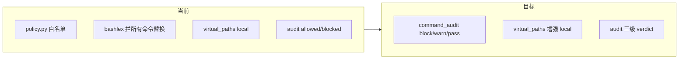
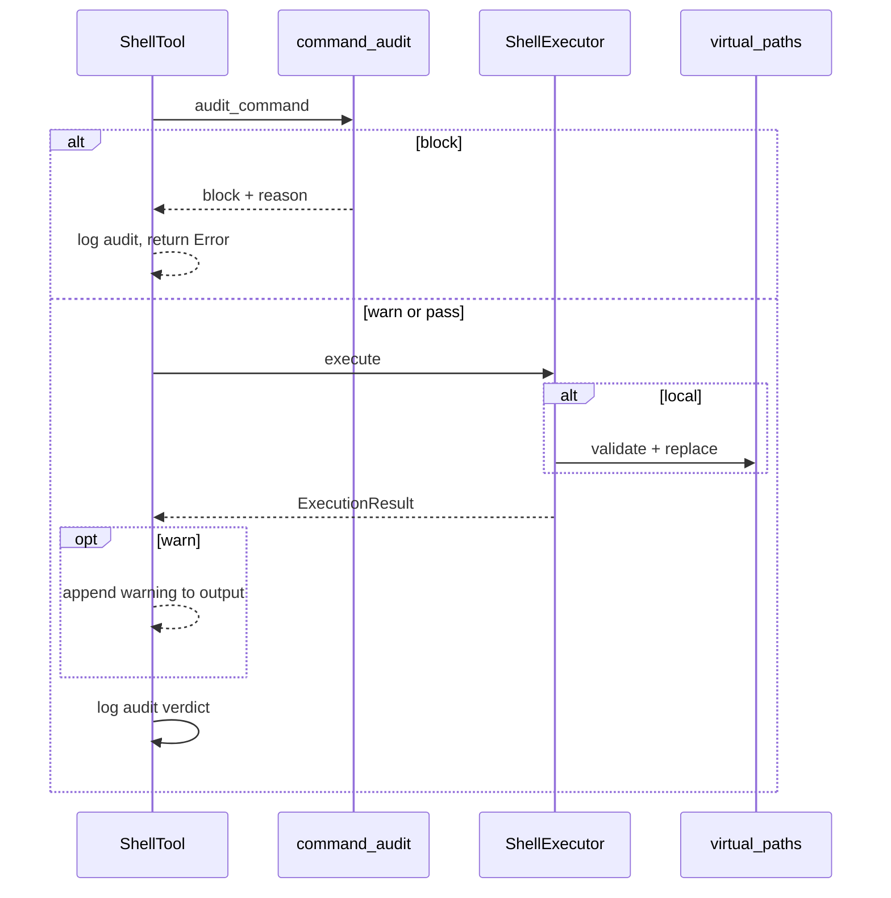

# Shell 命令安全方案改造（对齐 deerflow）

## 现状 vs 目标



| 能力 | 当前 [`policy.py`](backend/app/mcp/mcp_servers/shell_mcp/policy.py) | deerflow [`sandbox_audit_middleware.py`](file:///Users/honglei.wu/Desktop/code/deer-flow/backend/packages/harness/deerflow/agents/middlewares/sandbox_audit_middleware.py) | 改造后 |
|------|------|----------|--------|
| 命令白名单 | 有（~80 条 ALLOWED_COMMANDS） | **无** | **删除** |
| 高危模式 | 部分 DANGEROUS_PATTERNS | `_HIGH_RISK_PATTERNS`（更全） | 迁入新模块 |
| 中危警告 | 无 | pip/apt/sudo/PATH 等 → warn | 新增 warn |
| 输入限制 | 仅空命令 | 长度 10k、null byte、shlex 失败 block | 新增 |
| Local 路径 | [`virtual_paths.py`](backend/app/mcp/mcp_servers/shell_mcp/virtual_paths.py) 已有基础版 | `validate_local_bash_command_paths` 更完整 | **补齐缺口** |
| Docker | 同样走白名单 | 仅审计 + 容器隔离 | 仅审计 + 容器隔离 |

**行为变化（已确认接受）**：`vite`、`curl`（网络开启时）、自定义脚本等不再因「不在白名单」被拒；安全依赖模式拦截 + Docker 挂载边界 + local 路径白名单。

---

## 1. 新增 `command_audit.py`（替代 policy 核心逻辑）

路径：[`backend/app/mcp/mcp_servers/shell_mcp/command_audit.py`](backend/app/mcp/mcp_servers/shell_mcp/command_audit.py)

从 deerflow 移植并适配 shell MCP（函数名保持清晰，不依赖 LangChain middleware）：

- **常量**：`_HIGH_RISK_PATTERNS`、`_MEDIUM_RISK_PATTERNS`（与 deerflow 列表一致，见 [`sandbox_audit_middleware.py` L25-60](file:///Users/honglei.wu/Desktop/code/deer-flow/backend/packages/harness/deerflow/agents/middlewares/sandbox_audit_middleware.py)）
- **工具函数**：
  - `_split_compound_command()` — 引号感知拆分 `;` / `&&` / `||`
  - `_classify_single_command()` / `_classify_command()` — 返回 `"block" | "warn" | "pass"`
  - `_validate_input(command)` — 空命令、>10000 字符、`\x00` → block
- **公开 API**：

```python
@dataclass
class CommandAuditResult:
    verdict: Literal["block", "warn", "pass"]
    reason: str | None = None  # block 时的人类可读原因

def audit_command(command: str) -> CommandAuditResult: ...
```

- **删除**：`ALLOWED_COMMANDS`、`BLOCKED_COMMANDS`、bashlex 全量拦截 `commandsubstitution` 的逻辑（deerflow 仅拦 `$(curl|wget|bash|...)` 等 targeted 模式）
- **保留/合并**：现有 `DANGEROUS_PATTERNS` 中与 deerflow 重复的部分不再维护两份

---

## 2. 增强 `virtual_paths.py`（local 路径/参数约束）

在 [`virtual_paths.py`](backend/app/mcp/mcp_servers/shell_mcp/virtual_paths.py) 补齐 deerflow [`tools.py` L50-922](file:///Users/honglei.wu/Desktop/code/deer-flow/backend/packages/harness/deerflow/sandbox/tools.py) 中 local 校验缺口：

| 补齐项 | 说明 |
|--------|------|
| `_LOCAL_BASH_ROOT_PATH_COMMANDS` | `cat`/`rm`/`find` 等参数中出现裸 `/` 时拒绝 |
| `_LOCAL_BASH_COMMAND_WRAPPERS` | 识别 `command cd`、`builtin cd` |
| 重定向跳过 | `_is_shell_redirection_operator` 时跳过 token（避免把 `<` 后路径误判） |
| shlex 二次扫描 | 对 high-risk 在 `shlex.split` 后的 joined 串再匹配一次 |
| `skills/custom` | `_is_allowed_absolute_path` 已覆盖 `/mnt/skills` 前缀，补充单测即可 |

**调用时机不变**：仅在 `ShellExecutor.execute` 且 `backend == "local"` 时，**替换前** `validate_local_command_paths` → **替换** `replace_virtual_paths_in_command` → 执行 → `mask_paths_in_output`。

Docker 分支不调用路径校验（与 deerflow AioSandbox 一致）。

---

## 3. 更新审计与执行链路

### [`audit.py`](backend/app/mcp/mcp_servers/shell_mcp/audit.py)

- `SandboxAuditEntry.decision` 扩展为 `"block" | "warn" | "pass" | "allowed"`（或统一为 `verdict` 字段）
- 日志字段对齐 deerflow：`verdict`、`command`（截断 200）、`block_reason`

### [`shell.py`](backend/app/mcp/mcp_servers/shell_mcp/shell.py) — 新流程



1. `audit_command(command)` → `block` 则记 audit 并返回 `Error: Command blocked: ...`（**不执行**）
2. `executor.execute(...)`（local 内部路径校验）
3. 格式化输出；若 `verdict == "warn"`，追加 deerflow 同款提示：`⚠️ Warning: ... medium-risk ...`
4. audit 记录原始 Agent 命令（不含解析后的宿主机路径）

### 删除 [`policy.py`](backend/app/mcp/mcp_servers/shell_mcp/policy.py)

- 移除 `CommandPolicyEngine` 及 `policy_engine` 全局实例
- 更新 [`__init__.py`](backend/app/mcp/mcp_servers/shell_mcp/__init__.py) / 所有 import

---

## 4. 配置（可选小改）

[`config.py`](backend/app/mcp/mcp_servers/shell_mcp/config.py) 可增加（默认值对齐 deerflow）：

- `max_command_chars: int = 10_000` — 与审计层一致，供文档/测试引用

现有 `max_output_chars` / timeout 不变。Docker `network_enabled` 仍由 [`docker_executor.py`](backend/app/sandbox/docker_executor.py) 控制，**不在命令层 block curl**。

---

## 5. 测试改造

| 文件 | 动作 |
|------|------|
| 新建 `test_command_audit.py` | 移植 deerflow [`test_sandbox_audit_middleware.py`](file:///Users/honglei.wu/Desktop/code/deer-flow/backend/tests/test_sandbox_audit_middleware.py) 中 `TestClassifyCommand` 用例（block/warn/pass、复合命令、引号内 `;`） |
| 重写 [`test_server.py`](backend/app/mcp/mcp_servers/shell_mcp/test_server.py) | 删除白名单相关用例；改为 `audit_command` |
| 扩展 [`test_virtual_paths.py`](backend/app/mcp/mcp_servers/shell_mcp/test_virtual_paths.py) | 覆盖 `cat /`、`command cd /etc`、`| sh` 与路径校验分工（audit 拦 shell 管道，paths 拦 `/Users`） |
| 更新 [`test_shell_tool.py`](backend/app/mcp/mcp_servers/shell_mcp/test_shell_tool.py) | warn 输出含 ⚠️；block 不调用 executor；`vite`/`curl` 不再因白名单失败 |

运行：`cd backend && uv run pytest app/mcp/mcp_servers/shell_mcp/ -q`

---

## 6. 非目标

- 不实现 deerflow 的 MCP `allowed_paths`、ACP workspace、config 自定义 mount
- 不新增命令名 allowlist 配置项（已确认完全移除）
- 不修改 Docker 卷挂载逻辑（已有 `network_disabled` + bind mount）

---

## 关键文件一览

- **新增**：`command_audit.py`、`test_command_audit.py`
- **增强**：`virtual_paths.py`、`audit.py`、`shell.py`
- **删除**：`policy.py`
- **不变**：`executor.py` 集成点（仅 import/错误类型）、docker local 分支分工
