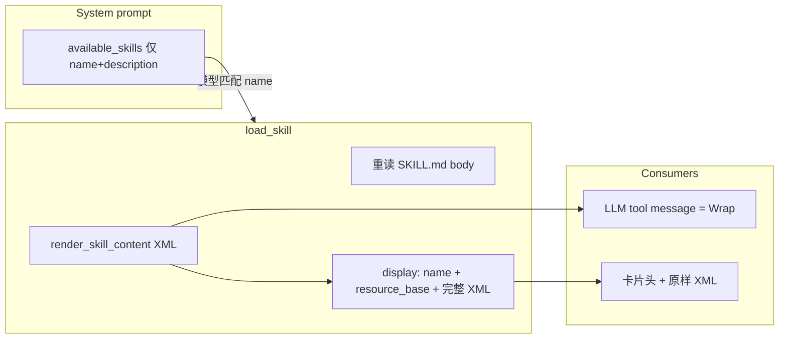

# Skill 目录注入与加载结果展示优化

对照 DeepSeek [`tool-skill`](file:///Users/apple/Desktop/code/deepseek-harness/packages/skill/tool-skill/src/index.ts) / [`skill`](file:///Users/apple/Desktop/code/deepseek-harness/packages/skill/skill/src/index.ts) 与当前实现。不搬 harness 的会话事件总线、分层 provider、`/name` 手势（需前端 command chip，另开需求）。

## 差异与原则

| 点 | DeepSeek | 当前 chat-agent | 本次 |
|---|---|---|---|
| 目录位置 | 持久 **user** `<system-reminder>`，digest 变才追加替换（保 KV 前缀） | 每请求写入 **system** 的 `<available_skills>` | **仍放 system**。本项目无 session event 目录消息；技能列表多数 turn 不变，放 system 更利于跨 turn 前缀命中（与 [prefix cache 计划](.cursor/plans/prefix_cache_optimization_3e2c3e8a.plan.md) 一致） |
| 目录内容 | `- \`name\`: 截断+转义的 description`；**不含 path** | XML `<skill>` + name/description/**location** | 改为 DeepSeek 行格式；**description 全文保留、不截断**；目录去掉 location |
| 加载结果 | `renderSkillContent`：`<skill_content>` + `<skill_resources>` + `<skill_instructions>` | 裸 `document.body` | 同一套包装；resource base 用技能目录虚拟路径 |
| 压缩 | 工具结果仅追加、不改写正文 | `skill_manager` 走 FAISS markdown 压缩（>8k tokens 会按用户问题筛块） | **跳过压缩**，与 file/shell 一样 |
| UI | `presentCall` 卡片 `Load skill {name}`；模型看 XML，transcript 不靠重解析正文 | 把 body 当 Markdown 滚满 300px | 卡片头：名称 + 资源目录；**下方原样展示发给模型的完整 XML**（含 `<skill_content>` 外壳，不剥离 instructions） |



## 1. 系统提示词：瘦目录 + 加载后再给路径

改 [`backend/app/prompts/system_prompt.py`](backend/app/prompts/system_prompt.py) 的 `<skill_system>`：

- `<available_skills>` 改为：

```
- `{{ skill.name }}`: {{ skill.description | e }}
```

- 描述：空白归一；对 `<` `&` `>` 转义（对齐 `escapeText`）。**不设长度上限、超长不省略**（不采用 harness 的 `catalogDescriptionMaxLength=500`）。
- **目录不再输出 `<location>`**。技能根路径只出现在加载结果的 `<skill_resources>`。
- 指引对齐 DeepSeek：目录只是摘要，匹配后先调 `{{ load_skill_tool_name }}`；未加载不得按描述臆造流程；引用资源按结果里的 base directory 解析相对路径，按需 `read_file`。
- 保留内置/自定义根目录说明（skill-creator / find-skills 仍需要 `/mnt/skills/custom`）。

`AgentSkillManifest` 可保留 `location` 给 registry/测试；模板只用 name + description。实现空白归一/转义放 [`backend/app/agent_skills/`](backend/app/agent_skills/) 纯函数，prompt 层调用，避免 Jinja 里手写。

## 2. `load_skill`：规范 XML 结果 + resource base

在 [`backend/app/agent_skills/`](backend/app/agent_skills/) 增加 `render_skill_content(name, content, resource_base)`，形态与 harness 一致：

```xml
<skill_content name="surprise-me">
<skill_resources>
Base directory for this skill: /mnt/skills/public/surprise-me
Resolve relative paths mentioned by this skill against the base directory before using them. Load referenced resources only as needed.
</skill_resources>

<skill_instructions>
...frontmatter 之后的 body...
</skill_instructions>
</skill_content>
```

`resource_base` 为技能**目录**虚拟路径（去掉 `/SKILL.md`），不是文件路径。

[`load_skill.py`](backend/app/mcp/mcp_servers/skill_manager_mcp/load_skill.py)：

- `content` = 上述 XML（给模型）。
- `structured_content` 扩为 `{ name, description, resource_base }`，供 executor 做展示项。
- 错误文案对齐：`Error: skill "{name}" is unknown or no longer available`；缺 name 仍报 required。
- **不改工具 LLM 名**（保持 `skill_manager_load_skill`），避免历史 backfill。

[`registry.load()`](backend/app/agent_skills/registry.py)：每次从磁盘重读 `SKILL.md`（harness `get()` 不缓存正文）。`list_manifests()` 仍可缓存摘要。`get_skill_registry` 的 `lru_cache`：在 custom skills 写入成功后 `cache_clear`（[`write_file.py`](backend/app/mcp/mcp_servers/file_mcp/write_file.py) 写到 `user_skills_dir` 时；必要时 edit_file 同样）。下一 **turn** 系统目录才能看到新 skill；本 turn 已冻结的 system 不改（append-only）。

## 3. 工具结果管道：不压缩；display 与模型看到同一份 XML

- [`SKIP_TOOL_RESULT_COMPACTION_SERVERS`](backend/app/mcp/constants.py) 加入 `SKILL_MANAGER_SERVER`。Skill 是必须整份遵循的说明书，不能按用户问题做相关性筛块。`load_skill` 的 `tool_overrides=0` 已关单条硬上限，保持。
- [`tool_executor._soft_shape_tool_result`](backend/app/agents/tool_executor.py)：`skill_manager` 成功时写入 `structured_content_for_display`（新类型 `skill_load`：`name`、`description`、`resource_base`、**`content`（与 tool message 相同的完整 XML，含 `<skill_content>` / `<skill_resources>` / `<skill_instructions>` 外壳，不剥离）**）。
- [`content_blocks.append_tool_result`](backend/app/agents/utils/content_blocks.py) 有 display 时 SSE 会省略顶层 `content`；UI 所需全文走 display 里这份 XML，与发给模型的文本一致。落库的 `ToolResultBlock.content` 仍保留同一份 XML。
- 新增 Pydantic + 前端联合类型，对齐 shell 的 `type: "shell_exec"` 判别方式。

## 4. 前端：卡片头 + 原样 XML

[`skill_manager.tsx`](frontend/src/pages/ChatPage/components/ChatMessage/AssistantMessage/ContentBlocksRender/ToolBlockRender/registry/servers/skill_manager.tsx) 在现有结果区之上加卡片头，**正文原样展示完整 XML，不抽取 inner body、不剥外壳**。

- `structuredContentForDisplay` 有 `skill_load`：标题「已加载 skill：{name}」，资源路径等宽展示；其下用现有 Markdown/等宽容器渲染 **完整 XML 字符串**（可保留 maxHeight 滚动，但不截断数据、不改写标签）。
- 无 display 的旧历史：回退顶层 `content`（兼容落库的裸 body）。
- [`contentBlock.ts`](frontend/src/interfaces/contentBlock.ts)：`SkillLoadDisplayItem` 含与模型相同的 `content: string`，并入 `ToolResultDisplayItem`。

调用行已有 `load-skill` 图标，可把 arguments 显示成 skill name（可选，小改 `renderArguments`）。

## 5. 测试

- Registry：`load()` 读到磁盘更新后的 body；manifest 仍含 location。
- `render_skill_content` 快照；description 转义且超长全文保留（不截断）。
- `get_system_prompt_for_chat_session(agent_mode=1)`：有 `- \`name\``，无 `<location>`，无 body。
- `LoadSkillTool`：成功 content 含 `<skill_instructions>` 与 base directory；未知名错误串。
- compaction skip：`skill_manager` 在 skip 集合中。
- 前端：`isSkillLoadDisplayItem` 过滤；有 display 时原样渲染完整 XML；无 display 时回退顶层 `content`。

## 明确不做

- 把目录改成每步 user `<system-reminder>` / digest 替换消息（缺 session catalog 基础设施；技能变更时宁可下一 turn system 变、前缀从 system 起 miss）。
- `/skill-name` 用户手势注入 `<skill_content>`。
- 工具改名为裸 `skill`。
- 目录 description 按 500 字截断（harness 默认；本方案保留全文）。
- 加载结果流式/体积上限（harness 同样暂缓）。
