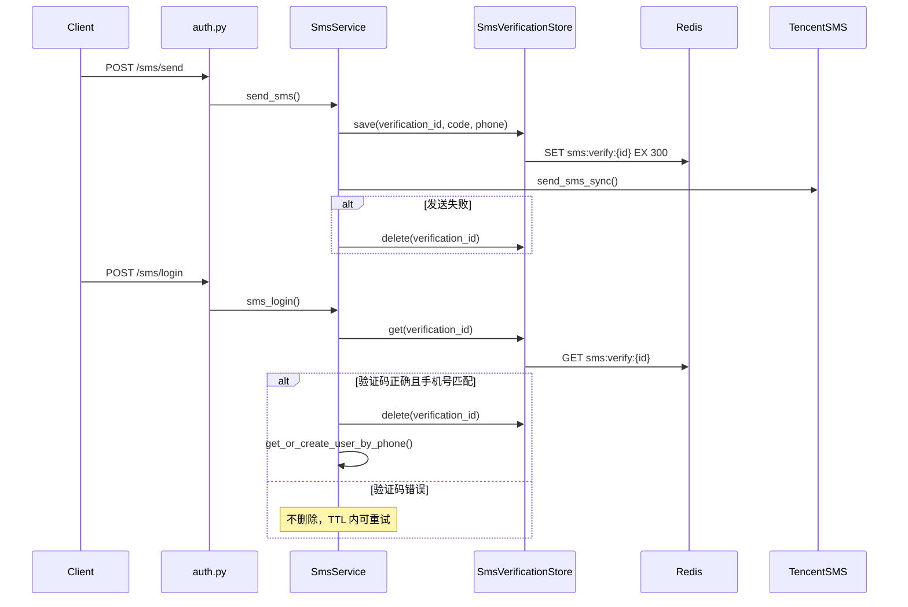

# 短信验证码 Redis 迁移方案

## 背景与目标

当前 [`backend/app/services/auth/sms_service.py`](backend/app/services/auth/sms_service.py) 使用进程内 `_verification_cache: dict[str, SmsVerificationEntry]`，多 worker 部署时「发码」与「登录」可能打到不同实例导致验证失败。

Phase 1 已完成 [`backend/app/core/redis.py`](backend/app/core/redis.py) 连接池与 lifespan 初始化；本方案只改验证码存储，**[`backend/app/api/auth.py`](backend/app/api/auth.py) 无需改动**（继续调用 `SmsService`）。



## 核心设计

### Redis Key 规范

| Key | 值 | TTL |
|-----|-----|-----|
| `sms:verify:{verification_id}` | JSON `{"code":"123456","phone":"13800138000"}` | 300s（沿用现有 `VERIFICATION_TTL`） |

- 使用 `SET key value EX 300` 替代手写 `expires_at`；过期由 Redis TTL 负责，读取不到即视为「验证码已过期或无效」。
- `verification_id` 为 UUID，前缀 `sms:verify:` 便于运维排查。

### 新建存储模块（薄封装）

新增 [`backend/app/services/auth/sms_verification_store.py`](backend/app/services/auth/sms_verification_store.py)：

```python
class SmsVerificationStore:
    KEY_PREFIX = "sms:verify:"
    TTL_SECONDS = 300

    async def save(self, verification_id: str, *, code: str, phone: str) -> None: ...
    async def get(self, verification_id: str) -> SmsVerificationEntry | None: ...
    async def delete(self, verification_id: str) -> None: ...
```

- 内部通过 [`get_redis()`](backend/app/core/redis.py) 访问 Redis。
- `save`：`SET ... EX TTL_SECONDS`，值用 `model_dump_json()`。
- `get`：`GET` + `SmsVerificationEntry.model_validate_json()`；key 不存在返回 `None`。
- `delete`：`DEL`（发送失败回滚、登录成功消费）。

**不引入 Lua / GETDEL**：登录成功路径为 `GET → 校验 → DEL`；输错码不删除（已确认保持现状）。并发双登同一验证码的极小竞态与当前内存实现一致，可接受。

### 改造 `SmsService`

[`backend/app/services/auth/sms_service.py`](backend/app/services/auth/sms_service.py) 变更点：

1. **删除** `_verification_cache` 全局 dict。
2. **`send_sms`**：
   - 生成 `verification_id` / `code` 后，先 `await store.save(...)`。
   - 腾讯云发送失败时 `await store.delete(verification_id)`（替代 dict `del`）。
   - Redis 异常：记录日志并返回 `HTTP 503`（验证码不能静默降级到内存）。
3. **`sms_login`**：
   - `entry = await store.get(vid)`；`None` → `400 验证码已过期或无效`。
   - 校验 code / phone；错误码与文案**保持不变**。
   - 全部通过后 `await store.delete(vid)`，再 `get_or_create_user_by_phone`。

Store 实例：模块级单例 ` _store = SmsVerificationStore()` 即可，与当前 `SmsService` 静态方法风格一致。

### Schema 微调

[`backend/app/schemas/auth.py`](backend/app/schemas/auth.py) 中 `SmsVerificationEntry`：

- **移除 `expires_at`**（Redis TTL 已承担过期语义）。
- 保留 `code`、`phone` 两个字段，继续作为 Redis 值序列化模型。

## 文件改动清单

| 文件 | 操作 |
|------|------|
| [`backend/app/services/auth/sms_verification_store.py`](backend/app/services/auth/sms_verification_store.py) | 新增 |
| [`backend/app/services/auth/sms_service.py`](backend/app/services/auth/sms_service.py) | 改用 Redis store |
| [`backend/app/schemas/auth.py`](backend/app/schemas/auth.py) | 精简 `SmsVerificationEntry` |
| [`backend/app/api/auth.py`](backend/app/api/auth.py) | **无改动** |
| [`backend/app/services/auth/__init__.py`](backend/app/services/auth/__init__.py) | 可选导出 `SmsVerificationStore`（非必须） |

## 测试建议

新增 [`backend/tests/services/auth/test_sms_verification_store.py`](backend/tests/services/auth/test_sms_verification_store.py)，用 `unittest.mock.AsyncMock` 模拟 Redis 客户端，覆盖：

- `save` 写入正确 key / TTL / JSON
- `get` 命中与 miss
- `delete` 调用 `DEL`
- `SmsService.sms_login` 输错码不触发 `delete`、成功登录触发 `delete`

不引入 `fakeredis` 新依赖，保持改动面小。

## 验证步骤

1. 本地启动 backend（确保 Nacos / `.env` 中 Redis 配置可达）。
2. `POST /api/auth/sms/send` → 返回 `verification_id`。
3. `redis-cli -h ... -p 6380 --user ... --pass ... GET sms:verify:{id}` 确认 key 存在且 TTL ≈ 300。
4. `POST /api/auth/sms/login` 正确验证码 → 登录成功，key 被删除。
5. 再次登录同一 `verification_id` → `400 验证码已过期或无效`。
6. 输错验证码 → `400 验证码错误`，key 仍存在可重试。
7. `GET /api/health` → `redis: ok`。

## 不在本次范围

- 手机号发送频率限制（仍依赖腾讯云 `PhoneNumberThirtySecondLimit`）。
- `auth.py` 注入 `Depends(get_redis_dep)`（服务层直接 `get_redis()` 即可）。
- SSE / 工具缓存等其他 Redis 场景（后续 Phase）。
