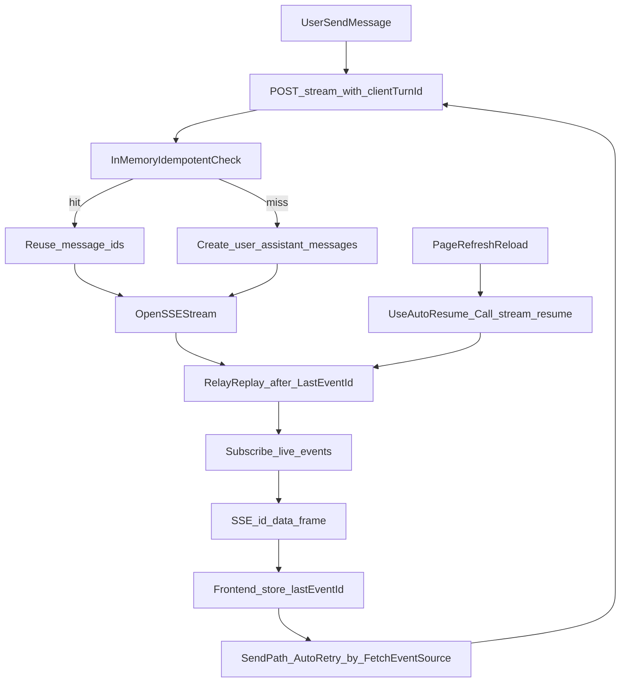

# SSE Last-Event-ID 与幂等改造计划

## 改造目标
- 保持 `POST /chat/stream` 不变，支持从请求头 `Last-Event-ID` 读取续传游标。
- 后端流事件补齐 SSE `id:` 行（以 `id` 作为唯一断点游标），并复用环形缓存回放逻辑。
- 前端优先使用 `fetch-event-source` 内置 `event.id` 与自动重连机制，完全使用 `last_event_id` 语义。
- 发送链路重试统一为 `fetch-event-source` 单层重试，移除 `hooks` 侧外层循环重试；`/stream/resume` 仅用于页面刷新恢复场景。
- `done` 事件作为唯一完成信号；连接关闭但未收到 `done` 时不触发重连，进入 closed/error 状态，交由页面刷新恢复或用户手动处理。
- 通过 `clientTurnId` 幂等键 + `assistantMessageId` 复用降低重复创建风险（短期内存级，不做持久化约束）。

## 现状锚点（用于改造定位）
- 当前 `seq` 注入在 payload JSON 中：`[backend/app/services/chat/stream_relay.py](/Users/honglei.wu/Desktop/code/chat-agent/backend/app/services/chat/stream_relay.py)`。
- 当前 `/stream` 每次都会先创建消息：`[backend/app/api/chat.py](/Users/honglei.wu/Desktop/code/chat-agent/backend/app/api/chat.py)`、`[backend/app/services/message/message_db.py](/Users/honglei.wu/Desktop/code/chat-agent/backend/app/services/message/message_db.py)`。
- 当前前端只读取 `event.data`，未利用 `event.id`：`[frontend/src/services/chat.ts](/Users/honglei.wu/Desktop/code/chat-agent/frontend/src/services/chat.ts)`。
- 当前 resume 依赖 `last_seq`（本次改造将直接重命名为 `last_event_id`）：`[frontend/src/hooks/chat.ts](/Users/honglei.wu/Desktop/code/chat-agent/frontend/src/hooks/chat.ts)`、`[backend/app/schemas/chat.py](/Users/honglei.wu/Desktop/code/chat-agent/backend/app/schemas/chat.py)`。

## 实施步骤

### 1) 统一流游标语义（后端 SSE 输出）
- 在 `[backend/app/services/chat/stream_relay.py](/Users/honglei.wu/Desktop/code/chat-agent/backend/app/services/chat/stream_relay.py)` 中把单条事件输出升级为完整 SSE 帧：至少包含 `id: <last_event_id>` + `data: ...`，并移除 payload 内 `seq` 注入逻辑。
- 将 `iter_resume` 的第二参数统一命名为 `last_event_id`，并以 `last_event_id` 作为唯一续传游标来源。
- 在 `[backend/app/utils/model.py](/Users/honglei.wu/Desktop/code/chat-agent/backend/app/utils/model.py)` 保持业务 `type/data` 结构稳定，避免引入非必要协议变更。

### 2) `/stream` 接口支持 Last-Event-ID 优先续传
- 在 `[backend/app/api/chat.py](/Users/honglei.wu/Desktop/code/chat-agent/backend/app/api/chat.py)` 的 `POST /stream` 中读取 `Last-Event-ID` 请求头并解析为 `last_event_id`（非法值回退 0）。
- 若本地 relay 存在该 `assistant_message_id`（或由幂等命中得到），直接走“回放 + 订阅”路径；否则按新会话流程启动 producer。
- `/stream/resume` 保留并复用同一解析函数，但约束为“页面刷新恢复专用入口”，不作为发送链路重试分支。

### 3) 新增幂等键，阻断重复建库
- 扩展请求 schema（建议在 `[backend/app/schemas/chat.py](/Users/honglei.wu/Desktop/code/chat-agent/backend/app/schemas/chat.py)` 与前端对应接口）增加 `client_turn_id`。
- 在消息创建前（`[backend/app/api/chat.py](/Users/honglei.wu/Desktop/code/chat-agent/backend/app/api/chat.py)` -> `create_chat_messages` 之前）先按 `conversation_id + client_turn_id` 做内存级查找，命中则复用既有未完成 assistant 记录：
  - 命中：复用既有 `user_message_id/assistant_message_id`，不重复创建。
  - 未命中：正常创建并写入 `client_turn_id` 关联。
- 在 `[backend/app/services/message/message_db.py](/Users/honglei.wu/Desktop/code/chat-agent/backend/app/services/message/message_db.py)` 增加对应查询/创建接口；本阶段不引入数据库唯一约束与迁移。

### 4) 前端改为消费 `event.id` 并透传 Last-Event-ID
- 在 `[frontend/src/services/chat.ts](/Users/honglei.wu/Desktop/code/chat-agent/frontend/src/services/chat.ts)` 中扩展 `streamWithSSE`：
  - `onmessage` 同时上抛 `event.data` 与 `event.id`；
  - 请求头可选注入 `Last-Event-ID`。
  - 将重试策略收敛到 `fetch-event-source`：`onerror` 仅对致命错误抛出，其余返回/默认重试间隔；`onclose` 不因“未收到业务 `done`”而抛错重连，改为上报 closed 状态。
  - 配置统一重试预算：最多 8 次且总时长不超过 60 秒（先到先停）。
- 在 `[frontend/src/hooks/chat.ts](/Users/honglei.wu/Desktop/code/chat-agent/frontend/src/hooks/chat.ts)`：
  - 新增 `lastEventId` ref/状态，并将原 `lastSeq` 相关命名迁移到 `lastEventId`/`last_event_id` 语义；
  - 收到事件时只更新 `lastEventId`（断点游标以 SSE `id` 为准）；
  - 删除 `sendMessage` 中手写 `for attempt` 外层 retry/`streamMessageResume` 重试分支，仅保留一次 `streamMessage` 调用并依赖库自动重连。
  - 保留 `useAutoResume` 的 `/stream/resume` 调用，仅用于页面刷新恢复。
- 在接口类型处同步扩展（`[frontend/src/interfaces/apiRequest.ts](/Users/honglei.wu/Desktop/code/chat-agent/frontend/src/interfaces/apiRequest.ts)` 等），并将 `clientTurnId` 一并随首发请求发送。

### 5) 命名收敛与清理
- 后端代码层（变量、参数、schema 字段、日志文案）将 `seq/last_seq/after_seq` 全量重命名为 `last_event_id` 语义。
- 前端代码层（ref、store、接口类型、请求字段、日志文案）将 `lastSeq/seq` 全量重命名为 `lastEventId/last_event_id` 语义。
- 完成联调后，发送链路仅保留 `Last-Event-ID` / `last_event_id` 路径；`/stream/resume` 仅保留页面恢复用途。

## 数据流（目标态）

## 验证计划
- 后端单测：
  - `Last-Event-ID` 解析与边界值；
  - `iter_resume` 回放顺序与去重（`>` 语义）；
  - 内存幂等命中时不重复创建消息。
- 前端验证：
  - 人工断网/中断后自动重连是否携带 `Last-Event-ID`；
  - `sendMessage` 链路不再出现外层重试循环，且不会与库内重试叠加；
  - `useAutoResume` 仍可在页面刷新后调用 `/stream/resume` 恢复流；
  - 未收到 `done` 即连接关闭时不会触发重连，会进入 closed/error 状态；
  - 重连后消息无重复、无缺块，UI 仍可正确落库与渲染。
- 端到端：
  - 首发、重连、跨 tab、服务短暂重启等场景回归。

## 风险与注意事项
- 多实例部署下 relay 仅内存态时，跨实例重连可能拿不到缓存；需确认是否有粘性会话或后续引入共享缓存。
- 当前幂等仅内存级，服务重启/切流量后仍可能出现重复创建；该风险已接受。
- 当前不设置重复创建率门禁，依赖人工观察；若线上重复率升高需补持久化幂等与告警。
- 代理层需确认 `Last-Event-ID` 头透传。
