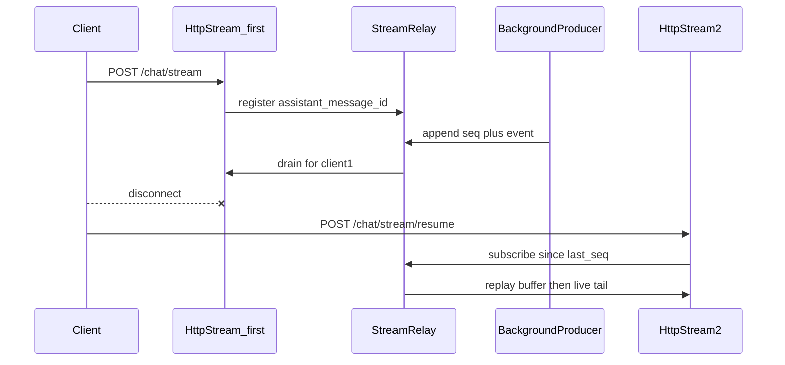

# SSE 断线重连与增量 chunk 续传

## 现状与缺口

- [`backend/app/api/chat.py`](backend/app/api/chat.py) 中 `_run_detached_sse_stream`：后台 `_run_producer` 把事件写入无界 `asyncio.Queue`，`_drain_queue` 仅服务**当前** HTTP 连接。客户端断开后消费协程被取消，生产者仍会把后续事件全部 `put` 进队列，直到流结束（见已有方案 [`.cursor/plans/sse_detached_background_task_6c746ec1.plan.md`](.cursor/plans/sse_detached_background_task_6c746ec1.plan.md)）。**这些事件没有任何第二个消费者**，重连后也不会自动重放。
- [`backend/app/services/chat/chat_orchestrator.py`](backend/app/services/chat/chat_orchestrator.py) 中 `persist_final_assistant_message` 在整轮 `stream_turn_events` **结束之后**才执行，断线中途 DB 里助手正文通常仍是空/`pending`，无法单靠「拉消息列表」实现流式增量续看（除非另做流式中间落库）。

因此「连接再次建立时 SSE chunk 增量发送」必须在**同一次生成任务**上增加**可重放的缓冲 + 游标**，而不是复用首次 `POST /chat/stream` 的入参再发一轮。

## 目标行为（契约）

1. 首次流式：`POST /chat/stream` 行为不变；服务端对每个 `assistant_message_id` 分配单调递增的 **`seq`（从 1 起）**，对**每一条**即将发出的 SSE 负载字符串（或规范化 JSON）打标。
2. 首帧 `ack` 里已有助手消息对象（含 `id`），前端从 [`frontend/src/hooks/chat.ts`](frontend/src/hooks/chat.ts) 的 `ack` 处理链路上即可拿到 `assistant_message_id`（若当前未显式保存，需在 store 里增加「当前流式 assistantMessageId + lastSeq」）。
3. 意外断线后：前端**不要**再次用同一份用户输入调 `POST /chat/stream`（会走 [`create_chat_messages`](backend/app/services/message/message_db.py) 再建一对消息）。应调用新接口，例如 **`POST /chat/stream/resume`**，body：`{ "assistant_message_id": "...", "last_seq": N }`（`last_seq` 为已成功处理的最大序号，续传从 `N+1` 开始）。
4. 服务端：若该 `assistant_message_id` 对应的后台生成仍在进行 → **先重放**缓冲中 `seq > last_seq` 的历史事件，再**订阅**后续实时事件直到 `done`/`error`/超时；若已结束 → 只重放缓冲剩余（或返回 204/空流 + 让前端走「拉全量消息」兜底）。

## 服务端设计

- **`StreamRelay`（建议新模块，例如 `backend/app/services/chat/stream_relay.py`）**
  - `register(assistant_message_id) -> None`：在 `stream_chat` 创建消息后、启动后台 producer 前注册。
  - `append(assistant_message_id, event_str: str) -> int`：分配 `seq`，把 `(seq, event_str)` 写入**有界**环形缓冲（`collections.deque(maxlen=...)` 或按字节上限截断），并唤醒所有「尾部订阅者」。
  - `iter_resume(assistant_message_id, after_seq: int) -> AsyncGenerator[str, None]`：先 `yield` 缓冲中 `seq > after_seq` 的 `event_str`（保持原样，含 `data: {...}\n\n`），再 `asyncio.Queue` 等待 live 事件直到收到内部 `Terminal`/`done` 标记。
  - `close(assistant_message_id)`：流正常结束或失败时清理注册表，避免泄漏。

- **与现有 `chat.py` 的衔接**
  - 在 `_run_producer` 内，每次 `await queue.put(event)` **之前**（或包装 `event_stream`）：`relay.append(assistant_message_id, event)`。
  - 首次连接的 `_drain_queue` 仍可从同一 relay 读，或简化为：**首次连接也走 `relay.iter_resume(assistant_message_id, 0)`**，从而与 resume 共用一条管道逻辑，避免双写不一致。
  - 后台 producer 结束时：`relay.close(assistant_message_id)`。

- **新路由 `POST /chat/stream/resume`（同文件或 `chat_resume.py`）**
  - Body：`StreamResumeRequest`（Pydantic）：`assistant_message_id: str`，`last_seq: int`（默认 0）。
  - 鉴权：沿用 `get_auth_token_info`；用 `MessageDbService` 加载该消息，校验 `role == assistant`、所属 `conversation_id` 归属当前用户（与现有会话权限校验方式对齐）。
  - 若 `assistant_message.status == done` 且 relay 已关闭：可直接返回**空流**或极短 SSE 说明「已结束」，前端转而 `getConversationMessages` 同步最终内容。
  - 返回 `StreamingResponse(relay.iter_resume(...), media_type="text/event-stream")`。

- **多副本部署**：上述注册表为**进程内存**时，仅单 worker 有效。若生产为多实例，需第二阶段改为 **Redis Streams / List + PubSub**（或 sticky session）。计划第一阶段写清单机/单 worker 假设并在代码注释或配置中说明。

## 协议与格式

- **序号载体（二选一，建议 A）**
  - **A**：扩展 [`format_sse_message`](backend/app/utils/model.py) 或仅在 relay 层维护 `seq`，对外仍输出现有 `data: {"type":...,"data":...}`；前端从**并行通道**取 seq：例如在每条 SSE 前增加一行 `id: <seq>\n`（标准 SSE），`@microsoft/fetch-event-source` 在重连时可能带上 `Last-Event-ID`；但当前是 **POST**，更稳妥是在 JSON `data` 内增加 `seq` 字段（与现有 `type`/`data` 并列），前端解析即可。
  - **B**：使用 SSE 原生 `id:` 行 + GET resume（改动较大）。

建议 **在 JSON 根上增加 `seq: number`**（仅服务端写入，前端 camelCase 后为 `seq`），与现有 [`StreamMessage`](frontend/src/interfaces) 类型对齐。

## 前端设计（[`frontend/src/services/chat.ts`](frontend/src/services/chat.ts) 与 hook）

- 在 `streamMessage` 同目录或同函数族增加 **`streamMessageResume({ assistantMessageId, lastSeq }, handlers, abortController)`**，请求 `POST .../chat/stream/resume`，请求体 snake_case。
- 在 [`frontend/src/hooks/chat.ts`](frontend/src/hooks/chat.ts) 发送流程中：
  - 维护 `ref`：`streamingAssistantMessageId`、`lastSeq`；在 `onMessage` 里若存在 `seq` 则更新。
  - `fetchEventSource` 的 `onerror`：区分**用户中止**（`abortController.signal.aborted`）与**网络异常**；仅后者在次数/退避限制内调用 `streamMessageResume`，并将 `onMessage` 接到**同一套** `messageHandlers`（注意 `ack` 重放时避免重复插入两条助手气泡：可对「已存在同 id 的占位消息」做幂等合并，或 resume 流约定**不再发送** `ack`，仅从中途 `content_block` 开始——需在服务端 relay 缓冲中决定是否包含 ack；更简单是 resume **从 `last_seq+1` 开始不包含已确认 seq 的 ack**）。
- **幂等 UI**：若 `ack` 会重放，handler 应「按 message id upsert」而非总是 append。

## 测试与验收

- 单测或集成测：模拟 producer 写入 N 条后「第一个 consumer 断开」，第二个 consumer `resume(last_seq=k)` 收到 `k+1..N` 及后续 `done`。
- 手工：浏览器 DevTools 断网/杀连接，恢复后确认无重复用户消息、助手内容连续。

## 风险与边界

- **缓冲上限**：环形缓冲需限制条数或总字节，避免长回答 + 多断线导致 OOM；超出时策略需定义（例如丢弃最旧并记录日志，resume 只能拿到最近窗口 + 结束后靠 DB 全量补）。
- **安全**：`resume` 必须校验消息所属用户，禁止通过猜测 `assistant_message_id` 偷看他人流。
