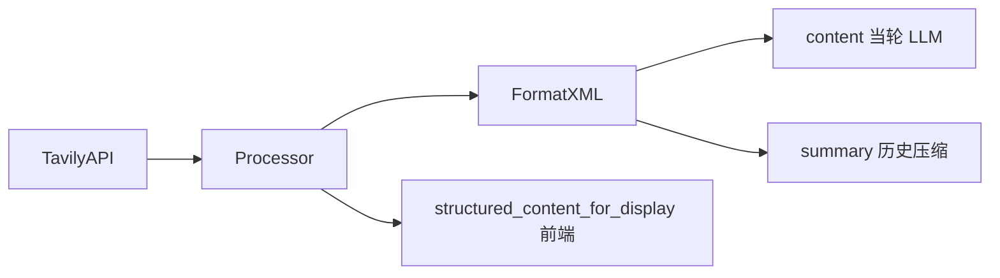

# 联网搜索结果 XML 包裹

当前 [`format_query_search_results`](backend/app/mcp/mcp_servers/tavily_mcp/utils.py) 把结果拼成中文散文（`标题:` / `URL:` / `网页内容:`）。网页正文里的标题、列表、伪指令容易和系统结构混在一起。项目里用户消息已用 XML（[`user_prompt.py`](backend/app/prompts/user_prompt.py) 的 `<user_message><query>…`），工具结果应对齐同一套边界约定。

数据流不变：格式化仍发生在 [`TavilyResultProcessor.format_result`](backend/app/agents/utils/tavily_result_processor.py) 之后。

- **`content`**：当轮 tool message，给模型看全文
- **`summary`**：历史压缩时替换全文（[`history_context_service.py`](backend/app/services/chat/history_context_service.py)）；继续只含元数据（标题/URL/分数），但同样用 XML
- **前端**：继续用 `structured_content_for_display`，不解析这段文本，UI 不受影响



## 标签结构

只改 [`utils.py`](backend/app/mcp/mcp_servers/tavily_mcp/utils.py) 的格式化函数。多查询由外层包一层，去掉 `----` 分隔。

```xml
<web_search_results>
  <search_query>
    <query>执行的搜索查询</query>
    <high_relevance_results count="2">
      <result index="1">
        <title>…</title>
        <url>…</url>
        <score>0.85</score>
        <content>…</content>
      </result>
    </high_relevance_results>
    <ignored_results count="1" threshold="0.10">
      <result index="1">
        <title>…</title>
        <url>…</url>
        <score>0.05</score>
      </result>
    </ignored_results>
  </search_query>
</web_search_results>
```

分块结果（`is_chunked`）用多个 `<snippet index="n">` 替代单个 `<content>`，对应现在的 `相关内容 i`。

`summary` 用同一棵树，但不输出 `<content>` / `<snippet>`。

提取 / 爬取走同一文件、同一 LLM 路径，一并改以免格式分裂：

- `format_extract_results` → `<web_extract_results>` / `<extract>` / `<failed_extracts>`
- `format_crawl_results` → `<web_crawl_results>` / `<page>`
- `format_map_results` 只是 URL 列表，保持现状

## 转义

网页正文常含 HTML，直接塞进标签会拆结构（甚至伪造 `</content>`）。

- 短字段（`query` / `title` / `url`）：`xml.sax.saxutils.escape`
- 长正文（`content` / `snippet` / 提取正文）：CDATA；正文中的 `]]>` 拆成 `]]]]><：

- 高相关 + 忽略结果的标签树（含 `count` / `threshold` / `index`）
- chunked 走 `<snippet>`
- 正文含 `<script>`、`</content>`、`]]>` 时结构仍闭合
- 多查询外层 `<web_search_results>` 包多个 `<search_query>`
- `summary` 无正文节点
- extract / crawl 各一条冒烟

不改 system prompt：模型按标签读结构即可，无需再解释「第 N 个搜索结果」。
