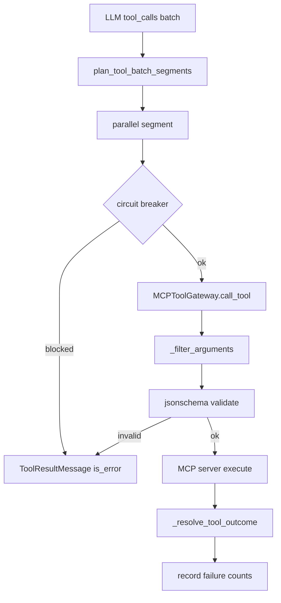

# Tool Call 校验与调度加固（P0）

## 范围

只做三项，不做 scope gate / GuardrailProvider / AI 命令分类器 / destructive checkpoint：

1. Schema 真校验（类型 + required + enum/min/max 等）
2. File 工具并行写路径冲突分段（hermes `_paths_overlap`）
3. 失败断路器：exact + same_tool(halt) + no_progress（幂等），对齐 hermes 计数/清零语义



## 1. Schema 真校验 — [`backend/app/mcp/gateway.py`](backend/app/mcp/gateway.py)

**做法：** 在现有 `_filter_arguments` 之后、真正 `client.call_tool` 之前，用 `jsonschema` 校验过滤后的 `args`。

**错误契约（对齐 claude-code）：**

- 新增 `ToolArgumentValidationError(ValueError)`（可放在 `gateway.py` 或 `app/mcp/errors.py`）
- 消息含字段路径 + 原因，例如：`工具 'file_write_file' 参数校验失败: content: expected string, got integer`
- [`ToolExecutor._format_tool_exception`](backend/app/agents/tool_executor.py) 已把异常 `str(exc)` 写进 tool result；无需改执行主路径，模型会收到可纠错错误

**校验策略（定稿）：**

- 无 schema / schema 非 object：跳过（与现有一致）
- 有 `properties` 或 `required`：对过滤后 args 跑 `Draft202012Validator`（MCP JSON Schema 常用子集均可覆盖）
- schema 本身非法（`SchemaError`）：打 warning 并跳过校验，不阻断调用（避免坏 schema 拖垮全链路）
- 保留 `_filter_arguments` 的 soft whitelist + warning；**删除独立 `_validate_required`**，required 交给 jsonschema，避免双轨
- `oneOf`/`$ref` 等：仍尝试 validate；解析失败则跳过（同 SchemaError 策略）

**`_filter_arguments` 是否多余？不多余。**

| | `_filter_arguments` | jsonschema |
|---|---|---|
| 职责 | soft strip：仅当 `additionalProperties === false` 时去掉未知 key，并生成 warning 回灌模型 | hard validate：类型 / required / enum / min / max 等；不合规则 raise |
| 未知参数 | 静默剔除，调用仍成功 | 若 schema 声明 `additionalProperties: false` 且未先 filter，会直接 ValidationError |
| 触发条件 | 仅 strict_whitelist 模式 | 有可用 schema 即跑 |

二者叠加顺序固定为 **先 filter → 再 validate**：

1. LLM 常幻觉多传字段；soft strip 让「多传无关参数」不至于整次失败重试
2. jsonschema 只校验「留下的」参数是否类型/格式正确
3. 因此 filter 之后，unknown key 不会再撞上 `additionalProperties: false`（测试用例也按此约定）

真正被 jsonschema 替代、应删除的是 **`_validate_required`**（required 存在性检查与 schema 校验重复）。

**依赖：** 在 [`backend/pyproject.toml`](backend/pyproject.toml) 显式加入 `jsonschema>=4.22`（目前仅传递依赖出现在 lock）。

**测试：** 新建 `backend/tests/mcp/test_gateway_schema_validation.py`

- 类型错误 → raise `ToolArgumentValidationError`
- 缺 required → raise
- unknown key 先被 filter，不因 additionalProperties 失败
- schema 缺失 / 非法 → 不 raise，照常 call

## 2. 并行写冲突 — [`backend/app/agents/tool_executor.py`](backend/app/agents/tool_executor.py)

**新模块：** [`backend/app/agents/tool_batch_planner.py`](backend/app/agents/tool_batch_planner.py)（纯函数，易测）

**路径作用域工具（定稿）：**

| bare name | 路径参数 | 是否纳入冲突 |
|---|---|---|
| `read_file` / `write_file` / `edit_file` | `file_path` | 是 |
| `present_files` | `filepaths[]` | 是 |
| `search_files` / `shell` / 其他 | — | 否（不占 reserved paths，可进当前并行组） |

用 [`is_llm_tool`](backend/app/mcp/tool_naming.py) + [`FILE_SERVER`](backend/app/mcp/constants.py) 识别。

**冲突算法（对齐 hermes `_paths_overlap`）：**

- `Path(p).parts` 前缀比较：任一路径是另一路径的祖先或相等 → overlap
- 遍历 tool_calls：若与当前组 `reserved_paths` overlap → 关闭当前组、开新组；否则加入当前组并登记路径
- 无路径的工具直接加入当前组

**执行改造 `execute_tool_calls_parallel`：**

```text
segments = plan_tool_batch_segments(active_calls)
results_by_id = {}
for segment in segments:
    gather(execute_single_tool for tc in segment)  # 段内并行，段间串行
return [results_by_id[tc.id] for tc in active_calls]  # 保持原顺序
```

整体 `OVERALL_TIMEOUT_SECONDS` 仍包住整批；段间串行会自然拉长 wall time，阈值保持 90s 不变。

**测试：** `backend/tests/agents/test_tool_batch_planner.py`

- 同文件两次 write → 两段
- 不同文件 write + read → 一段
- `/a/b` 与 `/a/b/c` → overlap
- 夹杂 shell → shell 跟当前组，不单独打断

## 3. 失败断路器 — 对齐 hermes `ToolCallGuardrail`

对照 hermes 六项机制的取舍（定稿）：

| hermes 机制 | 本项目 | 说明 |
|---|---|---|
| 1. exact_failure warn/block | **采纳** | SHA256 签名 + warn@2 / block@5 |
| 2. same_tool_failure halt@8 | **采纳** | 连续失败清零语义；halt 映射到强制 final round |
| 3. no_progress_block@5 | **采纳** | 仅幂等工具；结果哈希相同则计次 |
| 4. idempotent vs mutating | **采纳** | 决定 no_progress 是否生效 |
| 5. destructive command checkpoint | **不做** | 已有 `command_audit` + sandbox；无 checkpoint 基础设施 |
| 6. `_paths_overlap` 分段 | **采纳** | 见第 2 节（已规划） |

### 3.1 签名与计数（对齐 hermes `after_call`）

**新模块：** [`backend/app/agents/tool_call_guardrail.py`](backend/app/agents/tool_call_guardrail.py)

- **签名：** `sha256(f"{tool_name}:{canonical_json}")`，其中 `canonical_json = json.dumps(args, sort_keys=True, ensure_ascii=False, default=str)`
- **计数器：** `_exact_failure_counts[signature]`、`_same_tool_failure_counts[tool_name]`、`_no_progress[signature] = (result_hash, count)`
- **失败时：** exact +1、same_tool +1
- **成功时：** `pop(signature)` 且 `pop(tool_name)`（**两个都清零**，不是累计到请求结束）
- 状态挂在 `ToolExecutor`，`reset_for_request` 全清

> 修正原 plan：「同工具累计失败」改为 hermes 的**连续失败**——该工具任意一次成功即清零 same_tool 计数。

### 3.2 exact_failure（同参）

| 阈值 | 行为 |
|---|---|
| `exact_failure_warn_after=2` | 仍执行工具；在 tool result **末尾追加**中文警告，提示换策略 |
| `exact_failure_block_after=5` | **不执行** MCP；返回合成 `is_error` 结果 |

block 文案需可操作（中文）：说明同参已失败 N 次，请改参数或换工具，不要原样重试。

### 3.3 same_tool_failure → halt（同工具）

| 阈值 | 行为 |
|---|---|
| warn（可选，同 hermes 约 3 次） | 结果末尾追加警告 |
| `same_tool_failure_halt_after=8` | **halt 整个 turn**，不是只 block 该工具 |

**halt vs block（必须区分）：**

- **block：** 只跳过当前这次调用；本批其他工具、后续 iteration 仍可继续
- **halt：** 本批未执行的后续 segment 全部合成「已熔断」错误；设 `guardrail.halted = True`；[`chat_session_agent`](backend/app/agents/chat_session_agent.py) 在 tool 执行后若 `halted`，走已有 `_stream_final_round_events`（与 max iterations / context budget 同一出口），强制无工具最终回答

halt 文案按工具类型给自救提示（对齐 hermes recovery hint）：

- `shell_*`：建议先 `pwd && ls`、改用绝对路径 / 更简单命令，或改用 `file_read_file` / `file_write_file`
- `file_*`：检查路径是否在 `/mnt/user-data/...` 下、文件是否存在
- 其他：换参数或换工具，停止重复失败调用

### 3.4 no_progress（幂等无进展）

- 仅当工具判定为 **idempotent** 时生效
- 成功执行后对 `content`（或规范化后的 result 文本）做 SHA256；与同 signature 上次结果哈希相同则 `repeat_count + 1`，不同则重置为 1
- `no_progress_warn_after=3`：追加警告；`no_progress_block_after=5`：下次同参同结果前直接 block（或第 5 次成功返回后标记，第 6 次同参直接 block——实现取「连续相同结果达到 5 次后阻断下一次」）

### 3.5 idempotent / mutating 分类（chat-agent 映射）

按 **LLM 工具名**（带 server 前缀）或 bare name 归类：

**idempotent（只读）：**

- `file_read_file`、`file_search_files`
- `tavily_web_search`、`tavily_web_pages_extract`、`tavily_web_site_crawl`
- 只读类 weather / time / context7（若暴露）

**mutating（写入 / 有副作用）：**

- `file_write_file`、`file_edit_file`、`file_present_files`
- `shell_shell`（或实际 LLM 名）
- `code_*` 执行类
- skill_manager 写操作

规则：`mutating` 优先（在 mutating 集合则永不做 no_progress）；其余仅当在 idempotent 集合才做 no_progress。未分类工具：只走 exact / same_tool，不做 no_progress。

### 3.6 挂载点

1. `execute_single_tool` 开头：`should_block` / `should_halt` 检查
2. `execute_tool_calls_parallel` 段循环：若已 `halted`，剩余 segment 全部合成 halt 结果，不再 `gather`
3. 调用返回后：`record_outcome(success, content)` → 更新 failure / no_progress；必要时追加 warn 后缀
4. `chat_session_agent` 工具批结束后：`if tool_session.executor.guardrail.halted: _stream_final_round_events(...)`

**测试：** `backend/tests/agents/test_tool_guardrails.py`

- 同参失败：第 2 次结果含 warn；第 5 次起不调 MCP
- 同参成功后 exact 计数清零
- 同工具连续失败 8 次 → halted；该工具一次成功则 same_tool 计数清零
- 幂等工具相同结果 5 次后 block；mutating 工具相同结果不触发 no_progress
- halt 后并行批剩余调用不再执行

## 文件变更清单

| 文件 | 变更 |
|---|---|
| `backend/pyproject.toml` | 显式 `jsonschema` |
| `backend/app/mcp/gateway.py`（或 + `errors.py`） | jsonschema 校验；去掉 `_validate_required` |
| `backend/app/agents/tool_batch_planner.py` | **新建** 分段规划 |
| `backend/app/agents/tool_call_guardrail.py` | **新建** exact / same_tool / no_progress |
| `backend/app/agents/tool_executor.py` | 分段执行 + 接入 guardrail |
| `backend/app/agents/chat_session_agent.py` | halt → `_stream_final_round_events` |
| `backend/app/agents/mcp_tool_execution.py` | 透传 / reset guardrail（若需要） |
| `backend/app/mcp/constants.py` | file/tavily bare names + idempotent/mutating 集合 |
| `backend/tests/mcp/test_gateway_schema_validation.py` | **新建** |
| `backend/tests/agents/test_tool_batch_planner.py` | **新建** |
| `backend/tests/agents/test_tool_guardrails.py` | **新建** |
| 现有 scoring / gateway 测试 | 按需微调 mock |

## 验收

```bash
cd backend && uv run pytest \
  tests/mcp/test_gateway_schema_validation.py \
  tests/mcp/test_gateway_tool_names.py \
  tests/agents/test_tool_batch_planner.py \
  tests/agents/test_tool_guardrails.py \
  tests/agents/test_tool_executor_scoring.py \
  tests/agents/test_tool_outcome_resolve.py -q
```
