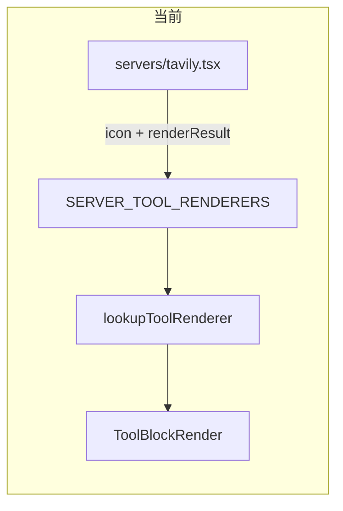
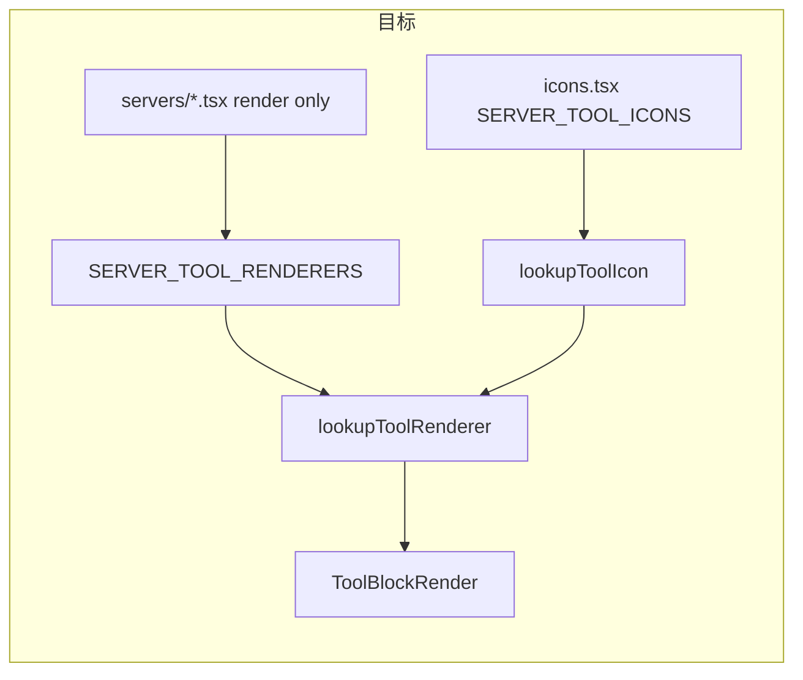

# Tool Icon 分层注册重构

## 现状

- [`icons.tsx`](frontend/src/pages/ChatPage/components/ChatMessage/AssistantMessage/ContentBlocksRender/ToolBlockRender/registry/icons.tsx) 仅负责 SVG 导入、`renderIcon`、`DEFAULT_ICON`
- 各 [`servers/*.tsx`](frontend/src/pages/ChatPage/components/ChatMessage/AssistantMessage/ContentBlocksRender/ToolBlockRender/registry/servers/) 在 `ToolRenderer` 上重复声明 `icon: renderIcon(...)`
- [`lookupToolRenderer.ts`](frontend/src/pages/ChatPage/components/ChatMessage/AssistantMessage/ContentBlocksRender/ToolBlockRender/registry/lookupToolRenderer.ts) 只做 renderer 合并，不解析 icon



## 目标结构

[`icons.tsx`](frontend/src/pages/ChatPage/components/ChatMessage/AssistantMessage/ContentBlocksRender/ToolBlockRender/registry/icons.tsx) 新增：

```typescript
export const SERVER_TOOL_ICONS: Record<string, Record<string, React.ReactNode>> = {
  tavily: {
    web_search: renderIcon(WebSearchIcon),
    web_pages_extract: renderIcon(WebExtractIcon),
    // ...
  },
  file: { read_file: ..., write_file: ..., ... },
  zread: { get_repo_structure: ..., read_file: ..., doc_search: ... },
  // 其余 server 同理
};

export function lookupToolIcon(
  serverName: string | undefined,
  mcpToolName: string
): React.ReactNode | undefined;
```

**完整映射清单**（从现有 server 文件迁移，无行为变化）：

| server | tools |
|--------|-------|
| `tavily` | `web_search`, `web_pages_extract`, `web_site_crawl`, `web_site_map`, `research` |
| `file` | `read_file`, `write_file`, `edit_file`, `search_files`, `present_files` |
| `code` | `execute_code`, `list_runtimes` |
| `shell` | `shell` |
| `skill_manager` | `load_skill` |
| `context7` | `resolve-library-id`, `query-docs` |
| `weather` | 5 个 weather 工具（共用 WeatherIcon） |
| `time` | `get_current_time` |
| `zread` | `get_repo_structure`, `read_file`, `doc_search` |

## 解析链路调整

[`lookupToolRenderer.ts`](frontend/src/pages/ChatPage/components/ChatMessage/AssistantMessage/ContentBlocksRender/ToolBlockRender/registry/lookupToolRenderer.ts)：

```typescript
const merged = mergeToolRenderer(servers[serverName]?.[mcpToolName], fallback);
return {
  ...merged,
  icon: lookupToolIcon(serverName, mcpToolName) ?? fallback.icon,
};
```

[`mergeToolRenderer.ts`](frontend/src/pages/ChatPage/components/ChatMessage/AssistantMessage/ContentBlocksRender/ToolBlockRender/registry/mergeToolRenderer.ts)：移除 `icon` 字段合并（icon 不再来自 server renderer），避免双源冲突。

[`types.ts`](frontend/src/pages/ChatPage/components/ChatMessage/AssistantMessage/ContentBlocksRender/ToolBlockRender/registry/types.ts)：`ToolRenderer.icon` 保留为**解析结果**字段（运行时由 lookup 填充），server 注册侧不再填写。



## 清理 server 文件

从以下 9 个文件中删除 `icon` 字段及仅用于 icon 的 import：

- [`tavily.tsx`](frontend/src/pages/ChatPage/components/ChatMessage/AssistantMessage/ContentBlocksRender/ToolBlockRender/registry/servers/tavily.tsx)
- [`file.tsx`](frontend/src/pages/ChatPage/components/ChatMessage/AssistantMessage/ContentBlocksRender/ToolBlockRender/registry/servers/file.tsx)
- [`code.tsx`](frontend/src/pages/ChatPage/components/ChatMessage/AssistantMessage/ContentBlocksRender/ToolBlockRender/registry/servers/code.tsx)
- [`shell.tsx`](frontend/src/pages/ChatPage/components/ChatMessage/AssistantMessage/ContentBlocksRender/ToolBlockRender/registry/servers/shell.tsx)
- [`skill_manager.tsx`](frontend/src/pages/ChatPage/components/ChatMessage/AssistantMessage/ContentBlocksRender/ToolBlockRender/registry/servers/skill_manager.tsx)
- [`context7.tsx`](frontend/src/pages/ChatPage/components/ChatMessage/AssistantMessage/ContentBlocksRender/ToolBlockRender/registry/servers/context7.tsx)
- [`weather.tsx`](frontend/src/pages/ChatPage/components/ChatMessage/AssistantMessage/ContentBlocksRender/ToolBlockRender/registry/servers/weather.tsx)
- [`time.tsx`](frontend/src/pages/ChatPage/components/ChatMessage/AssistantMessage/ContentBlocksRender/ToolBlockRender/registry/servers/time.tsx)
- [`zread.tsx`](frontend/src/pages/ChatPage/components/ChatMessage/AssistantMessage/ContentBlocksRender/ToolBlockRender/registry/servers/zread.tsx)

[`registryData.ts`](frontend/src/pages/ChatPage/components/ChatMessage/AssistantMessage/ContentBlocksRender/ToolBlockRender/registry/registryData.ts) 中 `DEFAULT_TOOL_RENDERER_ENTRY.icon = DEFAULT_ICON` 保持不变，作为未知 server/tool 的回退。

## 文档与测试

- 更新 [`registry/index.ts`](frontend/src/pages/ChatPage/components/ChatMessage/AssistantMessage/ContentBlocksRender/ToolBlockRender/registry/index.ts) 注释：新增工具时
  1. 在 `icons.tsx` 的 `SERVER_TOOL_ICONS[server][tool]` 注册 icon
  2. 在 `servers/<server>.tsx` 注册 render 逻辑
- 新增 [`lookupToolRenderer.test.ts`](frontend/src/pages/ChatPage/components/ChatMessage/AssistantMessage/ContentBlocksRender/ToolBlockRender/registry/lookupToolRenderer.test.ts)（纯函数，不 import SVG）：
  - mock `SERVER_TOOL_ICONS` + mock servers，验证 `lookupToolIcon` 命中 / 未命中回退 `DEFAULT_ICON`
  - 验证 renderer 行为合并不受 icon 抽离影响

## 不在本次范围

- 不拆分 `icons.tsx` 为多文件（单文件集中维护，符合当前 registry 规模）
- 不引入 server 级 `_default` icon（weather/zread 等同 icon 工具继续 per-tool 条目，与请求结构一致）
- 不改动 SVG 资源本身
