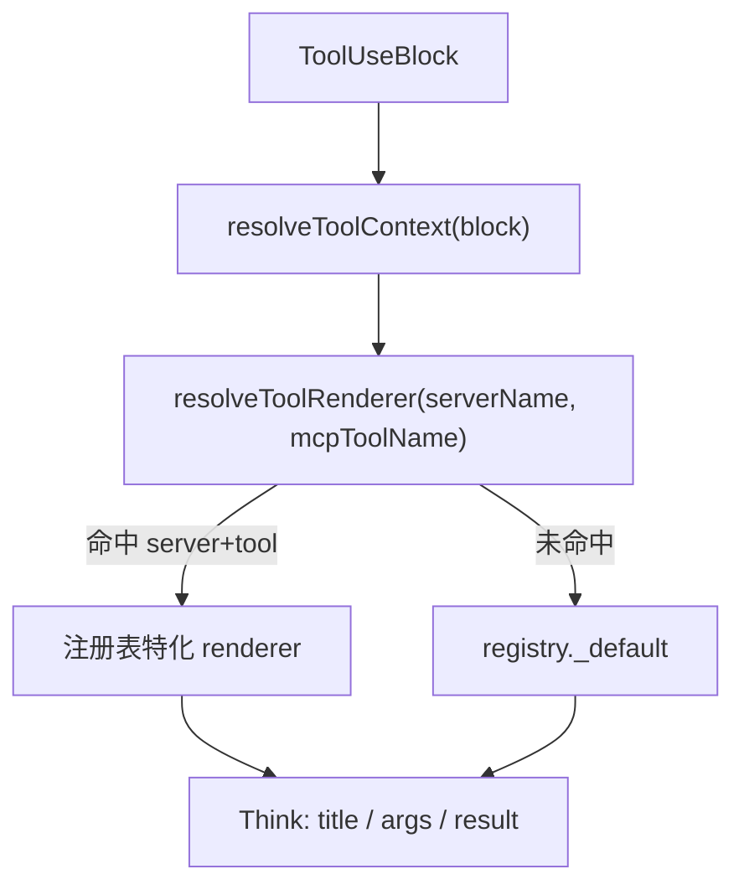

# ToolBlockRender 工具渲染注册表重构

## 现状与目标

**现状**：UI 已是「每个工具调用一块」，但特化逻辑分散在三处：

| 文件 | 职责 |
|------|------|
| [`toolIcons.tsx`](frontend/src/pages/ChatPage/components/ChatMessage/AssistantMessage/ContentBlocksRender/ToolBlockRender/toolIcons.tsx) | 按 bare tool name 映射图标 |
| [`ToolArguments/hooks.tsx`](frontend/src/pages/ChatPage/components/ChatMessage/AssistantMessage/ContentBlocksRender/ToolBlockRender/ToolArguments/hooks.tsx) | `execute_code` 参数 → 代码高亮 |
| [`ToolResult/index.tsx`](frontend/src/pages/ChatPage/components/ChatMessage/AssistantMessage/ContentBlocksRender/ToolBlockRender/ToolResult/index.tsx) | `web_search` / markdown 工具 / 默认 JSON |

**目标**：



**不在本次范围**：

- 后端 `structuredContentForDisplay` 扩展（仅迁移现有 `web_search` 用法）
- Shell 结构化结果与终端 UI：**见独立计划** [shell_structured_display_schema.plan.md](./shell_structured_display_schema.plan.md)（MCP schema、agent 挂载、前端 `ShellToolResult` 均不在 registry 重构内）

---

## 1. 新增 registry 模块

在 [`ToolBlockRender/registry/`](frontend/src/pages/ChatPage/components/ChatMessage/AssistantMessage/ContentBlocksRender/ToolBlockRender/registry/) 下新增：

### 1.1 类型定义 — `types.ts`

```ts
export type ToolRenderContext = {
  serverName: string;        // 持久化消息必有；流式首帧可能暂缺，见 §2 ToolBlockTitle
  mcpToolName: string;       // displayMcpToolName(block)
  toolUseBlock: ToolUseBlock;
  toolResultBlock?: ToolResultBlock;
  status: ContentBlockRenderStatus;
};

export type ToolRenderer = {
  icon?: React.ReactNode;                              // 或 Icon 组件工厂
  renderArguments?: (ctx: ToolRenderContext) => React.ReactNode | null;
  renderResult?: (ctx: ToolRenderContext) => React.ReactNode | null;
  getResultLanguage?: (ctx: ToolRenderContext) => string; // 默认 result 用
};

// serverName -> mcpToolName -> ToolRenderer
export type ToolRendererRegistry = Record<string, Record<string, ToolRenderer>>;
```

- `renderArguments` / `renderResult` 返回 `null` 表示「使用默认 renderer」（便于只覆盖 result 或只覆盖 icon）。
- 保留现有 props 行为：`ToolResult` 在 `!toolResultBlock` 时仍返回 null（由 [`ToolResult/index.tsx`](frontend/src/pages/ChatPage/components/ChatMessage/AssistantMessage/ContentBlocksRender/ToolBlockRender/ToolResult/index.tsx) 外层 guard，不放入 registry）。

### 1.2 解析与查找 — `resolveToolRenderer.ts`

```ts
export function resolveToolContext(block: ToolUseBlock): Pick<ToolRenderContext, "serverName" | "mcpToolName">;

export function resolveToolRenderer(
  serverName: string,
  mcpToolName: string
): ToolRenderer; // 合并后的 effective renderer（含 default 填充）
```

**查找优先级**（两层，无 tool-only 回退）：

1. `registry[serverName]?.[mcpToolName]` — 精确匹配（如 `tavily` + `web_search`）
2. `registry._default` — 全局默认（markdown args + JSON result + 通用 ToolOutlined 图标）

历史消息已通过 [`backend/scripts/backfill_tool_use_block_names.py`](backend/scripts/backfill_tool_use_block_names.py) 补全 `server_name` / `mcp_tool_name`，前端可假定持久化 `ToolUseBlock` 始终带 `serverName`，无需 `_fallback` 映射层。

### 1.3 默认 renderer — `defaults.ts`

从现有组件抽取，不重复实现：

- **Arguments 默认**：复用 [`ToolArguments`](frontend/src/pages/ChatPage/components/ChatMessage/AssistantMessage/ContentBlocksRender/ToolBlockRender/ToolArguments/index.tsx) 当前逻辑（`useToolArgumentsDisplay` → markdown / plain ellipsis），去掉内部的 `execute_code` 分支。
- **Result 默认**：复用现有 `CodeHighlighter` + `stringifyJsonLike` + `getResultLanguage`（[`utils.ts`](frontend/src/pages/ChatPage/components/ChatMessage/AssistantMessage/ContentBlocksRender/ToolBlockRender/utils.ts)）；文件类工具的语言推断移入 `file` server 注册项（见 §1.4）。

### 1.4 按 server 拆分注册 — `servers/*.ts`

与后端 [`backend/app/mcp/constants.py`](backend/app/mcp/constants.py) 及现有 `toolIcons.tsx` 对齐，初始迁移映射：

| server | tools | 特化内容 |
|--------|-------|----------|
| `tavily` | `web_search` | icon + `WebSearchResult`（`structuredContentForDisplay`） |
| `tavily` | `web_pages_extract`, `web_site_crawl`, `web_site_map`, `research` | icon + markdown result |
| `file` | `read_file`, `write_file`, `edit_file`, `search_files`, `present_files` | icon；`read_file` markdown result；读/写/改文件时从 `argumentsJson.file_path`（或 `path`）后缀推断 result / args 高亮语言（复用 `FILE_EXTENSION_LANGUAGE_MAP` / `getLanguageFromPath`） |
| `code` | `execute_code`, `list_runtimes` | icon + execute_code 参数代码高亮 |
| `skill_manager` | `load_skill` | icon + markdown result |
| `shell` | `shell` | icon；result/args 终端风格展示待 [shell 结构化 display 计划](./shell_structured_display_schema.plan.md) 落地后再注册 |
| `weather` | `search_city`, `get_current_weather`, ... | icon |
| `context7` | `resolve-library-id`, `query-docs` | icon + markdown result |
| `time` | `get_current_time` | icon |

[`registry/index.ts`](frontend/src/pages/ChatPage/components/ChatMessage/AssistantMessage/ContentBlocksRender/ToolBlockRender/registry/index.ts) 聚合 export `TOOL_RENDERER_REGISTRY`。

**共享 renderer 组件**（避免重复）：在 `registry/components/` 提取 `MarkdownToolResult`、`ExecuteCodeArguments`、`FilePathLanguage`（从 tool args 解析 `file_path` / `path` 并按后缀返回 highlight language）等小模块，供多个 server 条目引用。

---

## 2. 改造现有组件（薄壳化）

### [`ToolBlockRender/index.tsx`](frontend/src/pages/ChatPage/components/ChatMessage/AssistantMessage/ContentBlocksRender/ToolBlockRender/index.tsx)

- 调用 `resolveToolContext(toolUseBlock)` 得到 `{ serverName, mcpToolName }`
- `resolveToolRenderer(serverName, mcpToolName)` 取 `icon`
- 向 `ToolBlockTitle` 传入 `serverName` + `mcpToolName`
- `ToolArguments` / `ToolResult` 传入完整 `ToolRenderContext` 或 `renderer` 引用

### [`ToolBlockTitle/index.tsx`](frontend/src/pages/ChatPage/components/ChatMessage/AssistantMessage/ContentBlocksRender/ToolBlockRender/ToolBlockTitle/index.tsx)

用户选定格式：**来源在前**

- 常态（持久化消息 + 流式收到 `serverName` 后）：`{formatServerName(serverName)} · {formatToolName(mcpToolName)} · {状态}`
- 流式首帧暂缺 `serverName`（`tool_delta` 尚未到达）：临时显示 `{formatToolName(mcpToolName)} · {状态}`，收到 `serverName` 后切换为完整格式

新增 [`ToolBlockTitle/formatServerName.ts`](frontend/src/pages/ChatPage/components/ChatMessage/AssistantMessage/ContentBlocksRender/ToolBlockRender/ToolBlockTitle/formatServerName.ts)：`tavily` → `Tavily`，`code` → `Code`，`skill_manager` → `Skill Manager`（与 `formatToolName` 同样用 lodash `words` + `capitalize`）。

### [`ToolArguments/index.tsx`](frontend/src/pages/ChatPage/components/ChatMessage/AssistantMessage/ContentBlocksRender/ToolBlockRender/ToolArguments/index.tsx)

- 接收 `renderer?: ToolRenderer` 或 `ctx: ToolRenderContext`
- 若 `renderer.renderArguments?.(ctx)` 有返回值则用之，否则走默认 markdown/plain 逻辑
- 删除 `useExecuteCodeToolArguments` 中对 toolName 的硬编码（逻辑迁入 `servers/code.ts`）

### [`ToolResult/index.tsx`](frontend/src/pages/ChatPage/components/ChatMessage/AssistantMessage/ContentBlocksRender/ToolBlockRender/ToolResult/index.tsx)

- 保留 error 分支与 `!toolResultBlock` early return
- 删除 tool name 硬编码列表；改为 `renderer.renderResult?.(ctx) ?? defaultRenderResult(ctx)`
- `WebSearchResult.tsx` 保留位置，由 `servers/tavily.ts` import

### 删除 [`toolIcons.tsx`](frontend/src/pages/ChatPage/components/ChatMessage/AssistantMessage/ContentBlocksRender/ToolBlockRender/toolIcons.tsx)

图标定义迁入各 `servers/*.ts`；未注册工具使用 `_default.icon`（`ToolOutlined`）。

---

## 3. 工具命名辅助增强

扩展 [`frontend/src/utils/toolNaming.ts`](frontend/src/utils/toolNaming.ts)（或 registry 内 re-export）：

```ts
export function resolveToolContext(block: ToolUseBlock) {
  return {
    serverName: block.serverName, // 持久化消息必有；流式首帧可能 undefined
    mcpToolName: displayMcpToolName(block),
  };
}

// lookup 时：serverName 缺失则直接返回 _default，不做 tool-only 回退
```

[`viewModel.ts`](frontend/src/pages/ChatPage/components/ChatMessage/AssistantMessage/ContentBlocksRender/viewModel.ts) 中 `PROJECT_PREVIEW_TOOLS` 逻辑不变，仍用 `displayMcpToolName`。

---

## 4. 测试

新增 [`frontend/src/pages/ChatPage/components/ChatMessage/AssistantMessage/ContentBlocksRender/ToolBlockRender/registry/resolveToolRenderer.test.ts`](frontend/src/pages/ChatPage/components/ChatMessage/AssistantMessage/ContentBlocksRender/ToolBlockRender/registry/resolveToolRenderer.test.ts)（Vitest）：

- `tavily` + `web_search` → 命中 tavily 注册项（有 `renderResult`）
- `tavily` + 未注册 tool → 返回 `_default`
- 未知 server + 任意 tool → 返回 `_default`（不尝试 tool-only 查找）
- `formatServerName` / title 拼接 snapshot 或字符串断言

运行：`cd frontend && vp test`（或项目现有 test 命令）。

---

## 5. 迁移后新增工具的流程（文档注释）

在 `registry/index.ts` 顶部注释说明：

1. 在 `servers/<server>.ts` 添加 `{ mcpToolName: { icon, renderArguments?, renderResult? } }`
2. 若仅 result 特化，只实现 `renderResult`，args 自动 fallback
3. 新 MCP server 需同步后端 config key（如 `tavily`、`code`）

---

## 风险与兼容

- **历史消息**：依赖 backfill 脚本保证 `serverName` 存在；部署 registry 前需确认 backfill 已执行并通过 `--verify-only`
- **流式首帧**：新消息在首个 `tool_delta` 前可能暂无 `serverName`，lookup 暂走 `_default`；`serverName` 到达后 re-render 命中正确注册项
- **行为等价**：本次为 refactor，不改变折叠/状态/blink 逻辑（[`hooks.tsx`](frontend/src/pages/ChatPage/components/ChatMessage/AssistantMessage/ContentBlocksRender/ToolBlockRender/hooks.tsx) 不动）
- **CONTEXT7 工具名含连字符**：registry key 使用 bare name（`resolve-library-id`），与 `displayMcpToolName` 一致
