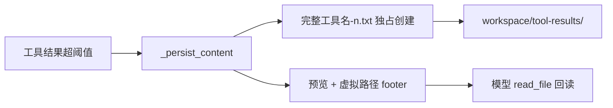

# 工具结果落盘路径与文件名

## 目标路径

```text
物理：.../workspace/tool-results/tavily_web_search-1.txt
虚拟：/mnt/user-data/workspace/tool-results/tavily_web_search-1.txt
```

不再使用 `.tool-results/call_1632e7a879954cb9a3a185f0.txt`。

## 文件名规则

在 [`backend/app/utils/tool_result_hard_limit.py`](backend/app/utils/tool_result_hard_limit.py) 的 `_persist_content` 中改命名，并传入已有的 `tool_name`（`apply_hard_limit` 已经有这个参数；这是 LLM 可见的完整名，如 `tavily_web_search`、`shell_exec`）。

- stem：用完整 `tool_name`，**不要** `extract_bare_tool_name`。只做文件系统清洗：保留 `[a-zA-Z0-9_-]`，转小写；空则用 `tool`。
- 序号：扫描同目录已有 `{stem}-数字.txt`，取最大序号 + 1；从 1 起。序号按完整工具名分别计数（`tavily_web_search-1` 与 `tavily_web_pages_extract-1` 互不影响）。
- 并行安全：同轮多个工具会并发落盘。用 `os.open(..., O_CREAT | O_EXCL)` 独占创建，`FileExistsError` 则序号 +1 重试（上限例如 1000），避免同名文件互相覆盖。
- 不再把 `tool_call_id` 写进文件名。日志里仍保留 `tool_call_id` / `virtual_path`。

示例：`tavily_web_search-1.txt`、`tavily_web_search-2.txt`、`shell_exec-1.txt`。

不迁移旧文件。历史 tool 消息里已写入的 `/mnt/user-data/workspace/.tool-results/call_....txt` 仍然指向旧文件，VFS 照常可读。新落盘只写新目录。



## 配置默认值

三处默认都要从 `.tool-results` 改成 `tool-results`，否则 Nacos 会盖掉代码默认值：

- [`backend/app/schemas/config.py`](backend/app/schemas/config.py) `ToolResultHardLimitConfig.persist_subdir`
- [`backend/app/utils/tool_result_hard_limit.py`](backend/app/utils/tool_result_hard_limit.py) 里 `config.persist_subdir or "..."` 的兜底
- [`backend/nacos-data/config/ai-chat-dev@@DEFAULT_GROUP@@`](backend/nacos-data/config/ai-chat-dev@@DEFAULT_GROUP@@) 与 [`ai-chat-prod@@DEFAULT_GROUP@@`](backend/nacos-data/config/ai-chat-prod@@DEFAULT_GROUP@@) 的 `chat_context.tool_result_hard_limit.persist_subdir`

## 测试与文档

更新 [`backend/tests/utils/test_tool_result_hard_limit.py`](backend/tests/utils/test_tool_result_hard_limit.py)：

- 现有断言从 `.tool-results/tc_shell.txt` 改为 `tool-results/shell_exec-1.txt`
- 新增：同完整工具名递增（两次 `tavily_web_search` → `-1` / `-2`）；非法字符 stem 被清洗；`O_EXCL` 冲突时跳到下一个序号

文档只改运行时约定，不改历史对比稿：

- [`backend/docs/TOOL_RESULT_AND_CONTEXT.md`](backend/docs/TOOL_RESULT_AND_CONTEXT.md)
- [`backend/docs/VFS_AND_SANDBOX.md`](backend/docs/VFS_AND_SANDBOX.md)

## 不改的部分

- `read_file` 不做模糊匹配或拼写纠错
- `search_files` 不必加 `--hidden`（新目录不再是点开头）
- 不搬迁已有 `.tool-results/` 文件
