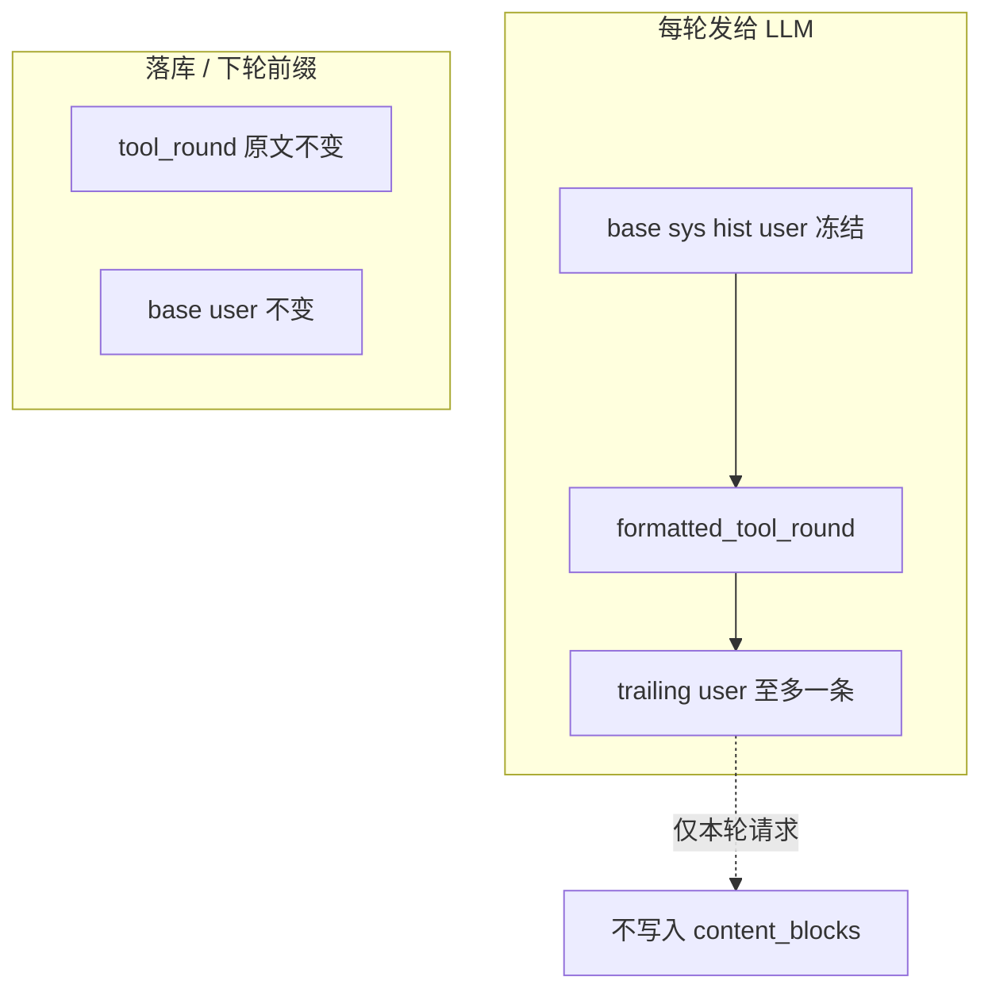

# 尾部 user hint（source 标记）+ 前缀缓存

对照 [DeepSeek Harness `createUserMessage`](https://github.com/deepseek-ai/deepseek-harness/blob/master/packages/llm/llm/src/message.ts)：内部消息一律 `role: user`，用 `source` 区分真人 prompt 与注入上下文；发给 provider 时只投影 `role/content`，`source` 不进模型。DeerFlow 的 Progress/Loop WARN 也是下一轮 `wrap_model_call` 尾部 `HumanMessage`，BLOCK 才是 `ToolMessage`。

**实施顺序：先做本计划，不要先完整执行计划 1。** 本增量叠在 [prefix_cache_optimization_3e2c3e8a.plan.md](prefix_cache_optimization_3e2c3e8a.plan.md) 上，并**替代**其 hints 落地方式（带 `source`、WARN 也走尾部 user）。计划 1 的 datetime 冻结与 cache usage 一并在本计划完成；计划 1 余下的 `llm_user_text` 快照 / 历史 `reasoning_content` 仍延后。

hints 不再改写最后一条 user；熔断 WARN 不再拼进 `tool.content`。



## 组装约定

```
round = base + formatted_tool_round + optional_trailing_user
```

- `collect_iteration_hints(iteration)`（仅 `agent_mode==0`）与 `guardrail.drain_pending_warns()`（所有 agent_mode）在组装时**合并成至多一条** trailing `user`
- 两者都有时：正文用 `\n\n` 拼接，**iteration hints 在前、guardrail WARN 在后**（同一条消息内的 recency）；`source.form = snapshot`，`sections` 分别记 `iteration_hints` / `tool_guardrail`（对齐 DeepSeek 多贡献合成一条 user，而不是连续两条 user）
- 只有一种时：`source.plugin` 为对应名，`form: notice`
- 同一种多段文案仍 `\n` 拼进该 section
- **不**写入 assistant `content_blocks`，不进 history；下一 iteration 重新收集（对齐 DeerFlow：hint 不进 checkpoint）
- 不采用两条连续 `user`：`source` 发给模型前会剥掉，模型只会看到两个相邻 user turn，容易当成用户连续说了两句，而不是一条策略提醒

### 多 step 组装（对齐 DeerFlow，禁止累积旧 hint）

DeerFlow 用 `request.override(messages=...)` 只改**当次**发给模型的 payload，checkpoint 里仍是 `assistant(tool_calls) + tool`。下一 step 的 `request.messages` **不含**上一步注入的 HumanMessage。

因此 step1 插了 hint、step2 还要插时，**不要**把 hint1 写进 durable transcript：

```
# 若 hint1 不可变地留在中间（累积）
step1: [sys, user, asst1, tool1, hint1]
step2: [sys, user, asst1, tool1, hint1, asst2, tool2, hint2]
# 前缀含 hint1，step1→step2 缓存其实能命中更长；但 hint1 文案已过期，和 hint2 打架

# 若之后就地改中间那条 hint（更糟，等同现在改 last user）
step2 已发出: [sys, user, asst1, tool1, hint1, asst2, tool2]
step3 改 hint1→hint3: [sys, user, asst1, tool1, hint3, asst2, tool2, ...]
# 从 hint 起整段后缀 miss，已完成的 asst2/tool2 也废掉

# DeerFlow / 本方案：hint 只出现在当次请求末尾
step1 发给模型: [sys, user, asst1, tool1, hint1]
step1 状态/落库: [sys, user, asst1, tool1]
step2 发给模型: [sys, user, asst1, tool1, asst2, tool2, hint2]
```

稳定前缀是 `sys + user + 已完成 tool_round`。hint 每步替换，不改已发出消息。

再注入条件（DeerFlow 两条中间件略有不同，本方案取「每步按当前状态重算」）：

- **ToolProgress**：WARNED 后每次后续 problem 再入队，下一轮再插一条（可恢复类不 BLOCK）
- **LoopDetection**：同一 hash 只入队一次；drain 后若无新检测，下一步不再插（硬停靠剥 `tool_calls`）
- **本方案 iteration hints**：每轮 `collect_iteration_hints(iteration)` 按当前搜索/URL 计数重算；step2 若仍满足条件，只带 **本轮新收集的** trailing user，不保留 step1 那条
- **本方案熔断 WARN**：`drain_pending_warns` 一次消费；若 step2 工具再次失败会重新入队，再挂到 step3 请求尾部

同一轮队列里多段文案（例如同一次 drain 有两条 WARN）合并成 **一条** `user`（DeerFlow `join("\n\n")`），不是多条连续 user。

BLOCK / HALT 仍是带 `tool_call_id` 的伪 `ToolResultMessage`（`error_source=guardrail_block|guardrail_halt`）。MCP `_build_tool_warning_message`（未知参数等）仍贴在当条 tool 上，那不是 round 级策略。

## 1. `create_user_message` + 发给 provider 时剥 `source`

在 [backend/app/utils/message.py](backend/app/utils/message.py) 增加：

```python
def create_user_message(content: str, *, source: dict[str, Any]) -> dict[str, Any]:
    return {"role": "user", "content": content, "source": source}
```

`source` 对齐 DeepSeek 的 `MessageSourceMap` 子集（不做完整 form union）：

- 仅搜索 hint：`{"kind": "plugin", "plugin": "iteration_hints", "form": "notice"}`
- 仅熔断 WARN：`{"kind": "plugin", "plugin": "tool_guardrail", "form": "notice"}`
- 两者都有：一条消息，`{"kind": "plugin", "plugin": "agent_hints", "form": "snapshot", "sections": [{"name": "iteration_hints", "text": "..."}, {"name": "tool_guardrail", "text": "..."}]}`

真人 user（`_compose_messages`）本轮不强制打 `kind: user`，缩小 diff。

[call_llm_api](backend/app/services/base_service/llm_service.py) 在 `chat.completions.create` 前把 messages 投影为 provider 允许字段（`role/content/name/tool_call_id/tool_calls/reasoning_content`），去掉 `source`。严格网关（DashScope）会拒未知字段；`source` 也绝不能进前缀缓存字节。

## 2. Iteration hints：collect，不再改写 user

[tool_call_policy.py](backend/app/agents/tool_call_policy.py)：`apply_iteration_hints` → `collect_iteration_hints(iteration) -> str | None`，删除 `update_last_user_message`。触发条件不变（已搜、URL 数、`should_continue(None)`）。

[mcp_tool_execution.py](backend/app/agents/mcp_tool_execution.py) 同步包装。

[chat_session_agent.py](backend/app/agents/chat_session_agent.py)：

- 循环里去掉对 `base_prompt_messages` 的 hints 就地修改
- `_build_round_prompt_messages(base, *, trailing_user=None)`：`base + formatted_tool_round + ([trailing_user] if trailing_user else [])`
- 循环顺序：`unified_context_guard` → 收集 hints/warns → `call_llm_api(round)`
- `_stream_final_round_events` 同样带上已 drain 的 pending warns（halt 后的收束轮也能看到）；`final_user_message` 仍无调用方，不动

## 3. 熔断 WARN 改为排队，下一轮尾部 user

[tool_call_guardrail.py](backend/app/agents/tool_call_guardrail.py)：

- `record_outcome` **不再返回拼进 content 的 suffix**；`⚠️ 警告` 行写入 `_pending_warns`
- HALT 文案仍返回/由 executor 写入**当条** `tool.content`（硬停必须占 `tool_call_id`）
- 新增 `drain_pending_warns() -> list[str]`；`reset()` 清空队列

[tool_executor.py](backend/app/agents/tool_executor.py)：`_annotate_tool_result` / `_handle_tool_failure` 不再 `content + guardrail_suffix`（halt 除外）。

效果：WARN 从「永久写进该条 tool、后续 iteration 仍能在历史 tool 里看到」变成「只出现在下一轮 LLM 请求尾部」，与 DeerFlow 一致，且不再改已发出 tool 的字节。

## 4. 原计划仍做的两项

- **冻结 turn 级 datetime**：`get_user_message_for_tool_calls(..., current_datetime=)`；`stream_session_events` 设 `_turn_datetime`，守卫 Step 3 复用。禁止移入 system prompt。
- **cache usage**：解析 DeepSeek/OpenAI/兼容字段；空 `choices` chunk 仍读 `usage`；`logger.info("llm_cache_usage", ...)`。

原 todos 里的 `llm_user_text` 快照 / 历史 `reasoning_content` 与正文「本轮不改历史 user 组装」冲突，**本增量不做**。

## 5. 测试

- `tests/agents/test_tool_call_policy.py`（新建）：收集条件；不修改传入 messages。
- 组装：有 hint/warn 时 base 最后一条 user 原文不变；尾部**至多一条** `user`；两者都有时 `source.form=snapshot` 且正文 hints 在前 WARN 在后；发给 mock LLM 的 payload **无** `source`。
- 多 step：step1 带 hint1 后，step2 的 round **不含** hint1，只含当前 collect/drain 的 hint2（若有）。
- `tests/agents/test_tool_guardrails.py`：WARN 不再出现在 `tool.content`；`drain_pending_warns` 有文案；BLOCK/HALT 仍在 tool 上；halt 文案仍在失败结果里。
- datetime 守卫一条；`tests/utils/test_llm_usage.py` 三种 usage。
