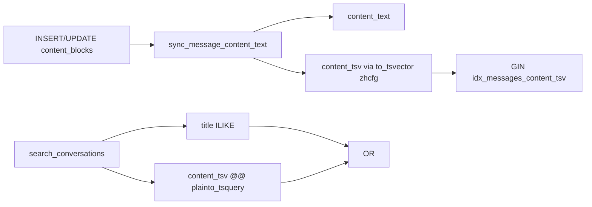

# Step 2：tsvector 中文分词全文搜索

## 目标与边界

- **目标**：消息正文搜索从 `content_text ILIKE` 改为 `content_tsv @@ plainto_tsquery('zhcfg', q)`，走 GIN，预期延迟 10–50ms。
- **保留**：标题仍用 `title ILIKE`；会话去重 / title 优先；列表排序仍为 `last_message_created_at DESC, id DESC`（**不做 `ts_rank`**，避免破坏现有游标分页语义）。
- **行为变化**：中文按词命中，不再保证任意子串命中（例如查询「调研」可命中，查询无分词意义的半个词可能 miss）。英文/数字仍可由 zhparser + `simple` mapping 处理。



## 1. Postgres 镜像：安装 zhparser

当前 [`docker-compose.yml`](docker-compose.yml) 使用 `pgvector/pgvector:pg18`，**不含 zhparser**。第三方现成镜像版本/词典不可控。

**做法**：新增 [`docker/postgres/Dockerfile`](docker/postgres/Dockerfile)，`FROM pgvector/pgvector:pg18`，编译安装 SCWS + [zhparser](https://github.com/amutu/zhparser)：

```dockerfile
FROM pgvector/pgvector:pg18
# apt: gcc make git wget bzip2 postgresql-server-dev-18
# build SCWS 1.2.3 → /usr/local
# build zhparser → make && make install
```

[`docker-compose.yml`](docker-compose.yml) 的 `postgres` 改为：

```yaml
build:
  context: ./docker/postgres
  dockerfile: Dockerfile
image: chat-agent-postgres:pg18-zhparser
```

### 数据是否会丢？

**正常换镜像不会丢数据。** 业务数据在 Docker named volume `postgres_data`（挂载到容器内 `/var/lib/postgresql`），与镜像层分离：

- 安全操作：`docker compose build postgres` → `docker compose up -d postgres`（或 `up -d --force-recreate postgres`）。同一 volume、同一 PG 大版本（仍为 18）→ 原有库表/数据保留；之后只跑 `alembic upgrade head` 加列/回填。
- `init-db/` 脚本**仅在数据目录为空时**执行一次，已有 volume 不会重跑，不会被清空。
- **会丢数据的操作**（禁止）：`docker compose down -v`、手动 `docker volume rm postgres_data`、改挂载路径导致指到空目录、降到不兼容的 PG 大版本。

文档补充：上述安全 recreate 流程；在 [`AGENTS.md`](AGENTS.md) / [`backend/AGENTS.md`](backend/AGENTS.md) 各加一句镜像含 zhparser，并注明勿对 postgres 使用 `-v`。

## 2. 模型：`messages.content_tsv`

[`backend/app/models/message_db.py`](backend/app/models/message_db.py)：

```python
from sqlalchemy.dialects.postgresql import TSVECTOR

content_tsv: Any | None = Field(
    default=None,
    sa_column=Column(
        TSVECTOR().with_variant(Text(), "sqlite"),
        nullable=True,
    ),
    description="content_text 的 zhcfg tsvector，供会话全文搜索",
)
```

`with_variant(Text(), "sqlite")` 保证现有 SQLite 搜索单测 `create_all` 不炸。

**Python 写入路径不写 `content_tsv`**（继续只写 `content_text`）；生产由触发器填充。SQLite 测试里 `content_tsv` 恒为 NULL，查询走方言回退。

## 3. Alembic 迁移（手动，接在 `h1i2j3k4l5m6` 后）

新建 `backend/alembic/versions/i2j3k4l5m6n7_add_content_tsv_zhparser.py`（revision id 按仓库惯例最终落盘时再定，`down_revision = h1i2j3k4l5m6`）。

`upgrade()` 顺序：

1. **扩展与配置**（`autocommit_block`，对齐 [`d1e8f0a1b2c3`](backend/alembic/versions/d1e8f0a1b2c3_user_profile_semantic_and_pgvector.py)）：
   - `CREATE EXTENSION IF NOT EXISTS zhparser`
   - 失败且提示不可用时抛明确 `RuntimeError`（要求使用本仓库 postgres 镜像）
   - `CREATE TEXT SEARCH CONFIGURATION zhcfg (PARSER = zhparser)`（`IF NOT EXISTS` 用 `DO $$ ... $$` 判断 `pg_ts_config`）
   - `ALTER TEXT SEARCH CONFIGURATION zhcfg ADD MAPPING FOR n,v,a,i,e,l WITH simple`（幂等：忽略已存在 mapping 错误，或先查 `pg_ts_config_map`）

2. **加列**：`content_tsv tsvector NULL`

3. **改写触发器函数**（在现有 [`h1i2j3k4l5m6`](backend/alembic/versions/h1i2j3k4l5m6_add_content_text_to_messages.py) 的 `\u0000` 消毒逻辑上追加）：
   - 抽出 `content_text` 后：
     ```sql
     IF extracted IS NOT NULL AND extracted <> '' THEN
       NEW.content_tsv := to_tsvector('zhcfg', extracted);
     ELSE
       NEW.content_tsv := NULL;
     END IF;
     ```
   - 触发器定义可不变（仍 `BEFORE INSERT OR UPDATE OF content_blocks`）

4. **回填**：
   ```sql
   UPDATE messages
   SET content_tsv = to_tsvector('zhcfg', content_text)
   WHERE content_text IS NOT NULL AND content_text <> '';
   ```

5. **GIN 索引**（大表用 `CONCURRENTLY` + `autocommit_block`，对齐 [`x9y8z7a6b5c4`](backend/alembic/versions/x9y8z7a6b5c4_add_ivfflat_index_for_kb_chunk_embeddings.py)）：
   ```sql
   CREATE INDEX CONCURRENTLY IF NOT EXISTS idx_messages_content_tsv
   ON messages USING GIN (content_tsv);
   ```

`downgrade()`：`DROP INDEX CONCURRENTLY` → 恢复仅写 `content_text` 的触发器函数（复制 Step 1 版）→ `drop_column content_tsv`。**不** drop `zhcfg` / `zhparser`（避免误伤其它对象；注释说明可选手动清理）。

## 4. 查询改造

[`backend/app/services/conversation/conversation_db.py`](backend/app/services/conversation/conversation_db.py)：

- 抽取 `_message_content_match(keyword, pattern)`：按 `db.get_bind().dialect.name` 分支：
  - **postgresql**：`cast(Any, MessageDb.content_tsv).op("@@")(func.plainto_tsquery("zhcfg", keyword))`
  - **其它（SQLite 测试）**：继续 `content_text.ilike(pattern, escape="\\")`
- `search_conversations` 与 `_build_search_item` 共用该谓词，避免 EXISTS 用 FTS、snippet 用 ILIKE 导致「列表有、snippet 空」不一致。
- **不用**文档里的 `' & '.join(keyword.split())` + `to_tsquery`：特殊字符易炸；改用 **`plainto_tsquery('zhcfg', keyword)`**，由配置分词并 AND 各 token。
- `_build_snippet`：先按完整 `keyword` 找子串；找不到时对 `keyword` 空白切分后的首个 token 再找；仍找不到则截取文首（应对 FTS 词级命中、非子串命中）。

标题匹配、游标、排序逻辑不动。

## 5. 测试

[`test_conversation_search.py`](backend/tests/services/conversation/test_conversation_search.py)：

- 继续 SQLite：覆盖 title / 中英文正文 / pending / inactive（走 ILIKE 回退）。
- 新增（或扩展）注释说明：生产 Postgres 走 tsvector；单测不依赖 zhparser。
- 可选：若后续有 Postgres 集成测，再断言 `@@`；本步不强制。

校验：

- `cd backend && make lint`
- `uv run alembic heads` 单 head
- `uv run pytest tests/services/conversation/test_conversation_search.py`
- 本地：`docker compose build postgres && docker compose up -d postgres` → `uv run alembic upgrade head` → 用含中文关键词的真实会话打 `GET /api/conversation/search`，`EXPLAIN` 确认走 `idx_messages_content_tsv`。

## 6. 明确不做

- 会话列表 **`ts_rank` 重排**（留给以后若改游标语义再做）。
- `conversations.title` 的 tsvector。
- 改 Step 1 已合入的历史迁移文件（只 `CREATE OR REPLACE` 触发器函数）。
