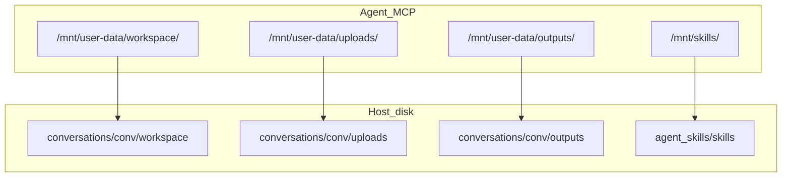

# user_data 目录结构 deer-flow 化改造计划

## 目标结构

### 物理目录（改造后）

`user-data` **仅出现在 Agent 虚拟路径前缀**（`/mnt/user-data/...`），**不**作为 `{conversation_id}/` 下的磁盘目录名。

```
backend/data/user_data/
└── {user_id}/
    └── conversations/
        └── {conversation_id}/
            ├── workspace/                # Agent 读写工作区（原 workspaces/{id}/）
            ├── uploads/                  # 会话上传（原 uploads/{id}/）
            │   └── derived/              # PDF 派生 Markdown（保持现有规则）
            └── outputs/                  # 最终交付物（新增，对齐 deer-flow 语义）
```

### 虚拟路径（改造后，[`app/vfs/config.py`](backend/app/vfs/config.py)）

| 虚拟前缀 | 物理路径 | 权限 |
|---------|---------|------|
| `/mnt/user-data/workspace/` | `.../conversations/{id}/workspace/` | 读写 |
| `/mnt/user-data/uploads/` | `.../conversations/{id}/uploads/` | 只读（文件 MCP） |
| `/mnt/user-data/outputs/` | `.../conversations/{id}/outputs/` | 读写（写入工具需放开） |
| `/mnt/skills/` | `app/agent_skills/skills/` | 只读 |



### 与当前结构的对比

| 维度 | 当前 | 目标 |
|------|------|------|
| 工作区 | `user_data/{uid}/workspaces/{conv}/` | `user_data/{uid}/conversations/{conv}/workspace/` |
| 上传 | `user_data/{uid}/uploads/{conv}/` | `user_data/{uid}/conversations/{conv}/uploads/` |
| 虚拟 workspace | `/workspace/` | `/mnt/user-data/workspace/` |
| 虚拟 uploads | `/uploads/` | `/mnt/user-data/uploads/` |
| outputs | 无 | `conversations/{conv}/outputs/` + `/mnt/user-data/outputs/` |
| Docker 上传挂载 | 整用户 `uploads/` → `/uploads`（与会话扁平路径不一致） | 会话 `conversations/{conv}/uploads/` → `/mnt/user-data/uploads` |

**保持不变（降低迁移面）：**

- `storage_key` 仍为 `{conversation_id}/{display_name}`（及 `derived/{stem}.md`），预览 URL `/api/file/preview/{user_id}/{storage_key}` 不变
- **HTTP 路径前缀**仍为 `/api/workspaces/{conversation_id}/...`（前端 `workspaceId` 传的是会话 ID，无需改 URL）；仅 FastAPI 路径参数名与后端符号改为 `conversation_id`

**本期统一命名：**

- 后端凡表示「当前会话」的 `workspace_id` **全部改为** `conversation_id`，不再保留别名或 `workspace_id == conversation_id` 的隐式约定

---

## 1. 统一路径模块（单一事实来源）

在 [`backend/app/vfs/paths.py`](backend/app/vfs/paths.py) 新增 `Paths` 类（参考 deer-flow `Paths` 模式），作为 **唯一** 路径事实来源；[`app/vfs/__init__.py`](backend/app/vfs/__init__.py) 按需导出 `get_paths`、`USER_DATA_ROOT`、`VIRTUAL_PATH_PREFIX`。

**`paths.py` 提供：**

- 模块级常量：`USER_DATA_ROOT`、`SKILLS_ROOT`、`VIRTUAL_PATH_PREFIX = "/mnt/user-data"`
- `Paths` 实例方法：
  - `conversation_dir(user_id, conversation_id)` → `.../conversations/{conversation_id}/`
  - `sandbox_work_dir` / `sandbox_uploads_dir` / `sandbox_outputs_dir`
  - `ensure_conversation_dirs()`（创建 workspace、uploads、outputs，`0o777`）
  - `resolve_user_data_virtual_path(virtual_path, user_id, conversation_id)`（供 `PathResolver` 委托）
  - `validate_conversation_id` / `validate_user_id`（路径安全校验，供全库复用）
- `get_paths() -> Paths` 单例（与 deer-flow 一致）

**下游收敛（不再各自拼路径）：**

- [`app/vfs/config.py`](backend/app/vfs/config.py)：`USER_DATA_ROOT` / `SKILLS_ROOT` 改为从 `paths` 导入；仅保留 `VFSConfig` 虚拟前缀默认值
- [`app/utils/workspace.py`](backend/app/utils/workspace.py)：配额/解析逻辑保留，目录根路径委托 `get_paths()`
- [`app/services/chat_upload/attachment.py`](backend/app/services/chat_upload/attachment.py)：`get_conversation_upload_dir` 等委托 `Paths`
- [`app/mcp/mcp_servers/file_mcp/utils.py`](backend/app/mcp/mcp_servers/file_mcp/utils.py)：与 `workspace.py` 同步委托 `Paths`

**不** 在 `app/config/paths.py` 另建模块，避免与 VFS 职责分裂。

路径相关函数签名统一使用 `conversation_id`（例如 `get_workspace_root(user_id, conversation_id)` 或重命名为 `get_conversation_work_dir`，二选一并在计划实施时全库一致）。

---

## 2. `workspace_id` → `conversation_id` 重命名（后端）

消除「两个名字指同一会话」的歧义；`RequestContext` 已使用 `conversation_id`，工具链应与之对齐。

### 2.0.1 核心链路

| 模块 | 变更 |
|------|------|
| [`app/agents/tool_executor.py`](backend/app/agents/tool_executor.py) | `current_workspace_id` → `current_conversation_id`；`reset_for_request(..., conversation_id=)`；`set_request_context(conversation_id=...)` 不再经 workspace 别名 |
| [`app/agents/mcp_tool_execution.py`](backend/app/agents/mcp_tool_execution.py) | `reset_for_request` 参数 `conversation_id` |
| [`app/agents/chat_session_agent.py`](backend/app/agents/chat_session_agent.py) | `tool_session.reset_for_request(..., conversation_id=conversation_id)`（去掉 `workspace_id=` 关键字） |
| [`app/mcp/mcp_servers/file_mcp/base.py`](backend/app/mcp/mcp_servers/file_mcp/base.py) | `ToolContext`：删除 `workspace_id` 属性，统一 `conversation_id`（直接读 `get_request_context().conversation_id`） |
| 各 file MCP 工具 | `ctx.workspace_id` → `ctx.conversation_id` |
| [`app/vfs/mapper.py`](backend/app/vfs/mapper.py) | `MappingContext.workspace_id` → `conversation_id` |
| [`app/vfs/resolver.py`](backend/app/vfs/resolver.py) / [`uploads_provider.py`](backend/app/vfs/uploads_provider.py) | 方法参数 `workspace_id` → `conversation_id` |
| [`app/mcp/mcp_servers/shell_mcp/shell.py`](backend/app/mcp/mcp_servers/shell_mcp/shell.py) | `get_or_create_executor` / `execute` 参数与缓存 key；错误文案 `conversation_id is required` |
| [`app/mcp/mcp_servers/shell_mcp/audit.py`](backend/app/mcp/mcp_servers/shell_mcp/audit.py) | 审计字段 `conversation_id` |
| [`app/mcp/mcp_servers/shell_mcp/server.py`](backend/app/mcp/mcp_servers/shell_mcp/server.py) | 注释与 `ctx.conversation_id` |
| [`app/utils/workspace.py`](backend/app/utils/workspace.py) | `validate_workspace_id` → `validate_conversation_id`（或合并进 `Paths._validate_id`）；`get_workspace_root` / `resolve_workspace_path` 第二参数改为 `conversation_id` |
| [`app/api/conversation.py`](backend/app/api/conversation.py) | 删除会话逻辑改用 `validate_conversation_id` |
| [`app/api/workspace.py`](backend/app/api/workspace.py) | 路径参数 `{workspace_id}` → `{conversation_id}`；响应 JSON 字段 `workspaceId` 可保留别名 **或** 改为 `conversationId`（若改字段需同步前端，见 §5） |
| [`app/mcp/mcp_servers/file_mcp/utils.py`](backend/app/mcp/mcp_servers/file_mcp/utils.py) | 与 `utils/workspace.py` 同步参数名 |

### 2.0.2 测试

- [`app/agents/test_tool_executor.py`](backend/app/agents/test_tool_executor.py)、[`shell_mcp/test_shell_tool.py`](backend/app/mcp/mcp_servers/shell_mcp/test_shell_tool.py)、[`file_mcp/test_server.py`](backend/app/mcp/mcp_servers/file_mcp/test_server.py)：断言与 fixture 参数名同步

### 2.0.3 刻意保留的 `workspace` 字样

以下 **不** 改名为 conversation，避免与磁盘子目录 `workspace/` 或虚拟前缀 `/mnt/user-data/workspace/` 冲突：

- 物理/虚拟目录名 `workspace`（Agent 工作区文件夹）
- REST 前缀 `/api/workspaces`（资源名，值为 `conversation_id`）
- 函数如 `get_workspace_root` 可保留名称（表示「工作区目录」），仅 **ID 参数** 改为 `conversation_id`

---

## 3. VFS 与 MCP 改造

### 3.1 配置与前缀

- [`app/vfs/config.py`](backend/app/vfs/config.py)：`VFSConfig` 默认值改为 `/mnt/user-data/workspace/`、`/mnt/user-data/uploads/`、`/mnt/user-data/outputs/`、`/mnt/skills/`
- [`app/vfs/resolver.py`](backend/app/vfs/resolver.py)：增加 `outputs` 分支；workspace/uploads/outputs 根目录改调 `Paths`（无 `user-data/` 物理段）
- [`app/vfs/mapper.py`](backend/app/vfs/mapper.py)：物理根路径与 `sanitize_response` 替换规则同步
- [`app/vfs/uploads_provider.py`](backend/app/vfs/uploads_provider.py)：虚拟路径前缀随 config 自动更新

### 3.2 文件 MCP

- [`app/mcp/mcp_servers/file_mcp/utils.py`](backend/app/mcp/mcp_servers/file_mcp/utils.py)、[`write_file.py`](backend/app/mcp/mcp_servers/file_mcp/write_file.py)、[`edit_file.py`](backend/app/mcp/mcp_servers/file_mcp/edit_file.py)：前缀校验改为 `vfs_config` 新值
- **outputs 写入**：`write_file` / `edit_file` 允许 `/mnt/user-data/outputs/`（与 deer-flow「交付物目录」语义一致）

### 3.3 Shell MCP + Docker

- [`app/sandbox/docker_executor.py`](backend/app/sandbox/docker_executor.py)：bind mount 源为 `conversations/{conv}/workspace|uploads|outputs`，容器内目标为 `/mnt/user-data/workspace`、`/mnt/user-data/uploads`（只读）、`/mnt/user-data/outputs`（读写）；`working_dir` / `HOME` 指向 `/mnt/user-data/workspace`
- [`app/mcp/mcp_servers/shell_mcp/executor.py`](backend/app/mcp/mcp_servers/shell_mcp/executor.py)：`set_uploads_path` 改为 **会话级** `sandbox_uploads_dir`，不再挂整用户 `uploads/`
- [`app/mcp/mcp_servers/shell_mcp/policy.py`](backend/app/mcp/mcp_servers/shell_mcp/policy.py)：允许 `cd` 到 `/mnt/user-data/workspace`（替换 `/workspace` 硬编码）
- `_adapt_command_for_backend`：适配 `cd /mnt/user-data/workspace` 冗余清理

### 3.4 提示词

- [`app/prompts/system_prompt.py`](backend/app/prompts/system_prompt.py)、[`app/prompts/prompt_utils.py`](backend/app/prompts/prompt_utils.py)：注入新前缀；补充 outputs 约定（最终交付物写入 `/mnt/user-data/outputs/`）

---

## 4. 上传与预览路径

- [`app/services/chat_upload/attachment.py`](backend/app/services/chat_upload/attachment.py)：
  - `get_conversation_upload_dir` → `.../conversations/{conv}/uploads`
  - `_resolve_under_uploads`：v3 文件落在 `conversations/{conv}/uploads/`；v2 legacy 仍走原扁平 `uploads/raw|derived` fallback
- [`app/api/conversation.py`](backend/app/api/conversation.py)：删除会话时 `shutil.rmtree(conversations/{conv}/)`（整棵会话目录）
- [`app/utils/workspace.py`](backend/app/utils/workspace.py)：`get_workspace_root` → `conversations/{conv}/workspace`

---

## 5. 数据迁移（v3 → v4）

新增 Alembic 数据迁移（模式参考 [`a3b4c5d6e7f8_upload_storage_v3_migration.py`](backend/alembic/versions/a3b4c5d6e7f8_upload_storage_v3_migration.py)）：

1. **文件搬迁**（幂等）
   - `workspaces/{conv}/*` → `conversations/{conv}/workspace/`
   - `uploads/{conv}/*` → `conversations/{conv}/uploads/`
   - 创建空的 `conversations/{conv}/outputs/`
2. **消息块回填**（`messages.content_blocks` JSON）
   - `/workspace/` → `/mnt/user-data/workspace/`
   - `/uploads/` → `/mnt/user-data/uploads/`
   - 已含 `/mnt/user-data/` 的条目跳过
3. **`STORAGE_VERSION`**：`3` → `4`
4. **v2 hash 扁平文件**：不搬迁，沿用 `resolve_upload_file_path_with_legacy` 只读 fallback

迁移完成后可选：删除空的旧顶层 `workspaces/`、`uploads/`（日志记录，不强制删用户数据）。

---

## 6. 测试与文档

| 范围 | 动作 |
|------|------|
| 单测 | 更新 file_mcp / shell_mcp 测试：新虚拟前缀 + `conversations/{conv}/workspace` 物理根 |
| 新增 | `test_paths.py`：目录创建、虚拟路径解析、路径逃逸拒绝 |
| 迁移 | 临时目录模拟 v3 → 断言搬迁到 `conversations/{conv}/workspace|uploads` |
| 文档 | 更新 phase0 计划与 AGENTS.md 中 `data/` 说明 |

**前端**：

- URL `/api/workspaces/{id}/...` **不变**（`id` 仍为 `conversation_id` 的值）
- 若 workspace API 响应将 `workspaceId` 改为 `conversationId`，需同步 [`frontend/src/services/workspace.ts`](frontend/src/services/workspace.ts) 与 `ProjectBlock`；**默认建议保留 `workspaceId` 响应字段** 仅改后端参数名，减少前端改动

---

## 7. 风险与取舍

- **命名区分**：磁盘为 `data/user_data/<uid>/conversations/...`；Agent 可见为 `/mnt/user-data/...`，避免在 `{conversation_id}/` 下再建 `user-data/` 目录造成双重语义
- **破坏性变更**：旧虚拟路径 `/workspace/`、`/uploads/` 迁移后由 resolver 拒绝；`storage_key` / 预览 URL 仍可用
- **outputs**：本期仅目录 + VFS + 写权限，不强制 `present_files` 工具

---

## 实施顺序建议

1. 引入 `Paths` + `conversation_id` 重命名（可同 PR，先 Paths 再批量替换符号）
2. 切换 VFS / 上传 / workspace API / conversation 删除
3. 更新 Docker + shell policy + system prompt
4. Alembic 搬迁 + `content_blocks` 回填 + `STORAGE_VERSION=4`
5. pytest + 手动验证上传预览、文件工具、Docker shell 读 uploads
