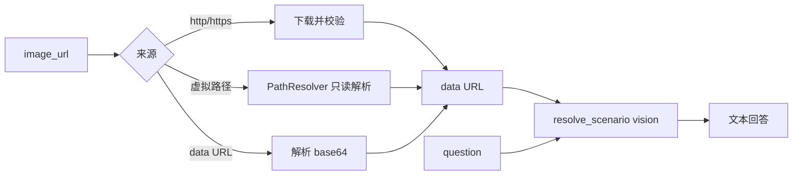

# 增加 vision_analyze 图片分析工具

LLM 可见名是 `vision_analyze`：新 MCP Server 名 `vision`，工具裸名 `analyze`（现有规则见 [`backend/app/mcp/tool_naming.py`](backend/app/mcp/tool_naming.py) 的 `{server}_{bare}`）。

两个参数都必填，没有可选参数：

- `image_url`：`http`/`https` URL、虚拟文件路径、或 `data:image/...;base64,...`
- `question`：对图片的问题或要求

返回值是视觉模型的纯文本回答。失败时 `is_error=true`，内容为简短错误说明。

## 图片归一化

新建 [`backend/app/mcp/mcp_servers/vision_mcp/`](backend/app/mcp/mcp_servers/vision_mcp/)（`server.py` + `analyze.py`）。实现复用 [`file_mcp` 的 ToolContext / ToolResult](backend/app/mcp/mcp_servers/file_mcp/base.py) 和 [`resolve_virtual_path`](backend/app/mcp/mcp_servers/file_mcp/utils.py)。

- **虚拟路径**：与 `read_file` 相同，只接受 `/mnt/user-data/{workspace,uploads,outputs}` 和 skills 前缀。宿主机绝对路径、`..` 穿越直接拒绝。读文件后按扩展名或魔数确认为图片，再编码为 data URL。
- **http/https**：服务端下载后转 data URL（多数兼容接口不代拉外链）。超时约 15s，解码后上限 10MB，只接受 `png` / `jpeg` / `gif` / `webp`。禁止重定向到内网；解析后拒绝 loopback、私网、link-local（含云元数据地址）。
- **data URL**：校验 MIME 与解码后体积，原样传给模型。

不把图片字节或完整 data URL 写入日志。

## 模型调用

把 `vision` 加进启动必填场景。[`validate_models`](backend/app/core/config.py) 的 `required_scenarios` 从 `text_generation` / `title_generation` / `summarization` 扩为四项，未配置 `models.scenarios.vision` 时进程启动失败。

同一校验里再要求该场景的 `default_model` 与 `alternatives` 对应模型 `capabilities` 含 `image`。指向纯文本模型时同样启动失败，避免工具注册了却在调用时才发现不能看图。

调用时 `resolve_scenario("vision")`，用现有 [`LLMService.call_llm_api`](backend/app/services/base_service/llm_service.py)（`stream=False`，不带 tools）。user 消息为 `question` 文本块 + `image_url` 块。系统提示要求只依据图片作答。

Nacos / `.env` 必须增加该场景，例如 `models.scenarios.vision.default_model` 指向已有、且 `capabilities` 含 `image` 的模型。代码仓库里不写死供应商或模型名。同步改 [`backend/README.md`](backend/README.md) 与 [`backend/AGENTS.md`](backend/AGENTS.md) 里「必须包含三个场景」的说明。

## 注册与提示

在 [`MCPConfig`](backend/app/schemas/config.py) 默认表注册 `vision` → `app.mcp.mcp_servers.vision_mcp.server`，并加入 `normal_mode_servers` 与 `agent_mode_servers`。子 agent 默认继承 Agent 模式工具，因此也会拿到它。

同步改两处，避免模型继续对图片调用 `read_file`：

- [`read_file.py`](backend/app/mcp/mcp_servers/file_mcp/read_file.py) 的描述和图片拒绝文案改为：图片请调用 `vision_analyze`。
- Agent 模式系统提示 [`system_prompt.py`](backend/app/prompts/system_prompt.py) 的工作目录说明加一句：分析上传或工作区图片用 `vision_analyze`，不要用 `read_file`。

## 测试

`backend/tests/mcp/mcp_servers/vision_mcp/`：mock LLM 与 HTTP。覆盖三种输入成功路径、缺参、非图片、路径穿越、内网 URL。另补启动校验：缺少 `vision` 场景失败；`vision` 指向无 `image` 能力的模型失败。现有 `read_file` 图片拒绝测试只断言 “image” 与 “cannot be read as text”，文案改动保持这两句仍成立。
