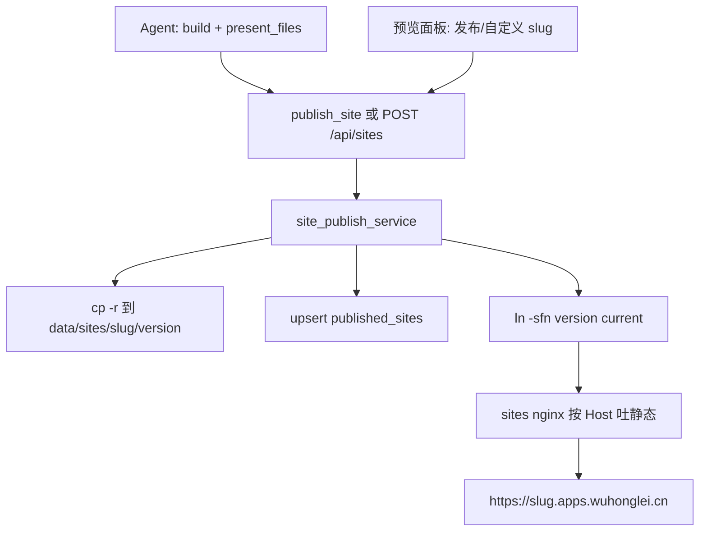
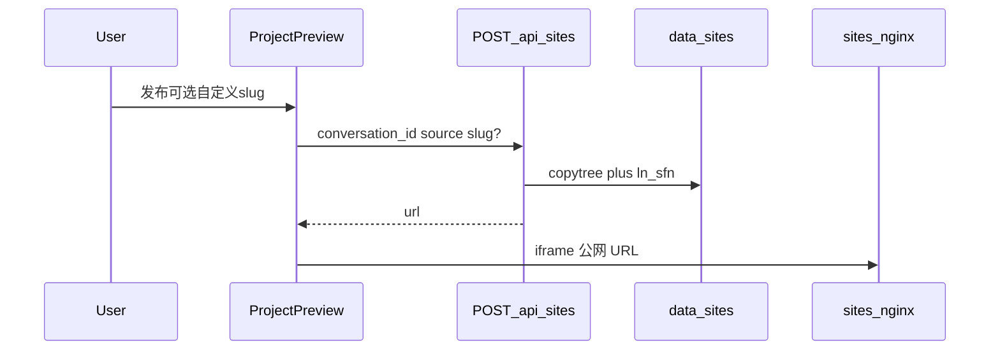

# Web 应用域名发布（第 2 / 3 期）

第 1 期已落地：[`deploy/sites/nginx.conf`](deploy/sites/nginx.conf) 按 Host 抽出 slug，只读挂载 `backend/data/sites/{slug}/current`；[`docker-compose.yml`](docker-compose.yml) 的 `sites:8080` 与 [`deploy.sh`](deploy.sh) 已纳入。本方案不再改 nginx / DNS，只补「创建后如何变成可访问域名」。

沿用文档已拍板的决策：子域名 `{slug}.apps.wuhonglei.cn`、快照不可变、slug 由服务端生成、MCP **不接收** slug、可见性默认 `unlisted`、私密站与独立 registrable domain 不做。

---

## 第 2 期：发布闭环（Agent 能交付公网 URL）

### 数据与路径

- 新模型 [`backend/app/models/published_site.py`](backend/app/models/published_site.py)，并在 [`backend/app/models/__init__.py`](backend/app/models/__init__.py) 注册（Alembic autogenerate 依赖这个 import）。
- 字段按文档：`slug` PK、`user_id`、`conversation_id` UNIQUE、`message_id` 可空、`site_root`、`version`、`entry`、`visibility`、`size_bytes`、`expires_at`、时间戳、`unpublished_at`。`user_id` / `conversation_id` 加 FK。
- 迁移 `down_revision` 接当前 head `i2j3k4l5m6n7`（落地前用 `uv run alembic heads` 再确认）。
- [`backend/app/vfs/paths.py`](backend/app/vfs/paths.py) 增加独立 `SITES_ROOT = BACKEND_ROOT / "data" / "sites"` 与 `site_version_dir(slug, version)` / `site_current_link(slug)`。**不要**走 `user_data` 解析器；`site_root` 只由服务端拼，永不接受调用方路径。
- 配置新增 `SitesConfig`（[`backend/app/schemas/config.py`](backend/app/schemas/config.py)）：`public_base_domain=apps.wuhonglei.cn`、单站上限 50MB、单用户活跃站 20、默认 TTL 30 天。URL 一律服务端拼 `https://{slug}.{domain}`，禁止模型/前端自己拼域名。

### 核心服务 `site_publish_service`

新文件 [`backend/app/services/site_publish_service.py`](backend/app/services/site_publish_service.py)，MCP 与 REST 共用。沿 [`DbService`](backend/app/services/base_service/db_service.py) 的 session 用法：路由注入 `Session`，MCP 用 `with SitePublishService() as svc`。

发布流程：

1. **归属**：复用 [`ensure_conversation_owned`](backend/app/services/chat_upload/attachment.py)（MCP 上下文已有 `user_id`/`conversation_id`，仍要核对会话存在且属于该用户）。
2. **source**：只接受 `/mnt/user-data/outputs/` 下**已存在目录**（套路对齐 [`present_files.py`](backend/app/mcp/mcp_servers/file_mcp/present_files.py) 的前缀 + `resolve_virtual_path`，但 `is_dir()` 且必须有 `index.html`）。默认/skill 固定 `/mnt/user-data/outputs/app-dist`。
3. **slug**（只在服务端，不写进 skill）：
   - 本 `conversation_id` 已有行（含已下线）→ 复用，走 republish / 重新上线；REST 传入的 slug 此时忽略。
   - 否则用会话标题 slugify（小写 ASCII/数字/连字符，压缩 `-`，截到 3–40）。过短、纯中文、命中保留字 `www/api/admin/chat/static/apps/mail/ftp` → `site-{nanoid(6)}`。
   - 主键冲突：`{base}-2`…；仍冲突或超长再回退 `site-{nanoid(6)}`。查重与 INSERT 同一事务；撞 `IntegrityError` 则内部重试，**MCP 路径不把 409 抛给模型**。
   - REST **主动传入** slug：非法 → 400；被其他站占用 → 409（不自动改名）。
4. **快照**：`shutil.copytree`（默认 copy2，禁止硬链接）到 `data/sites/{slug}/{version}/`，算 `size_bytes`；超配额 413。先写完版本目录，再写库，最后 `ln -sfn`（相对目标 `"1"` / `"2"`，容器与宿主机都能解析）。
5. **下线**（`DELETE /api/sites/{slug}`，会话还在）：先摘 `current`，再写 `unpublished_at`。版本目录留下便于同会话再发布。只改 DB 时 nginx 仍会服务。
6. **删会话**（现有行为 + 本方案补丁）：
   - **会话 data 已经会删。** [`_delete_conversation_workspace`](backend/app/api/conversation.py) 对整个 `data/user_data/{user_id}/conversations/{conversation_id}/` 做 `shutil.rmtree`，包含 `workspace/`、`uploads/`、`outputs/`（含 `app-dist`）。用户级 `skills/` 和其他会话目录不动。
   - **已发布快照不会随这次 rmtree 消失。** 快照在独立的 `data/sites/{slug}/`，不在 `user_data` 下。若不处理，公网 URL 会继续可访问（孤儿站）。
   - 因此删会话时额外：摘 `current`（立刻 404）→ `rmtree data/sites/{slug}/`（版本目录一并清，会话已不在，没有 republish 对象）→ 删除 `published_sites` 行。必须在 `db.delete(conversation)` 之前做完：`conversation_id` 有 FK，否则删会话会失败。
   - 这与「仅下线」不同：下线保留 slug 行和版本目录；删会话是终结，磁盘和行都清。

TTL：`expires_at = now + 30d`，每次 republish 续期。nginx 不读库，过期必须摘链。第 2 期加一个轻量周期任务（backend lifespan 里小时级扫描 `expires_at < now AND unpublished_at IS NULL`，走同一 `unpublish`）。不做独立 worker。

`message_id`：`RequestContext` 目前没有该字段，第 2 期保持 NULL，不改上下文。

### REST [`backend/app/api/sites.py`](backend/app/api/sites.py)

在 [`backend/app/main.py`](backend/app/main.py) 注册 `prefix="/api/sites"`，鉴权 `Depends(get_auth_token_info)`，响应 `ApiResponse`；业务错误用 `HTTPException`（已有 handler 会包成 `{code,msg}`）。

- `POST /`：`{conversation_id, source, slug?, visibility?}`。省略 slug → 服务端生成。
- `POST /{slug}/republish`：version+1，切 `current`；校验 slug 属于当前用户。
- `GET /me`：当前用户站点列表（给前端，**不是** Agent 查重入口）。
- `DELETE /{slug}`：下线。

错误：非法 slug 400；他人占用 409；source 不合法 400；超配额 413。

### MCP `publish_site`

- 新 [`backend/app/mcp/mcp_servers/file_mcp/publish_site.py`](backend/app/mcp/mcp_servers/file_mcp/publish_site.py)，在 [`server.py`](backend/app/mcp/mcp_servers/file_mcp/server.py) 注册。
- Schema **只有** `source` + 可选 `visibility`，**禁止** `slug` 字段（可选字段模型仍会填）。
- 描述写清：不要猜 slug、不要调 `/api/sites/me`、把返回的 `url` 原样告诉用户。
- `structured_content`：`{slug, version, url, entry, file_count, size_bytes}`。
- 护栏：[`constants.py`](backend/app/mcp/constants.py) 增加 `PUBLISH_SITE_BARE`，加入 `MUTATING_LLM_TOOLS`。不要放进 `PATH_SCOPED_FILE_BARE_TOOLS`（入参是目录 source，不是 `file_path`/`filepaths`）。

### Skill

[`backend/skills/public/webapp-building/SKILL.md`](backend/skills/public/webapp-building/SKILL.md) 在 Step B 后加 Step C：仅当用户明确要求公开访问/外部分享时调用；source 固定；不传 slug；原样回报 `url`。**不写** DNS/slug 生成手册。

---

## 第 3 期：前端体验 + 既有预览缺口

### 预览入口

[`backend/app/api/user_data.py`](backend/app/api/user_data.py) 的 `_PREVIEW_ENTRY_CANDIDATES` 补上 `outputs/app-dist/index.html`（当前只看 `workspace/dist` 等，建站产物对不上）。这是会话内预览的最低修复；**完整多页/字体/相对路径**仍依赖已发布域名。

### API 客户端与预览面板

- 新 [`frontend/src/services/sites.ts`](frontend/src/services/sites.ts)（风格对齐 [`workspace.ts`](frontend/src/services/workspace.ts)），从 [`services/index.ts`](frontend/src/services/index.ts) 导出。
- [`ProjectPreview/index.tsx`](frontend/src/pages/ChatPage/components/BlockPreviewPanel/ProjectPreview/index.tsx)：
  - 打开时 `GET /api/sites/me`，按 `block.workspaceId`（即 conversation_id）匹配活跃站。
  - 工具栏：发布、复制链接、下线。发布弹窗可填自定义 slug，走 `POST /api/sites` 的 `slug?`；400/409 用 antd 明确报错，**禁止静默改名**。
  - 已发布：「运行预览」iframe `src=https://{slug}.apps.wuhonglei.cn/`（可加 cache-bust query）；「在新页面打开」也走该 URL。取消对残缺 `preview-content` base64 内联的依赖。
  - 未发布：显示「发布后可通过域名预览」空态 + 发布按钮；不把坏掉的内联 HTML 当主预览。
  - 当前 Segmented 里「运行预览」被注释掉，第 3 期恢复，并按是否已发布切换可用性。

---

## 测试与验收

后端（pytest，不碰真实 DNS）：

- slugify / 保留字 / 冲突加后缀 / 过短回退。
- source 拒绝 workspace、文件、不存在目录。
- 同 conversation 再发布：slug 不变、version+1、旧版本目录仍在。
- MCP schema 无 slug；并发占用不向工具返回 409。
- DELETE / 过期任务摘掉 `current` 后目标路径不存在。

手工（接第 1 期已通域名）：

- Agent 不传 slug 仍拿到可 curl 的 HTTPS URL。
- 再发布 URL 稳定；下线立刻 404；再发布仍复用原 slug。
- 前端填已被占用的 slug 看到 409；已发布站多页刷新、图片、字体可用。

---

## 明确不做

- 不改 `sites` nginx / NPM / 通配证书。
- 不做 `private_signed`、HMAC、`auth_request`。
- 不给 MCP 加可选 slug；对话里口头指定域名留到以后。
- 不把用户 HTML 引进 `frontend` nginx 或 backend `StaticFiles`。
- Cookie 鉴权出现前不换独立 registrable domain。
