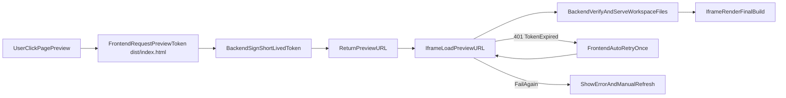

# Workspace dist-first iframe 预览统一计划

## 目标与范围
- 在 `project` block 中提供稳定的“最终效果预览”，优先展示构建产物而非源码模板页。
- 统一技术路线为：短期签名 URL + 后端静态文件分发 + 前端 iframe 渲染。
- 保持现有部署链路不变：`chat.wuhonglei.cn -> 前端 Nginx -> /api -> 后端`。
- 首期边界：仅保障相对资源路径（`./assets`、`assets`）加载，不承诺 `/assets/...` 绝对路径。

## 关键决策
- 默认入口设置为 `dist/index.html`（dist-first）。
- 若 `dist/index.html` 缺失，前端提示“未构建，无法预览最终效果”，不影响现有文件浏览能力。
- token 继续复用现有 JWT 体系，采用短时效与最小信息载荷策略。
- iframe 采用最小权限沙箱：`allow-scripts allow-same-origin`。

## 后端改造
- 目标文件：`backend/app/api/workspace.py`。
- 预览 token 接口：
  - `POST /api/workspaces/{workspace_id}/preview-token`（需登录）
  - 默认入参 `entryPath=dist/index.html`，限制 `ttlSeconds` 上限（如 300）
  - 返回 `previewUrl` 与 `expiresAt`
- 静态文件接口：
  - `GET /api/workspaces/preview/{token}/{asset_path:path}`（免登录）
  - 验签并校验 `user_id`、`workspace_id`、`entry_path`、`exp`
  - 强制 workspace 根目录内解析路径，阻断 `..` 与绝对路径
  - `asset_path` 为空时回退 token 内 `entry_path`
  - 资源不存在时回退 `entry_path`（支持 SPA 路由）
- 状态码语义：
  - `401`：token 无效或过期
  - `403`：越权访问或非法路径
  - `404`：目标文件不存在且无法回退
- 缓存策略：
  - token 接口：`Cache-Control: no-store`
  - HTML：`Cache-Control: no-store`
  - JS/CSS/图片：短缓存（如 `max-age=60`）

## 前端改造
- 目标文件：
  - `frontend/src/services/workspace.ts`
  - `frontend/src/pages/ChatPage/components/BlockPreviewPanel/ProjectPreview/index.tsx`
- `workspace service` 增加 `createWorkspacePreviewToken(workspaceId, { entryPath })`。
- `ProjectPreviewPanel` 增加“代码视图 / 页面预览”切换。
- 进入页面预览时默认请求 `entryPath=dist/index.html` 的 token，并以 `previewUrl` 渲染 iframe。
- 异常与恢复：
  - token 过期时自动重试一次
  - 重试失败后展示错误态与“刷新预览”按钮
  - 缺失 `dist/index.html` 时展示构建指引
  - 命中 `/assets/...` 绝对路径导致加载失败时，提示调整 Vite `base`（如 `./`）并重新构建

## 安全要求（必须）
- token 必须短时效、绑定单 workspace 与单入口文件。
- token 不暴露本地真实绝对路径。
- 静态文件读取仅允许访问 workspace 内文件。
- 默认不启用 `allow-forms`、`allow-popups`、`allow-downloads`。

## 验收标准
- 存在 `dist/index.html` 时可稳定展示最终页面效果。
- `dist/assets/*` 等相对路径资源可正常加载。
- token 过期可无感恢复一次，失败后可手动刷新恢复。
- `dist/index.html` 缺失时提示清晰，不影响原文件树与文件内容预览。
- 非法/过期 token、越权访问、路径穿越均能按约定状态码返回。

## 执行流程

