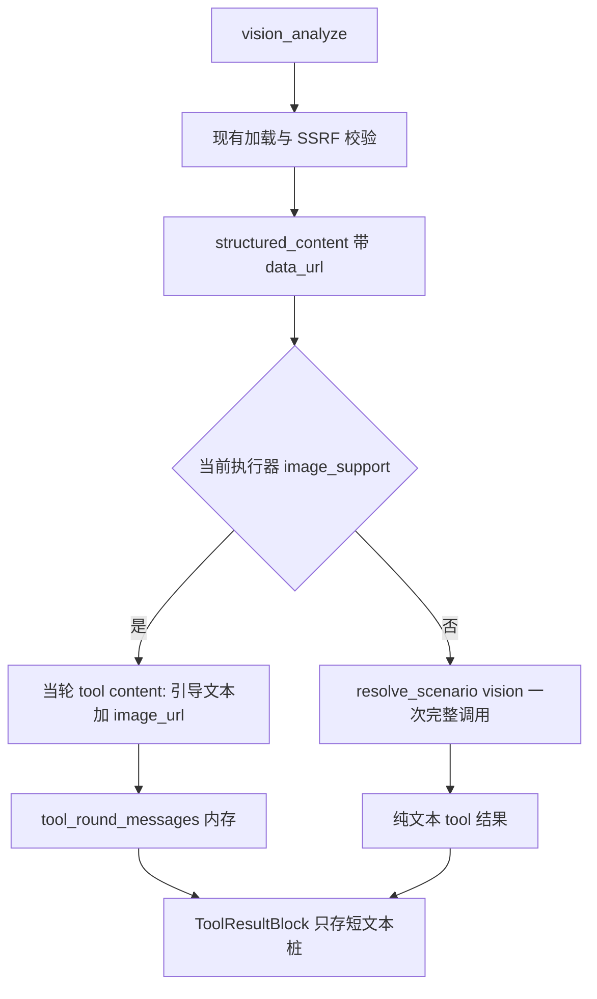

# P0：主模型原生视觉路由

主模型 `image_support=True` 时，`vision_analyze` 只做现有的取图与安全校验，把像素挂进**当轮** tool 消息；`resolve_scenario("vision")` 仅在主模型没有视觉能力时调用。历史重放、SSE、落库仍是短文本，与 `llm_rendered_text` 一样不把当轮大载荷写进可复用前缀。

缩放、可解码性校验、跨轮像素缓存不在本次范围。

## 为什么决策放在执行器，不放在工具里读上下文

[`RequestContext`](backend/app/utils/context.py) 是请求内共享对象。子代理 [`ChatSessionAgent`](backend/app/agents/chat_session_agent.py) 会 `set_request_context` 改同一份对象（见 [`subagent/context.py`](backend/app/services/subagent/context.py) 的注释）。若把 `image_support` 写进去，子代理的文本模型会覆盖父会话的视觉标记。

[`ToolExecutor`](backend/app/agents/tool_executor.py) 每次会话各自持有一份，已经从当前 `LLMConfig` 拿到 `model_name`。视觉与否跟这个执行器走，父/子会话互不影响。工具本身继续只做加载和校验。

## 行为

- **有视觉**：不调用辅助模型。发给主模型的 tool 消息 content 为 OpenAI 形态的 list：一段中文引导（沿用现有「不要编造图中不存在的内容」，并带上 `question`）加 `{"type":"image_url","image_url":{"url": data_url}}`。
- **无视觉**：行为与现在一致，[`_ask_vision_model`](backend/app/mcp/mcp_servers/vision_mcp/analyze.py) 的系统提示和 `resolve_scenario("vision")` 不变，tool 结果是分析文本。
- **上下文缺失**（单测直接调工具、没有会话执行器）：工具只返回已校验图片载荷，不自行打模型。辅助模型调用只发生在执行器确认 `image_support=False` 之后。
- **落库 / 下一轮**：[`ToolResultBlock.content`](backend/app/schemas/chat.py) 仍是 `str`。有视觉时写入不含 base64 的短桩（说明图片已交由当前模型查看，并附问题原文）。[`tool_messages_from_content_blocks`](backend/app/schemas/chat.py) 重放时没有图片 part。同一轮后续迭代仍看得到像素；下一轮追问若再次调用工具，只重新挂图，不再打辅助模型。原因见下一节。
- **前缀缓存**：图片 part 只活在当轮 `tool_round_messages`，不进 `content_blocks`，因此不会改变下一轮历史前缀的字节。

## 为什么落库不写 base64

下一轮的历史前缀来自消息表里的 `content_blocks`，不是当轮内存里的 wire 消息。[`tool_messages_from_content_blocks`](backend/app/schemas/chat.py) 把 `ToolResultBlock.content` 原样放回 tool 消息。这个字段是字符串，重放时不会再变成 `image_url` part。

因此把 data URL 写进这个字符串解决不了「下一轮还能看见像素」：模型读到的是一大段 base64 文本。同时它会进每一轮后续请求的前缀，10MB 图片大约 13MB 文本，每次追问都占用上下文和前缀缓存，即使用户已经不再问这张图。当轮真正发给模型的是 content list，和这条字符串字节不同，写进库也换不回与上一轮 wire 一致的缓存命中。

短桩保持历史前缀小且稳定，和 `llm_rendered_text` 只固化文本、不把当轮大载荷写进可复用前缀是同一原则。像素留在当轮 `llm_content`；需要再看图时重新调用工具挂图。用户消息上本来的图片块仍走现有 `ImageBlock` 重放，不靠 tool 结果再存一份。

## 三处打通

### 1. 工具载荷

[`VisionAnalyzeTool.execute`](backend/app/mcp/mcp_servers/vision_mcp/analyze.py) 在校验成功后返回：

- `content`：非空短桩（[`_invoke_mcp_tool`](backend/app/agents/tool_executor.py) 把空 content 当成 `is_error`）
- `structured_content`：`{"kind":"vision_passthrough","data_url":"...","question":"..."}`

不把 data URL 放进 `content`。[`format_mcp_result`](backend/app/mcp/gateway.py) 只拼文本，图片必须走已有的 `structured_content` 通道（shell / tavily 同一条路径）。

### 2. tool 消息组包

[`ToolResultMessage`](backend/app/schemas/llm.py) 增加仅当轮使用的 `llm_content: list[dict] | None`。`content: str` 保持不变，供 SSE、压缩、硬限制、日志和落库使用。

[`ToolExecutor`](backend/app/agents/tool_executor.py) 在 `_invoke_mcp_tool` 之后识别 `vision_passthrough`：

- `image_support=True`：`content` 保持短桩，`llm_content` 为 text + image_url。跳过会把结果交给压缩模型的 `_compact_tool_result_if_needed`（短桩没有压缩价值，且避免日志或摘要里带上 base64）。
- `image_support=False`：调用 `_ask_vision_model`，用分析文本覆盖 `content`，`llm_content=None`，随即丢掉 data URL。
- 日志和 Langfuse 的 `output` 继续只用 `content` 字符串。

`image_support` 从 [`ChatSessionAgent`](backend/app/agents/chat_session_agent.py) 的 `self.model_config.image_support` 传入 [`MCPToolSession`](backend/app/agents/mcp_tool_execution.py) / `ToolExecutor`。子代理用自己的 `child_llm`，自然拿到自己的标记。

[`format_tool_result_message`](backend/app/protocols/chat_messages.py) 把 `llm_content` 带到内部 dict，`content` 仍是短桩。[`append_tool_result`](backend/app/agents/utils/content_blocks.py) 继续只写 `content` 字符串。

[`_size_aware_compress_tool_rounds`](backend/app/agents/chat_session_agent.py) 只截断 `content` 字符串。短桩不会被选为截断对象；图片 token 仍计入预算，超窗走现有 context guard，不把 base64 截断成坏图。

### 3. provider 投影

[`project_messages_for_provider`](backend/app/utils/message.py) 在发给 API 前：

- 若消息带 `llm_content`，用它替换发出去的 `content`
- 只保留 `type=text` 与 `type=image_url`（`image_url.url`）两种 part
- 去掉 `llm_content` 以及其他非 provider 字段

当前聊天链路只有 OpenAI 兼容的 `chat.completions`（[`llm_service.py`](backend/app/services/base_service/llm_service.py) 一处出口）。用户消息里已有的 `image_url` list 原样通过，只有带 `llm_content` 的 tool 消息被改写。

Token 计数必须走同一投影。现在 [`count_message_tokens`](backend/app/utils/token.py) 已经能数 `image_url` part，但 [`_build_round_prompt_messages`](backend/app/agents/chat_session_agent.py) 只做了 `format_*`，还没投影。计数改为对投影后的副本计，否则图片 token 会被漏计，上下文护栏会低估。

## 测试

- [`tests/mcp/mcp_servers/vision_mcp/test_analyze.py`](backend/tests/mcp/mcp_servers/vision_mcp/test_analyze.py)：成功路径改为断言 passthrough 载荷，且不调用 LLM；错误路径（类型、大小、SSRF）不变。
- 执行器：`image_support=True` 时不调用 `_ask_vision_model`，`llm_content` 含图，`content` 无 base64；`False` 时 content 为模型回答且无 `llm_content`。
- `project_messages_for_provider`：tool 消息变成 image part list，内部字段被去掉；普通字符串 tool 结果和 user 图片消息不变。
- content block：落库块的 `content` 是短桩。
- 投影后的 token 计数包含图片 part，而不是只数短桩。
