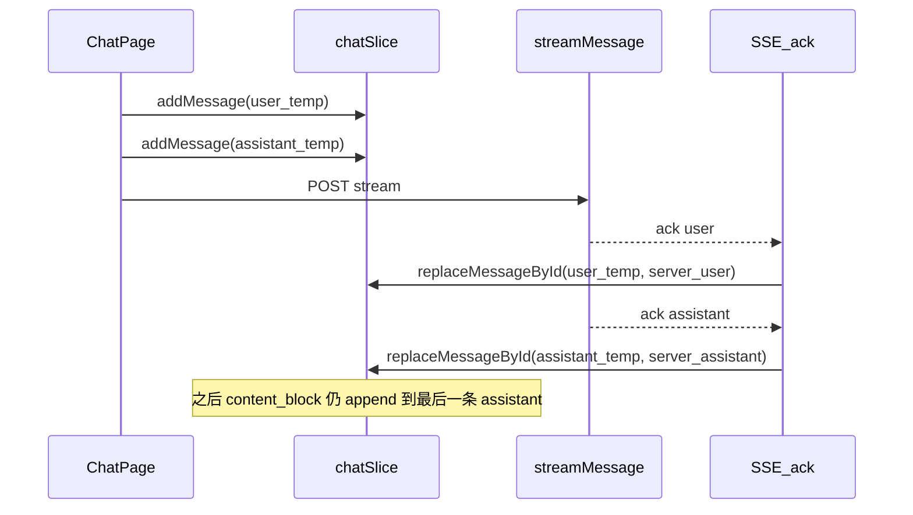

# 乐观 user + assistant 占位与 ack 替换

## 现状与目标

- 当前 [`ack`](frontend/src/hooks/chat.ts) 处理器对每条 `ack` 执行 `addMessage`，首包前列表为空，体验差。
- 目标：在 `await chatAPI.streamMessage(...)` **之前**向 Redux 追加两条消息（`user` 全文 + `assistant` 空占位，`MessageStatus.Pending`），收到 `ack` 时按**旧 id 替换**为服务端消息，不改变后续 `content_block` / `done` 等逻辑（仍依赖「最后一条为 assistant」）。

## 1. Redux：`replaceMessageById`

文件：[`frontend/src/store/slices/chatSlice.ts`](frontend/src/store/slices/chatSlice.ts)

- 新增 reducer：`replaceMessageById`，payload：`{ conversationId, messageId: string, data: ChatMessage }`。
- 在 `messages` 中查找 `message.id === messageId`，整行替换为 `normalizeMessage(data)`；找不到则 no-op（或打 warn，便于调试）。
- 导出 action，并在 [`updateLastMessageTimeMiddleware.ts`](frontend/src/store/middleware/updateLastMessageTimeMiddleware.ts) 的 `MESSAGES_MODIFYING_ACTIONS` 中加入 `chat/replaceMessageById`，保证 `lastMessageUpdateAt` 与 IndexedDB 同步一致。

## 2. 临时 id 约定与构造占位消息

- 使用已有依赖 [`uuid`](frontend/package.json)（如 `v4`），建议 id 前缀例如 `local-`，便于识别乐观消息（中止/错误时跳过 `deleteMessage`）。
- 在 `hooks` 旁或 `utils` 增加小函数（二选一，保持与现有 `buildUserContentBlocks` 一致）：
  - `buildTempUserMessage(...)`：`contentBlocks` 来自现有 `buildUserContentBlocks`，`createdAt`/`updatedAt` 用 `new Date().toISOString()`，`messageMetadata` 来自 `requestConfig`（与现有 `ChatMessage` 形状一致）。
  - `buildTempAssistantMessage(userMessageId, requestConfig)`：`contentBlocks` 空数组或最小占位；`replyTo` 设为**用户临时 id**（与 [`ChatMessage`](frontend/src/interfaces/chat.ts) 字段一致）；`status: Pending`。

无需改后端协议。

## 3. 修改 `sendMessage`（核心）

文件：[`frontend/src/hooks/chat.ts`](frontend/src/hooks/chat.ts)

**顺序（保持 `historyIds` 正确）：**

1. 现有逻辑：`buildUserContentBlocks`、中止上一轮、`setStreaming`/`setLoading`。
2. 计算 `historyIds`、`removedMessageIds`、`regenerateTitle`（仍基于当前 hook 中的 `messages`，在**任何**乐观 dispatch 之前）。
3. `clearMessagesAfterIndex`（若有 `index` 重发/编辑）——与现有一致。

**与 `clearMessagesAfterIndex` 的配合（勿与旧版 `length = index + 1` 混淆）：**
当前实现为 [`chatSlice` 中 `chatState.messages.length = index`](frontend/src/store/slices/chatSlice.ts)，保留的是下标 **`0 .. index - 1`**，**下标 `index` 处的 user（及之后消息）已被截断删除**。因此重发锚点那条 user **不会**留在列表里，**无需**再对 `removedMessageIds[0]` 做额外的 `removeMessageById`。`removedMessageIds` 仍按现有逻辑传给 `streamMessage` 供后端删库即可。

4. 生成 `userTempId`、`assistantTempId`，`dispatch(addMessage)` 两次插入占位。
5. 使用 `useRef` 保存本轮 `{ userTempId, assistantTempId }`，供 `ack` 闭包替换使用。

**`ack` 处理器调整：**

- 用 [`isUserRole`](frontend/src/utils/chat.ts)（即 `data.role === "user"`）分支：**用户 `ack`** → `replaceMessageById(userTempId, data)`；**非用户**（当前实现中即为 assistant）→ `replaceMessageById(assistantTempId, data)`。均**不再** `addMessage`。
- 若将来出现 `system` 等其它 `role` 的 `ack`，需明确策略（忽略、`replaceMessageById` 或打 warn），避免写错占位 id。
- 两轮 ack 后可在 ref 中清空临时 id，避免误匹配下一轮。

**首条 `ack` 与 `setLoading`：** 现有逻辑在收到非 `ack`/`refresh_conversation`/`title` 时才 `setLoading(false)`。占位后列表非空，最后一条 assistant 仍会拿到 `isLoading`，与 [`ChatMessageList`](frontend/src/pages/ChatPage/components/ChatMessage/ChatMessageList.tsx) 行为一致；无需单独做「空状态 loading」。

## 4. 中止 `abortMessage`

文件：同上 [`chat.ts`](frontend/src/hooks/chat.ts)

- 当前逻辑：`lastMessageCheck` 取最后一条 assistant，`clearLastMessage` + `chatAPI.deleteMessage(lastMessage.id)`。
- 乐观场景下：若仍为 `local-*` id，**不应**调用后端删除（消息可能尚未落库）；应同时移除**用户占位 + 助手占位**（例如两次 `removeMessageById` 或新增 `removeMessagesByIds` 一次 dispatch）。
- 若用户已 ack、助手仍为占位：仅删除服务端已存在的 user（需服务端 id）属于进阶边界，可在首版约定「中止仅发生在首包前」或根据 ref 是否已收到 user ack 分支处理；至少在计划中写明一种明确策略（推荐：**未收到任何 ack** 时双删且不请求 API；**已收到 user ack** 时对 user 调 `deleteMessage` 真实 id + 本地删 assistant 占位）。

## 5. 错误与 `catch`

- `streamMessage` 的 `onError`、`catch` 中当前仅 `resetState`（清 `isLoading`/`isStreaming`），**不会**删除消息。需补充：若仍存在 `local-*` 占位，移除本轮两条占位，避免界面残留假消息。
- `error` 事件处理器：视产品需求决定是否也清理占位（若与 `onError` 重复，需防双删）。

## 6. 回归范围

- 新会话：[`useCachedRequest`](frontend/src/hooks/chat.ts) 触发的首条 `sendMessage`。
- 已有会话：输入框直接发送。
- 编辑/重发：带 `index` 与 `removedMessageIds` 的路径。
- IndexedDB：[`dbMiddleware`](frontend/src/store/middleware/dbMiddleware.ts) 会持久化整份 `chatState`；替换 id 后自然落库，无需额外逻辑。

## 7. 测试建议

- 手动：Chrome DevTools **Slow 3G** + **Backend slow**（若有）下，确认发送后立即出现用户气泡 + 助手 loading。
- 中止：首包前停止，列表恢复为发送前状态，网络面板无对 `local-` id 的 DELETE。
- 编辑重发：历史与占位不重复、无多余条数。
