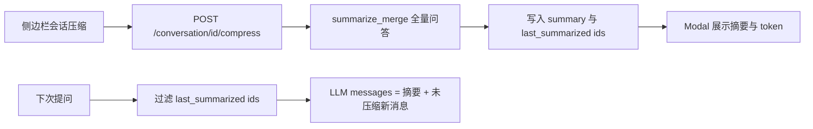

# 会话压缩（手动全量摘要）

## 行为约定

- 压缩对象是**该菜单项对应会话**的全部已完成问答（UI 消息列表不变，只压缩发给 LLM 的上下文）。
- 写入现有表 `[conversation_contexts](backend/app/models/conversation_contexts_db.py)`：`summary_before_window` + `last_summarized_message_ids`（全部被压缩消息 id）。
- 下次问答：`history_ids` 中若 id 落在 `last_summarized_message_ids`，**不进入** LLM `messages`；`summary_before_window` 仍走现有 `[get_user_message_for_tool_calls](backend/app/prompts/prompt_utils.py)` 注入。
- 会话有进行中回合（前端 `isStreaming` 或任意消息 `status=pending`）时菜单项禁用；后端同样拒绝（409）。
- 成功后弹 Modal：摘要正文 + 压缩前/后 token 数。




## 关键语义修正（必须一起做）

当前 `last_summarized_message_ids` 只用于窗口外摘要的增量/防抖，**下次仍会把原文塞进 history**。自动 Step 3 还会用「当次 out_of_window ids」**覆盖**该字段。

手动全量压缩后若仍覆盖，下一次自动切窗会把 ids 收成子集，已压缩原文会重新进入 LLM。因此：

1. **加载 history 时过滤** `last_summarized_message_ids`（手动、自动共用）。
2. 自动 Step 3 持久化改为 **UNION**：`last_summarized = old_ids ∪ 本次 out_of_window ids`。
3. 增量摘要：`working_history` 已不含旧 ids 时，`last ⊆ current` 不再成立；改为对 delta 做 `summarize_merge(prior, new_messages)`，ids 用 UNION 写回。

入口改 `[chat_orchestrator.py](backend/app/services/chat/chat_orchestrator.py)` 约 343–353 行：在 `get_history_messages_by_ids` 之后调用过滤，而不是 `prepared_history_messages = history_messages_from_db`。

## 后端

**接口**：`POST /api/conversation/{conversation_id}/compress`（挂在 `[backend/app/api/conversation.py](backend/app/api/conversation.py)`）

- 鉴权 + 校验会话属于当前用户。
- 有 `pending` 消息 → `409`「对话进行中，无法压缩」。
- 无消息 → `400`。
- 已全量压缩过（当前消息 id 集合 == `last_summarized_message_ids` 且已有摘要）→ 不调 LLM，直接返回已有摘要和统计。
- 否则：已有摘要则增量 merge 未覆盖的消息，否则对全部问答 `summarize_merge`（复用 `[ContextSummaryService](backend/app/services/conversation/context_summary_service.py)` + `window_out_summary.summary_max_tokens`）。
- 响应 schema（snake_case，前端会转 camelCase）：

```python
class ConversationCompressResponse(BaseModel):
    summary: str
    tokens_before: int   # 被压缩问答按摘要输入文本计 token
    tokens_after: int    # summary_before_window 的 token
    summarized_message_count: int
```

**服务**：在 `[HistoryContextService](backend/app/services/chat/history_context_service.py)` 增加：

- `filter_summarized_history(conversation_id, messages) -> list[ChatMessage]`
- `compact_full_conversation(conversation_id, messages) -> ConversationCompressResponse`
- 修正 `_generate_summary_with_guard` 的 ids UNION / 增量条件

`[MessageDbService](backend/app/services/message/message_db.py)` 增加按会话拉取 `ChatMessage` 列表、判断是否存在 `pending`。

Token 统计：用 summarization scenario 的 `TokenCalculator`；`tokens_before` 对 `format_conversation_for_summary(messages)` 计数，`tokens_after` 对最终摘要计数。

## 前端

侧边栏菜单（`[frontend/src/components/Layout/hooks.tsx](frontend/src/components/Layout/hooks.tsx)` 32–54 行）在「重命名」和「删除」之间增加：

```tsx
{
  label: "会话压缩",
  key: "compress",
  icon: <CompressOutlined />,
  disabled: isBusy, // chat[id].isStreaming 或存在 Pending 消息
}
```

- 点击先 `modal.confirm`（说明只压缩模型上下文、聊天记录仍保留）。
- `conversationAPI.compressConversation(id)` → `POST /conversation/{id}/compress`，该请求 `timeout` 提到 120s（默认 30s 不够）。
- 成功后打开结果 Modal（新文件，风格对齐 `[RenameModal](frontend/src/components/Layout/modals/RenameModal.tsx)`）：滚动展示 `summary`，顶部展示「压缩前 X tokens → 压缩后 Y tokens」。
- `[conversationSlice](frontend/src/store/slices/conversationSlice.ts)` 增加 thunk；`[conversation.ts` service/interfaces](frontend/src/services/conversation.ts) 增加类型与 API。

## 测试

- `HistoryContextService`：全量压缩写入 ids；再次调用幂等；过滤后 history 不含已摘要 id。
- `_generate_summary_with_guard`：第二次切窗 UNION ids，且带 prior 做增量 merge。
- `ChatOrchestrator` 加载 history 时跳过 `last_summarized_message_ids`。
- 进行中会话压缩返回 409（可测 service 层，不必强上 API）。

不改库表，无需 Alembic。