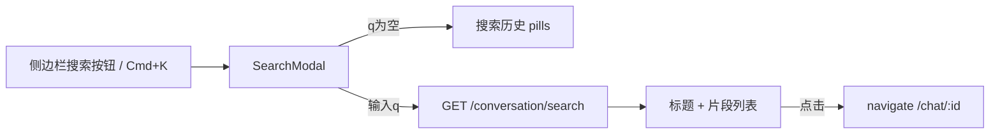

# 会话搜索功能（豆包式）

## 已确认决策

- 点击结果：仅 `navigate(/chat/:id)`，不定位到具体消息
- 空态：只展示最近搜索关键词（localStorage），不展示最近对话列表
- 附带：⌘K / Ctrl+K 打开弹窗

## 交互流程

## 后端：新增搜索 API

现有 [`backend/app/api/conversation.py`](backend/app/api/conversation.py) 无搜索；消息正文在 `messages.content_blocks`（JSON），无 FTS。MVP 用 `ILIKE`，不做新迁移/生成列。

**接口**：`GET /api/conversation/search?q={keyword}&cursor=&limit=20`

**实现落点**：
- Schema：[`backend/app/schemas/conversation.py`](backend/app/schemas/conversation.py) 增加 `ConversationSearchItem` / `ConversationSearchResponse`
  - 字段：`id`, `title`, `match_type` (`title` | `user` | `assistant`), `snippet`, `updated_at`（用会话的 `last_message_created_at` 或 `updated_at`）
- Service：[`backend/app/services/conversation/conversation_db.py`](backend/app/services/conversation/conversation_db.py) 新增 `search_conversations`
  - 强制 `user_id` + `is_active=true`
  - Title 命中：`conversations.title ILIKE '%q%'`
  - 消息命中：join `messages`，`role IN ('user','assistant')`，`status='done'`，`content_blocks::text ILIKE '%q%'`
  - 按 conversation 去重；优先 `title` 命中，否则取最早一条匹配消息做 snippet
  - Snippet：从 `content_blocks` 用已有 [`collect_text_from_blocks`](backend/app/schemas/chat.py) 抽文本，截取关键词前后约 40 字
  - 游标分页：复用现有 conversation cursor 风格（按 `last_message_created_at` + `id`）
- Route：在 `conversation.py` 增加 endpoint，返回 `ApiResponse[ConversationSearchResponse]`
- 单测：`backend/tests/` 下为 search 服务补 1–2 个用例（title 命中 / message 命中 / 用户隔离）

**不做本期**：`pg_trgm` / `tsvector`、跳转到 message id、搜索历史服务端存储。

## 前端：入口 + 弹窗

### 1. 侧边栏搜索按钮

改 [`SidebarHeader.tsx`](frontend/src/components/Layout/components/SidebarHeader.tsx)：在 Logo 行与「开启新对话」之间加一条搜索触发条（圆角灰底、左侧放大镜、「搜索...」、右侧 `⌘K` 提示）。折叠态浮动条里可加一个搜索图标按钮。

通过 props 上抛 `onOpenSearch`；在 [`MainLayout.tsx`](frontend/src/components/Layout/MainLayout.tsx) 持有 `searchOpen` state。

### 2. `SearchModal` 组件

新建 [`frontend/src/components/Layout/modals/SearchModal.tsx`](frontend/src/components/Layout/modals/SearchModal.tsx)（antd `Modal`，`centered`，无 footer，宽约 560–640）：

| 状态 | UI |
|------|----|
| `q` 为空 | 「搜索历史」+ pills；右侧「清除」清空全部；无历史时简短空提示 |
| 有输入 | 防抖（~300ms）调搜索 API；列表项：对话图标 + 标题（高亮）+ 片段（高亮，前缀「你:」/「助手:」）+ 相对时间 |
| 加载/空结果 | Spin / 「未找到相关对话」 |

交互：
- Enter / 点击 pill：填入关键词并搜索，同时写入历史
- 点击结果：`navigate(/chat/${id})`，关弹窗，写入历史
- Esc / 关闭按钮：关弹窗

### 3. 搜索历史（localStorage）

新建小工具，例如 `frontend/src/utils/searchHistory.ts`：
- key：`conversation-search-history:v1`
- 最近最多 10 条，去重、新词置顶
- 提供 `get` / `add` / `clear`

### 4. API 与类型

- [`frontend/src/services/conversation.ts`](frontend/src/services/conversation.ts) 增加 `searchConversations({ q, cursor, limit })`
- [`frontend/src/interfaces/conversation.ts`](frontend/src/interfaces/conversation.ts) 增加搜索响应类型

### 5. 全局快捷键

在 `MainLayout`（或 SearchModal 挂载处）监听 `keydown`：`metaKey/ctrlKey + k` → `preventDefault` 打开弹窗。弹窗打开时输入框 `autoFocus`。

## 关键文件一览

| 层 | 文件 |
|----|------|
| Backend | `schemas/conversation.py`, `services/conversation/conversation_db.py`, `api/conversation.py`, 新测试 |
| Frontend | `SidebarHeader.tsx`, `MainLayout.tsx`, 新 `SearchModal.tsx`, 新 `searchHistory.ts`, `services/conversation.ts`, `interfaces/conversation.ts` |

## 验收要点

- 侧边栏可见搜索入口；⌘K 可打开
- 空态只显示搜索历史；清除后为空
- 能搜到 title / 用户消息 / 助手回复
- 点击结果进入对应会话，不依赖消息定位
- 仅当前用户数据；无关键词时不调搜索 API
