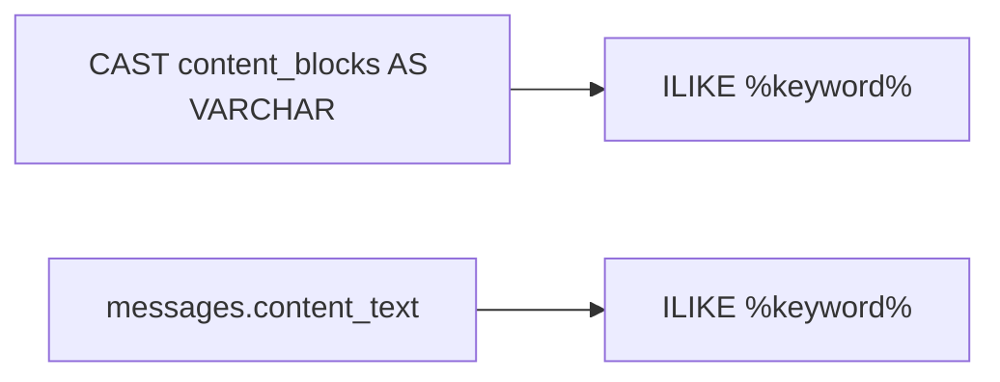

# Step 1：会话搜索纯文本冗余列

## 目标

去掉搜索时对 `content_blocks` 的 `CAST(... AS VARCHAR) + ILIKE`，改为对预先提取的纯文本列匹配，避免每次查询序列化整段 JSON。

当前两处查询都走 JSON 序列化：

```221:221:backend/app/services/conversation/conversation_db.py
        content_text = sa_cast(cast(Any, MessageDb.content_blocks), String)
```

[`_build_search_item`](backend/app/services/conversation/conversation_db.py) 里 snippet 查询同样 `sa_cast`。



行为变化（有意为之）：以前会匹配 JSON 里的字段名、tool 参数等；改造后只匹配 `type=text` 的正文。

## 1. 模型增加 `content_text`

在 [`backend/app/models/message_db.py`](backend/app/models/message_db.py) 增加可空 `Text` 列：

```python
content_text: str | None = Field(
    default=None,
    sa_column=Column(Text, nullable=True),
    description="content_blocks 中 TextBlock 纯文本拼接，供会话搜索",
)
```

**不建 B-tree 索引。** `%keyword%` 前导通配无法走 btree，长文本索引写入成本高；GIN/tsvector 留给 Step 2。

## 2. 写入时同步纯文本（SQLite 测试 + ORM 写入）

现有搜索测试用 SQLite 内存库，没有 Postgres 触发器。需要在 Python 侧同步，否则查询改完后测试全部 miss。

- 复用已有 [`collect_content_from_block_payloads`](backend/app/schemas/chat.py)（`"".join` 拼接所有 `TextBlock.text`）。
- 在 [`backend/app/services/message/message_db.py`](backend/app/services/message/message_db.py) 的 `create_user_message` / `create_assistant_message` / `update_assistant_message` 写入 `content_text`。
- 测试 helper [`_add_message`](backend/tests/services/conversation/test_conversation_search.py) 同样写入 `content_text=text`，这样 SQLite 下中文关键词也能命中（可去掉「JSON 存成 `\\uXXXX`」那条注释限制）。

不额外加 SQLAlchemy mapper event，避免和触发器双重来源不好排查；测试路径显式赋值即可。

## 3. Alembic：加列 + 触发器 + 回填

当前 head 是 `g0a1b2c3d4e5`。新建 [`backend/alembic/versions/`](backend/alembic/versions/) 脚本（手动写，不要 autogenerate——触发器和回填 ORM 表达不了）：

`upgrade()`：

1. `op.add_column("messages", sa.Column("content_text", sa.Text(), nullable=True))`
2. `CREATE OR REPLACE FUNCTION sync_message_content_text()`：`content_blocks` 为 NULL 或非 array 时置 `NULL`；否则 `jsonb_array_elements` 取 `type='text'` 的 `text`，`string_agg(..., '')` 与 Python `"".join` 对齐
3. `CREATE TRIGGER trg_sync_content_text BEFORE INSERT OR UPDATE OF content_blocks ON messages ...`
4. 回填历史：`UPDATE messages SET content_text = (...) WHERE content_blocks IS NOT NULL`（触发器会在 UPDATE 时自动填，也可直接 `SET content_blocks = content_blocks` 触发；更稳妥是 SQL 与函数同一套提取逻辑做一次性 UPDATE）

`downgrade()`：`DROP TRIGGER` → `DROP FUNCTION` → `drop_column`。

触发器兜底生产环境任意写入路径；Python 赋值保证 SQLite 测试和 ORM 写入立刻可用。

## 4. 查询改造

[`backend/app/services/conversation/conversation_db.py`](backend/app/services/conversation/conversation_db.py)：

- `search_conversations` 与 `_build_search_item` 两处改为：
  ```python
  content_text = cast(Any, MessageDb.content_text)
  ```
- 去掉不再使用的 `sa_cast` / `String` import。
- snippet 仍用 `collect_content_from_block_payloads(message.content_blocks)`（已加载的 JSON），不改展示逻辑。

## 5. 测试与校验

- 更新 [`test_conversation_search.py`](backend/tests/services/conversation/test_conversation_search.py)：`_add_message` 写入 `content_text`；可补一条中文正文搜索（验证不再依赖 JSON 序列化）。
- `cd backend && make lint`
- `uv run alembic heads` 确认单 head
- `uv run pytest tests/services/conversation/test_conversation_search.py`

不改 Step 2（zhparser / tsvector）。
