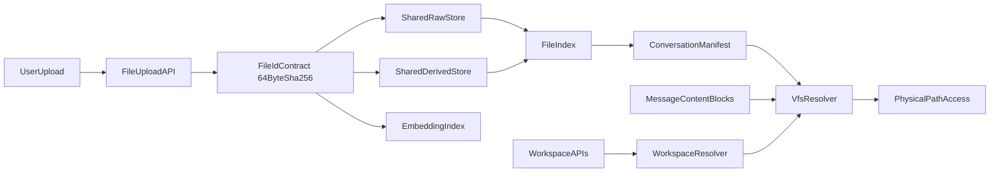

# 会话文件存储与虚拟路径迁移方案

## 目标与范围

- 将迁移拆成两层，避免把附件存储、会话挂载和 workspace 目录重构混在同一批改动里：
  - **附件存储迁移**：从当前 `user_data/<user_id>/uploads` 逐步迁移到 `user_data/<user_id>/shared/uploads/{raw,derived}`；先统一 `file_id` 语义，保持当前 64 位 SHA256 与 `kb_file_chunk_embeddings.file_id` 兼容；新增 `storage_key` 或 `physical_name` 承载 `file_<sha>.pdf`、`drv_<sha>.md` 等物理命名。
  - **会话挂载/虚拟路径迁移**：新增 `user_data/<user_id>/conversations/<conversation_id>/uploads/manifest.json` 作为会话上传挂载索引；单独规划 workspace 从当前 `user_data/<user_id>/workspaces/<workspace_id>` 到会话虚拟路径/会话目录的迁移策略。
- 在消息 `content_blocks` 中，从“仅 `url` 引用”演进为“`url + file_id + storage_key + storage_version` 双轨兼容”（`vpath` 不持久化）。
- 保证历史会话可读、上传不中断、迁移可灰度可回滚。

## 当前基线（代码现状）

- 上传入口在 [backend/app/api/file.py](/Users/apple/Desktop/code/chat-agent/backend/app/api/file.py)：`/upload` 返回 `AttachmentBlock`，`/preview/{user_id}/{filename}` 走磁盘路径。
- 附件路径与 URL 组装在 [backend/app/services/chat_upload/attachment.py](/Users/apple/Desktop/code/chat-agent/backend/app/services/chat_upload/attachment.py)：
  - `get_user_upload_dir()` 固定到 `.../user_data/<uid>/uploads`
  - `build_attachment_preview_url()` 固定旧 URL 形态
- PDF/图片上传分别在：
  - [backend/app/services/chat_upload/pdf.py](/Users/apple/Desktop/code/chat-agent/backend/app/services/chat_upload/pdf.py)
  - [backend/app/services/chat_upload/image.py](/Users/apple/Desktop/code/chat-agent/backend/app/services/chat_upload/image.py)
- 消息持久化模型在 [backend/app/models/message_db.py](/Users/apple/Desktop/code/chat-agent/backend/app/models/message_db.py)：`content_blocks` 为 JSON，可直接做兼容字段扩展。
- 块结构在 [backend/app/schemas/chat.py](/Users/apple/Desktop/code/chat-agent/backend/app/schemas/chat.py)：`ImageBlock/PdfBlock/MarkdownBlock` 目前核心引用字段是 `url`。
- 当前 PDF 上传在 [backend/app/services/chat_upload/pdf.py](/Users/apple/Desktop/code/chat-agent/backend/app/services/chat_upload/pdf.py) 中使用原始 PDF 内容 SHA-256：
  - `PdfBlock.id = content_hash`
  - `MarkdownBlock.id = content_hash`
  - 物理文件为 `<content_hash>.pdf` 与 `<content_hash>.md`
- 当前 RAG/embedding 依赖 64 位 SHA256：
  - [backend/app/models/kb_file_chunk_embedding_db.py](/Users/apple/Desktop/code/chat-agent/backend/app/models/kb_file_chunk_embedding_db.py)：`file_id` 为 `String(64)`
  - [backend/app/utils/multimodal.py](/Users/apple/Desktop/code/chat-agent/backend/app/utils/multimodal.py)：从 `PdfBlock.id`、`MarkdownBlock.id` 收集候选 `file_id`
  - [backend/app/services/chat/kb_rag_context_service.py](/Users/apple/Desktop/code/chat-agent/backend/app/services/chat/kb_rag_context_service.py)：按 `user_id + file_id` 检索，并从旧 uploads 目录读取 `{file_id}.md`
- 当前 workspace 目录不是 `conversations/<cid>/workspace`，而是 `user_data/<user_id>/workspaces/<workspace_id>`：
  - [backend/app/mcp/mcp_servers/agent_skills_mcp/utils.py](/Users/apple/Desktop/code/chat-agent/backend/app/mcp/mcp_servers/agent_skills_mcp/utils.py)：`get_workspace_root()` 固定到 `workspaces/<workspace_id>`
  - [backend/app/api/workspace.py](/Users/apple/Desktop/code/chat-agent/backend/app/api/workspace.py)：文件树、文件内容、下载、预览均复用 `resolve_workspace_path()`
  - [backend/app/prompts/prompt_utils.py](/Users/apple/Desktop/code/chat-agent/backend/app/prompts/prompt_utils.py)：系统提示里的 `workspace_dir` 固定展示 `data/user_data/<user_id>/workspaces/<workspace_id>`
  - [frontend/src/pages/ChatPage/components/BlockPreviewPanel/ProjectPreview/index.tsx](/Users/apple/Desktop/code/chat-agent/frontend/src/pages/ChatPage/components/BlockPreviewPanel/ProjectPreview/index.tsx)：ProjectPreview 通过 `/api/workspaces` 链路读取与预览 workspace

## 目标架构



说明：
- **第一层：附件存储迁移**。`file_id` 是稳定业务标识，必须优先兼容现有 embedding/RAG；`storage_key` 或 `physical_name` 是存储标识，可带前缀、后缀和目录语义。
- **第二层：会话挂载/虚拟路径迁移**。`conversation/uploads` 实现为“虚拟视图（挂载关系）”，不做文件拷贝；workspace 迁移独立处理，先兼容旧 `workspaces/<workspace_id>`，再切换到会话目录或虚拟路径。
- 真实文件位置只在服务端解析，Agent/前端只接触虚拟引用。
- Agent 可见的虚拟路径由 resolver 动态生成，例如：
  - `/conversations/<conversation_id>/uploads/raw/<storage_key>`
  - `/conversations/<conversation_id>/uploads/derived/<storage_key>`
  - `/conversations/<conversation_id>/workspace/<relative_path>`（workspace 迁移完成后）

## 分阶段实施

### Phase 0：file_id 合约与兼容读取先行（不改现网写入）

- 明确 `file_id` 合约：
  - `file_id` 是业务层稳定文件标识，优先保持当前 64 位 SHA256，兼容 `kb_file_chunk_embeddings.file_id String(64)`。
  - `storage_key` 或 `physical_name` 是存储层物理标识，可使用 `file_<sha>.pdf`、`drv_<sha>.md`、`img_<sha>.jpg` 等命名。
  - 对 PDF，现有 `content_hash` 继续作为 `file_id`；Markdown 派生物可共享原 PDF `file_id`，并通过 `derived_kind`、`storage_key` 区分。
  - 对图片，需先定义哈希输入：建议以处理后实际落盘 bytes 的 SHA256 作为 `file_id`，避免同一原图因转码/压缩后物理文件与展示内容不一致。
- 新增统一解析层（VFS Resolver）：支持解析以下引用输入并返回真实路径与权限校验结果：
  - 旧 `url`（`/api/file/preview/{user_id}/{filename}`）
  - 新 `file_id`
  - 新 `storage_key`（仅服务端解析，不作为 embedding/RAG 的候选 ID）
- `vpath` 作为动态输出能力（可选），不作为持久化输入依赖。
- 保留旧预览接口；新增基于 `file_id` 的预览入口。
- 验证点：历史会话附件可正常预览，行为与当前一致。

### Phase 1：附件上传链路升级为“shared + 会话挂载”

- `upload` 接口增加 `conversation_id`（先可选，灰度后改必填）。
- 写入策略：
  - 原始文件写入 `shared/uploads/raw`
  - 衍生文件写入 `shared/uploads/derived`
  - 在 `conversations/<cid>/uploads/manifest.json` 新增挂载记录
- 返回结构：保持 `url`，新增 `file_id`、`storage_key`、`storage_version=2`；`vpath` 如需展示由服务端动态生成。
- `kb_file_chunk_embeddings` 继续写入 64 位 `file_id`，不得写入 `file_<sha>.pdf` 这类 storage key。
- 验证点：新消息中 `content_blocks` 同时包含旧新字段；前端无感。

### Phase 2：会话挂载与历史数据回填（离线任务，幂等）

- 扫描 `messages.content_blocks` 中附件块（`image/pdf/markdown`），递归处理 `PdfBlock.markdown`。
- 解析旧 URL 得到 `{user_id, filename}`，结合消息 `conversation_id` 建挂载关系。
- 回填块字段：`file_id`、`storage_key`、`storage_version`（保留 `url`）；不回填持久化 `vpath`。
- 失败项（缺文件、非法 URL）写入迁移失败清单，支持重试。
- 验证点：抽样历史会话，附件读取优先走新引用并可回退旧 URL。

### Phase 3：workspace 现状迁移与 ProjectPreview 兼容

- 保持旧 workspace 目录可读写：`user_data/<user_id>/workspaces/<workspace_id>`。
- 新增 workspace resolver 兼容层：
  - 旧输入：`workspace_id` 继续解析到旧目录。
  - 新输入：`conversation_id` 或 vpath 可解析到 `conversations/<conversation_id>/workspace`。
  - 灰度期间 ProjectPreview、MCP 工具和 prompt 使用同一 resolver，不在各处重复拼路径。
- 覆盖链路：
  - `agent_skills_mcp/utils.py`：`get_workspace_root()`、`resolve_workspace_path()` 支持新旧根目录。
  - `api/workspace.py`：文件树、文件内容、下载、预览入口接入 workspace resolver。
  - `prompt_utils.py`：`workspace_dir` 从 resolver 获取，不再硬编码 `workspaces/<workspace_id>`。
  - 前端 ProjectPreview：继续传 `workspaceId`，后端兼容；后续如切到 `conversationId` 或 vpath，再更新 block schema。
- 验证点：Agent 写文件、前端文件树、文件内容、下载 zip、预览 `dist/index.html` 均可在新旧 workspace 上工作。

### Phase 4：切流与收口

- 附件读取优先级切为：`file_id + storage_key > url`（`vpath` 仅展示，不参与持久化读取判定）。
- 上传接口将 `conversation_id` 改必填。
- workspace 写入默认切到会话目录，旧 `workspaces/<workspace_id>` 保留只读兼容窗口。
- 旧 URL 预览接口保留 1~2 个版本窗口后评估下线。
- 引入清理策略：会话卸载、无引用文件延迟删除、回收站策略。

## 文件级改造清单

- [backend/app/schemas/chat.py](/Users/apple/Desktop/code/chat-agent/backend/app/schemas/chat.py)
  - 为 `ImageBlock/PdfBlock/MarkdownBlock` 增加可选字段：`file_id`、`storage_key`、`storage_version`。
  - PDF 派生 Markdown 增加可选 `derived_from_file_id`、`derived_kind`；注意这些字段进入前端后会 camelCase。
  - `vpath` 如保留，仅作为响应动态字段，不写入持久化数据。
  - 过渡期保留 `url`。
- [backend/app/api/file.py](/Users/apple/Desktop/code/chat-agent/backend/app/api/file.py)
  - `upload` 新增 `conversation_id` 参数（先可选）。
  - 新增按 `file_id` 预览接口。
- [backend/app/services/chat_upload/attachment.py](/Users/apple/Desktop/code/chat-agent/backend/app/services/chat_upload/attachment.py)
  - 抽离路径构建与引用生成逻辑，接入 shared 目录与 resolver。
  - 新增 `file_id` 与 `storage_key` 构建工具，禁止将带前后缀的物理名写入 embedding `file_id`。
- [backend/app/services/chat_upload/image.py](/Users/apple/Desktop/code/chat-agent/backend/app/services/chat_upload/image.py)
  - 上传后按处理后 bytes 计算图片 `file_id`，生成 `storage_key` 并挂载到会话。
- [backend/app/services/chat_upload/pdf.py](/Users/apple/Desktop/code/chat-agent/backend/app/services/chat_upload/pdf.py)
  - 继续使用原始 PDF SHA256 作为 `file_id`；PDF 与 Markdown 分别生成 raw/derived `storage_key` 并建立派生关系。
  - embedding 写入和 RAG 候选仍使用 64 位 `file_id`。
- [backend/app/models/message_db.py](/Users/apple/Desktop/code/chat-agent/backend/app/models/message_db.py)
  - 无需立刻改表结构；`content_blocks` JSON 可直接承载新增字段。
- [backend/app/models/kb_file_chunk_embedding_db.py](/Users/apple/Desktop/code/chat-agent/backend/app/models/kb_file_chunk_embedding_db.py)
  - 不改 `file_id String(64)` 语义；如需记录物理路径，放入 metadata 或新增文件索引表，不复用该列。
- [backend/app/utils/multimodal.py](/Users/apple/Desktop/code/chat-agent/backend/app/utils/multimodal.py)
  - 附件候选收集优先读 `file_id`，兼容旧数据读 `id`。
- [backend/app/services/chat/kb_rag_context_service.py](/Users/apple/Desktop/code/chat-agent/backend/app/services/chat/kb_rag_context_service.py)
  - 短文档全文读取改由 resolver 找到 Markdown 派生文件，不能继续硬编码旧 uploads 目录。
- [backend/app/mcp/mcp_servers/agent_skills_mcp/utils.py](/Users/apple/Desktop/code/chat-agent/backend/app/mcp/mcp_servers/agent_skills_mcp/utils.py)
  - 抽象 workspace root resolver，兼容旧 `workspaces/<workspace_id>` 与新 `conversations/<conversation_id>/workspace`。
- [backend/app/api/workspace.py](/Users/apple/Desktop/code/chat-agent/backend/app/api/workspace.py)
  - 文件树、文件内容、下载、预览统一走 workspace resolver。
- [backend/app/prompts/prompt_utils.py](/Users/apple/Desktop/code/chat-agent/backend/app/prompts/prompt_utils.py)
  - `workspace_dir` 由 resolver 返回，避免 prompt 与真实路径不一致。
- [frontend/src/services/file.ts](/Users/apple/Desktop/code/chat-agent/frontend/src/services/file.ts)
  - 上传接口支持可选 `conversationId`；注意 multipart 请求不会被全局 snakecase 自动转换，需要显式传 `conversation_id`。
- [frontend/src/interfaces/contentBlock.ts](/Users/apple/Desktop/code/chat-agent/frontend/src/interfaces/contentBlock.ts)
  - 补充 `fileId`、`storageKey`、`storageVersion`、`derivedFromFileId`、`derivedKind` 等字段。
- [frontend/src/pages/ChatPage/components/BlockPreviewPanel/ProjectPreview/index.tsx](/Users/apple/Desktop/code/chat-agent/frontend/src/pages/ChatPage/components/BlockPreviewPanel/ProjectPreview/index.tsx)
  - 保持 `workspaceId` 兼容；后端切换 resolver 后验证文件树、预览、下载链路。

## 数据与安全策略

- 权限校验强制在 resolver 层完成：`user_id + conversation_id + mount relation`。
- 禁止外部直接传物理路径；仅接受 `url/file_id/storage_key/vpath` 这类受控引用（`vpath` 仅作为可选展示输出）。
- 防路径穿越：保留并扩展现有 `Path.resolve + startswith` 安全校验。
- 建议补充 `file_index` 与 `mount_index`。若先用文件 manifest，必须明确原子写、并发锁、损坏恢复与补偿重试；如果迁移需要强一致或跨实例部署，优先数据库化。
- 会话上传挂载索引建议固定在 `user_data/<user_id>/conversations/<conversation_id>/uploads/manifest.json`；该目录只承载索引，不存放真实上传文件。
- 预览接口安全策略：
  - 旧 `/api/file/preview/{user_id}/{filename}` 在兼容期保留，但不扩大能力范围。
  - 新 `file_id/storage_key` 预览必须登录，并校验 `conversation.user_id == auth.user_id` 与挂载关系。
  - ProjectPreview 当前存在公开 `/{user_id}/{workspace_id}/preview-content` 入口，workspace 迁移时需要重新评估是否继续依赖“不可猜测路径”，或改成登录态校验。

## 会话虚拟路径与 Manifest 约定

- 物理存储路径：
  - `user_data/<user_id>/shared/uploads/raw/<storage_key>`
  - `user_data/<user_id>/shared/uploads/derived/<storage_key>`
- 会话挂载索引：
  - `user_data/<user_id>/conversations/<conversation_id>/uploads/manifest.json`
- Agent/前端可见虚拟路径：
  - `/conversations/<conversation_id>/uploads/raw/<storage_key>`
  - `/conversations/<conversation_id>/uploads/derived/<storage_key>`
- Resolver 处理流程：
  1. 解析虚拟路径得到 `conversation_id`、`kind=raw|derived`、`storage_key`。
  2. 读取 `uploads/manifest.json`，确认该 `storage_key` 已挂载到当前会话，并反查对应 `file_id`。
  3. 执行 `user_id + conversation_id + mount relation` 权限校验。
  4. 将虚拟路径映射到 `shared/uploads/raw|derived/<storage_key>`。
  5. 对最终路径执行 `Path.resolve + startswith` 校验后再开放读取。
- `manifest.json` 推荐结构：

```json
{
  "uploads": [
    {
      "file_id": "<sha256>",
      "storage_key": "file_<sha256>.pdf",
      "kind": "raw",
      "mime": "application/pdf",
      "physical_path": "shared/uploads/raw/file_<sha256>.pdf",
      "display_name": "合同.pdf"
    },
    {
      "file_id": "<sha256>",
      "storage_key": "drv_<sha256>.md",
      "kind": "derived",
      "mime": "text/markdown",
      "derived_from_file_id": "<sha256>",
      "derived_kind": "pdf_to_markdown",
      "physical_path": "shared/uploads/derived/drv_<sha256>.md",
      "display_name": "合同.md"
    }
  ]
}
```
- `vpath` 只作为动态响应字段或 Agent 工具入参使用，不写入消息持久化数据；消息持久化仍以 `file_id + storage_key + storage_version` 为准。

## file_id、storage_key 与文件命名规范

- `file_id` 统一约束：
  - 业务含义：文件内容标识，用于消息引用、会话挂载、RAG 候选、embedding 查询。
  - 格式约束：优先保持 64 位 SHA256 十六进制字符串，兼容 `kb_file_chunk_embeddings.file_id String(64)`。
  - 不允许把 `file_<sha>.pdf`、`drv_<sha>.md` 写入 `file_id`。
- `storage_key` 统一约束：
  - 存储含义：物理文件名或对象 key，用于 resolver 映射磁盘路径。
  - 可包含业务前缀和扩展名，例如 `file_<sha256>.pdf`、`drv_<sha256>.md`、`img_<sha256>.jpg`。
- PDF 原始文件：
  - `file_id=<pdf_sha256>`
  - `storage_key=file_<pdf_sha256>.pdf`
- PDF 派生 Markdown：
  - `file_id=<pdf_sha256>`（保持与原 PDF 同源，兼容当前 RAG）
  - `storage_key=drv_<pdf_sha256>.md`
  - `derived_from_file_id=<pdf_sha256>`
  - `derived_kind=pdf_to_markdown`
- 图片：
  - 建议 `file_id=<processed_image_sha256>`，以实际落盘 bytes 计算。
  - `storage_key=img_<processed_image_sha256>.<ext>`
- 关系约束：
  - 衍生文件必须记录 `derived_from_file_id` 与 `derived_kind`。
  - 同一 `file_id` 可对应多个 `storage_key`，但同一会话 manifest 中 `storage_key` 应唯一。
- 兼容策略：过渡期继续保留旧 `url`，新逻辑优先依赖 `file_id + storage_key` 与派生关系字段。

## Workspace 现状迁移策略

- 当前目录：`user_data/<user_id>/workspaces/<workspace_id>`，其中 `workspace_id` 在聊天里实际等于 `conversation_id`。
- 目标目录候选：`user_data/<user_id>/conversations/<conversation_id>/workspace`。
- 迁移原则：
  - 第一阶段不移动已有 workspace 文件，只新增 resolver 兼容层。
  - 第二阶段新写入可灰度到 `conversations/<cid>/workspace`，读取按 `new_path > old_path` fallback。
  - 第三阶段完成历史 workspace 搬迁或保留旧目录只读映射。
- 后端改造点：
  - `agent_skills_mcp/utils.py` 的 `get_workspace_root()` 不再直接拼 `workspaces/<workspace_id>`，改为调用 workspace resolver。
  - `api/workspace.py` 所有文件读、下载、预览统一走同一 resolver。
  - `prompt_utils.py` 的 `workspace_dir` 使用 resolver 输出，确保 Agent 看到的路径与工具实际根目录一致。
- 前端 ProjectPreview 策略：
  - 保持 `ProjectBlock.workspaceId` 和 `/api/workspaces/{workspaceId}` API 不变，降低前端改动风险。
  - 后端 resolver 负责把 `workspaceId` 映射到旧目录或新会话目录。
  - 等后端完全切换后，再评估是否将 ProjectBlock 扩展为 `conversationId` 或 `workspaceVpath`。

## 灰度、回滚与验收

- 灰度顺序：
  1. `file_id/storage_key` 合约与读兼容上线
  2. 新上传双写字段上线
  3. 会话挂载与历史附件回填
  4. workspace resolver 兼容上线
  5. 读优先级切换与旧路径收口
- 回滚策略：
  - 任一阶段可退回“仅依赖 `url`”读取逻辑。
  - workspace 任一阶段可退回旧 `workspaces/<workspace_id>` 根目录。
  - 新增字段均为可选，不影响旧数据反序列化。
- 验收标准：
  - 历史消息附件可用率 >= 99.9%
  - 新消息 `content_blocks` 新字段覆盖率 = 100%（`file_id/storage_key/storage_version`）
  - `kb_file_chunk_embeddings.file_id` 保持 64 位 SHA256，RAG 检索命中率无明显下降
  - PDF 与 Markdown 的同源关系可追溯率 = 100%（`derived_from_file_id` 完整）
  - ProjectPreview 文件树、文件内容、下载 zip、应用预览在新旧 workspace 根目录均可用
  - 无跨用户/跨会话越权读取
  - 上传与预览接口 P95 延迟无显著回归

## 实施注意事项

- 迁移任务必须幂等（可重跑、可断点续跑）。
- 迁移期间不要删除旧 `uploads` 目录内容。
- workspace 迁移期间不要删除旧 `workspaces` 目录内容。
- `file_id` 与 `storage_key` 的分工必须先定稿再改上传链路，避免污染 embedding/RAG 数据。
- 先完成可观测性（迁移进度、失败率、回退次数）再推进最终收口。

## 具体迁移执行计划（Runbook）

### 里程碑与发布节奏

- M0（第 1 周前半）：定稿 `file_id/storage_key` 合约，补齐 schema 与 resolver 设计。
- M1（第 1 周后半）：完成附件 Resolver 与双格式读取，开启灰度读流量 10%。
- M2（第 2 周）：上线上传双写（`url + file_id + storage_key`），新写入覆盖率达到 100%。
- M3（第 3 周）：启动历史回填，按批次推进并完成全量回填。
- M4（第 4 周）：上线 workspace resolver 兼容层，ProjectPreview 与 MCP 工具双路径验证通过。
- M5（第 5 周）：切读优先级到新字段，旧 URL/旧 workspace 根目录保留只读兼容窗口（1~2 个版本）。

### Phase 0 详细步骤（file_id 合约与读兼容）

1. 定义并冻结 `file_id/storage_key` 合约：
   - `file_id` 保持 64 位 SHA256。
   - `storage_key` 承载 `file_<sha>.pdf`、`drv_<sha>.md`、`img_<sha>.<ext>`。
   - PDF/Markdown 同源关系用 `derived_from_file_id` 与 `derived_kind` 表达。
2. 新增 `resolve_file_ref(ref, user_id, conversation_id)`，支持 `url/file_id/storage_key` 输入。
3. 预览链路统一先走 resolver，再映射物理路径。
4. 增加观测字段：
   - `resolve_source=url|file_id|storage_key`
   - `storage_key`
   - `resolve_fallback=true|false`
   - `resolve_failed_reason`
5. 灰度策略：
   - 先在内部环境全量验证。
   - 线上按用户分组灰度 10% -> 30% -> 100%。
6. 验收门槛：
   - 附件预览成功率不低于基线。
   - P95 延迟回归 < 10%。

### Phase 1 详细步骤（上传双写）

1. `upload` 接口增加 `conversation_id`（可选），缺省时仍写旧路径并打告警日志。
2. 新上传写入：
   - 原始文件：`shared/uploads/raw`
   - 衍生文件：`shared/uploads/derived`
   - 会话挂载：`conversations/<cid>/uploads/manifest.json`
3. 返回与落库：
   - 响应带 `url`（旧）+ `file_id/storage_key/storage_version`（新）。
   - `content_blocks` 同步写入新旧字段；`vpath` 如需返回由 resolver 动态生成，不落库。
   - 前端字段为 `fileId/storageKey/storageVersion`，并由请求层转换成后端 snake_case。
4. 验收门槛：
   - 新上传记录中 `storage_version=2` 覆盖率 100%。
   - embedding 新写入仍使用 64 位 `file_id`。
   - `manifest` 写入失败率 < 0.1%（失败需有补偿重试）。

### Phase 2 详细步骤（历史回填）

1. 回填对象：
   - `messages.content_blocks` 中 `type in (image,pdf,markdown)` 且仅有旧 `url` 的记录。
   - `PdfBlock.markdown` 嵌套块必须递归处理。
2. 批处理策略：
   - 按 `messages.id` 升序分页，`batch_size=500`（默认）。
   - 每批事务提交，失败不阻塞下一批。
   - 进度断点持久化：`last_processed_message_id`。
3. 单条处理逻辑（幂等）：
   - 解析旧 URL -> `(user_id, filename)`。
   - 根据 `conversation_id` 生成/复用挂载记录。
   - 回填 `file_id/storage_key/storage_version`，保留旧 `url`。
   - PDF 旧文件名若为 `<sha>.pdf`，则 `file_id=<sha>`、`storage_key=file_<sha>.pdf`。
   - Markdown 旧文件名若为 `<sha>.md` 且同 stem 存在 PDF，则 `file_id=<sha>`、`storage_key=drv_<sha>.md`，回填 `derived_from_file_id` 与 `derived_kind`。
   - 图片旧文件名若为 UUID，则计算实际文件 bytes SHA256 得到 `file_id`，生成图片 `storage_key`。
   - 若已存在 `storage_version=2` 则跳过（幂等保障）。
4. 失败分流：
   - 文件不存在、URL 非法、权限异常写入失败清单（含 message_id、原因、重试次数）。
5. 回填验收：
   - 成功率 >= 99.9%。
   - 失败清单全部可解释（丢文件/脏数据）。

### Phase 3 详细步骤（workspace 兼容迁移）

1. 新增 workspace resolver：
   - 旧根目录：`user_data/<uid>/workspaces/<workspace_id>`。
   - 新根目录：`user_data/<uid>/conversations/<conversation_id>/workspace`。
   - 读取优先级灰度：旧优先 -> 新优先并 fallback 旧。
2. 改造后端入口：
   - `agent_skills_mcp/utils.py`：MCP 写文件/读文件/删除/运行命令均通过 resolver。
   - `api/workspace.py`：文件树、文件内容、下载、预览均通过 resolver。
   - `prompt_utils.py`：`workspace_dir` 使用 resolver 输出。
3. 验证前端 ProjectPreview：
   - `workspaceAPI.getWorkspaceFileTree`
   - `workspaceAPI.getWorkspaceFileContent`
   - `workspaceAPI.downloadWorkspaceZip`
   - `workspaceAPI.getWorkspacePreviewContentUrl`
4. 历史 workspace 迁移：
   - 先复制/搬迁到新目录并保留旧目录。
   - 校验文件数量、总字节、入口文件预览。
   - 校验通过后旧目录只读保留 1~2 个版本。

### Phase 4 详细步骤（切流与收口）

1. 附件读优先级切换：`file_id + storage_key > url`。
2. 上传接口参数收口：`conversation_id` 改为必填。
3. workspace 写入默认切到 `conversations/<cid>/workspace`。
4. 保留旧 `preview/{user_id}/{filename}` 与旧 `workspaces/<workspace_id>` 只读兼容窗口 1~2 个版本。
5. 清理策略启用：
   - 仅卸载会话挂载，不删除 shared 原文件。
   - 无挂载引用且超过保留期才物理删除。
   - workspace 旧目录在确认无读流量后再进入归档或删除流程。

### 迁移任务运维与告警

- 核心指标：
  - `migration_processed_total`
  - `migration_success_total`
  - `migration_failed_total`
  - `migration_retry_total`
  - `new_ref_coverage_ratio`
  - `embedding_file_id_format_error_total`
  - `workspace_resolve_fallback_total`
  - `project_preview_success_ratio`
- 告警建议：
  - 15 分钟窗口内失败率 > 1% 触发告警。
  - 连续 3 个批次失败率 > 5% 自动暂停任务。
  - embedding 写入出现非 64 位 `file_id` 立即告警。
  - workspace fallback 比例异常升高时暂停切流。
- 每日输出迁移日报：
  - 累计进度、当日失败原因 TopN、预计完成时间。

### 回滚触发条件与动作

- 触发条件（任一满足）：
  - 线上附件可用率下降超过 0.5% 且持续 15 分钟。
  - 读链路 P95 延迟上升超过 20% 且持续 30 分钟。
  - 新上传双写失败率 > 1% 且无法自动恢复。
- 回滚动作：
  1. 读路径立即切回 `url` 优先。
  2. 暂停历史回填任务（保留断点）。
  3. 上传接口继续写旧字段，保留新字段但不依赖。
  4. workspace resolver 切回旧 `workspaces/<workspace_id>` 根目录。
  5. 故障修复后从断点恢复回填。
